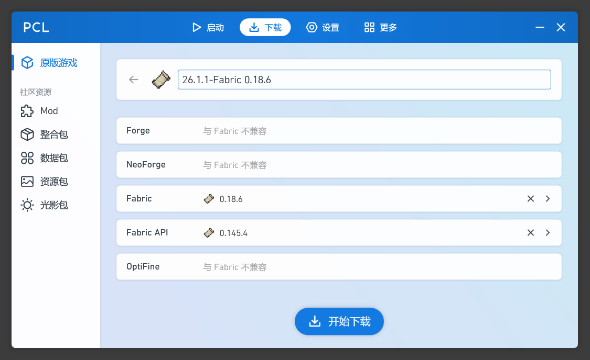
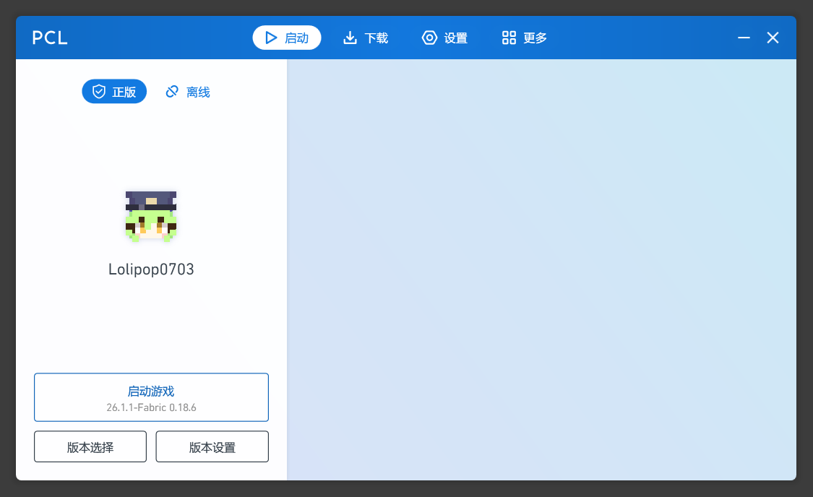
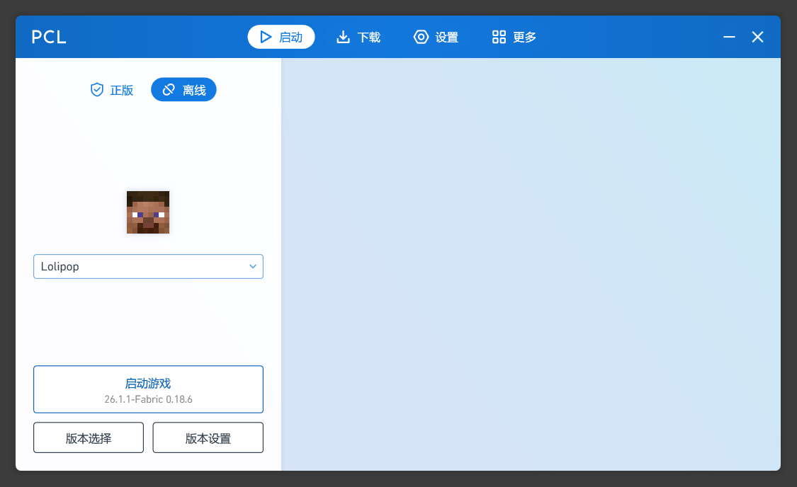
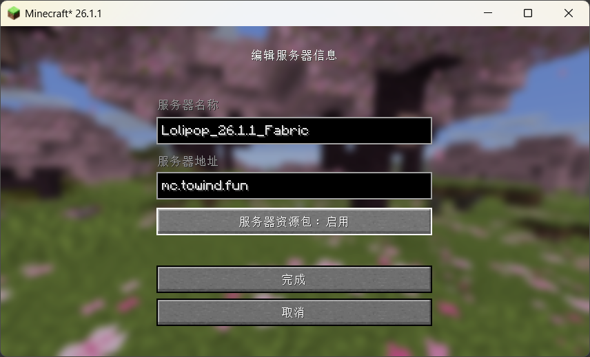
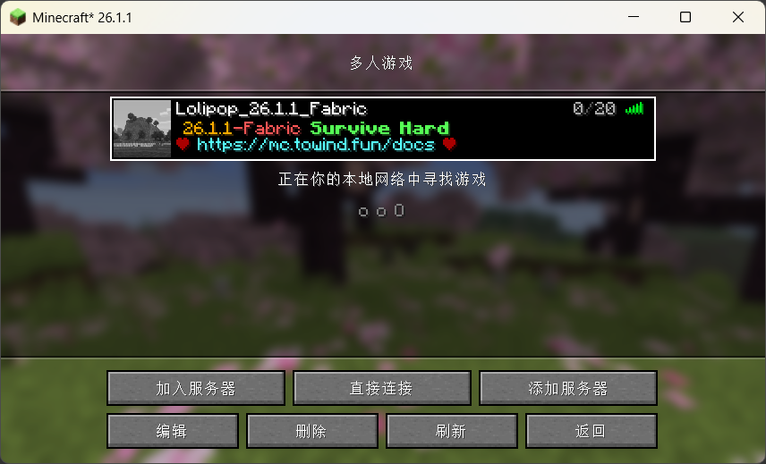
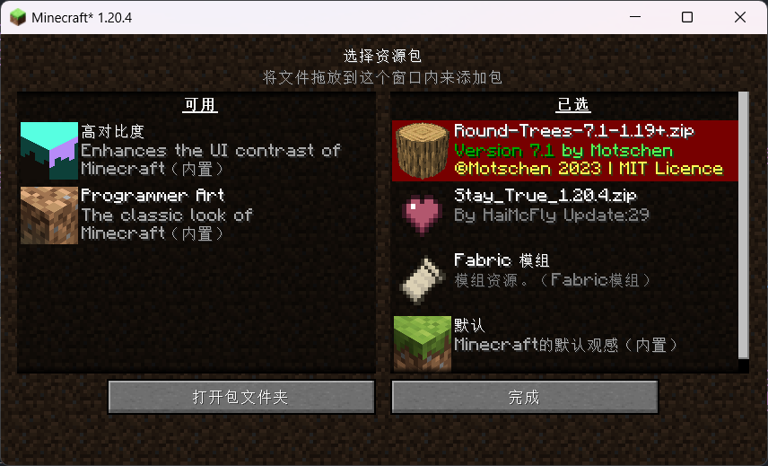
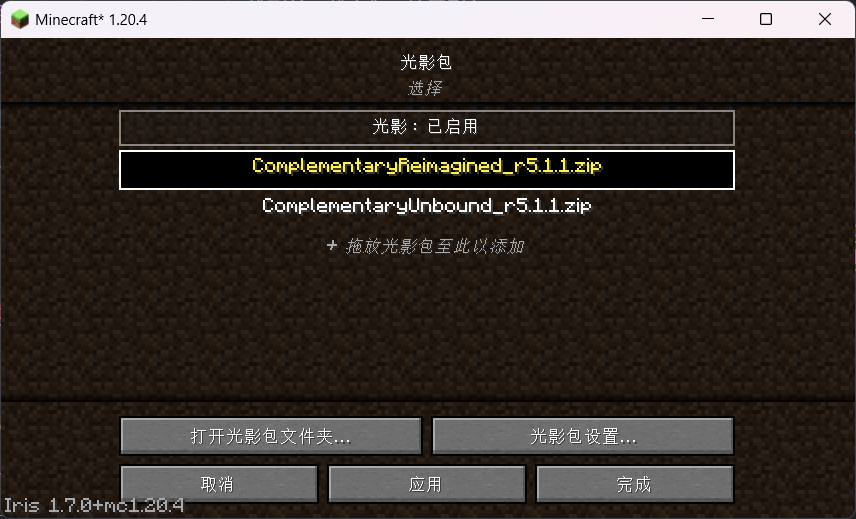

<a href="https://api.mcstatus.io/v2/status/java/mc.towind.fun" target="_blank">
  
</a>

## 服务器版本


Fabric 模组服务器，版本信息如下：

- **Minecraft** 26.1.1
- **Fabric** 0.18.6
- **Fabric API** 0.145.4

## 服务器地址

`mc.towind.fun`

已关闭正版验证；仅限白名单上的玩家访问服务器，请联系我添加。

## 服务器地图

https://mc.towind.fun/map

如果无法正常访问地图，请等待服务器模组更新。

## 派大星都能看懂的加入服务器步骤

### 安装 Plain Craft Launcher

访问[爱发电](https://afdian.com/p/0164034c016c11ebafcb52540025c377)下载最新版本的 Plain Craft Launcher，解压到任意目录，打开。

下载与[服务器版本](#服务器版本)相对应的 MC 客户端，如下图所示：



### 启动游戏

通过微软 OAuth 2.0 验证，登录到您的 Minecraft 账号，启动游戏：



如果没有购入正版，选择以离线的方式启动游戏：



### 连接到服务器

选择“多人游戏”，点击“添加服务器”，进入到“编辑服务器信息”页面。其中“服务器名称”可任意填写，与别的服务器区分开就好，例如 `Lolipop_26.1.1_Fabric`；“服务器地址”填写 `mc.towind.fun`；“服务器资源包”设置为 `启用`。如下图所示：



加入服务器：



开始你的世界之旅吧！

---

接下来的内容无关紧要，您可以选择性阅读。

## 自定义资源包

您可以在 [Modrinth](https://modrinth.com/resourcepacks) 或 [CurseForge](https://www.curseforge.com/minecraft/search?class=texture-packs) 找到用于增强视觉、音效体验等的资源包，按需引入。

> 资源包需放置在游戏路径的 `resourcepacks` 目录下。

作为参考，我引入了如下的资源包：

- [Round Trees](https://modrinth.com/resourcepack/round-trees) 我的世界里竟有圆形的树木

在“选项 - 资源包”可以找到相关配置：



## 自定义光影包

光影包能够**显著提升**游玩的视觉体验（同时大大提升对机器的配置要求），您可以在 [Modrinth](https://modrinth.com/shaders?g=categories:%27iris%27) 或 [CurseForge](https://www.curseforge.com/minecraft/search?class=shaders) 找到并下载它们，按需引入。

> 光影包依赖于模组 [Iris Shaders](https://modrinth.com/mod/iris) 或其它光影加载器模组。
>
> 首次启动包含光影加载器的游戏时，会在游戏路径下创建 `shaderpacks` 目录，将光影包放置到该目录即可。

作为参考，我添加了如下的光影包，在游戏中可以随时切换：

- [Complementary Shaders - Reimagined](https://modrinth.com/shader/complementary-reimagined) Complementary Shaders 的 MC 质感版本
- [Complementary Shaders - Unbound](https://modrinth.com/shader/complementary-unbound) Complementary Shaders 的写实版本

在“选项 - 视频设置 - 光影包”可以找到相关配置：



光影包 Complementary Shaders - Reimagined 效果展示：


## 自定义皮肤

服务器通过模组 [Fabric Tailor](https://modrinth.com/mod/fabrictailor) 实现离线服务器的皮肤自定义功能，在游戏中可以通过 `/skin` 命令设置自己的皮肤，例如：

```bash
# 设置为指定 URL 链接对应的皮肤
/skin set URL classic https://s.namemc.com/i/b80558ff4b834410.png # 经典身材
/skin set URL slim https://s.namemc.com/i/b80558ff4b834410.png # 纤细身材
```

由于服务器没有开启正版验证，因此默认情况下不会读取您的用户信息，也无法自动下载您在官网上传的皮肤。为了显示您的皮肤，请在游戏中输入如下命令：

```bash
# 设置为指定正版用户上传的皮肤
/skin set player <YOUR_MINECRAFT_USERNAME>
```

自定义皮肤效果展示：


## 完整的服务器配置

如果您也想搭建一个类似的我的世界服务器，或是想要了解此服务器的详细配置信息，请参考此章节。

服务器基于 Docker 镜像 [itzg/minecraft-server](https://github.com/itzg/docker-minecraft-server) 部署，对应 `docker-compose.yml` 配置如下：

```yaml
services:
  minecraft:
    image: itzg/minecraft-server:latest
    container_name: 26.1.1-fabric
    volumes:
      - ./data:/data
      - ./extras:/extras
    ports:
      - 25565:25565
      - 8123:8123
    stdin_open: true
    tty: true
    environment:
      - EULA=TRUE
      - VERSION=26.1.1
      - MEMORY=2G
      - TYPE=FABRIC
      - FABRIC_LOADER_VERSION=0.18.6
      - FABRIC_LAUNCHER_VERSION=1.1.1
      - MODRINTH_PROJECTS=@/extras/modrinth-mods.txt
      - MODRINTH_DOWNLOAD_DEPENDENCIES=required
      - MODRINTH_PROJECTS_DEFAULT_VERSION_TYPE=beta
    pull_policy: daily
    restart: unless-stopped
```

服务器模组列表文件 `@/extras/modrinth-mods.txt` 内容如下：

```plaintext
# Base library
fabric-api
# cloth-config
badpackets
yacl
lithostitched

# Performance optimization
ferrite-core
lithium

# World generation
terralith
tectonic
# towns-and-towers

# Util
jade
jei
clumps
double-doors
# kleeslabs
# appleskin
# netherportalfix
better-stats
# journeymap

# Community
villager-names-serilum
bl4cks-sit
chat-heads
fabrictailor

# Sound
# sound-physics-remastered

# Open service
# dynmap
```

服务器配置文件 `server.properties` 内容如下：

```properties
accepts-transfers=false
allow-flight=false
broadcast-console-to-ops=true
broadcast-rcon-to-ops=true
bug-report-link=
difficulty=hard
enable-code-of-conduct=false
enable-jmx-monitoring=false
enable-query=true
enable-rcon=true
enable-status=true
enforce-secure-profile=true
enforce-whitelist=false
entity-broadcast-range-percentage=100
force-gamemode=false
function-permission-level=2
gamemode=survival
generate-structures=true
generator-settings={}
hardcore=false
hide-online-players=false
initial-disabled-packs=
initial-enabled-packs=vanilla
level-name=world
level-seed=
level-type=minecraft\:normal
log-ips=true
management-server-allowed-origins=
management-server-enabled=false
management-server-host=localhost
management-server-port=0
management-server-secret=SECRET_CONTENT
management-server-tls-enabled=true
management-server-tls-keystore=
management-server-tls-keystore-password=
max-chained-neighbor-updates=1000000
max-players=20
max-tick-time=60000
max-world-size=29999984
motd=§6 26.1.1§c-Fabric§a§l Survive Hard§r\n§4❤§b https\://mc.towind.fun/docs§4 ❤
network-compression-threshold=256
online-mode=false
op-permission-level=4
pause-when-empty-seconds=60
player-idle-timeout=0
prevent-proxy-connections=false
query.port=25565
rate-limit=0
rcon.password=SECRET_CONTENT
rcon.port=25575
region-file-compression=deflate
require-resource-pack=false
resource-pack=
resource-pack-id=
resource-pack-prompt=
resource-pack-sha1=
server-ip=
server-port=25565
simulation-distance=10
spawn-protection=16
status-heartbeat-interval=0
sync-chunk-writes=true
text-filtering-config=
text-filtering-version=0
use-native-transport=true
view-distance=10
white-list=false
```

祝你游戏愉快！
