本文档旨在帮助日文零基础或英语险胜四六级的好厚米们入坑 FF14 国际服，主要叙述账号注册、客户端下载、游戏汉化等内容，不涉及对游戏具体玩法或机制的解说，希望对你有所帮助。

## 为什么玩 Final Fantasy XIV

FF14 作为一款 MMORPG 拥有如下令笔者喜爱的地方：

- **舒适的画风。** FF14 的画风和人物建模正中笔者好球区，即使以现在的眼光看低精度的模型也并不会引起视觉上的不适。哪怕站在主城挂机也要穿一套好看的幻化，守望人群熙熙攘攘，看着别人的打扮、动作收获社交的乐趣。
- **一个角色即是完整的游戏体验。** 创建一个角色即可游玩所有战斗职业和生产职业，体验游戏的全部内容，全心全意投入到一个角色上带来最棒的沉浸感。每个职业的输出循环、操作手法又各有千秋，学习、掌握到精通任何一个职业（这就是龙骑士，后跳 15 米逃出一切伤害范围圈！）都能带来游玩上的满足感。
- **世界观构筑和剧情展开令人沉浸。** 以单机游戏的规格制作的主线剧情，以及一些精彩有趣的特殊支线剧情（非正统调查员、光之邮递员等等），造就了一套独特的游戏文化，构筑了一个充满活力的世界观，令人沉浸其中，对于游戏来说亦是长久发展的生命线。
- **茫茫多的副本与挑战内容。** 副本分为四人本、八人本和二十四人本。主线剧情里的歼灭战难度面向普通玩家，能保证大家顺利过本，推动剧情；主线之外还有难度面向进阶玩家设计的歼殛战，面向核心玩家设计的诛灭战、零式和绝境战，充满挑战和丰厚的奖励（比如坐骑）。副本会同步装备品级，意味着无论新老玩家，在副本里都是性能平衡的，要依靠手法和努力完成攻略。
- **杰出的视觉清晰度设计。** 高难挑战里你完全可以通过自身的 DEBUFF，BOSS 的动作和场地的变化等判断出自己该如何处理机制，不需要其它任何科技手段的辅助。与 WOW 的高难设计形成鲜明对比，后者因为较差的视觉清晰度设计，导致挑战高难时大家都默认你正在使用插件，继而使得关卡设计师会在默认玩家们都使用插件的基础上，设计更难、更难的机制，最终导致玩家们不使用插件就几乎无法正常通关。
- **超高规格的音乐制作。** 在本身高质量音乐的基础上，通过乐器与鼓点的变奏表达战斗的高潮，某些副本里人声的加入更是将情绪推至巅峰。请务必打开音响游玩。
- **超多玩法的堆砌。** 七十级主线完成后开放的禁地优雷卡探索，八十级的南方博兹雅战线，九十级的开拓无人岛，一百级的新月岛，另外还有深层迷宫、变换迷宫、挖宝、地图 BOSS 狩猎、光（肝）武制作、金蝶游乐场、生产采集和潜水艇探索等各种玩法，每个玩法自成一套体系，完成的奖励反映在武器、称号、坐骑等方面，为爆肝带来满足感和成就感。

媒体评价方面，FF14 获得了 TGA 如下提名与奖项：

| 年度 | 奖项                                                                 |
| ---- | -------------------------------------------------------------------- |
| 2019 | 最佳角色扮演游戏（提名），最佳运营游戏（提名），最佳社群支持（提名） |
| 2021 | 最佳社群支持，最佳持续经营游戏                                       |
| 2022 | 最佳社群支持，最佳持续经营游戏                                       |
| 2023 | 最佳社群支持（提名），最佳持续经营游戏（提名）                       |
| 2024 | 最佳社群支持（提名），最佳持续经营游戏（提名）                       |
| 2025 | 最佳社群支持（提名），最佳持续经营游戏（提名）                       |

为什么笔者选择入坑国际服呢？原因在于笔者认为国际服环境更加单纯，对休闲玩家更加友好。事实也确实如此，挑战高难度副本即使灭队也几乎没有人表达不满，不会被教育做事，大不了就是 1 饭 30 分钟的时间散团重组。关于这点，论坛上也有[一些声音与挑战](https://bbs.nga.cn/read.php?tid=40652678)，可供参考。此外，和不同文化的其他国籍的人交流也算一番新奇体验。

加入国际服也意味着你需要有一定的**自强**能力，找寻方法改善自己的游玩体验，实现与其它语言玩家的无虞沟通，融入不同国家社群的游戏文化。同时，如果你的实际水平高于国际服松弛的高难人的话，预期的过本时间可能会多不少。如果这一切令你生畏的话，还是选择国服吧。

当然，FF14 远非完美无虞，这里能看到不少的[反噬与愤懑](https://www.saraba1st.com/2b/thread-2185571-1-1.html)，直指从 6.x 版本开始的，游戏在体验上的重复高与设计上的不走心问题。从 2024-2025 年的社区节奏来看，WOW 的版本迭代内容更胜一筹，值得称道。当然，笔者尚处于与 FF14 相伴的甜蜜期，这些批评丝毫没有影响到笔者从游戏中获取到的快乐，等到某一天笔者也成为了老登，因游戏内容的匮乏而丧失打开游戏的兴趣后，再来声讨吉田老贼吧。

## 在开始之前

FF14 的**前期相当枯燥乏味**，由于等级上限不断提高，所有战斗职业在低等级时的技能有着相当程度的简化，导致前期的技能循环像是小学生算数。用少数几个技能就打败了一只只蛮神，往往就会有“我还没用力，你就倒下了”的错位感。直到 70 级以后，随着更多核心技能的解锁，怪物机制的堆砌，战斗体验才开始迈入佳境。等到抵达了版本等级上限，解锁了职业的所有技能，开始搓制作组心目中的循环，就会有忙不过来的感觉：为了把爆发技能都打在团辅里，手指在键盘上的舞蹈仿佛在弹钢琴。

游戏的可玩性**与主线进度关联紧密**，每个大版本的新玩法和支线（或高难）副本几乎都在对应主线完成后解锁。而更新了十年的游戏内容也非一朝一夕能够打完的 —— 苦行僧般地推主线吧，未来的你一定会感谢现在努力的自己的 XD。有人粗略统计，从创建角色到完成 7.0 主线剧情，大约需要花费 200 小时的时间；如果在中途穿插一些其它的玩法比如制作发光武器或特殊区域探索，那么时间将倍翻。

> 身边统计学显示，认真走完 5.0 暗影之逆焰剧情的光之战士，都深深沉迷在了这款庞大的幻想游戏世界里……即使 AFK 也会偶尔想念起 FF14 的好。

每次开启新版本之前不妨先看看版本 PV。时至今日，笔者偶尔会翻出 5.0 的 PV 看上一看，光听歌都称得上享受。

- [2.0 重生之境](https://www.bilibili.com/video/BV1gz4y1U7fm/?p=2)，1 - 50 级
- [3.0 苍穹之禁城](https://www.bilibili.com/video/BV1gz4y1U7fm/?p=4)，50 - 60 级
- [4.0 红莲之狂潮](https://www.bilibili.com/video/BV1gz4y1U7fm/?p=5)，60 - 70 级
- [5.0 暗影之逆焰](https://www.bilibili.com/video/BV1gz4y1U7fm/?p=6)，70 - 80 级，剧情与战斗的巅峰
- [6.0 晓月之终途](https://www.bilibili.com/video/BV1gz4y1U7fm/?p=8)，80 - 90 级，主线章节的收束之地
- [7.0 金曦之遗辉](https://www.bilibili.com/video/BV1gz4y1U7fm/?p=11)，90 - 100 级


---

## 注册账号

FF14 账号的注册，游戏的激活和游玩时间的充值等操作都在 [Mog Station](https://secure.square-enix.com/account/app) 完成。由于包含 Google 人机验证码，需要使用**代理软件**才能顺利注册；如果你没有代理软件，可以选择淘宝代注册，注意甄别商家。

另外，注册账号和之后登陆 Mog Station 的 IP 地址需要尽可能保持一致，避免因 IP 频繁变动触发 i2501 封禁而无法登陆游戏。如果真的碰到了 i2501 封禁，请 24-48 小时后再尝试登录游戏，多次触发封禁的特殊情况下需要等待 1-2 周时间才会解除。

> 拓展资料：[了解萌新噩梦i2501](https://steamcommunity.com/sharedfiles/filedetails/?l=greek&id=2186534821#5356882)。

如果你想要更低的游戏开销，同时降低 i2501 封禁的风险，请注册**日版**的 Square Enix 账号。即在[此页面](https://secure.square-enix.com/oauth/oa/registligt.sendCountry?response_type=code&redirect_uri=https%3A%2F%2Fsecure.square-enix.com%2Faccount%2Fapp%2Fsvc%2Ftop%3Frequest%3Dinfo&client_id=account_manage)进行账户注册操作时，国籍 / 地域选择 Japan：

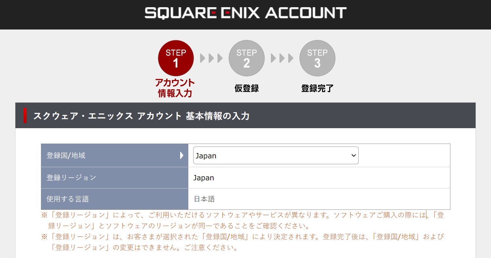

注册时填写的信息请尽可能记录保留下来，以防未来意外封禁时，验证真实身份时使用。

## 激活试玩账号

注册完毕后，请访问[试玩版激活页面](https://secure.square-enix.com/account/app/svc/ffxivregister?lng=ja-jp)，点击左侧的“スクウェア・エニックス アカウントでログイン”按钮，登录你刚才注册的账号：


在下一级页面，选择激活指定平台的 FFXIV 即可。如果没有激活过账号，在登录时将报错要你检查账号或密码是否正确。

## 游戏购买与点卡付费机制

在没有正式购买游戏之前，你可以免费、无限时间游玩 2.0 - 4.x 版本（对应 1 - 70 级）的所有内容。当然，试玩版账号存在一些功能上的限制，例如：

- 金币持有上限为 300,000。建议在达到上限前在 NPC 处购入方便未来在市场交易板换金的道具，例如修复装备耐久的最高级暗物质。
- 职业等级上限为 70 级。建议在达到上限后切别的职业来获取任务和日常副本的经验奖励。
- 无法向玩家发起私聊，也无法使用地图喊话。
- 无法使用市场交易板，也无法跟玩家面对面交易。意味着装备和食物都要自己搓，部分可以通过交易板偷懒的道具也只能手打了。
- 无法体验部分游戏内容，如 PVP 和绝境战。
- 如果服务器负载较高（通常发生在中型版本更新时），将无法排队进入游戏。

如果你被游戏吸引，想要继续玩下去，品鉴 5.0 版本及之后的内容，就需要购买游戏本体与资料包了。请留意，一旦购买游戏，解除了试玩版限制，就需要充值月卡了。

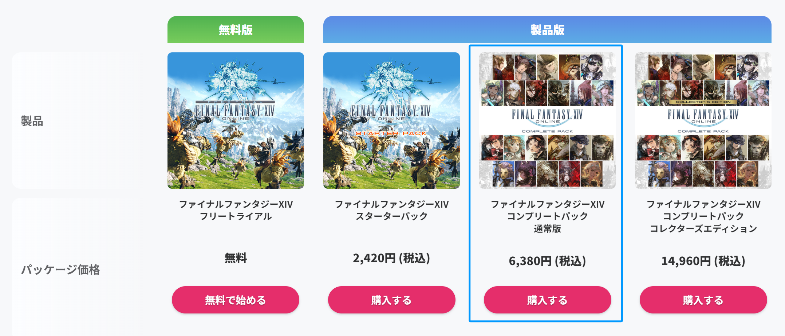

如上图蓝色方框勾选所示，正式入坑国际服意味着你需要首先花费 6380 日元 / Crysta 购买游戏本体与全部资料片。周年庆（夏）和圣诞节（冬）期间，官方商城通常会迎来不小的折扣活动，游戏本体与资料片也会同步打折，大型版本中后期也会时而不时推出打折活动，想省钱的玩家可以等到此时购买。由于汇率的缘故，购买**日版游戏**会更便宜，且之后月卡和官方商城付费道具的开销相比美版**便宜近一半**！

国际服采用月卡付费机制，日服最低为每月 1408 日元 / Crysta。首次激活游戏时会附赠 30 天的游玩资格，此期间可以找笔者或捡到你的导师要一个招待码，在 [Mog Station](https://secure.square-enix.com/account/app/svc/ffxivshopacctop) 激活，能拿到一些[不错的奖励](https://jp.finalfantasyxiv.com/lodestone/special/friend_recruit/?utm_source=lodestone&utm_medium=pc_banner&utm_campaign=jp_friendrecruit)，**赠送的游玩资格结束后就无法再使用招待码啦**。

用于购买游戏和游玩时间的 Crysta 可以在淘宝等二次贩售商购买与代充（有代理软件的话建议购买后自行充值），注意甄别商家。

## 下载并安装客户端

推荐使用开源的 [FFXIVQuickLauncher](https://github.com/goatcorp/FFXIVQuickLauncher) 游戏启动器替代官方的启动器，具备保存账号密码到本地的功能，能一键打开游戏，此外还具备其它进阶能力。在[这里](https://github.com/goatcorp/FFXIVQuickLauncher/releases)下载它的最新版本：

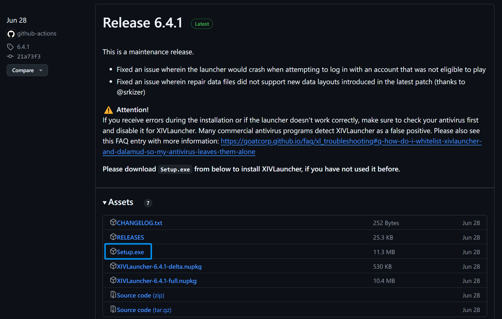

打开后将自动下载并安装国际版客户端到指定目录。完毕后，输入账号密码即可启动游戏。

> **Is XIVLauncher safe to use?**
> We put a lot of effort into ensuring that XIVLauncher is safe to use for everyone.
> Please read through our FAQ entry on this matter if you want to know more.

FFXIVQuickLauncher 内置了 Dalamud 卫月插件加载器，未来如果需要，可以添加插件以提升游戏体验。

请注意，使用 Dalamud 存在一定的风险，请勿在网络上公开传播你使用插件的截图或视频，避免被有心之人举报而封禁。

## 汉化游戏

推荐使用开源的 [FFXIVChnTextPatch-Souma](https://github.com/Souma-Sumire/FFXIVChnTextPatch-Souma) 来汉化游戏客户端，下载最新版本的汉化工具压缩包：


解压后打开目录里的 `FFXIVChnTextPatch-SM.exe` 汉化工具，在设置里选中游戏安装路径，如下图所示：

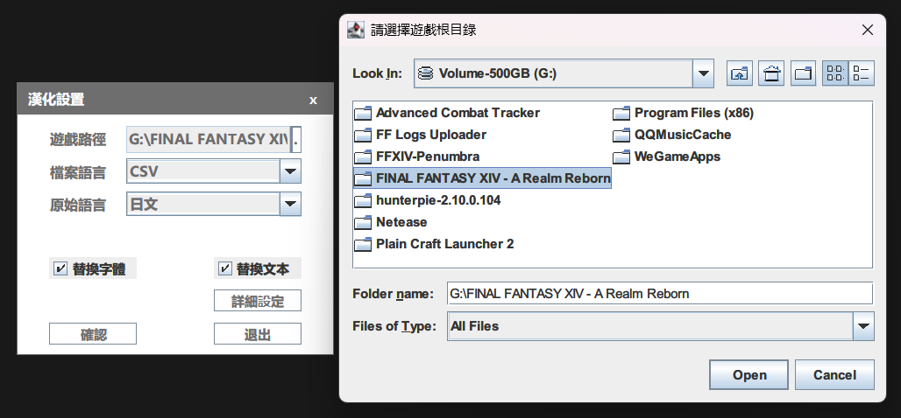

点击“详细设定”可以选择汉化的范围，推荐“全选”。这是因为 FFXIVChnTextPatch-Souma 为兼容某些三方工具，在默认情况下不会汉化 BOSS 名称，但至少从笔者的体验来看，全部汉化并不会影响到三方工具的使用。

保存设置，在主界面点击汉化按钮，等待完成即可。后续重新汉化时，可以在设置里取消勾选“替换字体”，减少花费时间。如若出现游戏异常崩溃的情况，也可以先还原汉化以便排查问题。

如果你有 Git 的使用经验，建议克隆该项目到本地，游戏版本更新后可以直接拉取最新的提交，避免每次都要重新下载整个压缩包。

## 加速器

游玩国际服需搭配任意游戏加速器，裸连延迟非常高且容易丢包。

笔者使用 UU 加速器加速国际服日本节点，真实延迟平均为 200ms，对高难副本挑战没有任何影响。

---

到此为止所有的准备都已完成，双击 FFXIVQuickLauncher，输入账号和密码，正式启动游戏吧！

## 服务器选择

笔者的角色创建在国际服的 **Gaia - Bahamut** 服务器，如果你认识[笔者](https://na.finalfantasyxiv.com/lodestone/character/36150060/)，请务必来这个服务器贴贴……求你了。嗯，为什么选择这个服务器？因为巴哈姆特一听就很帅呀！

如果你不认识笔者，或者如果你是古典派的 MMORPG 玩家，只希望更方便地交流并攻克副本，推荐选择 **Mana** 数据中心里的任意服务器（例如 **Chocobo** 鸟服），这里更容易碰到国人的圈子。你也可以提前加入国际服群，看看大家都在什么服务器。

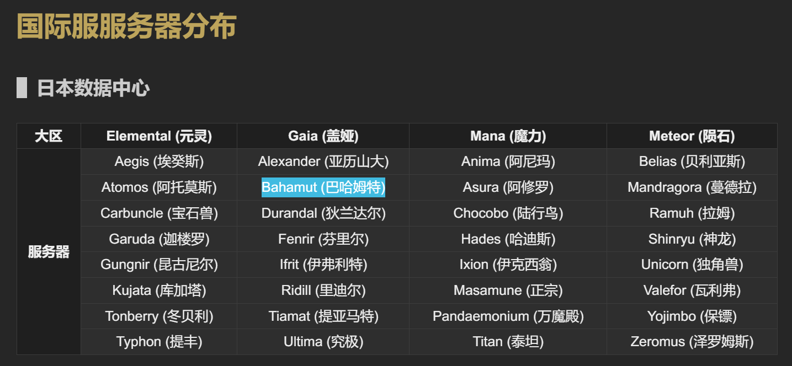

当然，服务器不同带来的限制并没有想象中那么大：

1. 你可以在三大主城里随时**跨域传送**到其它服务器，这时在你名称的右侧会有 \<放浪神加护\> 的标识。例如你可以从 Gaia - Bahamut 跨域传送到 Gaia - Ifrit 服务器。
2. 你也可以在角色选择页面**超域传送**到想去的其它大区下的服务器，这时在你名称的右侧会有 \<超域旅者\> 的标识。例如你可以从 Gaia - Bahamut 超域传送到 Elemental - Aegis 服务器。特别的，日本数据中心可以和大洋洲数据中心相互进行超域传送。

平时排本时，会与当前数据中心下所有服务器的玩家（包括 \<超域旅者\> 们）一起匹配，协同作战。不过，由于部队、房屋等不可跨服的系统存在，能在同一个原始服务器游玩总是最好的。

就笔者的了解而言，所属日本的四个数据中心里：

- **Elemental** 有着来自世界各地的玩家，可以直接使用英语沟通交流。
- **Gaia** 日本玩家居多，也有不少的台湾、香港玩家。
- **Mana** 日本玩家居多，同时聚集着大量的国人玩家。也是国际服里人数最多的数据中心，高难副本挑战者大多会前往该数据中心找招募队伍。
- **Meteor** 日本玩家居多。

血泪的教训：除了最开始选择数据中心的时候会选择服务器外，创建角色的时候也会让你选择服务器，注意不要将角色创建到默认的服务器去咯。进入游戏后可以首先看看右上角是否是自己想去的服务器：

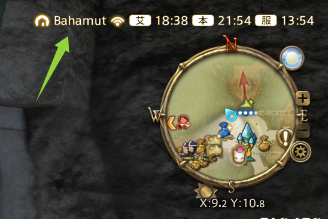

如果玩的时候发现排本或队员招募太慢，可以考虑超域旅行到别的数据中心去。尤其推荐 Mana 旗下的任意服务器，能显著提升游戏体验。

日本玩家 LuckyBancho 自 2013 年开始便在他的[个人主页](https://luckybancho.ldblog.jp/)更新发布国际服各个服务器的人口统计，截止 2025.11.30，在他制定的规则下，国际服的**活跃玩家约 82 万人**。具体到服务器的结果见下图（或 [Google 电子表格版本](https://docs.google.com/spreadsheets/d/1lD2BxLakUo7gx1PkZMLVsIEEWCmIYS9ag9uJfwLX-Do/edit?usp=sharing)）：

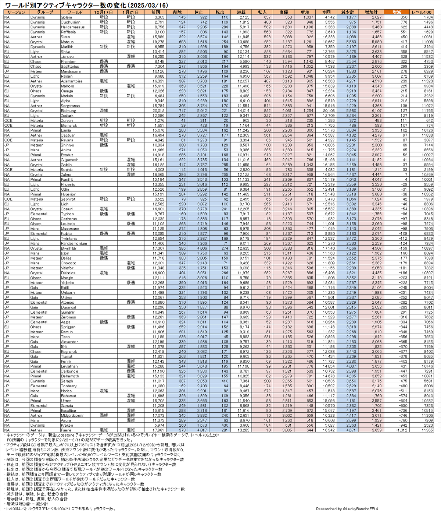

可以用解锁成就的玩家数量随时间变化趋势，来体现整体活跃玩家的数量，得到的趋势图如下：

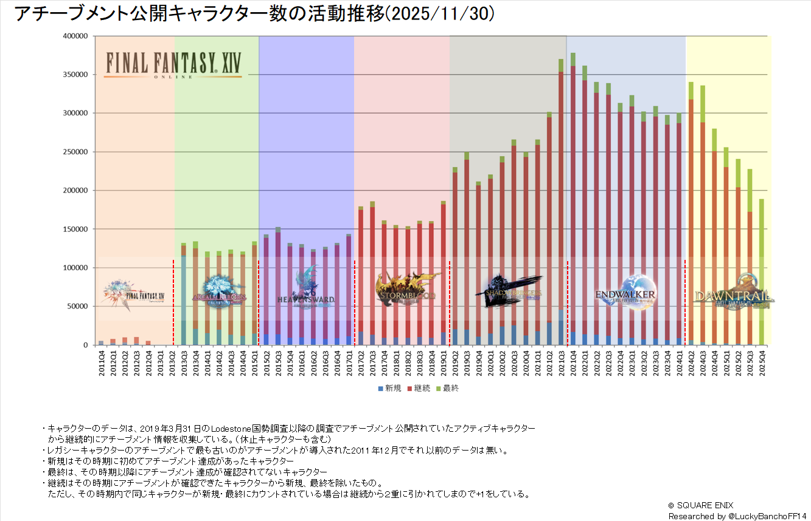

经历了 7.0 大版本的剧情低谷和玩法同质化，活跃玩家数量几乎回到了 4.x 版本的末期，相比巅峰时期近乎腰斩。我们的最终幻想 14……究竟会变成什么样子……？

## 成为新的光之战士

战斗职业按照职能分为输出（红职）、坦克（蓝职）和治疗（绿职）。简单描述各个职业的定位与职责就是：

- 输出职业：难度最低。近战物理职业需要调整输出的站位，尽可能输出多的伤害；远程敏捷职业无需调整站位，上手简单但是伤害略低，吟游诗人和舞者定位为团队辅助，机工士则定位为输出；远程魔法职业无需调整站位，但是释放技能需要读条，所以相比近战物理职业上手要稍难一些。
- 坦克职业：难度中等。需要吸引怪物的仇恨，使用减伤技能降低治疗职业负担，配合输出职业的站位，调谐副本的攻略节奏。承担相当于一个输出职业大约 50% 左右的输出。
- 治疗职业：难度最高。需要时刻关注队友的血量，使用治疗技能避免其他人倒下；使用减伤技能降低坦克职业负担，同时避免输出职业因群体攻击而倒下。如果自身不慎倒下，往往代表这次挑战要重来一遍了。由于治疗量的溢出，不需要时时刻刻读条治疗技能，还需要承担相当于一个输出职业大约 40% 左右的输出。由于副本里敌人的总血量是固定的，你多输出点其他人就可以少输出点，副本攻略完成的速度也就快点。


在创建角色时所选择的职业并不决定了你未来一定要玩的职能方向，因为你可以随时解锁其它职业并游玩，这也是 FFXIV 有别于其它 MMORPG 重要的一点。

如果你是萌新，建议在开荒时选择推主线更快，副本体验只关注自身走位和输出手法的**输出职业**。如果想挑战其他职能的职业，可以在打本过程中学习别人是怎么做的，再依葫芦画瓢吧！

随着繁中服的正式运营，大批新的光之战士涌进了这款 MMORPG，不少玩家也因此重新梳理了面向萌新的指南和心得，不妨看一看，从游戏玩法和机制等层面多认识一点你将要游玩的游戏，既可以少走一些弯路，也帮助你早些迈过枯燥的前期：

- [《攻略】新手快來看！一篇文詳細解說FF14的職業﹑裝備﹑練等﹑日隨FAQ / 2F新增高難＆職能解說》](https://forum.gamer.com.tw/C.php?bsn=17608&snA=25422)
- [【心得】新手遊玩心得 & 遊戲小要點 (持續更新中) (圖文多)- 蜜糖貓](https://forum.gamer.com.tw/C.php?bsn=17608&snA=26276)
- [【心得】新人問題回答 問都可以問](https://forum.gamer.com.tw/C.php?bsn=17608&snA=25557)

最后啰嗦一遍，游戏前期的体验相当乏味，真的需要耐心和毅力才能坚持下来。但随着主线任务的推进，各种玩法与副本的解锁，一天的时间都不知道该怎么安排了，几乎每个人都能找到当下想做的事情，于是沉浸在游戏世界里。

愿我们终能相遇在利姆萨·罗敏萨下层甲板。好运，光之战士！

---

## 其它贴士

下面是一些笔者的理解与配置，应该能带给你一些有益的启发。

### 雇员

你将在 17 级的主线任务完成后解锁一个永久雇员。下载使用 FFXIV 国际服官方手机 APP 后会赠送第二个永久雇员。

### 队伍交流

在国际服不可避免匹配到外国友人，理解队友在说什么有时候很重要（更多时候不重要）。笔者使用了开源工具 [TataruAssistant](https://github.com/winw1010/tataru-assistant) 来实时翻译并记录剧情文本：

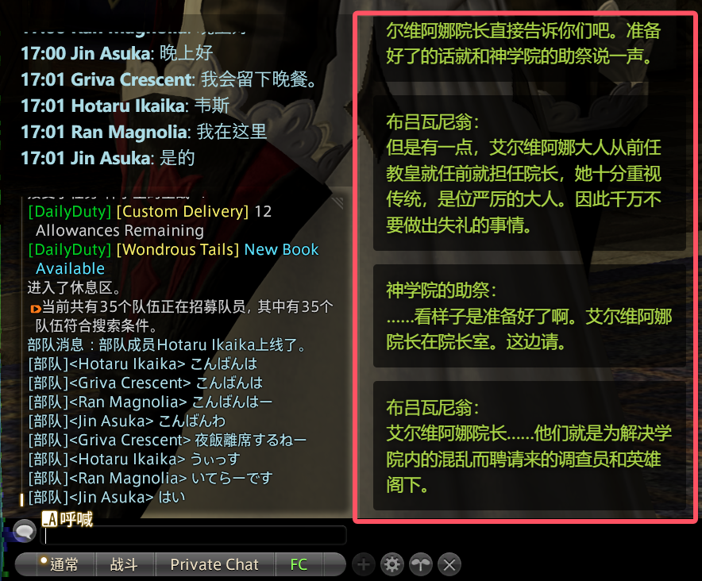

交流时优先使用日语，其次使用定型文和英语。笔者发现大多数日本玩家都是英语苦手，遇到他们看不懂的情况时，不妨通过翻译软件转换成日文再发送吧。

### 连接到 Steam

使用 Steam 的**添加非 Steam 游戏**功能，将 FFXIVQuickLauncher 作为游戏选中，自定义游戏名，再通过 Steam 启动游戏即可：

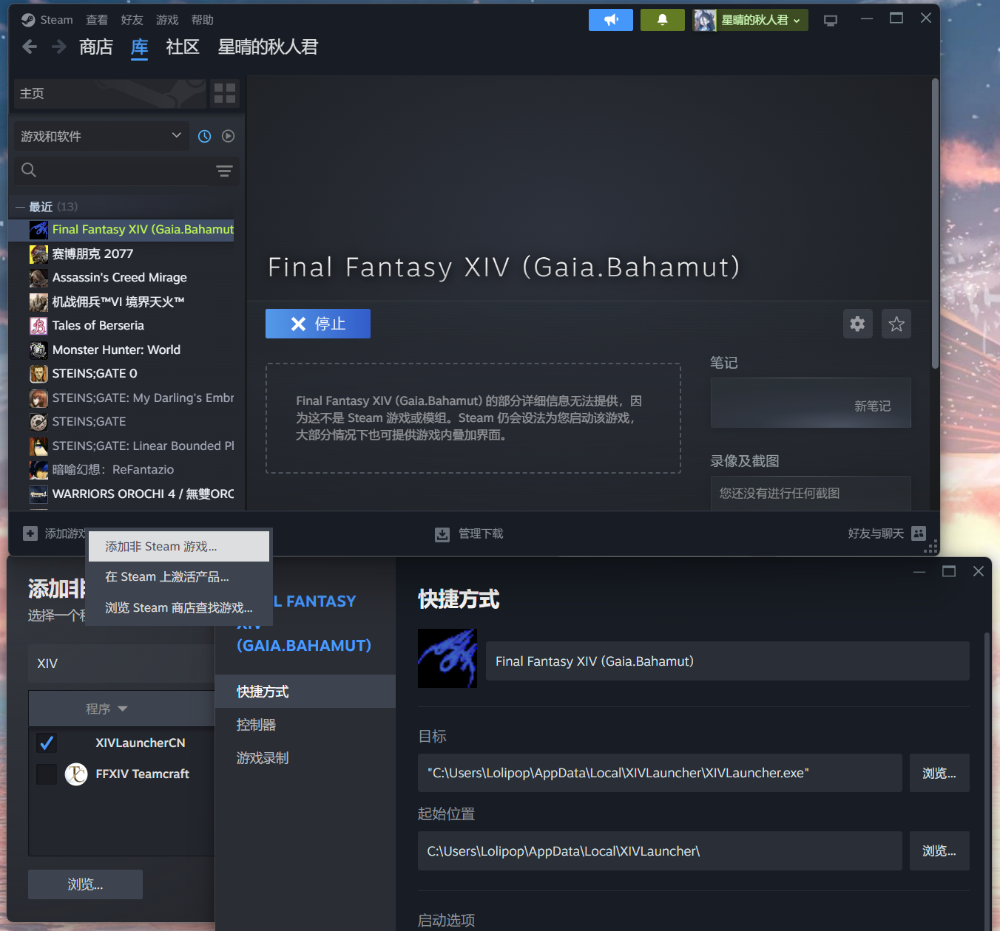

你或许会想要记录游玩的过程，以便假如发生了值得纪念的事情时，能以视频的方式回顾。新版本的 Steam 已经支持了游戏录制功能，在设置里配置好“在后台录制”，再通过 Steam 启动游戏，就可以记录下你在游玩过程中遇到的一切事情啦！

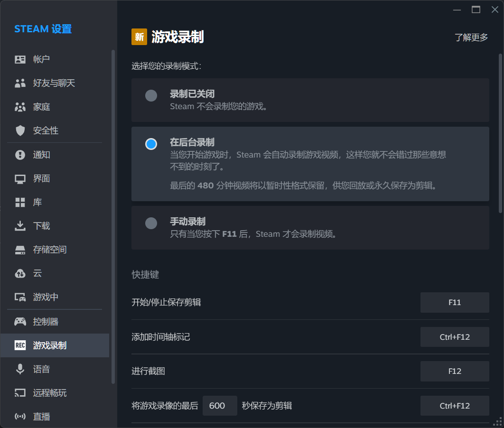

### ACT 与 FFLogs

啊……脑袋好疼……呜……前世的记忆苏醒了，原来我一直都是一位核心玩家，渴望在每个高难度挑战里都打出高额的伤害，拖着队伍往前走。

ACT 即 Advanced Combat Tracker，是一款针对 MMOPRG 网游的通用战斗数据记录框架，并依靠第三方插件完成对游戏数据的解析，我们使用它记录下每场战斗的数据。你可以在[这里](https://advancedcombattracker.com/download.php)下载到它，首次启动时请参考其指引，安装必要的解析器。

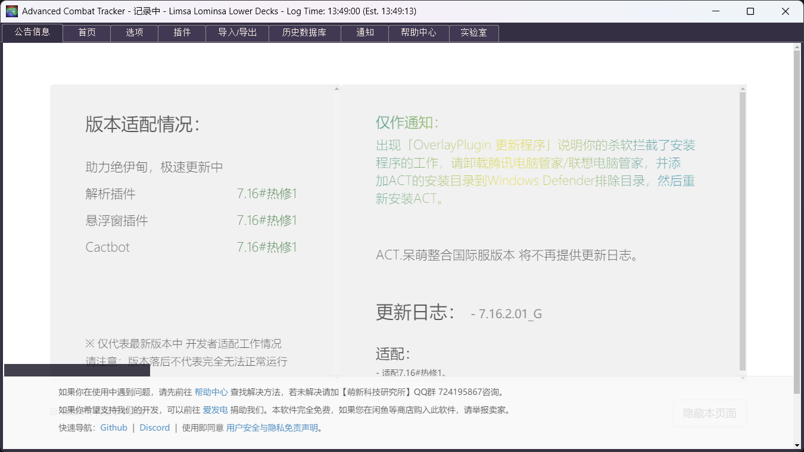

[FFLogs](https://www.fflogs.com) 是一个专为 FFXIV 提供战斗记录分析的网站，你可以上传战斗记录到这里，对其进行实时分析。如果你想上传 ACT 记录的战斗数据到 FFLogs，首先需要注册 FFLogs 账号并绑定你的游戏角色，并使用配套的软件 [FF Logs Uploader](https://www.fflogs.com/client/download)。

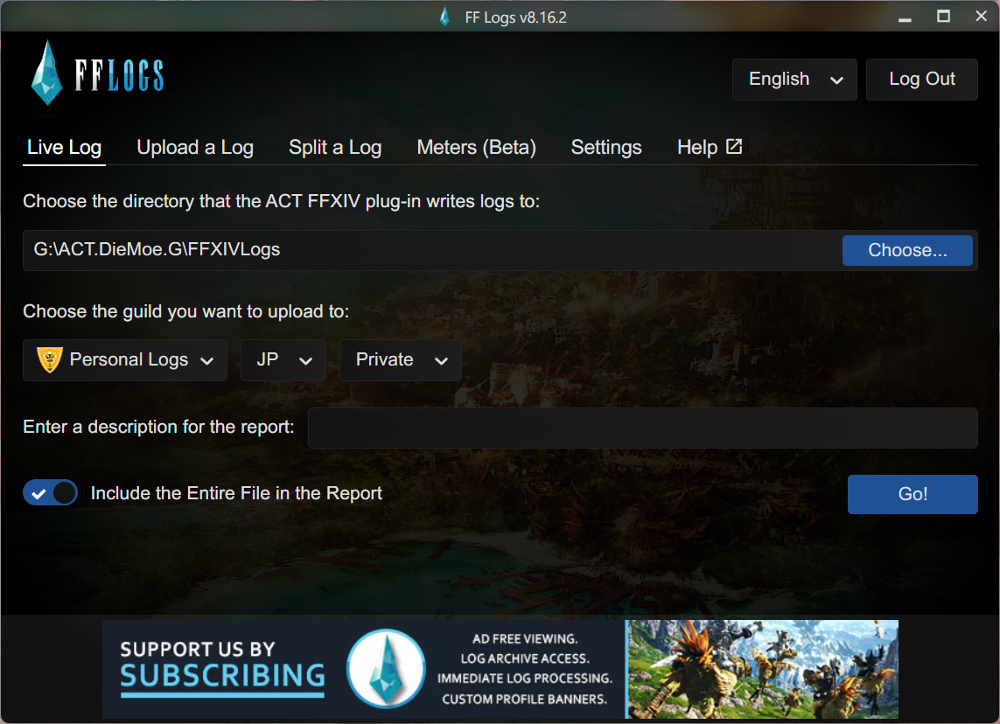

如上图所示：实时上传功能需要选中 ACT 写入战斗数据的目录，默认路径为 `C:\Users\${YourUsername}\AppData\Roaming\Advanced Combat Tracker\FFXIVLogs`；使用非简体中文语言的客户端才能将战斗数据上传到 JP 等区域。

Logs 排名就像是高难内容玩家的铭牌，代表你对副本机制的理解程度，对职业输出循环的掌握程度。当想象着别人看到你高超的表现后查 Logs 时尊敬的神情，你在心中也会忍不住轻哼起来吧。

使用 ACT 是一个两端都很锋利的双刃剑：好的方面是会让你认真对待每一场战斗，逐渐优化自己的输出循环，拼尽全力做到力所能及的最好，也能够为游戏增添一些挑战的乐趣，譬如每周零式的奖励拿到后，偶尔无聊时会想着要不去打一把刷刷 Logs；坏的方面是可能会为自己难看的数据感到焦虑，在不小心吃到“伤害降低”甚至死掉后开始觉得这次就算过本也没有意义，并且会降低你对“摸鱼”队友的容忍度，在进队前就能想象接下来三十分钟的游戏体验如何。

对于笔者来说，ACT 就是游戏启动时的必备插件，可以记录下每天都干了些什么，既可以向别人展示，也留给自己以后回顾。

### 随游戏启动软件

那么多配套软件，要在每次开游戏的时候一个一个启动太麻烦了！有没有什么配置，能让这些软件自动启动呢？有的兄弟，有的。

FFXIVQuickLauncher 就可以直接配置随游戏启动的软件列表，在这里添加软件可执行文件路径即可：

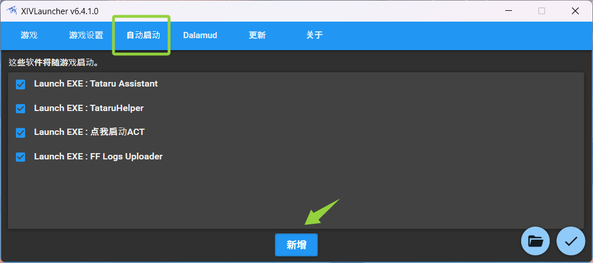

### Dalamud 插件

使用 Dalamud 插件可以改善游戏体验，简化部分操作流程。尽管如此，心中仍然要紧绷一根弦：自己应该使用哪些插件，使用哪些插件是**相对健康**的，是不会摧毁自己游戏体验的？如若不然，正如所有在单机游戏里使用修改器的玩家一样，失去了很多通过努力才能获得的成就感，也就失去了游戏本身设计上的很多乐趣。

当然，笔者也知道在许多游戏里，一部分人喜欢通过代练的方式获得一些成就和道具，进而彰显自己的身份地位，如果能接受这一切的虚伪，那么通过部分插件来替代代练的过程达到省钱的目的，也算开源软件所做的贡献吧。

在这里，笔者罗列了一些十足健康的插件，按照字母排序，供你参考使用：

- [Discord Rich Presence](https://github.com/reiichi001/Dalamud.RichPresence)：将详细的游玩状态同步到 Discord。不过建议在设置里隐去角色名，或是停止分享 Discord 活动状态到公开的大型群组，避免不必要的麻烦。
- [FF Logs Viewer](https://github.com/Aireil/FFLogsViewer)：快速查看小队成员的 FFLogs 战斗数据，帮助你决策在高难挑战的开头要不要使用市场价 3000 金币一瓶的爆发药。
- [GatherBuddy](https://github.com/Ottermandias/GatherBuddy)：采集助手，内置各个采集点的刷新时间，支持传送到距离采集点最近的以太之光，并切换为对应的职业，帮助你更高效地前往实地进行采集。
- [Item Vendor Location](https://github.com/electr0sheep/ItemVendorLocation)：快速查询物品可以在哪里购买，省去查询 Wiki 的烦恼。
- [JustBackup](https://github.com/NightmareXIV/JustBackup)：在启动游戏时自动备份游戏和插件配置，对于笔者这样有多台设备游玩的人来说相当实用。
- [Market Board](https://github.com/fmauNeko/MarketBoardPlugin)：快速查看道具在各个大区市场交易板上的价格，然后超域传送到低价服务器上买入想要的东西。
- [Peeping Tom](https://github.com/Caraxi/PeepingTom)：当别人选中你时，在他的角色脚下标注红点。所谓 MMORPG，就要随时对社交产生反应！除非是你完全不认识的陌生人，那就随他去吧。
- [PlayerTrack](https://github.com/Infiziert90/PlayerTrack)：记录和其他玩家的相遇与战斗的历史，支持添加玩家备注，弥补游戏内好友系统的不足。**这款插件推荐给每一位光之战士使用。**
- [Price Insight](https://github.com/kouzukii/ffxiv-priceinsight)：快速查看道具的市场价格和最近成交价格。与 Market Board 插件不同，价格将直接显示在道具详情上，十分的便利。
- [Sonar](https://discord.com/invite/K7y24Rr)：自动发送和接收各个服务器的狩猎和重要 FATE 刷新信息。
- [VanillaPlus](https://github.com/MidoriKami/VanillaPlus)：改造游戏 UI 本身，内含相当多笔者觉得实用的配置项。但也有一些可能会影响游戏体验的功能，请自行斟酌使用。

以及尽管不健康，但是能让你省下不少时间的插件。请见仁见智地使用或忽视：

- [Artisan](https://github.com/PunishXIV/Artisan)：自动制作插件，省去了在[生产模拟器](https://tnze.yyyy.games/#/welcome)里导入数据生成宏的麻烦，也省去了手动点击制作和执行宏的操作，还能够自动使用食物、修理装备和精炼魔晶石，可以说是生产玩法的绝对大杀器。即使背负红玩之名，笔者也要使用它来挂机生产爆发药，以及完成生产肝武制作。
- [Eureka Linker](https://github.com/Infiziert90/EurekaTrackerAutoPopper)：禁地优雷卡和新月岛探索插件。插件可以显著提升这两个特殊场景探索的效率，但是功能本身或多或少会影响到原始的开荒体验，适合已经熟悉玩法机制、进入农成就阶段的玩家使用。
  - 对于禁地优雷卡：再地图上标注幸福兔可能的财宝点；拥有幸福兔 CE 的计时器，使用插件的人可以共享计时器时间；普通 CE 刷新的时候会有声音和屏幕提示。不过要小心点击 CE 的一键喊话 POST 按钮，除非你知道自己在做什么，避免干扰触发者约定的开怪时间。
  - 对于新月岛：在地图上标注宝箱刷新点，同时在接近时提示是否存在宝箱；拥有魔法罐 CE 的计时器，使用插件的人可以共享计时器时间；寻找魔法罐宝箱过程中，也会把可能出现宝箱的地点标记出来，方便根据方位和距离指示挖掘。
- [Globetrotter](https://github.com/chirpxiv/Globetrotter)：自动显示藏宝图挖掘点的位置。虽然对着地图一点一点比对寻找挖掘点也是一种乐趣，但是久而久之还是觉得麻烦，使用这款插件可以省略掉这个过程。

笔者使用的插件合集：

```plaintext
DP1H4sIAAAAAAAACpWUTWvCQBCG/8uckyLWqOSm+FGLSrAilNLDZDPGJZvdMLuLiPjfi7a39jA9LrzPO+98sFcoIT+i8ZRAB3kvAYI8cKQE1ONZmFhr6yH/uMLKBmKLZostQQ5L40oK7EIghgRWfm6xNFR9G9ySX0DBWtHKel2fggjYIDcUpg65+s4hoiYctEeZtiDqtK33rhXJ35xF/keUjbZ6g929xBkvwhIthZO29ZaomjltaxG2WKxd7Q+azsJlzCNTg3tG1RBPYnCF6zohuwrUHshWjtdOYdBONo3X6MMUVRM7kXyGBttYPe20OhVMnqwiIajNZRaDbOD33ncUUFth9+/kJ4YJK5n/Aa02BgsTvUi/xHAinsZK6H/P/+JcI7t3gxfix9b/0H8moCvIQQ3KHj0TpuPeuEwHvdEoLQf9YToss36GqI6YZZCAhRzaS9r9fBG3LwaYtcBNBAAA
```

## 小尾巴

撰写此文时，正值 FFXIV 低谷期的 7.0 大版本，因为失去了优秀剧情的底蕴，公式化的内容更新和同质化的职业技改就成了玩家们不满情绪的发泄口。对于前者，至少 7.0 里高难副本的战斗体验也随着玩家水平提升而逐渐升温，笔者尚且觉得满意；对于后者，笔者爱玩的绝枪战士跟朋友爱玩的黑魔法师一样，尽管在小版本更新的技改中被抬高了职业的下限，但相对的减少了与职业的差异性，也降低了输出的上限，着实让人很不满意。即使宽容如笔者，也不得不承认 FFXIV 并不像以前那样总是魂牵梦绕白月光的存在了，跟笔者超喜欢的另一个游戏系列《怪物猎人》一样，新作《怪物猎人：荒野》的玩家口碑也跌到了冰点，两款游戏现今的境遇简直难兄难弟。

但是低谷也并不全是坏事，追着版本更新日志，笔者也发现开发者们为了挽回玩家流失的颓势所作出的努力，他们真的改进了一些诟病已久的游戏体验，以及新增了不少笔者认可的系统功能。例如：

- **冲刺效果结束后新增永续的小快跑。** 众所周知，冲刺是光之跑腿们最常用的技能，但是 20s 的持续时间结束后，要等待 40s 冷却时间才能激活下次冲刺，期间常时的走路速度总会让赶路的人觉得过于浪费时间。虽然像笔者这样的玩家早已适应冲刺后正常走路的速度（被调教好了），但是对于新人来说，总是不会那么快地接受。如今，冲刺结束后，角色会获得一个永续的小加速效果，试想，一个光之战士在每次的跑腿上节省了五秒钟，那么一百万个光之战士一天能节省多少时间……
- **允许召唤坐骑时移动。** 众所周知，光之战士在咏唱技能或使用道具时是不能移动的，否则就会中止读条，而召唤坐骑就是其中一个例子。虽然像笔者这样的玩家也早已适应了召唤坐骑时站定不动（也被调教好了），但如今，可以在召唤坐骑时移动了，既可以多走几步路，又不用担心读条被意外打断。另外，上部分坐骑时也新增了一个跨步骑乘的小动作，不再是瞬移坐上去了，算是一个观感上的小优化。
- **新增战术板功能。** 战术板就是可以在游戏内自定义编辑与小队分享的绘图板，常用来规定处理机制时的宏站位，相比文本宏来说更加直观。本来笔者以为没什么大用，毕竟大家学好 GAME8 基准的站位就行了，但在零式副本早期开荒过程中，各个攻略流派的站位处理确实存在差异，现去翻找攻略视频学习太慢了，这时招募者直接分享战术板，大家就能立即 Get 到机制处理时的站位要点了。实际的例子是，笔者在渡劫 M11S 时，最后的“陨石狂奔”机制主流有两套打法，笔者学习的是绿毛忍者攻略视频里的“DXA式”，但加入的队伍采用的是后来我觉得更好的“スタピとたんV2式“，中间一次灭团后我一头雾水（虽然莫名其妙处理正确了），但队长立刻分享了战术板，并介绍了站位规则，简单易懂！这支队伍也成为了我首次踏破 M11S 的队伍。
- **新增聊天气泡。** 明明 NPC 说话的时候都会有个气泡，但大家说的话只能显示在聊天窗口里，眼睛动来动去实在有些辛苦。之前笔者使用卫月插件来显示别的玩家说话的气泡，感觉很不错，没想到之后的更新里官方加入了聊天气泡的支持，而且还挺美观，不赖。
- **解禁不同职业装备幻化。** 也就是说白魔法师可以一只手持短杖，另一只手持盾牌来 cos 牧师了！咳咳，主要是服饰装扮不再局限于本职业可用的装备了，这大大提升了时尚搭配的自由度，对于以人物美型为重要卖点的 FFXIV 来说，堪称史诗级更新。未来要是把幻化柜升级成手游版本的图鉴模式就完美了，800 个格子对于光之收藏家们来说还是太少了。

笔者仍然对 FFXIV 的未来保持乐观，期待 8.0 的大版本更新能重振荣光，带来更多有趣的内容吧。

## 主要修订版本

- 2026.02.02，添加小尾巴，调整注册账号和购买游戏章节顺序。
- 2025.12.25，添加 Dalamud 插件相关内容；修正部分措辞。
- 2025.08.18，保留对官方纯净版 ACT 的介绍；删减无用内容。
- 2025.06.18，添加 i2501 封禁相关介绍，润色部分内容。
- 2025.05.13，修正部分措辞，更新服务器人口统计数据。
- 2025.03.04，添加对 ACT 和 FFLogs 的介绍。
- 2024.12.30，推荐使用 FFXIVChnTextPatch-Souma 进行游戏汉化。
- 2024.12.07，补充遗漏的小点。
- 2024.11.08，撰写完成文档。
