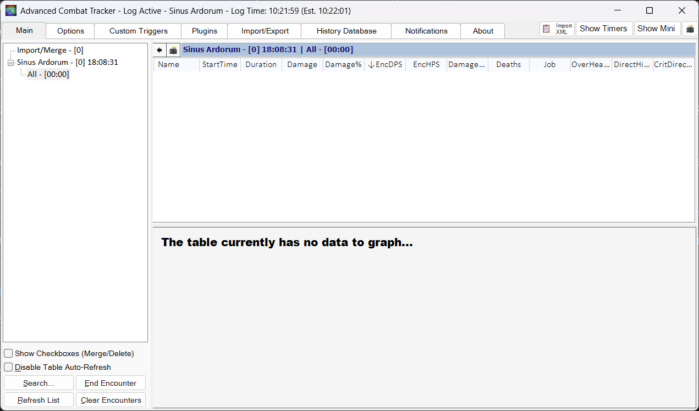

本文档旨在帮助日文零基础或英语险胜四六级的好厚米们入坑 FF14 国际服，主要论述如何注册账号、下载客户端、汉化游戏等，此外加入自己作为程序员的理解与游戏实践，希望对你有所帮助。

笔者自身是参考 NGA 上的这篇指南 [[国际服] 9102·国际服入坑指北](https://bbs.nga.cn/read.php?tid=15259943&rand=460) 入坑的国际服，除去一些过时内容，仍然值得你在本指北的基础上加以参考。

## 为什么玩 Final Fantasy XIV

FF14 作为一款 MMORPG 拥有如下令笔者喜爱的地方：

- **茫茫多的副本与挑战内容。** 副本分为四人本、八人本和二十四人本。主线剧情里的歼灭战难度面向普通玩家，能保证大家顺利过本，推动剧情；主线之外为每个歼灭战设计了歼极战（零式 / 绝境），难度面向进阶玩家和核心玩家，充满挑战和丰厚奖励（比如坐骑）。副本会同步装备品级，意味着无论新老玩家，在副本里都是性能平衡的，要依靠手法和努力完成攻略。
- **杰出的视觉清晰度设计。** 高难挑战里你完全可以通过自身的 DEBUFF，BOSS 的动作和场地的变化等判断出自己该如何处理机制，不需要其它任何科技手段的辅助。与 WOW 的高难设计形成鲜明对比，后者因为较差的视觉清晰度设计，导致挑战高难时大家都默认你正在使用插件，继而使得关卡设计师会在默认玩家们都使用插件的基础上，设计更难、更难的机制，最终导致玩家们不使用插件就几乎无法正常通关。
- **超高规格的音乐制作。** 在本身高质量音乐的基础上，通过乐器与鼓点的变奏表达战斗的高潮，某些副本里人声的加入更是将情绪推至巅峰。请务必打开音响游玩。
- **超多玩法的堆砌。** 七十级主线完成后开放禁地优雷卡探索，八十级南方博兹雅战线，九十级开拓无人岛，一百级新月岛，另外还有深层迷宫、变换迷宫、挖宝、地图 BOSS 狩猎、光（肝）武制作、金蝶游乐场、远航探索等等各种玩法，每个玩法自成一套体系，完成的奖励反映在武器、称号、坐骑等方面，带来成就感的正反馈。
- **恰到好处的生产玩法。** 作为上一点的补充，生产职业的玩法简单易上手，体系收敛，例如钓鱼只需要看到上钩提示后起钩，不需要再通过复杂操作得到钓鱼的结果，很适合打发时间。每个版本的超强力装备都可以通过生产职业制造，并在交易板上以合理的价格出售，这些生产出来的装备与战胜极难副本得到的最强力武器性能差距不到 5%，意味着人人皆可轻松达到版本毕业的状态，拥有挑战极难副本的入场券。
- **一个角色即是完整的游戏体验。** 一个角色即可游玩所有战斗职业和生产职业，体验游戏的全部内容，全心全意投入到一个角色上带来最棒的沉浸感。每个职业的输出循环、操作手法又各有千秋，学习、掌握到精通任何一个职业（你说得对，但这就是龙骑士，后跳 15 米躲过一切机制\*普通难度）都能带来游玩上的满足感。
- **舒适的画风。** 游戏画风和人物建模正中笔者好球区，即使模型精度低也并不会引起视觉上的不适。哪怕站在主城挂机也要凹一个好看的造型，守望人群熙熙攘攘，看着别人的打扮、动作收获社交的乐趣。从这点出发，笔者并不会去玩像 WOW 这样的 MMORPG，尽管它长期都受到全世界玩家的热爱。
- **部队与房屋系统。** 毕竟是 MMORPG，与陌生人的邂逅、了解和熟识是不得不品的一环。FF14 拥有大家一起共建的部队系统，允许部队购入一块属于自己的地皮，在上面搭建功能丰富的部队房屋，作为部队里的一员也可以拥有自己房间，设计并邀请别人来参观。聚会其中，其乐融融。
- **世界观构筑和剧情展开令人沉浸。** 以单机游戏的规格制作的主线剧情，还有一些有趣的特殊支线剧情（非正统调查员、光之邮递员等等），造就了一套独特的游戏文化，构筑了一个充满活力的世界观，令人沉浸其中，对于游戏来说亦是长久发展的生命线。

媒体评价方面，FF14 获得了 TGA 如下提名与奖项：

| 年度 | 奖项                                                                 |
| ---- | -------------------------------------------------------------------- |
| 2019 | 最佳角色扮演游戏（提名），最佳运营游戏（提名），最佳社群支持（提名） |
| 2021 | 最佳社群支持，最佳持续经营游戏                                       |
| 2022 | 最佳社群支持，最佳持续经营游戏                                       |
| 2023 | 最佳社群支持（提名），最佳持续经营游戏（提名）                       |
| 2024 | 最佳社群支持（提名），最佳持续经营游戏（提名）                       |

为什么笔者选择入坑国际服呢？原因在于笔者认为国际服环境更加单纯，对休闲玩家更加友好。事实也确实如此，挑战高难度副本即使灭队也几乎没有人表达不满，不会被教育做事，大不了就是 1 饭 30 分钟的时间散团重组。关于这点，论坛上也有[一些声音与挑战](https://bbs.nga.cn/read.php?tid=40652678)，可供参考。此外，和不同文化的其他国籍的人交流也算一番新奇体验。

加入国际服也意味着你需要有一定的**自强**能力，找寻方法改善自己的游玩体验，实现与其它语言玩家的无虞沟通，融入不同国家社群的游戏文化。同时，如果你的实际水平高于国际服松弛的高难人的话，预期的过本时间可能会多不少。如果这一切令你生畏的话，还是选择国服吧。

当然，FF14 远非完美无虞，这里能看到不少的[反噬与愤懑](https://www.saraba1st.com/2b/thread-2185571-1-1.html)，直指 6.x 版本开始的体验上的重复高与设计上的不走心问题。从 2024-2025 年的社区节奏来看，WOW 的版本迭代内容更胜一筹，值得称道。当然，笔者尚处于与 FF14 相伴的甜蜜期，这些批评丝毫没有影响到笔者从游戏中获取到的快乐，等到某一天笔者也成为了老登，因游戏内容的匮乏而丧失打开游戏的兴趣后，再来声讨吉田老贼吧。

## 在开始之前

游戏的**前期相当枯燥乏味**，技能循环像是小学生算数，副本难度像小学生考试。等到 60 级以后随着技能的解锁，怪物机制的堆砌，战斗体验就开始迈入佳境了，看到过一个相当贴切的描述：弹钢琴。

游戏的可玩性**与主线进度关联紧密**，每个版本的新玩法和支线（或高难）副本几乎都在对应主线完成后解锁。而更新了十年的游戏内容也非一朝一夕能够打完的 —— 苦行僧般地推主线吧，未来的你一定会感谢现在努力的自己的 XD。有人粗略统计，从创建角色到完成 7.0 主线剧情，大约需要花费 200 小时的时间；如果在中途穿插一些其它的玩法比如制作发光武器或特殊区域探索，那么时间将倍翻。

每次开启新版本之前不妨先看看版本 PV。时至今日，笔者偶尔会翻出 5.0 的 PV 看上一看，光听歌都称得上享受。

- [2.0 重生之境](https://www.bilibili.com/video/BV1gz4y1U7fm/?p=2)，1 - 50 级
- [3.0 苍穹之禁城](https://www.bilibili.com/video/BV1gz4y1U7fm/?p=4)，50 - 60 级
- [4.0 红莲之狂潮](https://www.bilibili.com/video/BV1gz4y1U7fm/?p=5)，60 - 70 级
- [5.0 暗影之逆焰](https://www.bilibili.com/video/BV1gz4y1U7fm/?p=6)，70 - 80 级，剧情与战斗的巅峰
- [6.0 晓月之终途](https://www.bilibili.com/video/BV1gz4y1U7fm/?p=8)，80 - 90 级，主线章节的收束之地
- [7.0 金曦之遗辉](https://www.bilibili.com/video/BV1gz4y1U7fm/?p=11)，90 - 100 级

---

## 游戏购买与点卡付费机制

在没有正式购买游戏之前，你可以免费、无限时间游玩 2.0 - 4.x 版本（对应 1 - 70 级）的所有内容。当然，试玩版账号存在一些功能上的限制，例如：

- 无法使用市场交易板，也无法跟玩家面对面交易。意味着装备和食物都要自己搓，部分可以通过交易板偷懒的道具也只能手打了。
- 金币持有上限为 300,000。建议在达到上限前在 NPC 处购入方便未来在市场交易板换金的道具，例如修复装备耐久的最高级暗物质。
- 无法向玩家发起私聊，也无法使用地图喊话。
- 如果服务器负载较高（通常发生在中型版本更新时），将无法排队进入游戏。

如果你想要继续玩下去 —— 享受了不起的 5.0 的剧情吧！与国服不同的是，在国际服还需要购买游戏本体与资料包才能游玩后续的内容，且每次推出新的大型资料片时还需要单独购买。另外，一旦购买了游戏本体，解除了试玩版限制，就需要充值月卡了，敬请留意。

如上图蓝色方框勾选所示，正式入坑国际服意味着你需要首先花费 6380 日元 / Crysta 购买游戏本体与全部资料片。周年庆（夏）和圣诞节（冬）期间，官方商城通常会迎来不小的折扣活动，游戏本体与资料片也会同步打折，想省钱的玩家可以等到此时购买。由于汇率的缘故，购买**日版游戏**会更便宜，且之后月卡和官方商城付费道具的开销相比美版**便宜近一半**！

国际服采用月卡付费机制，日服最低为每月 1408 日元 / Crysta。首次激活游戏时会附赠 30 天的游玩资格，此期间可以找笔者或捡到你的导师要一个招待码，在 [Mog Station](https://secure.square-enix.com/account/app/svc/ffxivshopacctop) 激活，能拿到一些[不错的奖励](https://jp.finalfantasyxiv.com/lodestone/special/friend_recruit/?utm_source=lodestone&utm_medium=pc_banner&utm_campaign=jp_friendrecruit)，**赠送的游玩资格结束后就无法再使用招待码啦**。

用于购买游戏和游玩时间的 Crysta 可以在淘宝等二次贩售商购买与代充（有代理软件的话建议购买后自行充值），注意甄别商家。

## 注册账号

FF14 账号的注册，游戏的激活和游玩时间的充值等操作都在 [Mog Station](https://secure.square-enix.com/account/app) 完成。由于包含 Google 人机验证码，需要使用**代理软件**才能顺利注册；如果你没有代理软件，可以选择淘宝代注册，注意甄别商家。

另外，注册账号和之后登陆 Mog Station 的 IP 地址需要尽可能保持一致，避免因 IP 频繁变动触发 i2501 封禁而无法登陆游戏。如果真的碰到了 i2501 封禁，请 24-48 小时后再尝试登录游戏，多次触发封禁的特殊情况下需要等待 1-2 周时间才会解除。

> 拓展资料：[了解萌新噩梦i2501](https://steamcommunity.com/sharedfiles/filedetails/?l=greek&id=2186534821#5356882)。

如果你想要更低的游戏开销，同时降低 i2501 封禁的风险，请注册**日版**的 Square Enix 账号。即在[此页面](https://secure.square-enix.com/oauth/oa/registligt.sendCountry?response_type=code&redirect_uri=https%3A%2F%2Fsecure.square-enix.com%2Faccount%2Fapp%2Fsvc%2Ftop%3Frequest%3Dinfo&client_id=account_manage)进行账户注册操作时，国籍 / 地域选择 Japan：

注册时填写的信息请尽可能记录保留下来，以防未来意外封禁时，验证真实身份时使用。

## 下载并安装客户端

推荐使用开源的 [FFXIVQuickLauncher](https://github.com/goatcorp/FFXIVQuickLauncher) 游戏启动器替代官方的启动器，具备保存账号密码到本地的功能，能一键打开游戏，此外还具备其它进阶能力。[在这里](https://github.com/goatcorp/FFXIVQuickLauncher/releases)下载它的最新版本：

打开后将自动下载并安装国际版客户端到指定目录。完毕后，输入账号密码即可启动游戏。

> **Is XIVLauncher safe to use?**
> We put a lot of effort into ensuring that XIVLauncher is safe to use for everyone.
> Please read through our FAQ entry on this matter if you want to know more.

FFXIVQuickLauncher 内置了 Dalamud 卫月插件加载器，未来如果需要，可以添加插件以提升游戏体验（接下来的汉化方案其中之一就使用到了 Dalamud）。

请注意，使用 Dalamud 存在一定的风险，请勿在网络上传播你使用游戏插件的截图或视频，避免被封禁。

## 汉化游戏

推荐使用开源的 [FFXIVChnTextPatch-Souma](https://github.com/Souma-Sumire/FFXIVChnTextPatch-Souma) 来汉化游戏客户端。

### 汉化工具方案

更简单最实用的汉化方案！下载最新版本的[汉化工具压缩包](https://github.com/Souma-Sumire/FFXIVChnTextPatch-Souma/releases)（命名形如 `Source code (zip)`），解压后打开目录里的 `FFXIVChnTextPatchGP.exe` 汉化工具，在设置里选中游戏安装路径，如下图所示：

点击“详细设定”可以选择汉化的范围，推荐“全选”。默认情况下 FFXIVChnTextPatch-Souma 不会汉化 BOSS 名称，以兼容某些三方工具。

保存设置，在主界面点击汉化按钮等待完成即可。

### 插件加载方案

进阶的汉化方案是通过卫月加载汉化模组，但是**需要一定的动手能力**。此外由于每次客户端版本更新时，卫月会无法使用（避免旧版本框架导致的游戏崩溃；根据版本更新的大小，卫月更新所需的时间也从一天到几天不等），汉化模组也因此**无法加载**，此时请使用[汉化工具方案](#汉化工具方案)过渡。

具体安装的方法如下：

1. 在 Dalamud 的设置页面添加 Penumbra 仓库地址 `https://raw.githubusercontent.com/xivdev/Penumbra/master/repo.json`，然后搜索并安装 Penumbra。如下图所示：

   

2. 下载必要的[字体模组](https://github.com/Souma-Sumire/FFXIVChnTextPatch-Souma/releases/download/v2.4.4/HarmonyOS.Sans.pmp)和最新版本的[汉化模组文件](https://github.com/Souma-Sumire/FFXIVChnTextPatch-Souma/releases)（命名形如 `7.25.v3.1.mod.pmp`），通过 Penumbra 导入 `.pmp` 模组文件，完成对游戏客户端的汉化。如下图所示：

   

3. 在此基础上，还可以引入 [Simplified Chinese UI Replacement](https://www.nexusmods.com/finalfantasy14/mods/2048) 模组，实现对 UI 界面的完整汉化。汉化后的 UI 界面如下图所示：

   

## 加速器

游玩国际服需搭配任意游戏加速器，裸连延迟非常高且容易丢包。

笔者使用 UU 加速器加速国际服日本节点，真实延迟平均为 200ms，对挑战副本几乎没有影响。

---

到此为止所有的准备都已完成，双击 FFXIVQuickLauncher，输入账号和密码，正式启动游戏吧！

## 服务器选择

笔者的角色创建在国际服的 **Gaia - Bahamut** 服务器，如果你认识[笔者](https://na.finalfantasyxiv.com/lodestone/character/36150060/)，请务必来这个服务器贴贴……求你了。嗯，为什么选择这个服务器？因为巴哈姆特一听就很帅呀！

如果你不认识笔者，或者如果你是古典派的 MMORPG 玩家，只希望更方便地交流并攻克副本，推荐选择 **Mana** 数据中心里的任意服务器（例如 **Chocobo** 鸟服），这里更容易碰到国人的圈子。你也可以提前加入国际服群，看看大家都在什么服务器。

当然，服务器不同带来的限制并没有想象中那么大：

1. 你可以在三大主城里随时**跨域传送**到其它服务器，这时在你名称的右侧会有 \<放浪神加护\> 的标识。例如你可以从 Gaia - Bahamut 跨域传送到 Gaia - Ifrit 服务器。
2. 你也可以在角色选择页面**超域传送**到想去的其它大区下的服务器，这时在你名称的右侧会有 \<超域旅者\> 的标识。例如你可以从 Gaia - Bahamut 超域传送到 Elemental - Aegis 服务器。特别的，日本数据中心可以和大洋洲数据中心相互进行超域传送。

平时排本时，会与当前数据中心下所有服务器的玩家（包括 \<超域旅者\> 们）一起匹配，协同作战。不过，由于部队、房屋等不可跨服的系统存在，能在同一个原始服务器游玩总是最好的。

就笔者的了解而言，所属日本的四个数据中心里：

- **Elemental** 有着来自世界各地的玩家，可以直接使用英语沟通交流。
- **Gaia** 日本玩家居多，也有不少的台湾、香港玩家。
- **Mana** 日本玩家居多，同时聚集着大量的国人玩家。也是人数最多的数据中心，高难副本挑战者大多会前往该数据中心招募队员。
- **Meteor** 日本玩家居多。

血泪的教训：除了最开始选择数据中心的时候会选择服务器外，创建角色的时候也会让你选择服务器，注意不要将角色创建到默认的服务器去咯。进入游戏后可以首先看看右上角是否是自己想去的服务器：

如果玩的时候发现排本或队员招募太慢，可以考虑超域旅行到别的数据中心去。尤其推荐 Mana 旗下的任意服务器，能显著提升游戏体验。

日本玩家 LuckyBancho 自 2013 年开始便在他的[个人主页](https://luckybancho.ldblog.jp/)更新发布国际服各个服务器的人口统计，截止 2025.03.16，在他制定的规则下，国际服的**活跃玩家约 99 万人**。具体到服务器的结果见下图（或 [Google 电子表格版本](https://docs.google.com/spreadsheets/d/1lD2BxLakUo7gx1PkZMLVsIEEWCmIYS9ag9uJfwLX-Do/edit?usp=sharing)）：

## 成为新的光之战士

战斗职业按照职责分为输出（红职）、坦克（蓝职）和治疗（绿职）。简单描述各个职业的定位与职责就是：

- 输出职业：难度最低，需要调整输出的站位，尽可能输出多的伤害。
- 坦克职业：难度中等，需要吸引怪物的仇恨，配合输出职业的站位，调谐副本的攻略节奏。承担相当于一个输出职业大约 50% 左右的输出。
- 治疗职业：难度最高，需要及时回复队友的血量，防止坦克倒下。由于身板较脆，自身也要躲开怪物的机制，避免自己暴毙。由于治疗量的溢出，还需要承担相当于一个输出职业大约 40% 左右的输出。由于副本里怪物的总血量是固定的，你多输出点其他人就可以少输出点，攻略完成的速度也就快点 XD。

建议你在开荒时选择推主线更快，副本体验只关注自身走位和输出手法的**输出职业**。如果想挑战其他职责的职业，可以在游玩过程中学习别人的操作与技巧，再依葫芦画瓢吧！

喔对了，在你的角色名字前面有个豆芽的图标，意味着你是全游戏生态链顶层的存在，你将得到最大程度的宽容，尽可以放心大胆地玩耍，而且在国际服，不必担心有什么操作会被诋毁。

重复再提一遍，游戏前期的体验相当枯燥乏味，但随着各种玩法与副本的解锁，一天的时间都不知道该怎么安排了，每个人几乎都能找到想做的事情然后沉浸在游戏世界里。愿我们终能相遇在水晶都，好运，光之战士！

---

## 其它贴士

下面是一些笔者的理解与配置，应该能带给你一些有益的启发。

### 雇员

你将在 17 级的主线任务完成后解锁一个永久雇员。下载使用 FFXIV 国际服官方手机 APP 后会赠送第二个永久雇员。

### 物品搜索

如果使用 FFXIVChnTextPatch-GP 对游戏客户端进行汉化，在诸如市场交易板等地方还是需要使用**日文关键字**进行搜索，此时就要使用到 Wiki 或其它工具来查询对应的道具名了，这一点着实在体验上增加了负担。

例如要搜索装备 _完满木魔导弓_，可以访问 Wiki 页面 https://ff14.huijiwiki.com/wiki/物品:完满木魔导弓：

使用上图中的日文名 _インテグラル・マジテックボウ_ 在交易板搜索即可。

笔者则更常用开源的 [FFXIV Teamcraft](https://github.com/ffxiv-teamcraft/ffxiv-teamcraft) 工具搜索：

除此之外，FFXIV Teamcraft 还有很多强大的功能，例如记录生产手法，便捷配置为生产宏等，推荐给厚米们使用。

### 队伍交流

在国际服不可避免匹配到外国友人，理解队友在说什么有时候很重要（更多时候不重要）。笔者使用了开源的 [TataruAssistant](https://github.com/winw1010/tataru-assistant) 来实时翻译并记录剧情文本：

或者也可以选用归档维护的 [TataruHelper](https://github.com/NightlyRevenger/TataruHelper)，功能上可以更加便利地设置多窗口，但其它方面上相比 TataruAssistant 则稍有逊色。

简单配置以后即可显示：

交流时优先使用日语，其次使用定型文和英语。笔者发现大多数日本玩家都是英语苦手，遇到他们看不懂的情况时，不妨通过翻译软件转换成日文再发送吧。

### 连接到 Steam

使用 Steam 的**添加非 Steam 游戏**功能，将 FFXIVQuickLauncher 作为游戏选中，自定义游戏名，再通过 Steam 启动游戏即可：

你或许会想要记录游玩的过程，以便假如发生了值得纪念的事情时，能以视频的方式回顾。新版本的 Steam 已经支持了游戏录制功能，在设置里配置好“在后台录制”，再通过 Steam 启动游戏，就可以记录下你在游玩过程中遇到的一切事情啦！

### ACT 与 FFLogs

啊……脑袋好疼……呜……前世的记忆苏醒了，原来我一直都是一位核心玩家，渴望在每个高难度挑战里都打出高额的伤害，拖着队伍往前走。

ACT 即 Advanced Combat Tracker，是一款针对 MMOPRG 网游的通用战斗数据记录框架，并依靠第三方插件完成对游戏数据的解析，我们使用它记录下每场战斗的数据。笔者使用的是 NGA 上的[这个帖子](https://bbs.nga.cn/read.php?tid=19019884)汉化整合的 ACT 软件，你也可以选择[官方版本](https://advancedcombattracker.com/download.php)的纯净软件。

[FFLogs](https://www.fflogs.com) 是一个专为 FFXIV 提供战斗记录分析的网站，你可以上传战斗记录到这里，对其进行实时分析。如果你想上传 ACT 记录的战斗数据到 FFLogs，首先需要注册 FFLogs 账号并绑定你的游戏角色，并使用配套的软件 [FF Logs Uploader](https://www.fflogs.com/client/download)。

如上图所示：实时上传功能需要选中 ACT 写入战斗数据的目录，如果使用的是 NGA 整合版本，目录为 `path/to/ACT.DieMoe.G/FFXIVLogs`；使用非简体中文语言的客户端才能将战斗数据上传到 JP 等区域。

使用 ACT 是一个两端都很锋利的双刃剑：好的方面是会让你认真对待每一场战斗，逐渐优化自己的输出循环，拼尽全力做到力所能及的最好，为游戏多增添一些可挑战的地方；坏的方面是会降低你对“摸鱼”队友的容忍度，并且会为自己比别人低的数据感到焦虑。

对于笔者来说，ACT 就是必备插件，可以记录下每天都干了些什么，既可以向别人展示，也留给以后自己回顾。

### 随游戏启动软件

那么多配套软件，要在每次开游戏的时候一个一个启动太麻烦了！有没有什么配置，能让这些软件自动启动呢？有的兄弟，有的。

FFXIVQuickLauncher 就可以直接配置随游戏启动的软件列表，在这里添加软件可执行文件路径即可：

## 参考指南

如果遇到笔者没有提及的问题，可以移步下面的指南：

- [FF14国际服超详细入坑指南](https://steamcommunity.com/sharedfiles/filedetails/?l=schinese&id=2186534821)，2024.04.13
- [【FF14】国际服入坑从入门到精通](https://www.bilibili.com/read/cv11570492)，2021.06.04
- [[国际服] 9102·国际服入坑指北](https://bbs.nga.cn/read.php?tid=15259943&rand=460)，2019.02.10

## 主要修订版本

- 2025.06.18，添加 i2501 封禁相关介绍，润色部分内容。
- 2025.05.13，修正部分措辞，更新服务器人口统计数据。
- 2025.03.04，添加对 ACT 和 FFLogs 的介绍。
- 2024.12.30，推荐使用 FFXIVChnTextPatch-Souma 进行游戏汉化。
- 2024.12.07，补充遗漏的小点。
- 2024.11.08，撰写完成文档。
