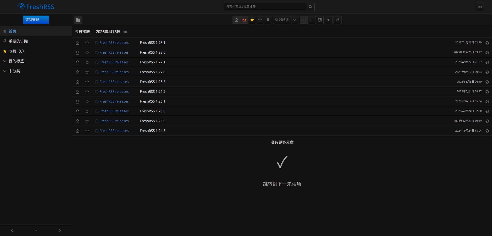
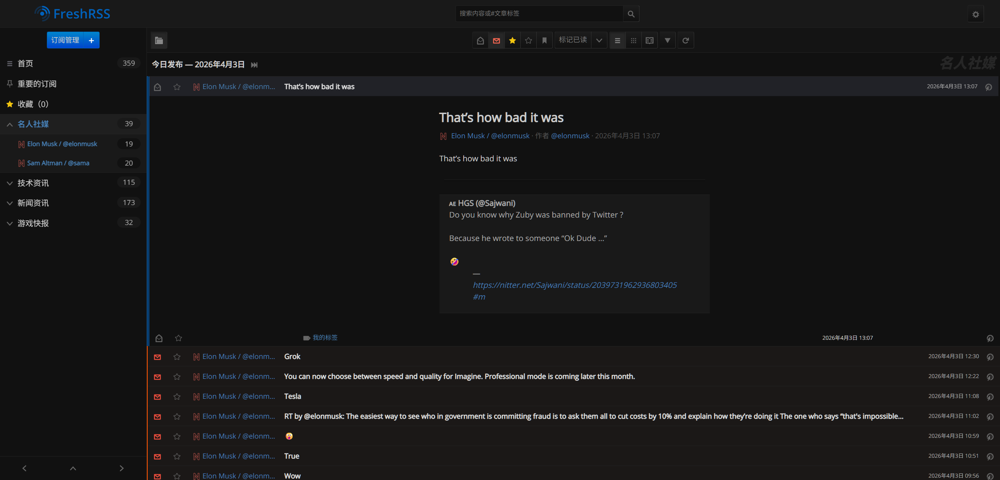
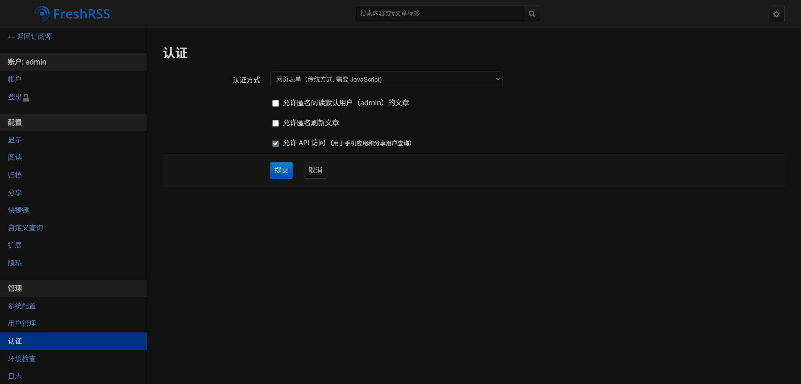
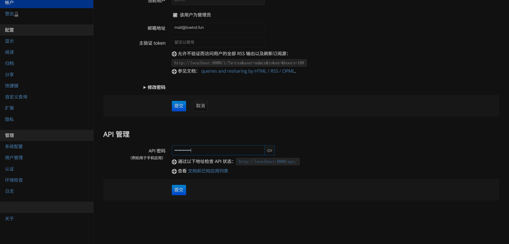
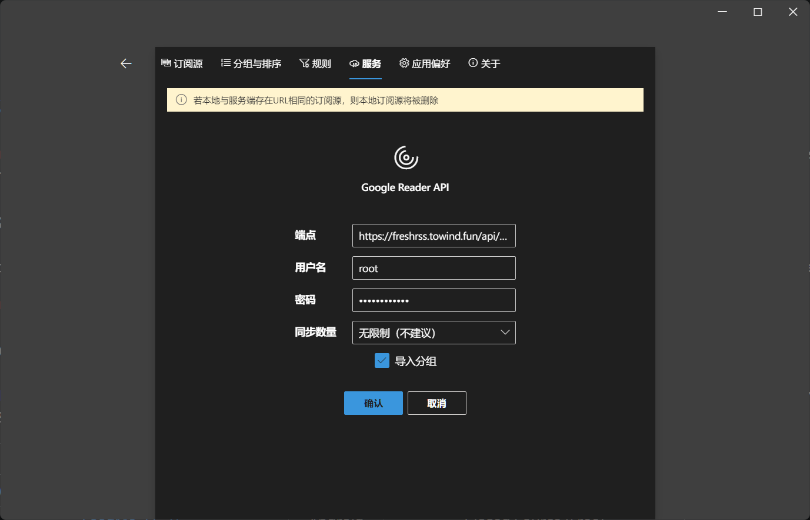
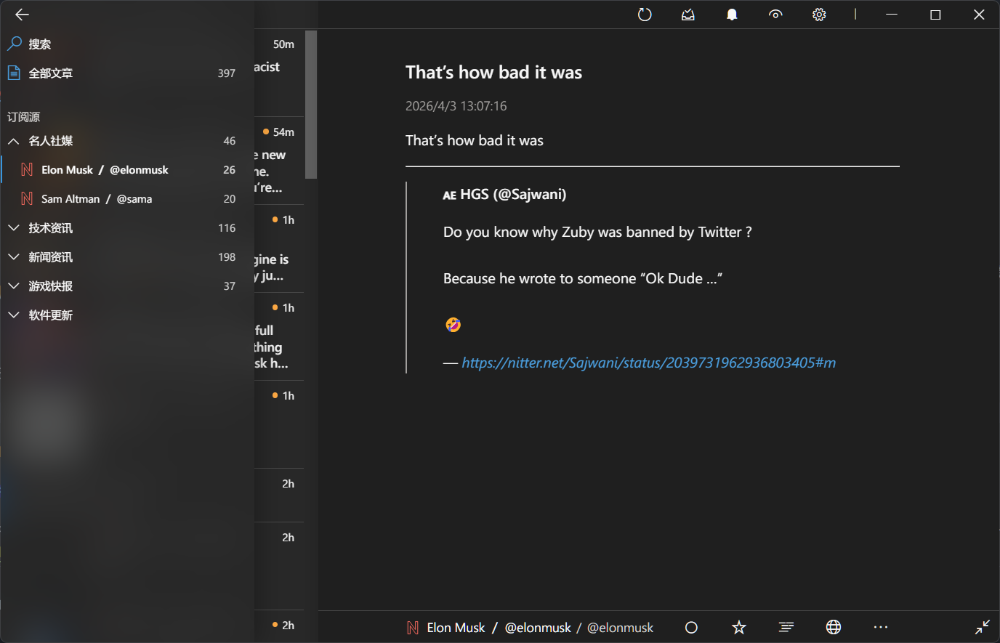

LLM 与 AI 的热潮激活了我对新鲜资讯的渴望，重新折腾起来了 RSS 阅读器。最开始想要让浏览器包办一切，因为自己总会切换不同的设备，而 Chrome 能同步安装的浏览器拓展，于是找到了知名度最高的 RSS Feed Reader。然而它并不是免费做慈善的，最大的限制是只能保存每个订阅源最新的 50 条内容，超出的部分就啪地一声不见了。对于更新较慢的博客来说，这个限制没有什么影响，想读的话肯定会在被删掉前读完；但对于更新频繁的新闻媒体来说，这个限制就很容易干掉可能有价值的未读讯息。

最后，我放弃了简单易懂的解决方案，选择了属于程序员的艰难苦行：自己部署一个 RSS 订阅源生成器。但止步于此实在简陋，于是我打算自己为自己创造需求，把生成器接入 OpenClaw，让大模型帮我筛选高价值内容。

## 部署 FreshRSS

我基于 Docker 部署一切后端服务，既可以避免污染全局环境，又能在统一的地方管理，还能轻松迁移到其它设备。参考 FreshRSS 官方文档提供的 Docker [部署指南](https://github.com/FreshRSS/FreshRSS/tree/edge/Docker#docker-compose)，一份完整可用的 `docker-compose.yml` 文件如下：

```yaml
services:
  freshrss:
    image: freshrss/freshrss:1.28.1
    container_name: freshrss
    hostname: freshrss
    restart: unless-stopped
    logging:
      options:
        max-size: 10m
    volumes:
      - ./data:/var/www/FreshRSS/data
      - ./extensions:/var/www/FreshRSS/extensions
    ports:
      - 8080:80 # 将容器的 80 端口映射到主机的 8080 端口
    environment:
      TZ: Asia/Shanghai # 时区选为上海
      CRON_MIN: "18,48" # 在每个小时的第 18 和 48 分钟拉取订阅源
      TRUSTED_PROXY: 172.16.0.1/12 192.168.0.1/16
    # Optional healthcheck section:
    healthcheck:
      test: ["CMD", "cli/health.php"]
      timeout: 10s
      start_period: 60s
      start_interval: 11s
      interval: 75s
      retries: 3
```

执行 `docker-compose up -d` 后，访问 `http://localhost:8080` 就能看到 FreshRSS 的初始化界面了，在这里可以配置管理员账号和数据库信息等。配置完毕后，首页便是内置的 FreshRSS 订阅源的版本更新通知：



接着，把我想要订阅的 RSS 链接添加到 FreshRSS 中，等待它自动拉取内容。这样，订阅的资讯便呈现在眼前了：



FreshRSS 二十四小时运行在我的服务器上，并且每隔半小时自动拉取订阅源内容，新的资讯存储在本地的数据库中，确保我即使有一段时间没打开 RSS 阅读器，也不会错过订阅源发布的任何一条讯息。

## 不要部署 RSSHub

唯一的问题是，还有许多优质站点并没有提供公开的 RSS 订阅源，不用担心，社区开源的 [RSSHub](https://github.com/DIYgod/RSSHub) 提供了解决方案：它能把各种站点的内容转换成 RSS 订阅源，这一切仰仗于社区维护者们根据不同站点定制的爬虫代码。

实际上你并不需要自己在服务器上部署 RSSHub，有很多热心分享的慈善家们共享了他们部署的 RSSHub 实例，你可以在[这里](https://docs.rsshub.app/zh/guide/instances)找到这些实例的地址。我选用了这个列表里域名看上去很吊的 `https://rsshub.rssforever.com`，它支持的所有路由可以访问 `https://rsshub.rssforever.com/api/radar/rules` 查看。当然，也尽量别只盯着一个实例薅，不然也可能被限流暂时无法拉取。

例如，如果你想要订阅财联社电报，可以在 FreshRSS 里添加订阅源地址 `https://rsshub.rssforever.com/cls/telegraph`。假如有天该公共实例下线了，也可以直接把域名替换为其它可用的公共实例地址。

当且仅当你的服务器网络无法访问这些公共实例，或者你认为这些公共实例的性能和稳定性无法满足需要时，再去自己折腾部署 RSSHub 吧。

## 连接到 Fluent Reader

尽管 FreshRSS 的 Web 页面已经足够使用了，但我更喜欢 Fluent Reader 的阅读体验，而 FreshRSS 也支持以及推荐其它客户端通过 [Google Reader API](https://freshrss.github.io/FreshRSS/en/developers/06_GoogleReader_API.html) 来拉取内容。所以在这一小节，我将展示把 FreshRSS 接入到 Fluent Reader 的过程。

首先，需要在 FreshRSS 的“认证”设置页面里启用 API 访问权限：



然后，还需要在 FreshRSS 的“账户”设置页面里添加 API 密码：



使用 `curl` 命令获取登录状态，验证是否配置成功，其中 `https://rss.example.com` 应替换为你的 FreshRSS 公网访问网址：

```bash
$ curl 'https://rss.example.com/api/greader.php/accounts/ClientLogin?Email=root&Passwd=password'
SID=root/8e6845e089457af25303abc6f53356eb60bdb5f8
LSID=null
Auth=root/8e6845e089457af25303abc6f53356eb60bdb5f8
```

如果成功打印出了 `SID` 等字段，说明 API 配置成功，可以使用 Fluent Reader 或其他支持 Google Reader API 的阅读器来访问 FreshRSS 了。

在 Fluent Reader 的设置界面里接入服务，其中端点形如 `https://rss.example.com/api/greader.php`，用户名为管理员用户名，密码为刚刚设置的 API 密码：



连接成功！现在我能在 Fluent Reader 阅读 FreshRSS 订阅的内容资讯了：



最妙的是，Fluent Reader 的星标等功能与 FreshRSS 是打通的，当你在 Fluent Reader 阅读器里为文章添加星标时，FreshRSS 在数据库里也会为关联用户的对应文章打上星标，真正实现阅读状态的同步。嘛，毕竟二者都实现了 Google Reader API。不过分组功能并没有打通，后续在 FreshRSS 修改分组的时候，需要手动更新一下 Fluent Reader 里的分组状态。

## 接入 OpenClaw

前面的内容不过是开胃小菜，现在开始才是 AI 时代为 RSS 订阅器端上来的正餐。正如[《信息过载时代，我的漏斗式阅读工作流》](https://shawnxie.top/blogs/tools/read-flow-2026.html)里作者的坦言：“信息问题早就不是获取不到，而是处理不过来。”LLM 是否能为我们缓解这个问题呢？

## 筛选高价值内容

## 每日 & 每周简报

## 尾声
