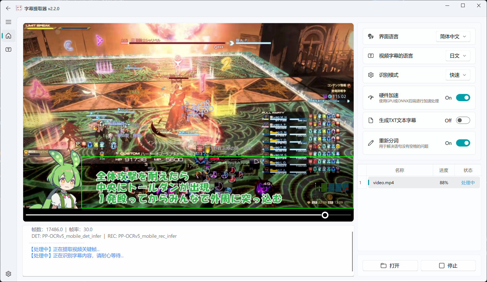

起因是自己违背了自己永远不加入固定队的誓言，受邀加入到了最终幻想 XIV 里以通关绝龙诗为目标的固定队去。由于我一直在日服游玩，因此参考攻略也入乡随俗，是日语玩家们创作的攻略。自己的日语水平是婴儿级别，看这些攻略的时候需要各类的翻译软件帮忙，而自己没有在 B 站找到汉化的日基 P1 阶段攻略[《FF14 ①絶竜詩戦争 ずんだもんと学ぶ 教皇庁フェーズ](https://www.youtube.com/watch?v=0nWgcU9OqGs)，遂突发奇想，把它烤出来，也算给自己点一个新的技能点。

## 字幕提取

找原作者要原始字幕文件自然是最优解，但我的社交能力达不到这个水准，跳过；直接用 Youtube 自动生成的字幕很方便，但是准确率感人（絶竜詩戦争 -> 自牛脂戦争），只能是兜底方案。人工智能技术近来飞速发展，于是想到基于大模型实现字幕的提取，首当其冲的就是任何情况下都可以使用的 Automatic Speech Recognition 技术了 —— 它让电脑或机器能够“听懂”人类语言的技术，能够将人们口述的语音信号实时或离线转换为文本。

### 基于 WhisperX 的 ASR 字幕提取方案探索

于是以 ASR 为关键词，在 Github 搜索开源软件，体验了一下达摩院开源的 [FunASR](https://github.com/modelscope/FunASR) 项目，不过用示例里的字幕生成脚本不能正确地导出时间戳，改代码无果后放弃。于是找到了此小节用的 [WhisperX](https://github.com/m-bain/whisperX) 项目。

> [!NOTE]
> 总是应该使用 Conda 来管理不同的机器学习和大模型推理任务环境。不过本小节里我偷懒没有使用 Conda，而是直接在全局的 Python 环境中安装了 WhisperX 和相关依赖，请不要模仿。

安装目前最新版本的 WhisperX：

```bash
pip install whisperx
```

检验安装是否成功：

```bash
$ whisperx --version
whisperx 3.8.6
```

我的电脑使用 Nvidia 显卡，安装 WhisperX 3.8.6 支持的 [CUDA Toolkit 12.8](https://developer.nvidia.com/cuda-12-8-1-download-archive) 来加速推理：

```bash
$ nvcc --version
nvcc: NVIDIA (R) Cuda compiler driver
Copyright (c) 2005-2025 NVIDIA Corporation
Built on Fri_Feb_21_20:42:46_Pacific_Standard_Time_2025
Cuda compilation tools, release 12.8, V12.8.93
Build cuda_12.8.r12.8/compiler.35583870_0
```

参考当前 WhisperX 版本 [`pyproject.toml`](https://github.com/m-bain/whisperX/blob/v3.8.6/pyproject.toml) 文件里的依赖项：

```toml
dependencies = [
    "torch~=2.8.0",
    "torchaudio~=2.8.0",
    "torchvision~=0.23.0",
]
```

安装适用于此 WhisperX 版本以及 CUDA 12.8 版本的 PyTorch 相关库：

```bash
pip install torch~=2.8.0 torchaudio~=2.8.0 torchvision~=0.23.0 --index-url https://download.pytorch.org/whl/cu128
```

WhisperX 依赖 `torchcodec` 库实现高效的音视频编解码，而 `torchcodec` 又在底层依赖于 FFmpeg，需要我们手动下载 FFmpeg 的 DLL 动态链接文件并放在对应目录下。在 [BtbN](https://github.com/BtbN/FFmpeg-Builds/releases) 找到适合于 WhisperX 的 FFmpeg 版本，例如，WhisperX 3.8.6 最高支持 FFmpeg 7，因此需要下载命名形如 `ffmpeg-n7.x.x-x-xxxxxxxxxxx-xxx-gpl-shared-7.x.zip` 的压缩包。解压后，将 `bin` 目录添加到系统环境变量，并把此目录里所有的 `.dll` 文件拷贝到 Python 依赖 `torchcodec` 目录下，我使用 Pyenv 管理全局的 Python 版本，因此目录为 `C:\Users\xxx\.pyenv\pyenv-win\versions\3.xx.xx\Lib\site-packages\torchcodec`。

随便找一个 Youtube 在线下载工具，如 [YouTube 高清视频下载](https://youtube.iiilab.com/)，下载待烤肉的视频与音频文件。由于视频和音频是分离的，可以使用 FFmpeg 将视频与音频合并成一个 MP4 文件：

```bash
ffmpeg -i video.mp4 -i audio.m4a -c:v copy -c:a copy output.mp4
```

WhisperX 在内部会自动转换音频文件为标准化的 16kHz 单声道格式再进行推理，因此可以直接将音频文件塞给 WhisperX，让它推理并导出字幕文件：

```bash
whisperx audio.m4a --language ja --device cuda --compute_type float16
```

下载模型花了比较长的时间，但实际执行推理的时候非常快，得到的结果如下：

```srt
1
00:00:28,838 --> 00:00:28,898
んんん

2
00:00:33,787 --> 00:00:49,884
ふんふん、ズンダモンなのだ。今回は絶竜師戦争、最初の狂暴潮フェーズについて解説していくのだ。フィールドマーカーはこんな感じ。フィールド円の内側にトンガリがあるので、それよりも南木側にちょっとずらしておく感じ。

3
00:00:50,527 --> 00:01:18,252
うちではMTがアデルフェル、STがグリノンを持ってたけど無敵を使う場合、暗黒はアデルフェルを持った方がいいかもね最初はDTSを稼ぐために中央にアデルフェルは途中消えるため最初はアデルフェルから殴っていくのだ戦闘開始後グリノンは四角模様を参考にど真ん中に誘導許されるならグリノンタンクはそのまま南側にいると少し楽になるよそんで戦闘リミスがなくなるならAで

4
00:01:19,363 --> 00:01:32,578
許されたのだホリエストホーリー普通の全体攻撃普通のって言っても前の全体攻撃最初は2体まとめて攻撃してEPSを稼いでいくのだ

5
00:01:36,240 --> 00:02:05,990
敵の連携攻撃、戦取距離減水、そして外側反移攻撃とはたまわり。戦は受け渡してきるので、グリノータンクがそれを回収。戦法範囲なので一人北に移動。他の人はアデルフェルタンク含め南へ、タデサにやや近づいて、津のように対処する。戦取タンクへの攻撃は距離減水なので、この処理をする場合は必ず無敵を使うこと。正しい処理は最初東西に分けて、津のように戦を引っ張ると、バフで処理できるようになる。
```

考虑使用更优的推理模型来提升准确率，试试看 WhisperX 目前最强的模型 `large-v3` 加持下的推理效果吧：

```bash
whisperx audio.m4a --language ja --device cuda --compute_type float16 --model large-v3 --batch_size 16
```

如果你的显卡显存较小，可以设置 `--compute_type int8` 或 `--batch_size 8` 等来降低显存占用。

新的推理结果如下：

```srt
1
00:00:08,840 --> 00:00:28,898
んんんんん

2
00:00:33,787 --> 00:00:49,884
ふんふん、積んだもんなのだ。今回は絶粒子戦争、最初の強行潮フェーズについて解説していくのだ。フィールドマーカーはこんな感じ。フィールド円の内側にとんがりがあるので、それよりも南北側にちょっとずらしておく感じ。

3
00:00:50,527 --> 00:01:18,252
うちではMTがアデルフェルSTがグリノーを持ってたけど無敵を使う場合暗黒はアデルフェルを持った方がいいかもね最初はDPSを稼ぐために中央にアデルフェルは途中消えるため最初はアデルフェルから殴っていくのだ戦闘開始後グリノーは四角模様を参考にど真ん中に誘導許されるならグリノータンクはそのまま南側にいると少し楽になるよそんでセントリミスがなくなるんならええで

4
00:01:19,363 --> 00:01:32,578
許されたのだホリエストホーリー普通の全体攻撃普通のって言っても全体攻撃最初は2体まとめて攻撃してEPSを稼いでいくのだ

5
00:01:36,240 --> 00:02:05,310
敵の連携攻撃、セントリ距離減衰そして外側範囲攻撃と頭割りセンは受け渡しできるのでグリノータンクがそれを回収先方範囲なので1人北に移動他の人はアデルフェルタンク含め南へタゲサにやや近づいて図のように対処するセントリタンクへの攻撃は距離減衰なのでこの処理をする場合は必ず無敵を使うこと正しい処理は最初東西に分けて図のようにセンを引っ張るとバフで処理できるようになる
```

不是，哥们？我标点符号呢！嘛，反正也要把这些字幕塞到大模型进行翻译，届时让它自动识别生成标点就好。手动矫正一些明显的错误后，让大模型将日语翻译为中文。看着 AI 思考过程里中英日乱吐的画面，还别有一番趣味。这一次抽奖得到的翻译结果如下：

```srt
1
00:00:08,840 --> 00:00:28,898
[音乐]

2
00:00:33,787 --> 00:00:49,884
呼姆呼姆，这里是俊达萌。本次将解说绝龙诗战争最开始的教皇厅阶段。场地标记大概如图所示。由于场地圆形内侧有尖角，南北方向的标记需要稍微偏移一点。

3
00:00:50,527 --> 00:01:18,252
我们这里MT拉阿德尔费尔，ST拉格里诺。如果要用无敌的话，暗骑拉阿德尔费尔可能更合适。最初为了积累DPS将阿德尔费尔放在中央，由于阿德尔费尔中途会消失，战斗开始后先打阿德尔费尔。战斗开始后格里诺参考方块图案引导到正中央，条件允许的话格里诺坦克留在南侧会稍微轻松一些，这样也能减少圣断散开的失误。

4
00:01:19,363 --> 00:01:32,578
好，通过了。至圣圣光，普通的全体攻击，虽说普通但也是全体攻击。最初同时攻击两个目标以积累DPS。

5
00:01:36,240 --> 00:02:05,310
敌人的连携攻击：圣断距离衰减，以及外围范围攻击与分摊。圣断标记可以转移，由格里诺坦克接手。由于是前方范围，1人移至北侧，其余人包括阿德尔费尔坦克移至南侧，稍微靠近仇恨圈，按图示处理。对坦克的圣断攻击有距离衰减，处理此机制时必须使用无敌。正确的处理方式是最初分东西两侧，按图示拉住标记后即可用减伤处理。
```

从结论来说，很难直接使用。最主要的原因是 WhisperX 生成的字幕时间轴跟原视频的字幕没有对齐，后续制作视频时会增加工作量；另一方面还属 ASR 大模型推理的准确度不够高，对于游戏专有名词不能很好地识别，继而导致翻译结果不甚理想。如大模型就修正了如下明显错误：

- `EPSを稼ぐ` → DPS（原文ASR误识别）
- `南側で3回` → 散开（误识别，上下文为"散开"）
- `3階はシビアじゃない` → 第三次（"3階"误识别为"3回目"）
- `三回図に沿って3回する` → 按散开图散开（"三回図"为"散開図"，"3回"为"散開"）
- `即支援範囲攻撃` → 即死范围攻击（"支援"为"死"的误识别）
- `栄章完了` → 詠唱完成（"栄章"为"詠唱"的误识别）
- `空の全員に` → 对全体（"空"为"各"的误识别）

不过对于日常使用以及原视频没有包含字幕的场景来说，WhisperX 已经很能满足将音频转为字幕的需要了。

### 基于 VSE 的 OCR 字幕提取方案探索

既然 ASR 难免存在识别上的准确度问题，何不用 OCR 呢？对呀，毕竟这次的攻略视频本身有作者自己添加的字幕，只需要把这些字幕通过机器视觉技术提取出来就好了吧。

于是我又以 Subtitle 和 OCR 为关键词，在 Github 搜索开源软件，找到了星标最高的工具 [Video Subtitle Extractor](https://github.com/YaoFANGUK/video-subtitle-extractor)。更妙的是，显然它是来自中国的，日本动漫爱好者主导开发的项目，想必对日语字幕的识别会有不错的表现。

直接下载并安装仓库分发的安装包自然最为方便，但是这样就只能使用 CPU 来进行推理了，实际体验下来速度相当感人。因此最好克隆项目后，手动安装相关依赖，激活 GPU 来加速推理。

将项目仓库克隆至本地：

```bash
git clone https://github.com/YaoFANGUK/video-subtitle-extractor.git
```

如果还没有，直接一把梭哈安装 [Anaconda](https://www.anaconda.com/download/success?reg=skipped) 并正确设置系统环境变量：

```bash
$ conda --version
conda 25.11.1
```

创建并激活 Conda 虚拟环境，Python 选择项目推荐的 3.12 版本：

```bash
$ conda create -n vse_env python=3.12
$ conda init
==> For changes to take effect, close and re-open your current shell. <==
$ conda activate vse_env
```

安装说明文档里推荐的 CUDA 11.8 版本和兼容的 cuDNN，以及其它项目依赖：

```bash
conda install -c conda-forge cudatoolkit=11.8 cudnn=8.9

cd video-subtitle-extractor
pip install paddlepaddle-gpu==3.3.1 -i https://www.paddlepaddle.org.cn/packages/stable/cu118/
pip install -r requirements.txt
```

作者自述此项目是他在读书期间开发，存在很多细节上的问题，如今工作了已经没有足够的精力进行重构，哎……我发现的问题包括但不限于：

1. 请确保仓库路径以及输入的视频路径没有中文字符或者空格，否则需使用 AI 帮你修改源码，将特定命令使用引号包裹，避免解析出错无法运行。
2. `requirements.txt` 包含了 `paddlepaddle` 依赖，安装后会导致无法正常启动 GPU 推理，需要手动卸载之：
   ```bash
   pip uninstall paddlepaddle
   ```
3. GPU 推理过程中遇到了 oneDNN 相关的报错，AI 指出错误原因是 oneDNN (MKLDNN) 不支持某些操作符，需要在初始化模型前禁用 oneDNN。这是 PaddlePaddle 与 V5 模型之间的兼容性 bug，禁用 oneDNN 是目前标准的规避方案。禁用 oneDNN 后，CPU 推理任务的速度可能会变慢，但模型结果不会改变，所以在难以解决报错的情况下直接禁用它吧：
   ```python
   # backend\tools\ocr.py
   import os
   os.environ['PADDLE_PDX_ENABLE_MKLDNN_BYDEFAULT'] = '0'
   ```

好吧，对于学生时代的项目来说，还是要减少对稳定性的期待，随时着手收拾乱局。

一切就绪，启动 GUI 图形界面：

```bash
python .\gui.py
```

导入视频，拖拽识别区域，开始处理：



快速模式下识别的结果如下：

```srt
1
00:00:17,333 --> 00:00:17,532
ウ

2
00:00:32,166 --> 00:00:36,032
HP91738 MP 10000 64734 63924 Lv90 F. A X88 16, 758. 801 RT 3000 LT23:571 ST14:57 SET

3
00:00:36,033 --> 00:00:41,232
91738 MP 10000 734 3 63924 Lv90 F. A X88 今回は絶竜詩戦争 最初の教皇庁フェースについて解説していくのだ 58, 801 23:57 ST14:57

4
00:00:41,233 --> 00:00:43,799
91738 MP 10000 3 LV90 F. A 63924 X88 フィールドマーカーはこんな感じ 16, 758. 801 SET LT23:57 ST14:57

5
00:00:43,800 --> 00:00:50,365
647 34 63924 方 88 フィールド円の内側にとんがりがあるので それよりも南北側に、ちょっとずらして置く感じ 801 23:57 ST14:57

6
00:00:50,366 --> 00:00:54,432
91738 MP 10000 34 63924 うちでは(戦士)がアテルフェル ST(暗黒)がグリノ一を持ってたけど 16. 758. 801 LT 23:57 ST14:57

7
00:00:54,433 --> 00:00:58,932
91738 MP 10000 C 63924 3 Lv90 F. A X88 無敵を使う場合 暗黒はアテルフェルをもったほうがいいかもね 758. 801 LT23:57 ST14:57
```

呃……对于复杂的画面来说，OCR 识别可能并不是什么好办法，游戏 UI 上时钟的数字还有角色信息啥的都被塞进来了。虽然可以慢慢删去这些无用信息，但也显著拉高了工作量与耗时，不想干这种事。另外作者提到可以用精准模式提升准确度，但实在是太花时间了，等了好久才处理几秒钟的视频，而且多半也会把 UI 信息识别进去，我不会再等了。

还体验了另一款工具 [RapidVideOCR](https://github.com/SWHL/RapidVideOCR)，使用起来方便了不少，识别速度也很快，只是还是会遇到相同的问题，许多无关的文字被塞进了结果去，需要后续人工去除。或许要付费的工具，才能提供更好的准确率和用户体验吧。

比较下来，若要使用人工智能技术来提取游戏攻略字幕，ASR 还算是堪堪可用的方案。

### 使用在线的字幕提取工具

WIP...

## 视频制作

WIP...
