在过去，V2RayN 还是为 Windows 开发的客户端，但随着 MacOS 上的各类 V2Ray 客户端的陆续停更，V2RayN 终于也响应了社区的呼声，自 2024 年底添加了对 MacOS 和 Linux 系统的支持。现今于我而言，V2RayN 无疑是我的全平台首选的代理客户端。

我想着也是时候为 V2RayN 写一篇完整的指南了，旨在帮助全新安装它的用户快速上手，从零开始配置一个可用的系统代理环境。

> [!NOTE]
> 本文撰写时以目前最新的 V2RayN 版本 v7.25.4 为例，其他版本在配置与使用上可能略有差异，请以实际情况为准。本文所有操作与截图均来自于 Windows 操作系统。

## 下载并解压 V2RayN 客户端

如果还没有，请前往 Github 的[发布页面](https://github.com/2dust/v2rayN/releases/latest)，下载适合自己系统的最新稳定版本的 V2RayN 客户端。

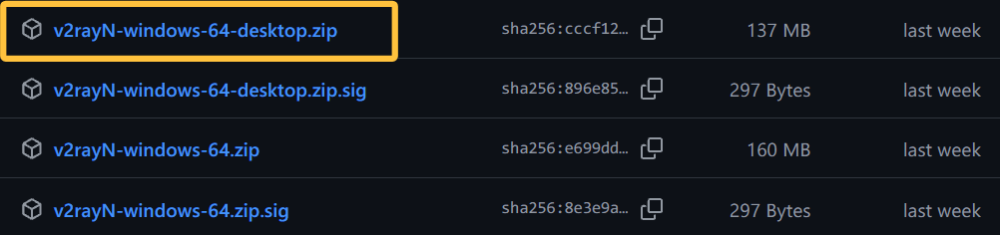

对于 Windows 客户端，包含 `-desktop` 后缀的版本基于 Avalonia UI 实现页面，不带后缀的版本基于 WPF 实现页面。在功能上二者并无差异，区别在于前者是跨平台 UI 框架，后者是 Windows 平台专用 UI 框架。因此大可以根据你自身的性格来作出选择，如果热爱新鲜事物时刻保持软件版本最新，那么大大方方选择 `-desktop` 版本；如果你对工具的要求就是稳定可靠，平时更想把热情放在更重要的事情上，那么选择不带后缀的版本即可。

遗憾是在正常的网络环境下，访问 Github 并下载上面的资源时可能会很慢很慢。别担心，有人提供了下载加速服务，举例来说，对于原始下载地址 `https://github.com/2dust/v2rayN/releases/download/7.25.4/v2rayN-windows-64-desktop.zip`，可以访问 Fastly 提供的加速服务地址 `https://cdn.gh-proxy.org/https://github.com/2dust/v2rayN/releases/download/7.25.4/v2rayN-windows-64-desktop.zip` 来下载。

解压后，得到的目录形如：

```bash
v2rayN-windows-64
├── AmazTool.exe                            # 权限提升与系统操作辅助工具。通常用于处理 Windows 系统级操作，如 TUN 模式驱动安装、系统代理注册表修改、防火墙规则管理等需要提权的任务，避免主程序全程以管理员身份运行带来的安全风险
├── av_libglesv2.dll
├── e_sqlite3.dll
├── libHarfBuzzSharp.dll
├── libSkiaSharp.dll
├── v2rayN.exe                              # 主程序入口
├── v2rayN.icns
├── v2rayN.png
└── bin
    ├── Country.mmdb                        # MaxMind GeoIP2 数据库。根据 IP 地址查询地理位置，是实现"国内IP直连、国外IP代理"策略的核心数据源
    ├── EnableLoopback.exe                  # UWP 回环工具。Windows UWP 应用默认被隔离无法访问本地代理，此工具能够解除该限制，使这些应用能走 v2rayN 代理
    ├── geoip.dat                           # IP 规则集，定义 IP 段归属（如 cn、private、telegram 等），供内核做路由决策
    ├── geoip.metadb                        # Mihomo 专用的 GeoIP 规则集优化格式，针对 Mihomo 内核的查询性能做了索引优化，加载速度更快
    ├── geoip-only-cn-private.dat           # 精简版 GeoIP 库，仅含中国 IP 和私有地址段。体积更小，适合只需国内直连分流的场景
    ├── geosite.dat                         # 域名规则集，定义域名归属（如 google、netflix、gfw 等），供内核做 DNS/路由分流
    ├── mihomo                              # Mihomo (原 Clash.Meta) 内核
    │   └── mihomo.exe                      # Clash 系内核的活跃分支。兼容 Clash 配置格式，支持 VLESS Reality、TUIC 等，适合习惯 Clash 生态或已有 Clash 订阅的用户
    ├── sing_box                            # sing-box 内核
    │   ├── libcronet.dll                   # Chromium Cronet 网络库。为 sing-box 提供基于 Chromium 网络栈的 QUIC/HTTP3 传输优化，显著提升 Hysteria2/TUIC 协议的稳定性和速度
    │   └── sing-box.exe                    # 新一代通用代理平台。支持 TUIC、Hysteria2、VLESS Reality 等新协议，配置灵活，内存占用低。适合使用新兴协议的用户
    ├── srss                                # sing-box 专用二进制 IP 和域名规则集优化格式，加载速度更快，内存占用更小
    │   ├── geoip-cn.srs
    │   ├── geoip-facebook.srs
    │   ├── geoip-fastly.srs
    │   ├── geoip-google.srs
    │   ├── geoip-netflix.srs
    │   ├── geoip-private.srs
    │   ├── geoip-telegram.srs
    │   ├── geoip-twitter.srs
    │   ├── geosite-category-ads-all.srs
    │   ├── geosite-cn.srs
    │   ├── geosite-geolocation-cn.srs
    │   ├── geosite-gfw.srs
    │   ├── geosite-google.srs
    │   ├── geosite-greatfire.srs
    │   └── geosite-private.srs
    └── xray                                # Xray-core 内核
        ├── wintun.dll                      # Wintun 虚拟网卡驱动。为 Xray 的 TUN 模式提供底层网络适配器支持，使非 HTTP/SOCKS 流量也能被代理接管
        └── xray.exe                        # VLESS+XTLS-Vision、Trojan、Shadowsocks 等主流协议的首选。性能优秀，社区活跃，是大多数用户的默认内核
```

首次启动客户端后，会自动创建 `guiConfigs/`，`guiLogs/` 和 `guiTemp/` 三个目录，分别用于存放 GUI 客户端的配置文件、日志文件和临时文件。

而后，在客户端进行的与 V2Ray 相关的配置，如添加服务器、订阅、路由规则等，都会被保存到 `binConfigs/config.json` 文件中。这个文件是最重要的配置文件，如果有多主机使用 V2RayN 的需求，建议将其备份到云端，以便在不同设备间同步配置。如果你知道自己在做什么，可以直接编辑这个文件来修改代理配置。此外，如果代理出现了奇奇怪怪的问题，在确保备份的前提下，可以直接删除这个文件来重置 V2Ray 配置。

## 导入代理地址或添加订阅

代理服务商通常会提供两种方式来让用户使用他们的服务：一种是直接提供完整的代理 IP 地址或域名地址分享链接，形如：

```plaintext
ss://xxxxxxxxxxx@xxx.xxx.xxx.xxx:xxx
ss://xxxxxxxxxxx@https://xxx.xxx.xxx.xxx:xxx
vless://xxxxxxxxxxx@xxx.xxx.xxx.xxx:xxx?encryption=none&flow=xtls-rprx-vision&security=reality&sni=portal.citygrainla.com&fp=chrome&pbk=xxx&sid=xxx&type=tcp&headerType=none
```

复制到剪切板后导入即可使用：

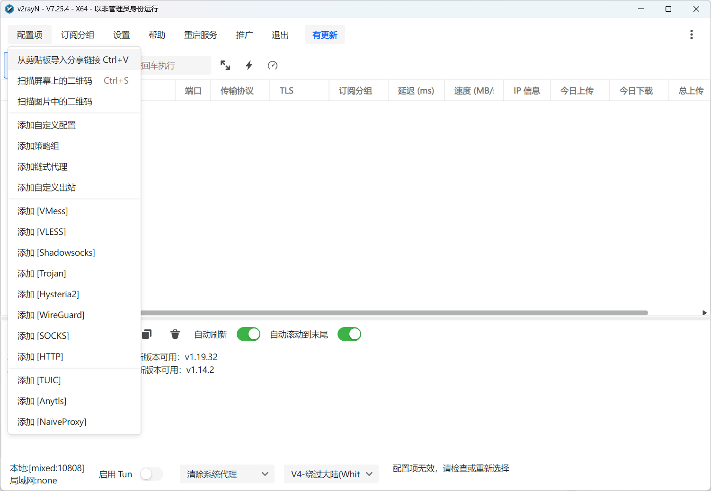

在这里补充一下使用 IP 地址和域名地址的区别：IP 地址是指向服务器的唯一标识符，也就是说使用它我们的主机就能直接找到代理服务器，进而建立连接。而域名地址是一个人类可读的、更容易记忆的文本（当然作为代理地址的域名往往没那么好记，就算记了也没啥用），主机需要通过域名解析服务（DNS）将域名转换为对应的 IP 地址，才能找到代理服务器再建立连接。由于从域名解析到 IP 地址的过程中要经过 DNS 的查询，如果 DNS 配置有误、被污染或域名遭到封禁，域名解析就会失败，导致无法连接到代理服务器。

这样来看，使用 IP 地址分享链接的方式能确保你能连接到代理服务器，那么用它不就 OK 了吗？没那么简单。在现实实际中，代理服务器的 IP 地址可能会因为各种原因而发生变化，比如代理提供商更换了服务器、服务器被封禁或被攻击等。而在 DNS 服务正常的情况下，主机可以通过域名解析获取最新的 IP 地址，从而保证连接的可用性。

那么有没有能结合二者优点，同时尽可能避免二者缺点的方式呢？这就是接下来要介绍的另一种接入代理服务的方式——添加订阅：

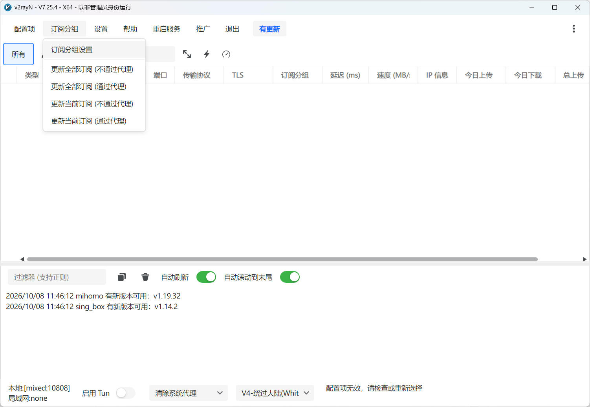

添加代理服务商为你提供的订阅链接，配置好自动更新：

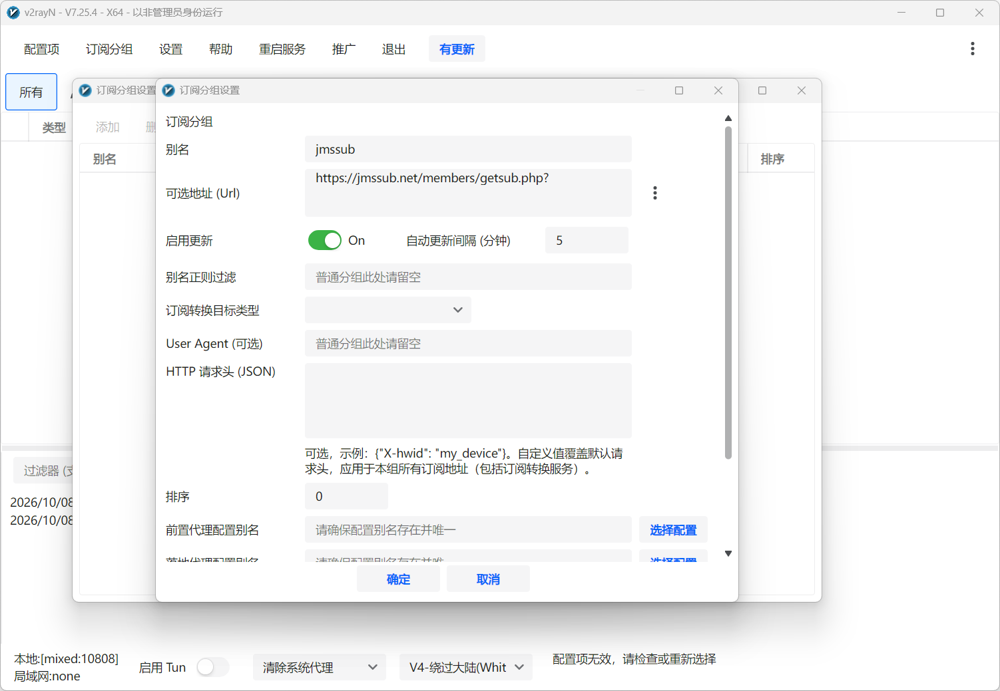

更新订阅，拉取最新的代理配置：

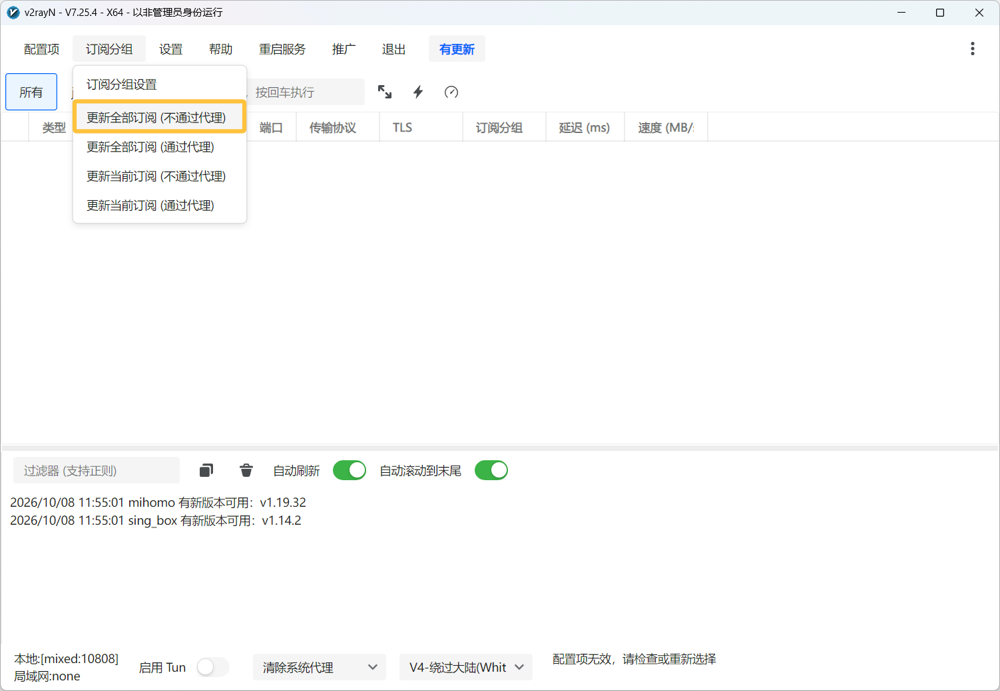

基于 IP 地址的代理配置被顺利拉取下来，如果能获取到延迟信息，说明代理服务器是可用的：

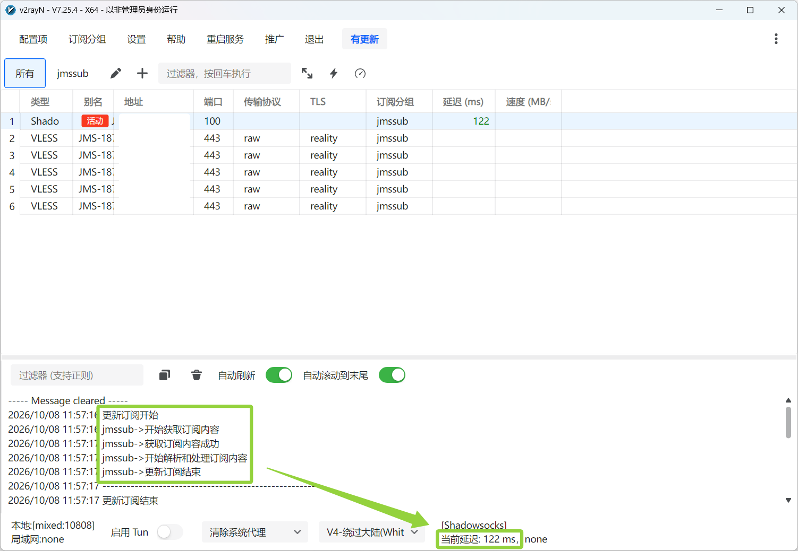

订阅的方式能够让你在代理服务器的 IP 地址发生变化时，仍然可以通过订阅链接获取到最新的 IP 地址，从而保证连接的可用性。但是，它也不可避免的要经过域名解析的过程，如果 DNS 异常，会导致拉取不到最新的代理配置。在这种情况下，需要临时切换为 IP 地址分享链接的方式来使用代理服务。

## 启用 V2RayN

注意到客户端下方的两个选择框了吗？默认情况下分别是「清除系统代理」和「V4-绕过大陆(Whitelist)」。为了能让你正常使用代理，这两个选择框是最后一块必须学会的知识点。

V2RayN 支持四种代理模式：

- **清除系统代理**：关闭系统的代理服务器设置，恢复成直连网络。适合于临时关闭代理，或者需要完全还原系统网络状态时使用。
- **自动配置系统代理**：自动配置系统的代理服务器，并将系统的 HTTP/SOCKS 流量转交给 V2rayN 的本地监听端口。**适合于绝大多数情况下使用**。
- **不改变系统代理**：不改变系统已有的代理服务器配置。适合于有其他代理服务器，但仍需要用到 V2RayN 的情况下使用。
- **Pac 模式**：基于 PAC（代理自动配置）脚本文件进行分流，浏览器会执行这个脚本文件来判断网络是否进行代理。然而其他软件一般不会遵循该脚本文件，还是会走直连网络。考虑到在自动配置系统代理的模式下，浏览器也会遵循路由规则判断网络是否进行代理，所以这个模式实际上很少会用到。

对于 Windows 而言，系统代理可以在设置页面进行配置：

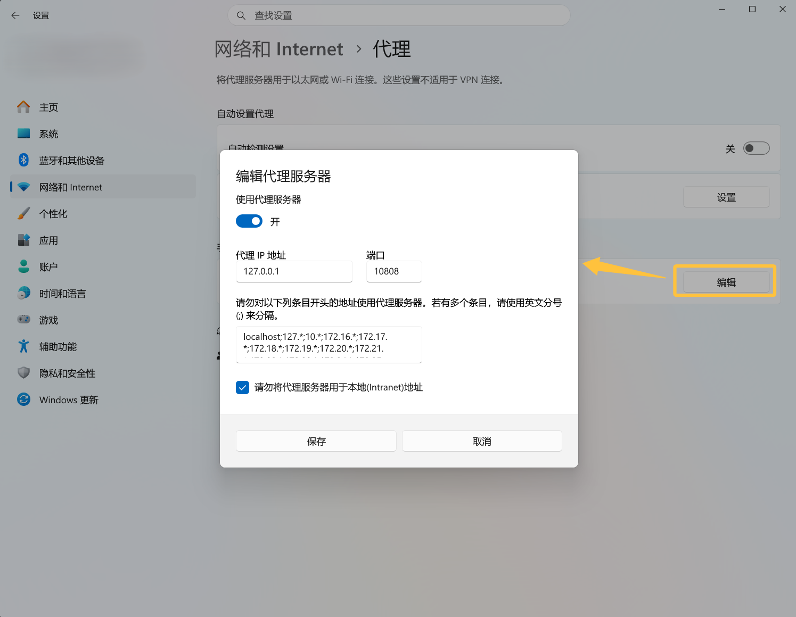

如果选择了「自动配置系统代理」，那么 V2RayN 在启动时会自动修改这里的配置为代理服务监听的端口，如上图所示。同理，如果选择了「清除系统代理」，V2RayN 在启动时会自动清除这里已有的配置，恢复成直连网络；如果选择了「不改变系统代理」，V2RayN 在启动时不会改变这里已有的配置。

V2RayN 在启动后会静默监听本地的端口，因此在非「自动配置系统代理」模式下，软件仍可以通过设置自身的代理服务器地址为对应的端口，实现网络代理功能。

网络流量走到 V2RayN 后，并不会一股脑就全部甩给代理服务器，而是会根据路由规则进行分流，最好的情况下是让所有国内的网络请求走直连，而国外的网络请求走代理。

V2RayN 自带了三个不同的路由规则，判断网络流量走代理还是走直连：

- **绕过大陆(Whitelist)**：记录在“白名单”里的国内域名和 IP 走直连，其余的所有网络流量走代理。适合于大多数情况下使用。
- **黑名单(Blacklist)**：记录在“黑名单”里的国外域名和 IP 走代理，其余的所有网络流量走直连。适合于遇到某些国内站点访问异常，或跟其他人共用主机的情况——你也不想你的妈妈网上冲浪的时候出现加载失败的问题吧？
- **全局(Global)**：好吧，让所有经过 V2RayN 的网络流量走代理。当你知道你在做什么的时候使用。

因此，对于一般用户来说，建议常驻使用「**自动配置系统代理**」与「**V4-绕过大陆(Whitelist)**」的组合，就基本上可以满足日常上网冲浪的一切需要了。

世事无常，并非所有国外的域名都在“黑名单”上，也并不是所有国内的域名都在“白名单”里。如果遇到某些网站访问不了或应用网络不畅的情况，可以灵活切换代理模式和路由规则。在“参数设置”里我们可以配置自动更新 Geo 文件，有助于提升路由规则的准确度：

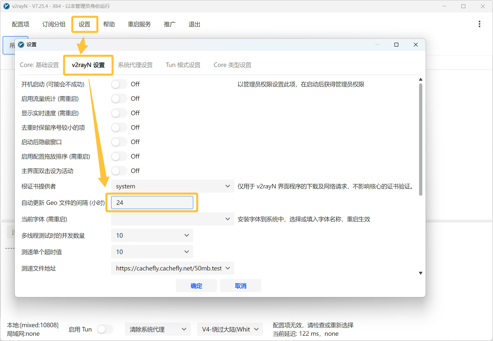

偶尔想起来，去检查一下客户端与代理内核的更新，也有助于获取到最新的安全与稳定性补丁：

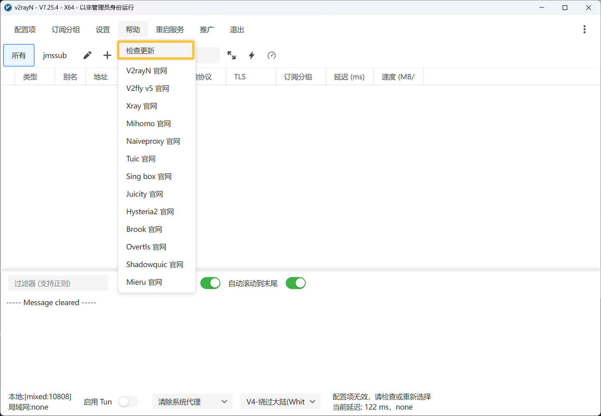

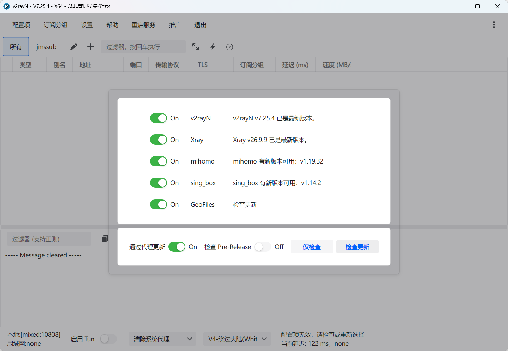

到这里，你已经掌握了从零开始到正常使用 V2RayN 必备的知识点。

## 用好 V2RayN

这个章节里我希望介绍更多可能用得上的知识，让你的 V2RayN 体验从能用变得会用，亦是撰写本文的原动力所在。

### 流量探测

在“参数设置”里有「开启流量探测」的配置项，它有何作用？

流量探测通过读取网络数据包包中的特定数据字段，提取出真实的域名，配合 geosite 规则，可以实现更精准的路由分流。

V2RayN 支持勾选流量探测的类型，以添加对不同类型的网络数据包的支持。

值得一提的是，「仅限路由（routeOnly）」功能默认关闭，流量探测得到的域名会覆盖原始的目标地址。然而在部分情况下，尤其是访问 CDN 和反代站点时，网站的 TLS 证书只会签发给特定域名，如果原始的目标地址被覆盖，可能会导致服务端拒绝连接或者返回错误证书，最终导致客户端报 TLS 错误，无法正确建立网络连接。我就曾遇到微博上部分图片无法正确加载的问题，就是流量探测引发的与 CDN 源站 TLS 握手失败导致的。因此，还是建议启用此功能，保证 TLS 兼容性。

总结来说，推荐**勾选「开启流量探测」选框**以实现更精准的路由分流，**选中所有支持的「流量探测类型」选项**，同时**启用「仅限路由（routeOnly）」功能**避免奇奇怪怪的网络错误：

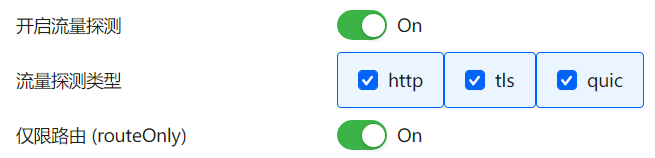

### Mux 多路复用协议

哇「Mux 多路复用协议」听起来好厉害，它是做啥的，我应该开启它吗？

嚯嚯嚯，现实恰恰相反，在如今的网络环境和现代网络协议的加持下，一般建议关闭此功能。

Mux 的核心思想是在一条 TCP/UDP 连接上同时承载多条独立的数据流，让多个请求复用一条连接，减少网络握手的次数以提升网络效率。

然而，正如早期版本的 HTTP 协议那样，Mux 会存在队头阻塞的问题：如果 TCP 连接上的某一个连接拥塞或者发生丢包，那么复用同一物理连接上的其他子连接也会被拖累；如果内部实现使用的是单队列或类似串行分片机制，也会遇到应用层级的排队问题。在跨境网络这种高丢包、高抖动环境下，Mux 会显著放大延迟波动，表现为网页加载卡顿、视频频繁缓冲。

现代的网络协议已内置了更优的替代方案，例如：VLESS 协议的 XTLS-Vision 流控模式，本身已实现零拷贝和高效传输，无需额外 Mux 层；HTTP/2 & HTTP/3 协议在应用层已自带多路复用，再叠加 Mux 属于双重封装，反而增加开销。

在过去，Mux 被视作性能优化的手段。现在，只有少数特定场景开启 Mux 是有价值的。加上 Mux 协议的帧结构具有高度规律性，中间审查设备很容易识别相应的网络流量，轻则限速，重则直接阻断 IP 或端口。

总结来说，对于正常使用代理软件的用户来说，**关闭 Mux 功能**才是更优解。

### 分片

「启用分片（Fragment）」这是个啥，我应该勾选它吗？

分片的作用就是将原本完整发送的 TLS 握手包，在 TCP 层故意拆分成多个极小的片段发送。这样，中间审查设备在重组这些碎片之前，无法看到完整的握手内容，从而绕过基于完整包的 DPI 检测。

特别的，「末端分片」是指特意将 Client Hello 的最后一个字节或最后几个字节单独作为一个分片发送。这种策略针对的是某些只检查“前 N 个字节”或“特定偏移量”的简化版 DPI 设备，把敏感信息推到末尾并单独切片，可以最大化规避检测。

现代的网络协议本身就更抗检测，例如 REALITY 无证书安全传输方案，会“借用”（TLS 伪装）互联网上现成知名网站（如 `://microsoft.com`）的 TLS 特征，让你的代理流量在外部看起来与访问正规网站完全一致，从而极大地降低被识别和封锁的概率，无需再叠加会增加延迟的分片功能。

总结来说，对于使用 VLESS 等现代协议，以及使用较新 V2RayN 客户端的用户来说，应当**关闭与分片相关的功能**。只有在确认遭遇 TLS 指纹级封锁且无法更换节点/协议时，才将其作为最后的调试手段。

### Xray 与 Sing-box 内核

目前 V2RayN 客户端支持在 Xray 和 Sing-box 两种内核间切换，默认情况下使用 Xray 内核。需注意的是，客户端里部分的配置项仅对 Xray 生效，部分仅对 Sing-box 生效，剩下的会根据启用的内核进行自动映射。

Xray 是老牌成熟的内核，拥有最广大的社区和工具集成，稳定性表现优异。

Sing-box 是一个较新的、通用的内核，定位为 Xray 的替代品。相比 Xray，它拥有更低的内存占用，更好的性能表现。

如果无视代理核心开发者小圈子里的节奏与乱斗，你依旧可以参考自己的性格进行选择：图新鲜、高性能，那么就选 Sing-box；好稳定、慕成熟，那么就保持 Xray 不变。

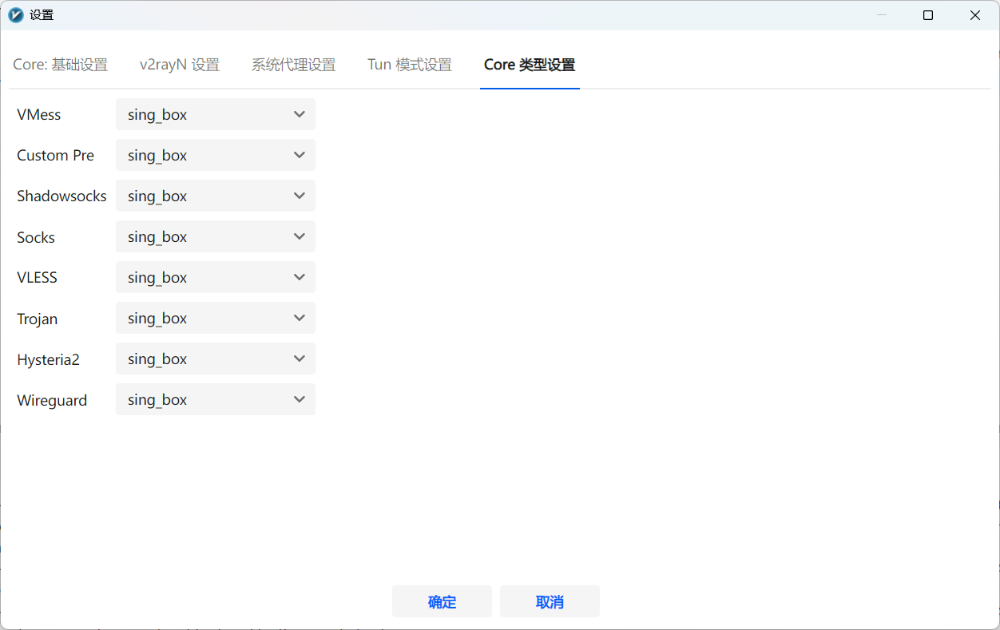

### 路由设置

在路由设置对话框的上面可以选择「域名解析策略」和「sing-box 域名解析策略」，都是干嘛的？

当使用 Xray 内核时，「域名解析策略」配置生效，它定义了“在匹配路由规则之前或之后，是否先将域名解析为 IP”。有如下选项：

- **`AsIs`**：直接使用域名进行连接和路由匹配，不进行预解析。只有在直连（Direct）或目标服务器需要 IP 时才会触发 DNS 解析。最大程度保留域名信息，让远端代理服务器去解析域名，能有效防止本地 DNS 污染，且通常速度最快。适用于绝大多数场景，也是默认的域名解析策略。
- **`IPIfNonMatch`**：仅当域名无法匹配任何路由规则时，才使用本地 DNS 将其解析为 IP 进行二次匹配。
- **`IPOnDemand`**：只要路由规则中存在任何基于 IP 的规则，就立即将域名使用本地 DNS 解析为 IP，然后用 IP 去匹配所有规则。

在过去，geosite 数据库不全，确实需要 GeoIP 兜底。如今 `geosite:cn` 等列表覆盖率极高，常见流量都能通过域名规则精确匹配，GeoIP 兜底的实际触发率极低，为此使用本地 DNS解析域名，承担 DNS 泄露风险得不偿失。Sing-box 直接移除了 `IPIfNonMatch` / `IPOnDemand` 这两个选项，其路由阶段默认行为就是 `AsIs`，这也代表了新一代代理内核的共识：路由阶段不应做 DNS 解析。

总结来说，对于 Xray 内核，在绝大多数情况下应**选择 `AsIs` 策略**。

而使用 Sing-box 内核时，「sing-box 域名解析策略」配置生效，它定义了“当目标是一个域名时，内核应当如何将其转换为 IP 地址，以及优先使用 IPv4 还是 IPv6 来建立连接”。有如下选项：

- **`-`**：遵循系统默认行为，通常由操作系统或上游 DNS 的响应顺序决定使用 IPv4 还是 IPv6。默认值。
- **`prefer_ipv4`**：同时请求 A 记录（IPv4）和 AAAA 记录（IPv6），但优先使用 IPv4。如果 IPv4 解析失败或超时，才回退到 IPv6。
- **`prefer_ipv6`**：同时请求 A 记录（IPv4）和 AAAA 记录（IPv6），但优先使用 IPv6，如果 IPv6 解析失败或超时，才回退到 IPv4。
- **`ipv4_only`**：仅请求 A 记录，完全忽略 AAAA 记录。
- **`ipv6_only`**：仅请求 AAAA 记录，完全忽略 A 记录。

目前大量代理节点以及基础设施对 IPv6 支持欠佳，优化不足导致存在路由绕路的问题，所以大多数情况下不应该选择 `prefer_ipv6` 或 `ipv6_only` 策略。

总结来说，对于 Sing-box 内核，通常推荐**选择 `prefer_ipv4` 策略**。如果不会访问纯 IPv6 站点，那么选择 `ipv4_only` 策略也算一个小优化。当然，留空也不失为一个选项。

### DNS 设置

在“DNS 基础设置”里有若干配置项，在这里一一讲解它们的用途。

DNS 配置：

- **直连 DNS**：用于解析国内域名或私有域名的 DNS。通常配置为国内公共 DNS 或本地运营商 DNS。当流量被判定为“直连”时，使用此 DNS 获取 IP，确保访问国内网站速度快且准确。
- **远程 DNS**：用于解析国外域名或被代理流量的 DNS。通常配置为境外可信 DNS。该请求会通过代理节点发出，以确保获取到正确的国外网站 IP。
- **Bootstrap DNS**：“DNS 的 DNS”，用于解析 DoH/DoT 服务器的域名本身。当且仅当直连 DNS 或远程 DNS 使用形如 `https://dns.google/dns-query` 的格式时生效，用于把这样的地址解析为 IP。

为了防止 ISP 劫持，建议将直连 DNS 和远程 DNS 地址设为 **DoH/DoT 域名**，而不是直接使用 IP 地址。

解析策略配置：

- **直连目标解析策略**：当规则判定目标为“直连”时，客户端用哪种方式把目标域名翻译成 IP 地址并建立连接。
  - **`AsIs`**：交由操作系统底层或系统 DNS 解析域名，客户端内核不做处理。**推荐的默认值**。
  - **`UseIP` 等**：在客户端内核中通过设定的直连 DNS 把域名解析为指定的 IPv4 或 IPv6 地址后，再发起直连。可以避免部分因系统 DNS 缓存污染或 IPv6 优先导致的直连卡顿、缓慢问题，但会产生一次额外的 DNS 查询开销。
- **代理目标解析策略**：当规则判定目标需“代理”时，客户端用哪种方式把目标域名翻译成 IP 地址并建立连接。
  - **`AsIs`**：交由代理服务器负责解析域名，客户端内核不做处理。**推荐的默认值，绝大部分情况应该使用此选项**。
  - **`UseIP` 等**：在客户端内核中通过设定的远程 DNS 把域名解析为指定的 IPv4 或 IPv6 地址后，再通过代理连接。当且仅当代理服务器不支持 DNS 解析的时候，使用这些选项。
- **连接代理解析策略**：解析你的代理节点服务器本身域名时，客户端用哪种方式把目标域名翻译成 IP 地址并建立连接。通常默认使用直连 DNS 解析节点域名，如果节点域名无法访达或直连 DNS 被污染，此时可能需要手动指定 Bootstrap 或特定 DNS 来解析节点域名。V2RayN 客户端标注“不建议开启，特殊情况可能回环”，那我们也遵循它的提示设为空值吧。

其他选项：

- **并行查询**：同时向“直连 DNS”和“远程 DNS”发起请求，使用最先返回的有效结果。优点是显著降低首次解析延迟；缺点是如果直连 DNS 抢先返回了被污染的国外 IP，可能导致短暂连接失败。
- **乐观缓存**：当缓存中的 DNS 记录过期后，立即返回旧的过期 IP 给应用，同时在后台异步刷新记录。**建议开启**。
- **启用 Happy Eyeballs**：当 DNS 同时返回 IPv4 和 IPv6 地址时，不再等待其中一个超时再使用另一个，而是快速并发尝试连接，优先使用响应最快的地址。使用 Xray 内核且解析策略配置配置为 `UseIP` 时，建议开启，能够解决 IPv6 拖慢网速问题。Sing-box 内核默认集成并启用此功能，此处的开关只起占位的效果。

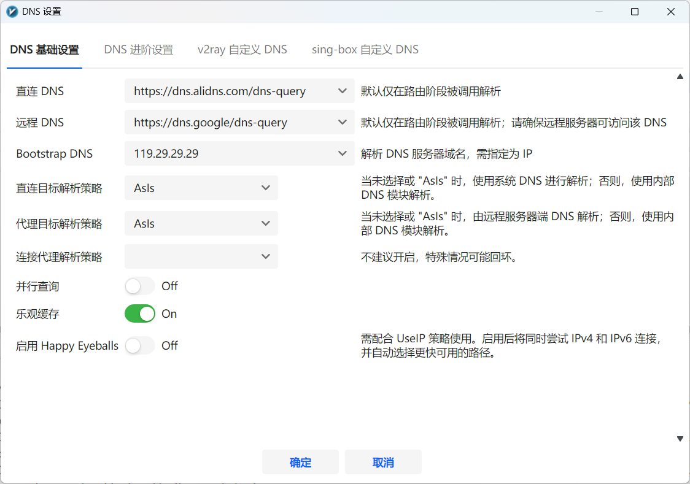

### Tun 模式

在 V2RayN 客户端的左下角，代理模式选择框的旁边，有一个「启用 Tun」的按钮，它是干啥的？

答曰，启用强行接管电脑所有流量的 Tun 模式来进行路由分流。

正如只有浏览器和极少专业软件会遵循 PAC 脚本文件定义的代理规则一样，只有支持系统代理的软件才遵循「自动配置系统代理」的规则，将自身的网络流量交给 V2RayN 统一管控。

如果你确乎有这样的需求，要让包括客户端网游、不支持系统代理的软件和命令行工具等在内的所有网络流量都走 V2RayN 分流代理，那么可以启用 Tun 模式。在该模式下，V2RayN 会创建一块虚拟网卡，在操作系统底层拦截所有网络流量，实现代理的目的。如果你的 Windows 主机使用 WiFi 联网，在启用 Tun 模式后，可以注意到联网标识从 WiFi 变成了有线网络。

Tun 模式下应该将代理模式设为「清除系统代理」，避免网络流量走两遍 V2RayN，还可以验证模式下的代理功能是否工作正常。

从设计的愿景来看，Tun 模式无疑是系统代理最佳的选择。但是我在使用它时偶尔会遇到一些“玄学”无法访问网络的问题，对于不深耕底层的我来说也不知该如何着手解决。据说 Xray 内核和 Sing-box 内核在 Tun 模式下的表现同样有所差别，如果默认的 Xray 内核老是出现问题，不妨切换到 Sing-box 内核，兴许就正常了。

由于 Tun 模式的工作原理与游戏加速器的工作原理相同，都是通过虚拟网卡实现网络流量劫持，所以可能会遇到不兼容的情况。例如，旧版本的 UU 加速器在设置页面有单独的“Tun 网卡兼容”选项，勾选后能实现与代理软件 Tun 模式的共用，新版本的 UU 加速器已内置此功能。但是，如果玩游戏时的网络流量没有走到加速器，而是经过 V2RayN 的话，需要考虑在配置中不代理指定客户端的网络流量，或是临时禁用 Tun 模式。

对我来说，当上网体验受到影响，就会关闭 Tun 模式，默默切回「自动配置系统代理」。「自动配置系统代理」仍然是现在最适合大多数用户的代理模式。

## 结语

截止目前，我认为你应该掌握的所有内容都已经在上面了，如果还想更深入了解更多配置项的功能，建议访问 V2RayN 的[仓库维基](https://github.com/2dust/v2rayN/wiki/)，关注社区里的相关[讨论](https://github.com/2dust/v2rayN/discussions)。

V2RayN 本质上只是简化使用的命令行工具 V2Ray 的客户端，如果想探索 V2Ray 的完整能力，可以前往其[官方网站](https://www.v2ray.com/)学习，手动对 `binConfigs/config.json` 进行配置。
