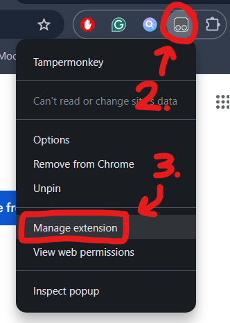

Wplace 是一个所有人都可以往世界地图上任意添加像素点的涂鸦平台，看见大家创造的各种图画，我也不可避免地被吸引加入。

但是你妈的，怎么成都的涂鸦全是 KR Dog？必须要正本溯源，添加一些我喜爱的要素了！

这篇文章将介绍 Tampermonkey 插件 Blue Marble，并使用它在 Wplace 进行创作。由于 Wplace 本身需要代理软件才能访问，所以下面的内容均假设您具备科学上网的能力。

## 安装 Blue Marble

Blue Marble 是一款用于 Wplace 作画的 Tampermonkey 插件，您可以上传转换好的像素图画，它将基于选定的坐标和像素图画，在 Wplace 的地图上显示作画模板。而后，您只需要按照模板一个一个地放置像素点就好了！遗憾的是，它并不支持自动化放置像素点，因为这是违背 Wplace 用户协议的。

Blue Marble 的[官方文档](https://wplace-pixel.com/zh/blue-marble)提供了在 Chrome 安装插件的教程，简单总结步骤如下：

1. 从 Chrome 应用商店安装 Tampermonkey 扩展程序。
2. 右键单击 Tampermonkey 的图标，进入扩展程序设置页面，启用“开发者模式”，并配置“允许用户脚本”。摘取官方的示例图：
   
   
3. 访问链接 `https://github.com/SwingTheVine/Wplace-BlueMarble/releases/download/pre/BlueMarble.user.js` 安装插件。
4. 访问 Wplace，开始使用插件。

如果您过去使用过其它的 Tampermonkey 插件，步骤 1 和 2 应当已经配置完成了。

## 转换像素图画

在正式使用 Blue Marble 之前，您需要转换源图片为只包含 Wplace 支持颜色的新像素图画，以便基于它正确地在地图上生成待绘制的像素点。

您可以通过 [Wplace Color Converter](https://pepoafonso.github.io/color_converter_wplace/index.html) 工具来转换图片，效果如下：

如果使用“Dithering”功能，像素图画的颜色会更加还原源图片，但是在低分辨率下噪点会比较明显。

## 导入作画模板

访问 Wplace，页面上会有大大的 Blue Marble 面板。为了导入刚刚转换好的像素图画为作画模板，操作步骤如下：

1. 选中地图上的一个像素点，点击 Blue Marble 面板里的“坐标”按钮。它将被作为作画模板的左上角顶点。如下图所示，选中的像素点坐标为 `(Tl X: 1615, Tl Y: 841, Px X: 752, Px Y: 575)`，它将被自动设置到面板里：
   
2. 点击“Upload Template”按钮，上传转换好的像素图画。
3. 点击“Create”按钮，Blue Marble 将在地图上生成待绘制的像素点。如下图所示，小型的色块就是待绘制的像素点，完整的色块是笔者已经绘制的像素点：
   

此外，点击“Disable”按钮可以暂时隐藏待绘制的像素点；点击“Enable”按钮又将重新显示待绘制的像素点。

## 开始作画吧

为了便于作画，您可以按颜色过滤待绘制的像素点。如下图所示，只显示“Dark Gray”颜色的像素点，过滤掉其它颜色：

现在开始一个一个添加像素点吧！

对了，刚注册的 Wplace 用户会赠送 20000 点 Droplets，建议使用它来提升绘画次数上限。这样，在休息一阵后就可以狠狠作画了。

## 笔者画了些啥

由于 Wplace 允许用户任意覆盖别人的像素点，世界也大概率每隔一段时间清空重置，画作很难永恒地保留下去。

且如沙龙般在这里定格自己留过的痕迹。

### 天童爱丽丝（Cola!!）

[中国成都](https://wplace.live/?lat=30.50449975627844&lng=104.02637662177733&zoom=14.852081433804749)，2025.08.28-08.30

### 攀七中校徽

[中国攀枝花](https://wplace.live/?lat=26.590020751256176&lng=101.63627896552734&zoom=15.624748093457498)，2025.08.29

### 攀枝花（碧蓝档案 Logo 版本）

[中国攀枝花](https://wplace.live/?lat=26.595993787113287&lng=101.71098599677734&zoom=15.173534563778032)，2025.08.30-08.31

### 天童爱丽丝（立绘）

[中国攀枝花](https://wplace.live/?lat=26.623025733924276&lng=101.66194302802731&zoom=13.893164622639107)，2025.08.31-09.05
