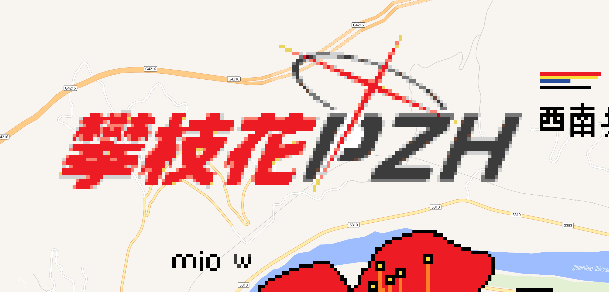

Wplace 是一个所有人都可以往世界地图上任意添加像素点的涂鸦平台，看见大家创造的各种图画，我也不可避免地被吸引加入。

但是你妈的，怎么成都的涂鸦全是 KR Dog？必须要正本溯源，添加一些我喜爱的要素了！

这篇文章将介绍 Tampermonkey 插件 Blue Marble，并使用它在 Wplace 进行创作。由于 Wplace 本身需要代理软件才能访问，所以下面的内容均假设您具备科学上网的能力。

## 安装 Blue Marble

Blue Marble 是一款用于 Wplace 作画的 Tampermonkey 插件，您可以上传转换好的像素图画，它将基于选定的坐标和像素图画，在 Wplace 的地图上显示作画模板。而后，您只需要按照模板一个一个地放置像素点就好了！遗憾的是，它并不支持自动化放置像素点，因为这是违背 Wplace 用户协议的。

Blue Marble 的[官方文档](https://wplace-pixel.com/zh/blue-marble)提供了在 Chrome 安装插件的教程，简单总结步骤如下：

1. 从 Chrome 应用商店安装 Tampermonkey 扩展程序。
2. 右键单击 Tampermonkey 的图标，进入扩展程序设置页面，启用“开发者模式”，并配置“允许用户脚本”。摘取官方的示例图：
   
   
3. 访问链接 `https://github.com/SwingTheVine/Wplace-BlueMarble/releases/download/pre/BlueMarble.user.js` 安装插件。
4. 访问 Wplace，开始使用插件。

如果您过去使用过其它的 Tampermonkey 插件，步骤 1 和 2 应当已经配置完成了。

## 转换像素图画

在正式使用 Blue Marble 之前，您需要转换源图片为只包含 Wplace 支持颜色的新像素图画，以便基于它正确地在地图上生成待绘制的像素点。

您可以通过 [Wplace Color Converter](https://pepoafonso.github.io/color_converter_wplace/index.html) 工具来转换图片，效果如下：

如果使用“Dithering”功能，像素图画的颜色会更加还原源图片，但是在低分辨率下噪点会比较明显。

## 导入作画模板

访问 Wplace，页面上会有大大的 Blue Marble 面板。为了导入刚刚转换好的像素图画为作画模板，操作步骤如下：

1. 选中地图上的一个像素点，点击 Blue Marble 面板里的“坐标”按钮。它将被作为作画模板的左上角顶点。如下图所示，选中的像素点坐标为 `(Tl X: 1615, Tl Y: 841, Px X: 752, Px Y: 575)`，它将被自动设置到面板里：
   
2. 点击“Upload Template”按钮，上传转换好的像素图画。
3. 点击“Create”按钮，Blue Marble 将在地图上生成待绘制的像素点。如下图所示，小型的色块就是待绘制的像素点，完整的色块是笔者已经绘制的像素点：
   

此外，点击“Disable”按钮可以暂时隐藏待绘制的像素点；点击“Enable”按钮又将重新显示待绘制的像素点。

## 开始作画吧

为了便于作画，您可以按颜色过滤待绘制的像素点。如下图所示，只显示“Dark Gray”颜色的像素点，过滤掉其它颜色：

现在开始一个一个添加像素点吧！

对了，刚注册的 Wplace 用户会赠送 20000 点 Droplets，建议使用它来提升绘画次数上限。这样，在休息一阵后就可以狠狠作画了。

## 笔者画了些啥

由于 Wplace 允许用户任意覆盖别人的像素点，世界也大概率每隔一段时间清空重置，画作很难永恒地保留下去。

且如沙龙般在这里定格自己留过的痕迹。

### 天童爱丽丝（Cola!!）

可爱捏！！

[中国成都](https://wplace.live/?lat=30.50449975627844&lng=104.02637662177733&zoom=14.852081433804749)，2025.08.28-08.30

### 攀七中校徽

[中国攀枝花](https://wplace.live/?lat=26.590020751256176&lng=101.63627896552734&zoom=15.624748093457498)，2025.08.29

### 攀枝花（碧蓝档案 Logo 版本）

使用攀枝花的红色填充！！

[中国攀枝花](https://wplace.live/?lat=26.595993787113287&lng=101.71098599677734&zoom=15.173534563778032)，2025.08.30-08.31

### 天童爱丽丝（立绘）

乖乖！！

[中国攀枝花](https://wplace.live/?lat=26.623025733924276&lng=101.66194302802731&zoom=13.893164622639107)，2025.08.31-09.05

### 暗影之逆焰三人组

来自 FFXIV 最好的资料片《暗影之逆焰》的三位主角。

[中国攀枝花](https://wplace.live/?lat=26.57838815538298&lng=101.65719693427732&zoom=14.759460171133384)，2025.09.05-09.06

### 黑服

跟在大理的游戏开发部同好们的联动创作！！

[中国大理](https://wplace.live/?lat=25.837788520917343&lng=100.67211880927732&zoom=15.072861784258917)，2025.09.06-09.07

### 空崎日奈（线条）

来自设定集小漫画里右下角的线条风格日奈！

[中国攀枝花](https://wplace.live/?lat=26.624282878259827&lng=101.70114224677732&zoom=14.047533393758304)，2025.09.07

### 小波奇

绘制 Pixiv 上的作品[《ぼっち・ざ・ろっく》](https://www.pixiv.net/artworks/105655561)。Bocchi 画了一半的时候我实在受不了黑黑的脸部了，所以手动调了一下色，增加了亮度和饱和度，让脸部在可选颜色下看上去更自然些，此外也提升了一定的清晰度，让像素点生成更加细腻，重新开始绘画。尽管如此，成品的脸部效果仍然不尽人意，也许适合用别的算法来生成绘画模板。加上只喜欢 Bocchi 所以只画了她！

[中国攀枝花](https://wplace.live/?lat=26.59033512933573&lng=101.59497037177732&zoom=13.916392406107098)，2025.09.08-09.18

### 小桃和她“最严厉的母亲”

绘制 Pixiv 上的作品[《#ブルーアーカイブ 无题》](https://www.pixiv.net/artworks/135108164)。这个画师的作品可可爱爱，实在适合在 Wplace 上重现！从大理射过来的光之炮穿过了攀枝花南部，通过这张作品与 BA 同好打了个招呼\~

[中国攀枝花](https://wplace.live/?lat=26.47411370569993&lng=101.78252896552732&zoom=14.677230163210675)，完成于 2025.10.16

### 天童爱丽丝（女仆）

绘制 Pixiv 上的作品[《#ブルーアーカイブ 116》](https://www.pixiv.net/artworks/130953583)。女仆装的爱丽丝敲可爱捏！！

[中国攀枝花](https://wplace.live/?lat=26.498972018912&lng=101.68655240302732&zoom=14.528446042185886)，完成于 2025.10.25

### 笑面教授

绘制 Pixiv 上的作品[みんなの欲の友](https://www.pixiv.net/artworks/122710740) / 人人都爱的欲望之友。太……太高雅了，黑丝的质感使我不辞辛苦，把这幅作品搬到 Wplace 上！！

[中国攀枝花](https://wplace.live/?lat=26.53955188403055&lng=101.64489224677732&zoom=12.822012653001261)，从国庆节前就开始画的超大幅作品，完成于 2025.11.03

