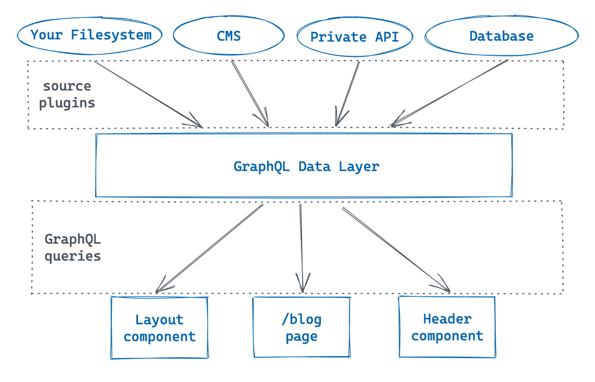
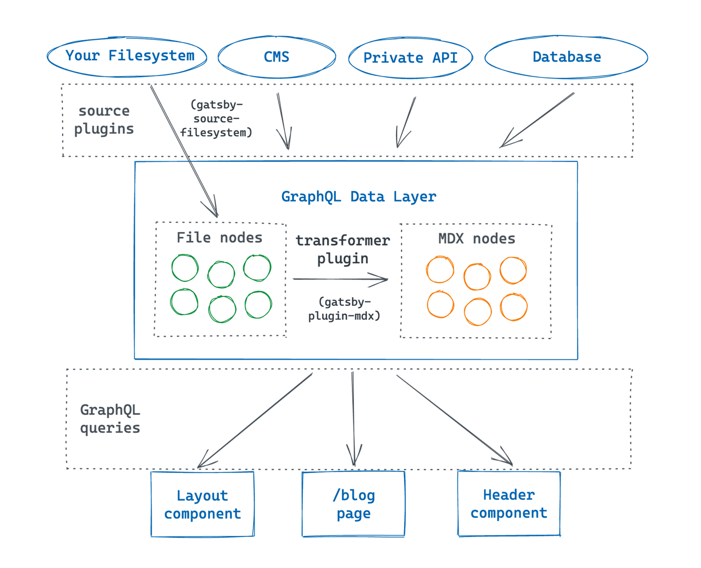
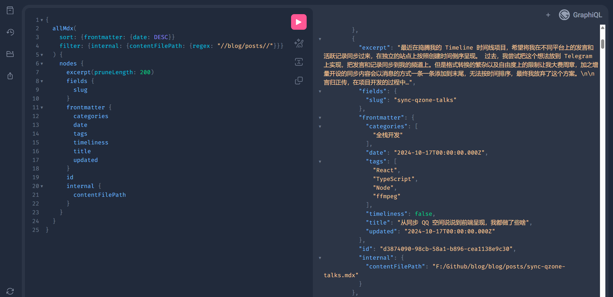

## 碎碎念

搭建一个自己的博客是无数跻身于 IT 行业开发者的心中最质朴的愿望！

回想笔者的历程，刚上大学的时候就摩拳擦掌想要实现一个博客系统，但在 Github 上创建了仓库以后就开始了无限期的拖延：自己没有任何的开发经验，不知道框架也不知道 UI 组件库，只知道要写 HTML + CSS + JavaScript 代码，面对眼前想要实现的完整系统不知该如何下手。

从零开始实现博客系统的计划虽然搁浅，但是拥有一个自己的博客的愿望没有改变。如果自己还没有能力去开发，那末至少基于现有的博客平台去搭建一个博客吧，毕竟对于博客来说，最重要的还是内容本身。终于在大二上学期的时候收集资料，横向对比，考量不同博客平台的优势与短板，最终选择了基于 Hexo 搭建自己的静态博客系统，能够部署在 Github Pages 上而不需要自己去维护服务器。还根据自己搭建的经验，模仿别人写了一篇搭建 Hexo 博客的<Link to="/posts/hello-hexo-world">简易教程</Link>，这篇教程也顺理成章成为了自己的第一篇技术博客。

Hexo 由目录结构驱动，简单好用，作为博主可以全身心投入到博客的撰写中去。Hexo 的生态里已经有着非常多的惹眼且实用的博客主题，下载到到对应目录下再修改全局配置项即可一键启用。笔者在大学生涯相当慢热，直到认为自己应该开始做某件事情时，才不留余力地去 push 自己，可谓是充分享受了青春。因此在拥有了博客系统之后，反而失去了很多原初的动力，又因为自己并没有沉浸于对技术的学习中去，也就没有什么好写下来记成博客的。

直到大三下学期，笔者选定了成为前端开发工程师的道路，在众多面经中看到了博客的重要性，于是开始慢慢写起来。将实习遇到的困难，竞赛项目里的开发经验，以及自学过程中的收获整理为一篇篇博客，上传到自己的仓库里。望着终于能翻页的个人博客，一种纯粹的满足感油然而生。

后来又觉得自己的大学生涯有些太平淡了，于是便挑战向 Github 别人的项目提交 PR，其中提的最多的 PR 是给自己在用的博客主题 —— [hexo-theme-archer](https://github.com/fi3ework/hexo-theme-archer) 的，另外还成功申请成为了它的维护者，自发地帮忙去解决堆积的 Issues。现在想来那时候的自己还非常的稚嫩，Issues 里提什么就做什么，没有认真分析过它是否真的是一个问题。例如有个 Issue 提到希望提供图片左右浮动的功能，自己就写了两个样式类塞到主题里并贴上如何使用，但实际上这样的功能只需要博主在撰写博客的时候使用 `` 标签的形式再添加行内样式就可以了。不过当然也有自认为做得不错的工作，例如看到有人提了一个 PR 为主题添加了暗色模式支持，一下子激发起了我的兴趣，于是在这个 PR 的基础上花了几天的功夫实现了完全的暗色模式适配，想必为大家的眼睛起到了一些保护的作用。

时间流转，随着前端开发成为了自己的工作，站点开发已然成为烹小鲜般的事情，不再神秘。某天笔者偶然看到了 [Thesis Theme Vision](https://thesis.priority.vision/)，很有笔记软件的感觉，十分符合自己对博客系统的审美喜好，终于耐不住想要去复刻实现的愿望，于是又创建了一个 Github 仓库。这一次，确实从零开始了自己的博客系统搭建工程。

## 技术选型

笔者最初考虑的是为 Hexo 开发一个主题，但是我实在很难投入到学习其支持的 EJS 或 Pug 这些模板语言中去，思来想去还是继续投资到我擅长的且更有未来的 React 中去吧，遂决定另起炉灶。

接下来无论是选择 Next.js 或 Umi 作为开发框架都没有问题，甚至直接基于 React 手搓也没有问题，但笔者还是对 Gatsby 和 Docusaurus 这类所谓的“静态站点生成器”非常感兴趣。考虑到笔者自身对博客系统高可自定义性的需要，最终选择了 Gatsby 作为框架。核心使用到的库版本如下：

- `gatsby@^5.0.0`
- `react@^18.0.0`

## 解析并渲染博客

### 解析 `.mdx` 文件为博客

不同于 Hexo 的将文件塞到 `source/_posts/` 目录下即识别为一篇博客，Gatsby 要求开发者实现“解析数据源到数据层”和“组件从数据层查询”两个阶段的工作。援引官方文档的数据层介绍图片如下：



解析数据源到数据层可以通过**源插件**实现，官方约定源插件以 `gatsby-source-` 开头。笔者现在想要将本地的 `.mdx` 文件解析到数据层，可以通过插件 [`gatsby-source-filesystem`](https://www.gatsbyjs.com/plugins/gatsby-source-filesystem/) 实现。编辑 `gatsby-config.ts`，添加此插件并配置欲解析的本地目录：

```ts
import type { GatsbyConfig } from "gatsby";

const config: GatsbyConfig = {
  plugins: [
    {
      resolve: "gatsby-source-filesystem", // 尽管官方文档在使用字符串时都使用的是反引号 `，但笔者更习惯使用单双引号
      options: {
        name: "posts",
        path: "path/to/posts/",
      },
      __key: "posts",
    },
  ],
};

export default config;
```

上面的配置项表示插件将自动读取 `path/to/posts/` 目录下的文件信息。

但这还不够，源插件 `gatsby-source-filesystem` 仅允许查询与文件相关的元数据，但是却无法读取文件包含的具体内容。为了读取到文件内容，就要用到**转换器插件**。对于 `.mdx` 格式的 File 节点，可以通过插件 [`gatsby-plugin-mdx`](https://www.gatsbyjs.com/plugins/gatsby-plugin-mdx/) 转换为 MDX 节点。官方文档里的这张图能直观描述这个过程：



继续配置 `gatsby-config.ts` 如下：

```ts
import remarkGfm from "remark-gfm";

const config: GatsbyConfig = {
  plugins: [
    {
      resolve: "gatsby-source-filesystem",
      // ...
    },
    {
      resolve: "gatsby-plugin-mdx",
      options: {
        gatsbyRemarkPlugins: [
          // 添加代码块高亮
          "gatsby-remark-prismjs",
        ],
        mdxOptions: {
          remarkPlugins: [
            // 添加对 GitHub flavored markdown (GFM) 格式的支持
            remarkGfm,
          ],
        },
      },
    },
  ],
};
```

值得一提的是，由于 MDX 的语法与 Markdown 不同，它默认仅支持 CommonMark 格式，而某些非标准的 Markdown 功能如表格，需要单独配置插件启用。在上面的配置项里，笔者就引入了 `remark-gfm` 插件，它使得 `gatsby-plugin-mdx` 能够解析 GFM 格式的语法。但是由于[兼容性问题](https://github.com/gatsbyjs/gatsby/discussions/36406)，经测试，目前的 `gatsby-plugin-mdx@5.14.0` 只能搭配旧版本的 `remark-gfm@^1.0.0` 使用，不过也足够了。

官方教程在博客的 Frontmatter 中添加了 `slug` 属性来方便后续生成路由，但笔者更喜好 Hexo 那种文件路径驱动路由生成的模式。为此，可以在 `gatsby-node.ts` 中导出 `onCreateNode()` 方法，对于每一个 MDX 节点，根据文件路径生成 `slug` 属性：

```ts
import { type CreateNodeArgs } from "gatsby";

export const onCreateNode = ({ node, actions }: CreateNodeArgs) => {
  const { createNodeField } = actions;
  if (node.internal.type === "Mdx") {
    createNodeField({
      node,
      name: "slug",
      value: parseFilePathToPostSlug(String(node.internal.contentFilePath)),
    });
  }
};
```

假设撰写了如下的博客文章：

```md
---
title: 从同步 QQ 空间说说到前端呈现，我都做了些啥
date: 2024-10-17
updated: 2024-10-17
timeliness: false
categories:
  - 全栈开发
tags:
  - React
  - TypeScript
  - Node
  - ffmpeg
---

最近在捣腾我的 Timeline 时间线项目，希望将我在不同平台上的发言和活跃记录同步过来，在独立的站点上按照创建时间倒序呈现。

...
```

访问本地的 GraphQL IDE 界面，查询到的 MDX 节点结果如下：



截止目前，笔者完成了“解析数据源到数据层”这一阶段的工作，接下来就需要在组件读取这些 MDX 节点数据并展示了。

### 渲染博客

Gatsby 的 GraphQL 数据层是它区别于其它前端框架的重要特性，尽管最终构建的产物仍是静态的前端页面，但在开发的过程中引入了这样的类似数据库的概念，体验仿似自己与自己握手，自己同自己进行数据传递。

如果想在 React 组件里消费数据层里准备好的数据，就需要编写对应的 GraphQL 查询代码：

```ts
// src/hooks/useAllMdx.ts
import { graphql, useStaticQuery } from "gatsby";

interface MdxNode {
  excerpt: string;
  fields: {
    slug: string;
  };
  frontmatter: {
    categories: string[];
    tags: string[];
    title: string;
    date: string;
    updated: string;
  };
}

export const useAllMdx = () => {
  const {
    allMdx: { nodes: posts },
  } = useStaticQuery<{
    allMdx: { nodes: MdxNode[] };
  }>(graphql`
    query {
      allMdx(sort: { frontmatter: { date: DESC } }) {
        nodes {
          excerpt
          fields {
            slug
          }
          frontmatter {
            categories
            tags
            title
            date
            updated
          }
        }
      }
    }
  `);

  return posts;
};

export default useAllMdx;
```

一个 React 组件里最多只能有 `useStaticQuery()` 方法，如果您想要查询多条不同数据，要么把查询代码写到一起，要么就新建一个钩子方法（推荐）。对于全局都会使用到的数据，可以分门别类放到不同的钩子方法里，例如网站的 Metadata，就可以把查询代码放在 `src/hooks/useSiteMetadata.ts` 里。

现在，笔者需要根据博客的文件路径，自动生成访问路由，例如对于博客文件 `path/to/this-is-a-blog.mdx`，可以通过路由 `/posts/this-is-a-blog` 访问到，该怎么实现呢？官方提供了多种方案，这里笔者选择了更符合自己喜好的，在 `gatsby-node.ts` 文件里导出 `createPages()` 方法的方案，它能够以编程的方式自定义生成路由，拥有相当大的自由度：

```ts
import { type CreatePagesArgs } from "gatsby";
import path from "path";

const postTemplate = path.resolve("./src/templates/post.tsx");

export const createPages = async function ({
  actions,
  graphql,
}: CreatePagesArgs) {
  const { data } = await graphql<{
    allMdx: {
      nodes: MdxNode[];
    };
  }>(`
    query {
      allMdx(
        sort: { frontmatter: { date: DESC } }
        filter: {
          internal: {
            contentFilePath: { regex: "//blog/posts/|/blog/about-me.mdx/" }
          }
        }
      ) {
        nodes {
          fields {
            slug
          }
          id
          internal {
            contentFilePath
          }
        }
      }
    }
  `);

  data?.allMdx.nodes.forEach((node) => {
    const slug = node.fields.slug;
    const path = slug === "about-me" ? "/about-me" : `/posts/${slug}`;

    actions.createPage({
      path,
      component: `${postTemplate}?__contentFilePath=${node.internal.contentFilePath}`,
      context: {
        id: node.id,
      },
    });
  });
};
```

笔者就根据博客的路径，单独配置了“关于我”页面的路由。此外，笔者读取了 `src/templates/post.tsx` 文件作为生成路由的页面模板，并按照 `gatsby-plugin-mdx` 推荐的方式，将 MDX 节点的文件路径作为了查询参数 `__contentFilePath` 的值，这样模板文件的 `props.children` 将自动被替换为 MDX 节点包含内容的解析结果。另外，笔者向组件传递了 MDX 节点 `id` 作为上下文，为模板文件查询 MDX 节点详细信息提供了参数。

下面，编写模板文件 `src/templates/post.tsx` 即可实现博客页面的展示了：

```tsx
import { MDXProvider } from "@mdx-js/react";
import { graphql, type PageProps } from "gatsby";
import * as React from "react";

type PostPageData = {
  mdx: Pick<MdxNode, "frontmatter">;
};

type PostPageContext = Pick<MdxNode, "id">;

const PostTemplate: React.FC<PageProps<PostPageData, PostPageContext>> = ({
  children,
  data,
}) => {
  const {
    mdx: {
      frontmatter: { title, date, updated, categories, tags },
    },
  } = data;

  return (
    <div>
      <h1>{title}</h1>
      <article>
        <MDXProvider>{children}</MDXProvider>
      </article>
    </div>
  );
};

export const query = graphql`
  query ($id: String!) {
    mdx(id: { eq: $id }) {
      frontmatter {
        categories
        tags
        title
        date
        updated
      }
    }
  }
`;

export default PostTemplate;
```

通过上面导出的 `query` 静态查询字符串，Gatsby 将查询数据层里 `mdx.id === props.pageContext.id` 的 MDX 节点的指定属性，并把结果传递给 React 组件的 `props.data`。

这样，“组件从数据层查询”这一阶段的工作也完成了，剩下的就是慢慢优化页面逻辑和展示效果了！

### 添加自定义组件

MDX 格式的博客相比 MD 格式的最大优势在于能够使用自定义的 React 组件：

```tsx
import { type MDXProps } from "mdx/types";

import Card from "path/to/components/card";

const components: MDXProps["components"] = {
  Card,
};

const PostTemplate = ({ children }) => {
  return (
    <article>
      <MDXProvider components={components}>{children}</MDXProvider>
    </article>
  );
};
```

现在，在编写 MDX 博客文件的时候，就可以像使用 JSX 一样使用 `<Card>` 组件了！

另外，还可以自定义现有标签渲染的结果。例如想要为图片文件添加 FancyBox 的支持，可以编写代码如下：

```tsx
import { Fancybox } from "@fancyapps/ui";

const FancyBoxImage = (props: { alt?: string; src?: string }) => {
  const {
    alt = "The author is too lazy to give an alt",
    src,
    ...restProps
  } = props;
  return (
    <a href={src} data-fancybox="gallery" data-caption={alt}>
      
    </a>
  );
};

const components: MDXProps["components"] = {
  img: FancyBoxImage,
};

const PostTemplate = ({ children }) => {
  const articleRef = React.useRef<HTMLElement>(null);

  React.useEffect(() => {
    Fancybox.bind("[data-fancybox]");
    return () => Fancybox.unbind("[data-fancybox]");
  }, []);

  return (
    <article ref={articleRef}>
      <MDXProvider components={components}>{children}</MDXProvider>
    </article>
  );
};
```

MDX 渲染得到的 `` 组件将自动被替换为 `<FancyBoxImage>` 组件，而后正确地被 FancyBox 绑定。

### 静态资源的访问与优化

使用插件 `gatsby-remark-images`，Gatsby 将自动压缩博客中使用到的本地图片，减少流量压力，同时生成占位图片，避免博客高度突然变化，提升阅读体验。处理后的图片资源将自动生成到 `public` 的对应目录下，确保能被正确地访问。结合插件 `gatsby-plugin-mdx` 使用，可以配置如下：

```ts
const config: GatsbyConfig = {
  plugins: [
    "gatsby-plugin-sharp",
    {
      resolve: "gatsby-plugin-mdx",
      options: {
        gatsbyRemarkPlugins: [
          {
            resolve: "gatsby-remark-images",
            options: {
              maxWidth: 624,
            },
          },
          "gatsby-remark-copy-linked-files",
        ],
      },
    },
  ],
};
```

其中，`gatsby-plugin-sharp` 是插件 `gatsby-remark-images` 的必要依赖，需要添加到插件列表中。

插件 `gatsby-remark-images` 仅支持压缩、处理部分的图片格式如 `.jpeg`，其它的格式如 `.gif` 则需要插件 `gatsby-remark-copy-linked-files` 帮助原封不动地移动到 `public` 里的对应目录。两个插件协同使用即可达成最好的静态资源访问效果。

由于 `gatsby-remark-images` 会相应地封装 MDX 渲染结果里的 `` 标签，为了兼容 FancyBox 能力，可以编写 `useEffect()` 钩子方法如下：

```tsx
const PostTemplate = ({ children }) => {
  const articleRef = React.useRef<HTMLElement>(null);

  React.useEffect(() => {
    const optimizedImageLinks =
      articleRef.current?.querySelectorAll<HTMLLinkElement>(
        "a.gatsby-resp-image-link",
      );
    optimizedImageLinks?.forEach((link) => {
      const image = link.children.item(1) as HTMLImageElement;
      link.setAttribute("data-fancybox", "gallery");
      link.setAttribute("data-caption", image.alt);
    });

    Fancybox.bind("[data-fancybox]");
    return () => Fancybox.unbind("[data-fancybox]");
  }, []);

  return (
    <article ref={articleRef}>
      <MDXProvider components={components}>{children}</MDXProvider>
    </article>
  );
};
```

## 路由切换体验优化

有的时候切换路由可能需要几秒钟时间处理，用户看不到页面切换的结果可能会非常焦虑。为了缓解这种焦虑，在库 `nprogress` 的帮助下，笔者添加了可视化的进度条。

这一切非常简单，只需要在 `gatsby-browser.ts` 文件导出两个生命周期钩子方法即可：

```ts
import nProgress from "nprogress";

export const onRouteUpdateDelayed = () => {
  nProgress.start();
};

export const onRouteUpdate = () => {
  nProgress.done();
};
```

上面的代码表示，当路由切换耗时大于 1 秒时，显示进度条。当路由切换完成时，隐藏进度条。

当然，别忘了引入 `nprogress` 的样式文件，如果希望，还可以修改一下进度条的颜色。

## 持续部署

笔者基于 Github Workflow 实现项目的持续集成与持续部署，可以编写工作流文件 `.github/workflows/deployment.yml` 如下：

```yml
name: Blog System CI & CD

on:
  push:
    branches:
      - main

jobs:
  pages:
    runs-on: ubuntu-latest

    steps:
      - name: Checkout code
        uses: actions/checkout@v4

      - name: Use Node.js 20.x
        uses: actions/setup-node@v4
        with:
          node-version: 20
          cache: "yarn"

      - name: Cache Yarn dependencies
        uses: actions/cache@v4
        id: yarn-cache
        with:
          path: node_modules
          key: ${{ runner.os }}-yarn-${{ hashFiles('**/yarn.lock') }}
          restore-keys: |
            ${{ runner.os }}-yarn-

      - name: Install dependencies
        run: yarn install --immutable

      - name: Build Gatsby
        run: yarn build

      - name: Deploy
        uses: peaceiris/actions-gh-pages@v4
        with:
          personal_token: ${{ secrets.PERSONAL_ACCESS_TOKEN }} # 笔者将产物推送到了外部仓库，因此这里使用到了 Github 私人密钥
          publish_dir: ./public
          external_repository: LolipopJ/LolipopJ.github.io
          publish_branch: main
```
