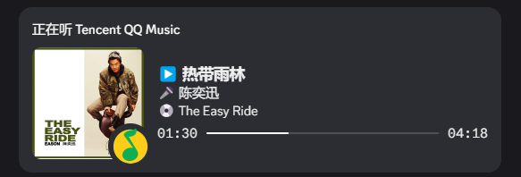

笔者性格使然，并不介意所谓隐私，愿意把自己的各种进行时的状态信息公开展示在个人网站上。很早以前，笔者就考虑实现一个小软件，自动读取电脑上运转的程序，能够将当前活跃的程序名称上传到网站上进行展示。但是并没有好的设计思路，最终只是新建了 Repo 就搁置了这个想法。

如今，随着全局代理成为家中网络标配，Discord 成为挂驻后台的常用软件，看着自己信息页的“正在玩”项目，心想这不就是笔者一直想要的读取自己在做什么的功能吗？那么，现在想要做的软件就简单不少了，只需要实现读取自己的 Discord 状态，开放接口给网站前端调用即可。

但是，笔者发现 Discord 并未提供开放接口读取用户的状态信息，毕竟 Discord 需要考虑到每个用户的隐私。经过调研，笔者找到了 [`discord.py-self`](https://github.com/dolfies/discord.py-self) 库，考虑通过 Discord Self-Bot 来实现相关功能。

> Discord 官方文档中明确表示不支持 Self-Bot 的使用，违反使用条款可能会导致账号封禁。因此，笔者仅将本文内容作为技术分享，若您决心实现类似功能，请承担账号封禁的风险。

简单来说就是：创建一个 Bot 小号，添加笔者主账号好友，让 Bot 轮询笔者主账号的状态信息，将其提供给前端访问。即使真的触到霉头被官方封禁的话，去世的也只是笔者的小号……吧。

## 实现读取自己 Discord 状态的 Self-Bot

虽说程序员不该自己设限，但毕竟是第一次使用 Python 从零开始搓一个项目，从环境搭建到应用部署上线，都不存在自己的方法论或最佳实践，因此本章节的实现过程仅供参考，如有更好的方案也请不吝留言指出。也因为是从零开始，本章节的过程介绍会比较啰嗦，权当留给自己日后翻阅吧。

### 开发环境搭建与前置准备

目前 discord.py-self 库保证兼容的最高 Python 版本为 `3.12`。笔者回想起管理 Node.js 版本时使用 `nvm` 的经验，料想 Python 也应该有版本管理工具，果然找到了大家常用的 [`pyenv`](https://github.com/pyenv/pyenv) 工具，对于 Windows 端它是 [`pyenv-win`](https://github.com/pyenv-win/pyenv-win)。

参考官方文档安装 `pyenv`，使用它安装并管理本机的 Python 版本：

```bash
# 安装指定的 Python 版本
pyenv install 3.12.10
# 设置全局 Python 版本
pyenv global 3.12.10
# 验证 Python 环境
python -c "import sys; print(sys.executable)"
```

不同于 Node.js 在安装依赖时会在项目根目录下生成 `node_modules` 文件夹，在 Python 项目里，大家一般使用虚拟环境来隔离项目依赖。笔者找到了用于 Python 项目的依赖管理工具 `pipenv`，使用它的体验几乎与 Node.js 管理依赖无异，非常 Nice。

在系统上安装 `pipenv`：

```bash
# 设置镜像源为清华大学镜像
pip config set global.index-url https://mirrors.tuna.tsinghua.edu.cn/pypi/web/simple
# 全局安装 pipenv
pip install pipenv
```

如果最早学习前端时，笔者就知道从框架开始构建项目，想必能节省很多时间。当然笔者并不后悔，毕竟框架省略的部分也是构成前端技术栈的重要一支，绕弯路学习它们何尝不是一种增进技术的捷径。不过对于 Python 而言，笔者自觉现在不愿付出那么多心血去精进，因此即刻选择从框架入手，快速搭建起项目的雏形。适合构建轻量级 Web 服务的 Python 框架有很多，以 Github 星标数为导向，笔者选择了 [FastAPI](https://github.com/fastapi/fastapi) 作为开发框架。

参考 FastAPI 文档，安装依赖库：

```bash
# 执行命令后会在当前目录生成 `Pipfile` 和 `Pipfile.lock` 文件
pipenv install fastapi "uvicorn[standard]"
```

代码格式化和质量检查工具对于一个健康的代码库是必不可少，笔者选用了开源社区新宠 [`ruff`](https://github.com/astral-sh/ruff)：

```bash
pipenv install --dev ruff
```

另外配合 VSCode 插件 Ruff 和 Python 拓展 `pre-commit`，可以实现完备的代码质量检查和格式化功能，不再赘述。

最后，进入 `pipenv` 创建好的虚拟环境：

```bash
pipenv shell
```

这样，开发应用要用到的 Python 环境就算搭建完毕了。未来切换不同的机器开发时，也不用为 Python 版本和依赖包而烦恼。

### 连接到 Discord

接下来，正式开始开发服务端应用。最基本的任务就是连接到 Discord 账号。

安装依赖包 `discord.py-self`：

```bash
pipenv install discord.py-self
```

结合 FastAPI 的文档和 `discord.py-self` 的仓库示例，在 AI 的帮助下实现连接 Discord 账号的功能：

```python
# main.py
import asyncio
import os

import discord
import uvicorn
from dotenv import load_dotenv
from fastapi import FastAPI

load_dotenv()


class MyClient(discord.Client):
    def __init__(self, *args, **kwargs):
        super().__init__(*args, **kwargs)

    async def on_ready(self):
        print(f"✅ Discord Bot Logged in as {self.user}")


client = MyClient()


async def run_discord_bot():
    await client.start(os.getenv("DISCORD_TOKEN"))


async def lifespan(app: FastAPI):
    print("🚀 Starting Discord Bot...")
    task = asyncio.create_task(run_discord_bot())
    yield

    print("🛑 Shutting down...")
    if not client.is_closed():
        await client.close()
        print("🌙 Discord bot connection was closed.")
    task.cancel()


app = FastAPI(lifespan=lifespan)


if __name__ == "__main__":
    uvicorn.run(
        "main:app", host="127.0.0.1", port=28800, reload=True
    )
```

从环境变量里获取的 `DISCORD_TOKEN` 是笔者小号的 `authorization` 字段值，可以通过浏览器开发者工具找到网络请求头获取。

使用 `python main.py` 命令运行上述代码，如果控制台打印出 `✅ Discord Bot Logged in as <username>`，说明成功连接到 Discord。

### 读取用户的状态信息

接下来实现读取目标用户状态信息的功能，亦是本应用最核心的功能：

```python
from discord.ext import tasks

class MyClient(discord.Client):
    def __init__(self, *args, **kwargs):
        super().__init__(*args, **kwargs)
        self.recipient = None
        self.queried_activities = []

    async def setup_hook(self) -> None:
        self.task_query_activities.start()

    @tasks.loop(seconds=5)
    async def task_query_activities(self):
        print("🛠️ Running background task...")

        if self.recipient is None:
            channelId = int(os.getenv("DISCORD_CHANNEL_ID"))
            channel = self.get_channel(channelId)
            if channel is not None:
                self.recipient = channel.recipient
                print(f"✅ Set recipient to {self.recipient}.")
            else:
                print(f"❌ No Discord channel found for channel ID {channelId}.")
                return

        await self.update_queried_activities()

    @task_query_activities.before_loop
    async def before_task_query_activities(self):
        await self.wait_until_ready()

    async def update_queried_activities(self):
        recipientId = self.recipient.id
        if recipientId is None:
            print("❌ No recipient ID found.")
            return

        relation = self.get_relationship(recipientId)
        if relation is not None:
            self.queried_activities = [
                activity.to_dict() for activity in relation.activities
            ]
            print(
                f"✅ Updated activities for user {self.recipient}: {self.queried_activities}"
            )
        else:
            print(f"❌ No relationship found for user {self.recipient}.")
```

笔者翻阅 `discord.py-self` 的文档良久，终于找到了 `get_relationship(user_id)` 方法，可以获取当前登录用户（Bot）与指定用户（主账号）的好友关系，返回值里囊括了指定用户的状态信息。上述代码中，服务每五秒执行此方法并得到最新的状态信息；环境变量 `DISCORD_CHANNEL_ID` 是 Bot 与笔者主账号的私聊频道 ID，同样可以通过浏览器开发者工具找到网络请求找到。

Discord 官方文档里好像有提到 API 请求限制是每分钟 120 次，笔者在这里设置为了每 5 秒请求 1 次，应该算 Bot 服务界的良心吧，请不要封禁我的账号！

运行应用，顺利打印笔者 Discord 主账号的状态信息如下：

```plaintext
✅ Updated activities for user username#0: [{'state': 'Workspace: discord-status-sender', 'details': 'Editing main.py', 'timestamps': {'start': 1763218441894}, 'assets': {'small_text': 'Visual Studio Code', 'small_image': '1359299466493956258', 'large_text': 'Editing a PYTHON file', 'large_image': '1359299282380918886'}, 'flags': 0, 'session_id': 'some_session_id', 'type': 0, 'name': 'Visual Studio Code', 'application_id': 383226320970055681, 'buttons': ['View Repository']}, {'state': '🎤 陈奕迅\u200b', 'details': '▶️ 热带雨林\u200b', 'timestamps': {'staart': 1763223056699, 'end': 1763223314779}, 'assets': {'small_text': 'Tencent QQMusic', 'small_image': '1431733810025988256', 'large_text': '💿 The Easy Ride\u200b', 'large_image': 'mp:external/KZjIWMaOSvXCbL1zzLTbVk50JQ-usSu1AUFI8q1e-P8/%3Fmax_age%3D2592000/https/y.gtimg.cn/music/photo_new/T002R500x500M000002rHV981wx55S_3.jpg'}, 'flags': 0, 'session_id': 'some_session_id', 'type': 2, 'name': 'Tencent QQ Music', 'application_id': 1431607752945434655, 'buttons': ['🎧 Listen', '🔍 View App on GitHub']}]
```

### 开放 API 服务

最末，基于 FastAPI 开放接口 `GET /status` 供前端调用：

```python
@app.get("/status")
def status():
    return client.queried_activities
```

启动应用，访问本地接口地址如 `127.0.0.1:28800/status`，就能看到指定 Discord 账号的状态信息了！

接下来？还不快把应用部署到自己能访问到 Discord 的服务器上，然后去搓前端代码！

您可以在仓库 [`LolipopJ/discord-status-sender`](https://github.com/LolipopJ/discord-status-sender) 找到完整的项目代码。

## 丰富自己的 Discord 状态

对于原生不支持共享状态给 Discord 的软件，也可以搜索相关的 RPC 软件或插件来将它们的状态主动推送给 Discord。笔者常用的有如下两款。

### 共享 QQ 音乐播放状态

Discord 原生支持读取 Spotify 等国外流行音乐软件的播放状态，但不支持读取笔者常用的 QQ 音乐的播放状态。开源软件 [NetEase-Cloud-Music-DiscordRPC](https://github.com/Kxnrl/NetEase-Cloud-Music-DiscordRPC) 解决了这个问题，设置它开机自动启动，即可将 QQ 音乐的播放状态同步到 Discord 上。



撰写本文时，该开源软件已经将近一年没有更新维护，一些影响体验的问题也亟待解决，例如正在播放的音乐名称过长会出现报错。幸亏有[社区贡献的版本](https://github.com/kriYamiHikari/Music-DiscordRPC)在持续改进，笔者如今也是用的该版本实现音乐播放状态的同步。

### 共享 VSCode 编辑状态

VSCode 何尝不是一款面向程序员的益智游戏，插件 [Discord Presence](https://marketplace.visualstudio.com/items?itemName=icrawl.discord-vscode) 可以实现将当前编辑文件信息与编辑时长同步到 Discord 上的功能。


