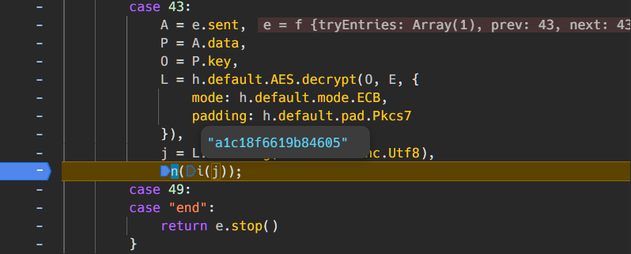

请注意，本文讨论的“动态加密”是指后端不直接返回视频文件的密钥，而是先将密钥对称加密后传回给前端，前端再基于约定好的算法解密得到真正的密钥。

但正如资深的程序员所说的那样：

> 任何客户端的加解密都是不安全的。我们都应该认为，任何在客户端进行的加解密操作都可能被逆向工程或破解。

如果你能够在浏览器中播放视频文件，那么你就应该能够下载它到本地。

本文仅供学习和研究使用，使用请遵守相关法律法规和网站服务条款。本文将隐去测试站点的一切信息。不同命令行解释器的语法可能有所不同，请注意甄别更替。

## 前置准备

笔者依赖 [ffmpeg](https://ffmpeg.org/) 来下载和合并视频文件。请确保你已经安装了 ffmpeg，并且将其可执行文件路径添加到系统的 Path 环境变量中，以便可以在命令行中访问它。

## 获取 m3u8 播放列表

在浏览器控制台的“网络”标签页中，过滤找到获取 m3u8 播放列表的请求，它通常以 `.m3u8` 结尾。可以在请求的“预览”标签页中看到类似如下的内容：

```m3u8
#EXTM3U
#EXT-X-VERSION:3
#EXT-X-TARGETDURATION:12
#EXT-X-MEDIA-SEQUENCE:0
#EXT-X-PLAYLIST-TYPE:VOD
#EXT-X-KEY:METHOD=AES-128,URI="https://path/to/key/${uid}",IV=0x00000000000000000000000000000000
#EXTINF:12.500000,
video-00000.ts
#EXTINF:12.500000,
video-00001.ts
#EXTINF:3.550000,
video-00002.ts
#EXT-X-ENDLIST
```

将它保存到本地文件中，例如命名为 `playlist.m3u8`。

当然，笔者更推荐使用命令行的方式下载 m3u8 播放列表。使用 CMD 时，命令形如：

```command
curl ^"https://path/to/playlist.m3u8^" ^
  -o ^"playlist.m3u8^" ^
  -H ^"accept: */*^" ^
  -H ^"origin: https://origin^" ^
  -H ^"referer: https://origin/^" ^
  -H ^"sec-ch-ua: ^\^"Not;A=Brand^\^";v=^\^"99^\^", ^\^"Google Chrome^\^";v=^\^"139^\^", ^\^"Chromium^\^";v=^\^"139^\^"^" ^
  -H ^"sec-ch-ua-mobile: ?0^" ^
  -H ^"sec-ch-ua-platform: ^\^"Windows^\^"^" ^
  -H ^"sec-fetch-dest: empty^" ^
  -H ^"sec-fetch-mode: cors^" ^
  -H ^"sec-fetch-site: cross-site^" ^
  -H ^"user-agent: Mozilla/5.0 (Windows NT 10.0; Win64; x64) AppleWebKit/537.36 (KHTML, like Gecko) Chrome/139.0.0.0 Safari/537.36^" ^
  -H ^"x-auth: m3bDiQ9IPHr54TdVjgUNJmLQLmmWJFTSOhjR0E8Y9kU^"
```

请根据实际情况替换 URL 和请求标头。一般来说必要的请求标头是防止被服务器拒绝的 `referer`，和用于用户鉴权的 `cookie`（本例中为服务端自定义的 `x-auth` 字段），其它标头用于模拟请求来自于健康的浏览器。当然，直接在“网络”标签页里复制请求内容准没有错。

特别的，可以将请求头单独保存在一个文本文件里，方便后续其它请求使用。例如命名为 `headers.txt`：

```txt
accept: */*
origin: https://origin
referer: https://origin/
sec-ch-ua: "Not;A=Brand";v="99", "Google Chrome";v="139", "Chromium";v="139"
sec-ch-ua-mobile: ?0
sec-ch-ua-platform: "Windows"
sec-fetch-dest: empty
sec-fetch-mode: cors
sec-fetch-site: cross-site
user-agent: Mozilla/5.0 (Windows NT 10.0; Win64; x64) AppleWebKit/537.36 (KHTML, like Gecko) Chrome/139.0.0.0 Safari/537.36
x-auth: m3bDiQ9IPHr54TdVjgUNJmLQLmmWJFTSOhjR0E8Y9kU
```

CMD 没有简易的读取文件并拼接命令的语法，但 PowerShell 和其它命令行解释器有相应的工具函数可以读取 `headers.txt` 进而拼装 `curl` 请求，不再赘述。

## 获取密钥

在下载得到的 m3u8 播放列表中，有一行类似如下的内容：

```
#EXT-X-KEY:METHOD=AES-128,URI="https://path/to/key/${uid}",IV=0x00000000000000000000000000000000
```

它表示视频分片文件基于 AES-128 加密，其中 `URI` 指向的就是密钥的地址，`IV` 是初始化向量。理论上我们只需要再使用 `curl` 命令下载这个密钥文件到本地，然后对应修改 `URI` 字段为本地文件路径即可。

但本文想要探讨的正是另外一种情况：**`URI` 指向的并不是直接可用的密钥，而是一个加密后的密钥，我们需要基于约定好的算法解密得到真正的密钥。**

那么，这个“约定好的算法”我们要如何得知呢？答案就是去找！去分析网站的前端代码，去找出它是如何解密并获取真正的密钥的！通常来说，这个解密算法会被打包混淆在某个 JavaScript 文件里。

以笔者测试的站点为例，它首先会调用签名接口 `https://path/to/key/${uid}/sign`，响应值为一个 JSON 对象，包含一个随机生成的参数 `nonce`：

```json
{
  "nonce": "1757046701749:hC45ZHCJ"
}
```

接着用某种算法生成的参数 `sign`，将它和刚刚得到的参数 `nonce` 一齐调用获取密钥的接口 `https://path/to/key/${uid}?nonce=${nonce}&sign=${sign}`，响应值是另一个 JSON 对象，包含您可能以为的真正密钥：

```json
{
  "key": "j3Nmzd7BabJRRKCKm16NPrbmEaEyVhZZr4mamyUqjgo="
}
```

笔者也很高兴，看到 `key` 字段的值很像是 Base64 编码后的字符串，解码后肯定正好是需要的 128 位的 AES 密钥。但拿去解密却报错说字符串并非 Base64 编码，说明它使用了另一种加密方案。

这样，笔者就不得不去翻找前端代码了。在前面的过程里，笔者知道与视频播放相关的代码调用了 `/sign` 接口，所以就从这个关键字入手，搜索打包混淆后的 JavaScript 代码，找到了如下代码片段：

```js
return a.default.wrap(
  function (e) {
    for (;;)
      switch ((e.prev = e.next)) {
        // ...
        case 28:
          return (
            (_ = y[0].substring(5, y[0].length - 1)),
            (b = y[0].match(/keys\/.*"/i)[0]), // b 为 m3u8 文件里 #EXT-X-KEY:URI 的 ${uid} 部分
            (T = b.substring(5, b.length - 1)), // T 为截取后的 b
            (e.next = 33),
            c.default.get(_ + "/sign")
          );
        case 33:
          if (
            ((S = e.sent), (k = S.data), (w = k.nonce)) // w 为调用 /sign 接口时随机生成的参数 ${nonce}
          ) {
            e.next = 38;
            break;
          }
          return e.abrupt("return");
        case 38:
          return (
            (C = h.default
              .MD5(w + T) // 拼接 w 和 T 后进行 MD5 哈希
              .toString()
              .substring(0, 16)), // 截取前 16 个字符
            (E = h.default.enc.Utf8.parse(C)), // 将字符串 C 按 UTF-8 编码转换为二进制数据，作为后续解密使用的密钥
            (x = _ + "?nonce=" + w + "&sign=" + C),
            (e.next = 43),
            c.default.get(x)
          );
        case 43:
          (A = e.sent),
            (P = A.data),
            (O = P.key), // 这里的 P.key 就是刚刚 Base64 解码失败的 key
            // 调用 AES 模块的解密方法，对 P.key 进行解密
            (L = h.default.AES.decrypt(
              O, // 待解密的数据
              E, // 密钥，从前面的代码计算得到
              {
                mode: h.default.mode.ECB, // 指定加密模式为 ECB（电子密码本模式）
                padding: h.default.pad.Pkcs7, // 指定填充方式为 PKCS#7 填充
              },
            )),
            (j = L.toString(h.default.enc.Utf8)), // j 即为我们解密视频分片所需要的真正密钥
            n(i(j));
        case 49:
        case "end":
          return e.stop();
      }
  },
  e,
  void 0,
);
```

从上面的代码可知，第二次请求时携带的参数 `sign` 其实就是用于加密真正密钥所使用的另一个 AES 密钥。而整个过程就是站点为了不让真正密钥直接暴露在网络请求里而设计的一个“动态加密”方案。

那末，获取代码片段里 `j` 变量的值，就是笔者想要的真正密钥了！终极的自动化方案肯定是编写脚本来实现从发送请求到拼接字符串最后解密的全过程，但笔者懒得折腾，就直接在源代码里打断点完成了：



可知，解密视频分片文件所需的真正密钥为 `a1c18f6619b84605`。

## 下载并拼装视频文件

剩下的工作就非常简单了，将真正密钥保存为本地的文件 `key.bin`，对应修改 `playlist.m3u8` 里 `#EXT-X-KEY` 行的 `URI` 字段为本地文件路径：

```m3u8
#EXT-X-KEY:METHOD=AES-128,URI="key.bin",IV=0x00000000000000000000000000000000
```

然后将 `playlist.m3u8` 里的所有视频分片文件 URL 修改为完整的 URL 地址：

```m3u8
#EXTINF:12.500000,
https://path/to/video-00000.ts
#EXTINF:12.500000,
https://path/to/video-00001.ts
#EXTINF:3.550000,
https://path/to/video-00002.ts
#EXT-X-ENDLIST
```

一切就绪，执行 `ffmpeg` 命令下载并拼装视频文件：

```bash
ffmpeg -protocol_whitelist "file,crypto,data,http,https,tcp,tls" -allowed_extensions ALL -i playlist.m3u8 -c copy output.mp4
```

其中，ffmpeg 默认只支持从安全的协议（包括 `file,crypto,data`）获取视频分片文件，不支持 `https` 等其它协议，因此设置了命令行参数 `-protocol_whitelist "file,crypto,data,http,https,tcp,tls"`；同理，ffmpeg 默认只支持读取 `.ts` 和 `.m3u8` 等常见扩展名的文件，因此设置了命令行参数 `-allowed_extensions ALL` 来允许读取秘钥文件 `key.bin`。

执行完成后，当前目录下就会生成合并后的 `output.mp4` 文件。可喜可贺，可喜可贺！
