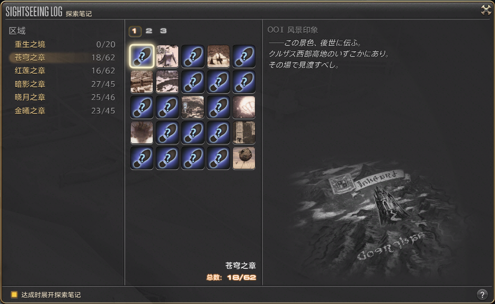
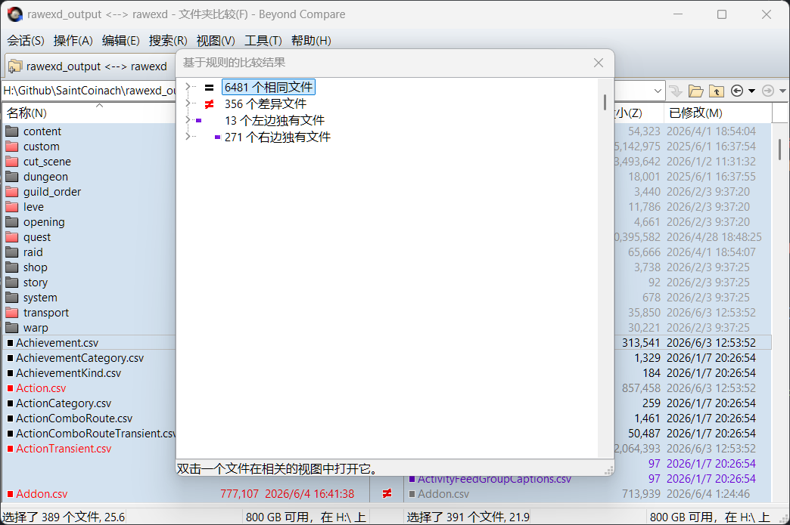

> [!CAUTION]
> 此博客仅供学习交流，严禁用于商业用途。使用汉化补丁属于修改客户端行为，使用者需自愿承担风险。

我是常驻最终幻想 14 国际服的玩家，为了获得本土级的游玩体验，对客户端进行汉化是必要的。社区上最早开源了一款汉化工具 [FFXIVChnTextPatch](https://github.com/reusu/FFXIVChnTextPatch)，但早已停止维护，不过开发者 Gpoint Chen 在它的基础上开发了版本 [FFXIVChnTextPatch-GP](https://github.com/GpointChen/FFXIVChnTextPatch-GP)，但也于去年底暂停了更新。目前我正使用的是开发者 Souma Sumire 继续开发的版本 [FFXIVChnTextPatch-Souma](https://github.com/Souma-Sumire/FFXIVChnTextPatch-Souma)，正在活跃维护中。

自 7.4 版本开始，国服与国际服开始了版本同步更新，对于我这样的玩家来说是巨大的福音：新版本更新的时候再也不用手动翻译剧情内容了，新追加的要素也能立即 Get 到含义了。对于汉化工具的维护者来说，也会降低版本差异带来的维护成本，减少游戏崩溃现象的发生。

## 客户端汉化方案简述

目前实现游戏客户端汉化的方案主要有二：

1. 使用 FFXIVChnTextPatch-GP 工具，直接修改游戏客户端的源文件，实现汉化。
2. 使用基于 Dalamud 框架的 Penumbra 模组加载器，将游戏对原 SqPack 的读取请求替换为汉化模组，从而实现游戏文本的替换。

后者是更现代，侵入性更小，安全性更高的方案，最大的问题是每次游戏版本更新的时候，Dalamud 框架会有一段时间无法使用，汉化模组自然也无法使用了。此外，对动手操作能力有一定的要求，对于不使用 XIV Launcher，或不会安装与配置 Penumbra 的玩家来说，这种方案就难以推广了。

前者是传统的汉化方案，虽然会直接修改游戏客户端的源文件，但不依赖于 Dalamud 框架的更新，在游戏版本更新后能够更快地恢复使用，且 GUI 界面没有使用门槛，是更适合普罗大众的汉化方案。

因此，本文也将基于传统的汉化器方案继续探索。

且让我简单提一嘴汉化器的工作原理吧。汉化器在执行汉化操作时，会备份国际服客户端 `/game/sqpack/ffxiv` 目录下的数据文件和索引文件，他们的作用如下：

- 数据文件 `000000.win32.dat0`：包含客户端**字体**等通用资源。
- 数据文件 `0a0000.win32.dat0`：包含客户端**游戏文本**资源。
- 索引文件 `000000.win32.index` 等：用于定位数据文件中具体资源的起始位置。

在汉化器设置页面勾选“替换字体”和“替换文本”选项后，实际会将新的字体和文本资源**追加到对应数据文件的末尾**，然后更新索引文件使其指向新的资源位置。这种处理方案相当优雅，不会破坏已有数据文件的结构，仅是通过更新索引就实现了新资源的引用。

知道了原理，你便知道“替换字体”操作只用执行一次就行了，之后每次汉化的时候，只要没有还原过 `000000.win32.dat0` 文件，就都可以跳过这个耗费时间的操作。但是，如果没有“还原汉化”操作，每次都直接执行新一轮的“替换字体”或“替换文本”操作，数据文件便会随之**不断膨胀**占据硬盘空间，请知悉。

## 提取国服客户端文本资源

> [!WARNING]
> Souma 提到工具 SaintCoinach 已不再活跃维护，Gpoint 的改版也有一段时间没有更新了，可能存在潜在的兼容性问题。

可以使用工具 [SaintCoinach](https://github.com/xivapi/SaintCoinach) 来提取最终幻想 14 客户端中的资源和文本数据，汉化工具 FFXIVChnTextPatch-GP 的维护者 Gpoint 为它定制了一个[版本](https://github.com/GpointChen/SaintCoinach/tree/hexcode)，导出的数据可以更方便地用于汉化器，[在这里](https://github.com/xivapi/SaintCoinach/releases)下载该版本的构建后程序。

本文选用命令行工具的方式实现文本数据的提取，则应该下载压缩包文件 `SaintCoinachCmdHexTest.0.0.2.0.zip`，解压后使用终端工具执行命令，参数为国服客户端安装路径：

```bash
$ cd ./SaintCoinachCmdHexTest.0.0.2.0/net7.0
$ ./SaintCoinach.Cmd.exe "path/to/最终幻想XIV"
Defined sheet ClassJobActionSort is missing.
Defined sheet CraftLevelDifference is missing.
Defined sheet StainTransient is missing.
Game version: 2026.05.25.0000.0000
Definition version: 2026.05.25.0000.0000
SaintCoinach.Cmd (Version 0.1.0.0)
>
```

国服客户端的源代码目录结构与国际服稍有不同，可以手动指定语言为 `chs` 避免出现解析异常：

```bash
SaintCoinach.Cmd (Version 0.1.0.0)
> lang chs
> lang
Current language: ChineseSimplified
```

接下来，就可以执行 `rawexd` 命令来导出游戏数据表为 CSV 文件了，该命令不会对导出的文件进行任何后处理：

```bash
SaintCoinach.Cmd (Version 0.1.0.0)
> rawexd
Export of CustomTalkDefineClient failed: Unable to read beyond the end of the stream.
Export of QuestDefineClient failed: Unable to read beyond the end of the stream.
7910 files exported, 2 failed
```

`rawexd` 命令后未跟任何参数时，会导出所有的 CSV 文件。导出的文件存放在 `SaintCoinachCmdHexTest.0.0.2.0/net7.0/{GAME_VERSION}/rawexd` 目录下。

原版的 SaintCoinach 在导出 CSV 文件时将二进制控制码翻译为了人类可阅读的指令标签，如 `<Sheet(Item,IntegerParameter(1),0)/>`，这对于解包玩家来说是非常有意义的。但是汉化器的终极目的是将所有文本内容重新编码为二进制，塞回国际服的客户端中，这些自定义的指令标签反而成了阻碍，编码后会变成客户端完全理解不了的东西，导致游戏崩溃。而这正是 Gpoint 制作改版的意义所在，导出的过程中直接将二进制控制码翻译为形如 `<hex:...>` 的十六进制编码，汉化器在处理这些内容时就能正确地将它们转换回原本的二进制控制码了。

举个例子，原版的 SaintCoinach 提取出来的文本内容 `<CommandIcon(10)/> 收回物品`，改版的 SaintCoinach 得到的文本内容为 `<hex:021E020B03> 收回物品`，二者是如何实现转换的呢？

根据 SaintCoinach 的[枚举值定义](https://github.com/xivapi/SaintCoinach/blob/0b22b78f97951bb66bfa78fb561aa4c7bf7af7cd/SaintCoinach/Text/TagType.cs#L43)，可知标签 `CommandIcon` 对应的编码为 `0x1E`；另外根据其解码器的[代码实现](https://github.com/xivapi/SaintCoinach/blob/0b22b78f97951bb66bfa78fb561aa4c7bf7af7cd/SaintCoinach/Text/XivStringDecoder.cs#L15-L16)，指令码起始标识（可以形象地看作左尖括号 `<`）的编码为 `0x02`，指令码结束标识（可以形象地看作右尖括号 `>`）的编码为 `0x03`；对于数字类型参数，采用了“紧凑整数”的编码方式，编码值为实际值 +1，则参数区长度 `1` 的编码为 `0x02`，参数值 `10` 的编码为 `0x0B`。那么拆分十六进制编码 `021E020B03`，实际包含以下五块内容：

1. `02`：指令码起始标识；
2. `1E`：指令码类型。此值对应 SaintCoinach 的自定义标签 `CommandIcon`；
3. `02`：指令码参数区长度。此值对应 1，即包含一个参数；
4. `0B`：第一个指令码参数。此值对应的参数值为 10；
5. `03`：指令码结束标识。

于是实现了相同二进制控制码的不同写法。约定在十六进制编码的外层包裹上 `<hex:...>`，汉化器就可以识别它，并最终翻译回正确的二进制控制码。此外，还有一些特殊的指令码，如条件指令码 `<If(...)><Else/>`，不再赘述。

## 想要解决的问题

你可能就会问了：那么，直接使用现成仓库 FFXIVChnTextPatch-Souma 不就好了吗？是的，作者 Souma 也会在游戏客户端更新后的当天爆肝，更新仓库里的 CSV 文件内容。

只是存在效率上的问题，用改版的 SaintCoinach 提取出来的 CSV 文件与汉化器目前使用的 CSV 文件内容还是有一定区别的：

- 前者包含更多的表格列，后者只包含了自增主键的表格列和字符串类型的表格列。只保留需要汉化的表格列是有意义的，既能控制 CSV 资源大小，还能更直观编辑翻译文本内容，更能避免不同客户端之间存在的些许值差异引发游戏的异常。
- 前者的类型定义使用使用小写缩写格式，如 `int32` 和 `str`，后者则大驼峰完整格式，如 `Int32` 和 `String`。虽然 CSV 解析器大抵能理解不同的写法表示相同的意义，但为了避免潜在的问题，还是保留汉化器目前使用的格式更好一些。

本着能自动化的事情就应该让计算机来代劳的想法，可不能让辛勤耕耘的维护者们累坏了（FFXIVChnTextPatch-GP 的作者在去年底就累到弃坑了），我开始了这次探索之旅 —— 要怎样使用 SaintCoinach 提取出来的 CSV 文件来汉化国际服客户端，而尽可能地减少“能工智人”参与处理的时间呢？

> [!NOTE]
> 虽然有着美好的初衷，但 Souma 本人也不是傻的，后来在群里他提到这些 CSV 文件是自动生成的，意即他也应该用到了什么脚本来实现后文中与我相似的处理，只是我没有找到或是他没有开源而已。

我想到的实现方案有以下三种：

1. 写一个自动化脚本，将 SaintCoinach 提取出来的 CSV 文件内容转换为汉化器使用的 CSV 文件格式。
2. 修改 SaintCoinach 的底层代码实现，使其能够直接导出符合汉化器使用的 CSV 文件格式的内容。
3. 修改汉化器的底层代码实现，使其能够直接使用 SaintCoinach 提取出来的 CSV 文件内容。

在 AI 的加持下，三种方案我应该都能实现，只是时间成本的问题。作为程序员要整就整大活的心理想驱使我选择方案二、三，但综合考虑下来，我认为方案一最能被广泛运用，还能避免再去建一个新的仓库自顾自嗨。

所以，本文将继续探索方案一的实现。

## 实现自动化脚本

相比人工处理，自动化脚本应当最大程度地补全用于汉化的文本。例如，在目前版本的 FFXIVChnTextPatch-Souma 中，与“探索笔记”相关的“风景印象”文本没有被汉化：



这是由于对应的 [`Adventure.csv`](https://github.com/Souma-Sumire/FFXIVChnTextPatch-Souma/blob/996bcf6f2047be5aacfcfd4adc5f1511c4876498/resource/rawexd/Adventure.csv) 文件里没有“风景印象”所对应的第 14 列表格字段。Souma 提到可能是某个版本新加了属性，导致索引偏移了，所以没能正确导出文本内容。

自动化脚本在处理后应该正确包含这些表格列：

```py
keep_indices = [0]
is_str_col = {0: types_row[0] == 'str'}

for i in range(1, len(types_row)):
    is_string = (types_row[i] == 'str')
    is_str_col[i] = is_string
    if is_string:
        keep_indices.append(i)
```

除了补全缺失的，还要做到过滤无用的 CSV 文件。某些 CSV 文件仅起到资源索引或是参数控制的作用，不包含可用于汉化的文本内容，那么应该将它们排除在外，无需拷贝到汉化器的 `resource/rawexd` 目录下。例如 `BGM.csv`，应当被过滤掉：

```csv
key,0,1,2,3,4,5,6
#,File,Priority,DisableRestartTimeOut,DisableRestart,PassEnd,DisableRestartResetTime,SpecialMode
int32,str,byte,bit&01,bit&02,bit&04,single,byte
0,"",0,False,False,True,90,0
1,"music/ffxiv/BGM_Null.scd",0,False,False,True,90,0
2,"music/ffxiv/BGM_System_Title.scd",1,False,False,True,90,0
3,"music/ffxiv/BGM_System_Launcher.scd",1,False,False,True,90,0
4,"music/ffxiv/BGM_System_Chara.scd",1,False,False,True,90,0
5,"music/ffxiv/BGM_Town_Rest_01.scd",1,False,False,True,90,0
```

简单实现过滤功能的话，可以让脚本先扫描 CSV 文件内容，看看是否包含中文字符：

```py
import re

chinese_re = re.compile(r'[\u4e00-\u9fff]')

for index, file_path in enumerate(csv_files):
    with open(file_path, 'r', encoding='utf-8') as f:
        content = f.read()
    if not chinese_re.search(content):
        continue
```

使用 Beyond Compare 工具，基于规则比较处理后的 CSV 文件与汉化器仓库目前版本包含的 CSV 文件，得到的结果如下：



这个结果相当振奋人心，意味着我的脚本几乎满足了预期的功能，且兼容源仓库的资源文件格式。

另外，有 13 个 CSV 文件是脚本过滤后发现是汉化器仓库中目前不包含的，可以视情况补充到仓库中或忽略。例如 `VVDVoteRouteLabel.csv` 对应的多变迷宫“商客奇谭”中路线选项的文本内容，在目前版本中确实没有被汉化，应当[添加到仓库中](https://github.com/Souma-Sumire/FFXIVChnTextPatch-Souma/issues/103)。而用于生成随机名字的资源文件，以及全日文的资源文件，就不应该也不需要放到仓库里了。

有 271 个 CSV 文件是被脚本过滤但是汉化器仓库包含的，理论上它们没有任何意义，但为了保险起见，还是需要人工校对一下，看看是否真的可以移除掉。当然，保留它们也不会影响汉化器本身的功能，如果没有代码洁癖，大可不做多此一举的操作。

当然，最重要的还是这 356 个存在差异的 CSV 文件，需要一一校对，配合国际服日文资源的原文，看看是否存在缺失的文本。例如 `Adventure.csv` 对应的探索笔记的相关内容，在目前版本中缺失了描述部分，需要[补全缺失的文本](https://github.com/Souma-Sumire/FFXIVChnTextPatch-Souma/pull/102)。

## 数据修改与校对

最让人担心的问题还是发生了：国服和国际服相同 CSV 文档里的某些数据行可能存在[较大差异](https://github.com/GpointChen/FFXIVChnTextPatch-GP/wiki/5.-CSV#addoncsv-%E6%97%A5%E4%B8%AD%E6%8C%87%E4%BB%A4%E5%B7%AE%E7%95%B0)，此时应以国际服版本内容为准，避免文本显示异常甚至游戏崩溃。

例如在 `Addon.csv` 中：

- 国服数据行 `1297,"乌尔达哈城内"`，与国际服版本 `1297,"SEARCH CLASS JOB CUSTOMIZE"` 存在明显差异，应保留国际服版本内容不执行替换；
- 紧随其后 `1298,"萨纳兰"` 与国际服版本 `1298,"検索クラス・ジョブ"` 也存在明显差异，不执行替换；
- 指令码 `1840,"<Clickable(<Sheet(ClassJob,IntegerParameter(1),0)/>)/>"` 与国际服版本 `1840,"<Sheet(ClassJob,IntegerParameter(1),0)/>"` 不一致，不执行替换，否则可能导致游戏崩溃。

此类问题需要在长期的维护过程中发现并消灭，没有捷径可言。当然，有能力的话，在解决的同时可以自行补充翻译。

接下来就是细节上的完善了，例如：

- 在游戏里，存在需要玩家在“说话”频道里说出特定文本才能推进的[任务](https://github.com/GpointChen/FFXIVChnTextPatch-GP/wiki/5.-CSV#%E6%9C%89%E8%AA%AA%E8%A9%B1%E5%85%A7%E5%AE%B9%E7%9A%84%E4%BB%BB%E5%8B%99)，而在国际服的公共频道发出中文往往被视作一件有风险的事情。大家大抵不会拼写日文，因此，预期此类任务可以通过说出对应的英文来完成。在处理 CSV 文档的对应表格字段时，应当把它们译为英文，文本的标识形如 `TEXT_XXXXXX_XXXXX_SAYTODO_000_XXX`。例如在伊尔美格的某个任务里，需要玩家喊出“超级小可爱”来推进，对应的日文原文是“スネリン”实在不会打，使用英文“snae ling”替代就没有问题啦。
- 汉化游戏的客户端后，在聊天里发出你展示的道具时，别人看到的道具名实际上是你客户端上物品的中文名字，这一点也需要注意，非必要不要给陌生玩家展示你的道具。因此 Souma 特地修改了对应功能的文本，将“展示道具属性”的翻译改为了“展示道具属性（警告：别人看也是中文）”。
- 游戏中魔晶石的命名并不直观，例如很多时候我需要查看“武略魔晶石X型”的描述，才能反应过来它可以增加“暴击”属性，Souma 特意将它们的名字修改为了“武略魔晶石X型（暴击）”的格式，除了一眼看懂外，还方便了在市场上搜索。虽然这属于可有可无的改动，有的人甚至会觉得这会破坏游戏的沉浸感，但我自身还是蛮喜欢的，于我来说会沿用这种命名。

为此，可以维护一个 JSON 文件，记录需要特殊处理的文本资源的主键 ID 和对应列的文本内容，例如：

```json
{
  "Addon.csv": {
    "0": {
      "1297": "SEARCH CLASS JOB CUSTOMIZE",
      "1298": "自定义职业特职搜索"
    }
  },
  "Adventure.csv": {
    "15": {
      "2162790": "有一些候鸟会随着季节变化往来于近东地域与艾欧泽亚，为了躲避严寒，那些怪鸟在这里搭建了巢穴，它们在此产卵、养育后代。在雏鸟们学会飞行后便会离开巢穴向东飞去。"
    }
  }
}
```

优化自动化脚本，当处理到对应文件时，按照记录的内容替换对应表格行的指定列文本内容，具体实现不再赘述。

完整的脚本[可见此](https://github.com/LolipopJ/SaintCoinach-GP/blob/hexcode/Scripts/process_csv.py)，执行时将前面提取出来的 CSV 文件目录作为参数传入即可：

```bash
$ python ./process_csv.py "/path/to/SaintCoinachCmdHexTest.0.0.2.0/net7.0/{GAME_VERSION}/rawexd"
已加载自定义内容文件: path/to/custom_content.json
  共 2 个文件规则。
进度: [7910/7910] 100.0% - Done.

========================================
CSV 文件处理完成！
找到的总文件数：7910
成功处理的文件：6850
被过滤的文件数：1060
应用了自定义替换的文件数：2
处理出错的文件数：0
========================================
```

最后，将处理得到的 CSV 文件按需拷贝到汉化器仓库的 `resource/rawexd` 目录下，替换掉原有的文件，就可以执行汉化操作了！

## 特别鸣谢

除了正文中提到的开源仓库与相关的开发者外，整个探索与实现过程还参考了以下博文：

- [《FF14 漢化筆記》by Gpoint](https://hackmd.io/@GpointChen/SJi_gv-ad)
- [《如何製作漢化工具》系列文章 by Q拔](https://home.gamer.com.tw/profile/index_creation.php?owner=ddcci5656)

可以说自己完全是站在前人的肩膀上了，那就且让我以此文为这份有益的事业加把小小的柴薪吧。

## 尾声

妄想……什么时候国际服客户端会添加官方中文的支持呢……？
