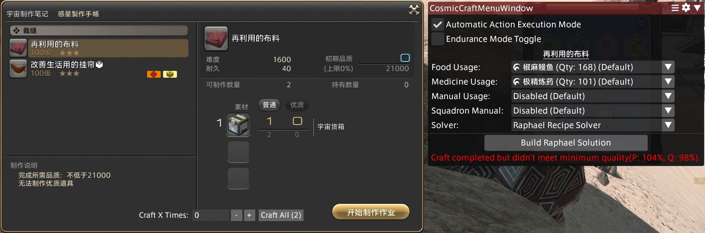
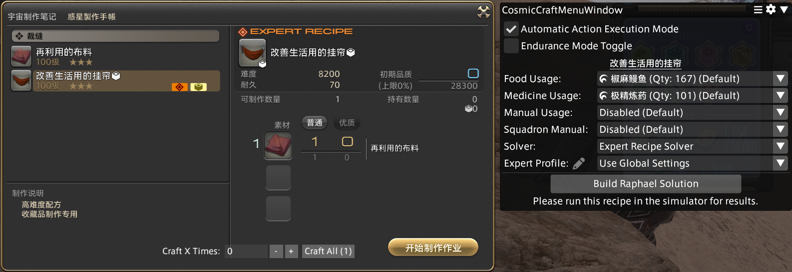
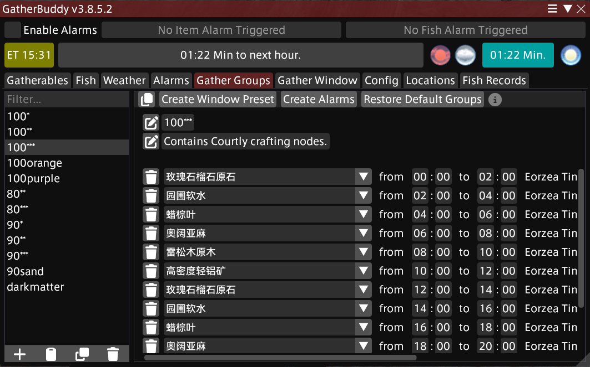
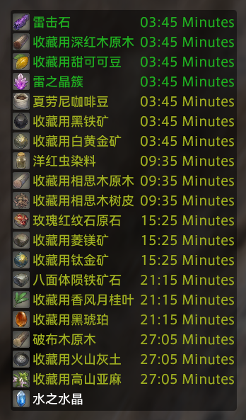
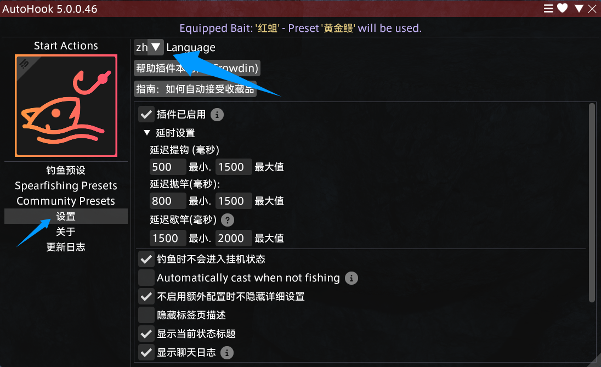
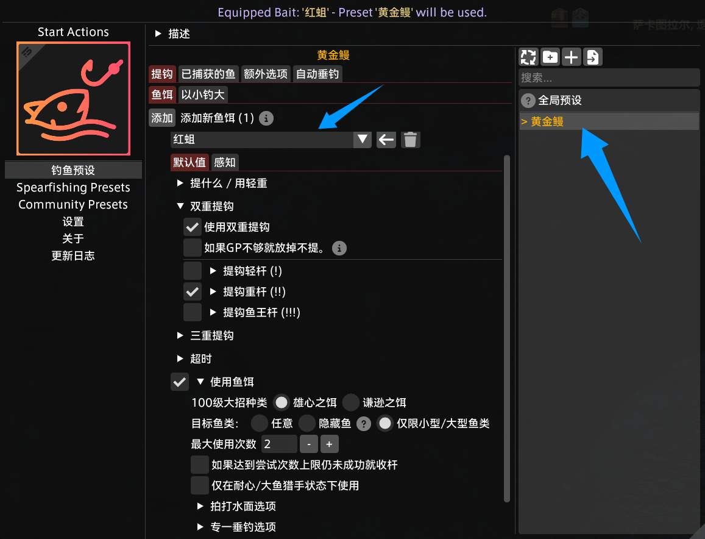
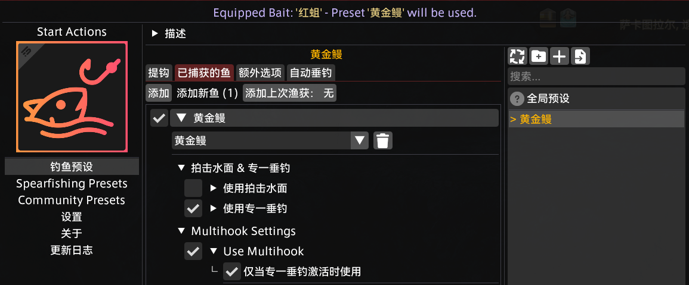
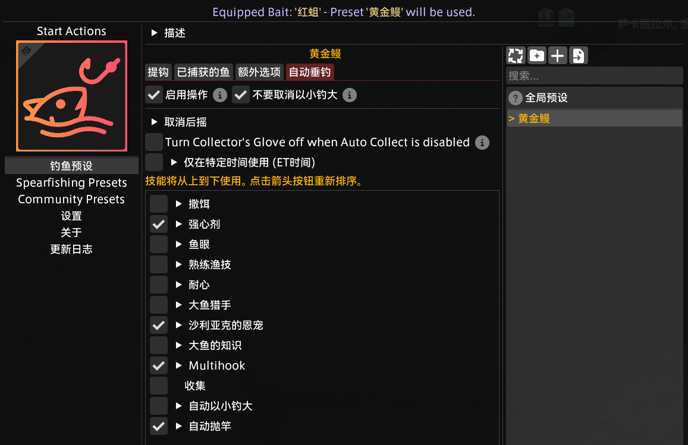

撰写此文时，我的角色已经在最终幻想 14 的游戏世界里守护艾欧泽亚 135 天 15 小时了，从一条只玩休闲内容的咸鱼，到现在成为了已经可以轻松征服零式副本挑战的狼群成员，自认为游戏理解提高了许多。至于代表制作人对玩家最高级别调教的绝境战，阻碍我完成的也只有还不想花那么多时间专注在一块内容上练习罢了，哼哼哼……啊，炫耀自己的游戏技术并非本文的主旨，言归正传，我将这篇博客里分享在游戏中运用 Dalamud 插件（即卫月插件）的技巧。

自力更生搓爆发药和食物并没有问题，但当你需要搓几百组的时候，对注意力的消耗就成了巨大的负担：执行完宏 1 后，要去执行宏 2，搓完后再继续下一轮制作。期间每隔几十秒就要切回窗口点击一下，实在是令人焦虑。越是长大越是觉得时间宝贵，注意力可贵，对于此类重复度高的机械化工作，占用屏幕时间显得尤为浪费。因此，我学习并使用了一些能够简化上述生产等过程的插件，耐不住想要分享的性子，遂整理成文，也许对你有所帮助。当然，我也并没有把这些插件的功能钻研透彻，下面也只会讲述我实际使用到的功能。

## 前置准备与风险提示

为了使用 Dalamud 插件，首先必须安装 Dalamud 框架。最简单的方式是下载 [FFXIVQuickLauncher](https://github.com/goatcorp/FFXIVQuickLauncher)，使用它启动游戏，将自动下载、更新和安装 Dalamud 框架。

本文涉及到的生产插件 Artisan 和钓鱼插件 Auto Hook 确实**违反了游戏的使用条款**，存在自动化操作的不当行为，请了解并承担相应的使用风险。不过看到俄匊斯星球上光明正大搓成就的 Artisan 插件享受者，以及自己从未遇到账号封禁的情况，大致上可以放心使用吧。

也因此，插件 Artisan 和 Auto Hook 并未注册到 Dalamud 官方插件库中，需要手动添加插件源：进入游戏后，打开“卫月设置”，找到“测试版” - “自定义插件仓库”，填写插件源地址 `https://love.puni.sh/ment.json`，点击右侧的加号按钮，最后点击右下角的保存按钮就可以了。现在，打开 Dalamud 的“插件中心”，就能找到并安装这两款插件了。

## 生产插件 Artisan

考虑到不用插件的绿色玩家，在面对复杂生产作业时，大多人也都是去找到生产计算器，输入自己的属性值算出生产步骤，写好宏再依次调用，搓出目标的装备或道具。

所以，当有一款插件能直接读取角色属性值计算出生产所需的步骤，并且自动执行宏完成生产任务时，对于我的吸引力就是无限大的。能做到这件事的插件就是 [Artisan](https://github.com/PunishXIV/Artisan)，且不止于此，它还可以：

- 支持批量生产，完成当前配方后立即开始生产下一个；
- 提供专家配方的运行时解法，宇宙探索上的高难生产内容也能从容应对（虽然金牌率难以保证，但对于想要生产职业成就称号的人来说已经感激涕零了）；
- 检测游戏数据判断操作是否完成，避免网络延迟带来的影响（生产宏偶尔会因为网络延迟卡步骤，导致制作失败，遇到时很恼人）；
- 自动使用食药等，保证生产可靠性；
- 自动精炼魔晶石，减少手操繁琐；
- 支持切换手动模式，面对笨笨操作时接管生产；
- 支持生产模拟器，看看当前宏执行的成功率，帮助优化宏步骤；
- 支持配置宏执行间隔时间，海都待机时也可以慢慢搓生产。

插件的使用方法也很简单，打开生产配方后，界面右侧就会显示 Artisan 的操作面板，可以在这里进行各种设置和操作。必要的就是选择食物，然后按需生成 Raphael 解法宏。以宇宙探索为例：

对于生产“再利用的布料”道具，我首先点击了 Artisan 操作面板下方的“Build Raphael Solution”按钮，得到了“Raphael Recipe Solver”。选择该解法后，可以看到面板底部的红字提示，由于宏步骤是固定的，如果生产的全程都是“普通”状态，那么成品的品质率为 98%，会因为不满足 100% 满品质的阈值线而制作失败。但这也意味着，如果其中某次推进品质提升的步骤恰巧遇到了“高品质”状态，那么大概率就能把它搓出来。于是，我选择了这个成功率较高且效率更高的解法，用来挑战该高难配方。点击制作笔记下方的“Craft All”按钮，开始批量生产此道具。

另外，Artisan 内置了标准配方的运行时解法“Standard Recipe Solver”，但实战下来成功率感人，而且部分操作步骤连我这条咸鱼都觉得离谱，在优化前暂时不推荐给任何人使用。

总结来说，如果你在搓一个标准配方，那么总是应该使用“Raphael Recipe Solver”。

在这次生产中，我成功搓出来一张“再利用的布料”，接下来把它用于生产专家配方道具“改善生活用的挂帘”：

这里，如果生成并选择“Raphael Recipe Solver”，以我目前的属性值，成品的品质率只有感人的 72%，远远达不到金牌的标准，即使某些步骤恰好遇到了“高品质”状态，对评价提升的幅度也不大。所以，我选择 Artisan 内置的专家配方运行时解法“Expert Recipe Solver”，它将根据当前步骤遇到的实际状态（如“高效”、“长持续”和“结实”等），执行算法里设定的操作。

遗憾的是这次搓得的收藏品的品质并不算高，任务的总评价得分为 380 分，只有铜牌奖励。别灰心，下次继续！从我的体验来看，基本上此类配方得到金牌：银牌：铜牌的比例差不多为 2:1:1。对于持有“专家之证”的生产职业，拥有更高的属性值与使用“专家图纸”逆天改命的能力，获得金牌的比例会更高。

总结来说，如果你在搓一个专家配方，建议首先生成并选择“Raphael Recipe Solver”，看看成品品质率是否满足预期，如果满足，那么直接使用它；如果不满足，则切换到“Expert Recipe Solver”，赌这次能有不错的结果。对于宇宙探索任务来说，大多数高难专家配方都应该使用“Expert Recipe Solver”，获取金牌的效率会更高。

至于非高难配方，例如生产秘籍里的标星配方，在穿着全套生产职业 Bis 装备的情况下，直接使用“Raphael Recipe Solver”，也能可靠制作出高品质道具。

以上就是 Artisan 的基本使用方法了，更多细节和默认选项请打开插件的配置页面慢慢调整。

现在，你已经获得了自动化生产的能力。

## 采集插件 Gather Buddy

[Gather Buddy](https://github.com/Ottermandias/GatherBuddy) 是 Dalamud 官方收录的插件，意味着它并不具备违反官方条款的自动化采集的能力。之所以还放在这里介绍它，正是因为我认为 Gather Buddy 已经满足了一切我对于采集效率提升的需要。

在包含新采集物、新制作配方的新版本开放初期，为了赚钱或是为了省钱的光之战士们总需要定好游戏闹钟，前往特定的采集点获取稀有材料。Gather Buddy 预置了采集列表“Gather Groups”：

点击上方的“Create Window Preset”按钮即可把组内的采集物加入到采集窗口“Gather Window”中。通过 `/gbc window` 命令可以快速打开和关闭采集闹钟窗口，效果形如：

这里不仅展示了采集物的可采集时间与下次可采集时间，而且在点击采集物时，会自动将你传送到距离采集点最近的以太之光，并且还帮你切换为对应的采集职业。

此外，如果懒得打开 Gather Buddy 插件页面，对于想要采集的东西，右键单击它，选择“Gather”选项，也可以立刻将你传送到对应的以太之光。

对于不在预设列表的采集物，也可以手动添加到采集窗口中追踪下次可采集的时间，省去了去 Wiki 查资料、去找天气预报和去设置游戏闹钟的麻烦。

现在，你习得了提升采集效率的技能。

### 黑化的采集者

当社区里的开发者，将插件 Gather Buddy 与自动寻路插件 [vnavmesh](https://github.com/awgil/ffxiv_navmesh) 结合后，就诞生了堕入深邃黑暗的插件 [Gather Buddy Reborn](https://github.com/FFXIV-CombatReborn/GatherBuddyReborn)。它完全自动化了采矿和园艺的过程，可以自动呼唤坐骑飞向下一个采集点，采集需要的资源。

我曾体验过它半小时，就彻底禁用了它。不知为何，自己尚能接受自动生产插件和自动钓鱼插件，但就是对这个插件有莫名的抵触情绪。仿佛它的存在就示明我，还有很多很多游戏的内容都是无意义的，你不需要再花时间做它们了。但我实在觉得，飞来飞去前往采集点的过程有种不易发现但确实存在的愉快感，我还不想摧毁这份小小的乐趣。

假如对这份小情趣你也并不在意，可以去试一试这款插件，体验自动化采集资源的黑暗能力。

## 钓鱼插件 Auto Hook

钓鱼玩法是我觉得最终幻想 14 里有趣的一环，看到鱼糕收录的海量钓鱼数据之后，每每遇到顶着“最终鲩想”称号的冒险者时我都会多投去一分尊敬的目光，这是花费了何等巨大的努力，在游戏世界里体验了多长时间的风餐露宿。

对于鱼王猎手来说，钓鱼确实是有趣的，鱼王杆（!!!）响动的那一刻，艰苦付出一下子就得到了回报，爽！

但是对于需要用钓到的水产品搓食物的人来说，钓鱼简直是枯燥到极致的活：下杆，等十多二十秒鱼咬钩，提钩，再下杆。搓生产的时候，忘记执行下一个宏或是搓完了没有及时开启下一轮生产，大不了是慢一些，但钓鱼提钩收慢了就会遇到鱼和饵两空的境地，几乎不容许我将注意力转移到别的地方。

所以，当我为了搓食物而钓鱼时，就会使用插件 [Auto Hook](https://github.com/InitialDet/AutoHook) 来提升现实生活质量。它具备以下功能：

- 自动下杆和提钩，正如其名的标准能力。
- 自动使用基本钓鱼技能，使用的时机可以配置。
- 针对用的鱼饵使用特定钓鱼技能。
- 针对钓到的鱼使用特定钓鱼技能。

在 7.4 版本新增了生产职业常备的食物“椒麻鳗鱼”，其原料之一为“黄金鳗”。这里我就以大量获取“黄金鳗”为例，对插件进行配置，提升钓鱼效率。

首先，点击插件设置面板左侧的“设置”，来到插件配置页面，这里可以切换为汉化的界面：

查询[鱼糕](https://fish.ffmomola.com/#/wiki/fishing/spot/325/fish/46188)可知，“黄金鳗”喜食“红蛆”，咬“重钩”，咬钩时间为 9\~17 秒（“撒饵”时为 5\~10 秒）。

点击插件设置面板左侧的“钓鱼预设”，回到钓鱼配置页面。点击右上方的“添加新预设”按钮，创建一个名为“黄金鳗”的预设档，右键单击预设档，选择“设置为启用”。左键点击“黄金鳗”预设档，对此预设进行详细配置。

进入“提钩” - “鱼饵”标签页，添加“红蛆”作为鱼饵，对该鱼饵进行配置，例如我勾选了如下配置：

- “双重提钩 - 使用双重提钩 & 提钩重杆（!!）”：当且仅当鱼咬重杆时，使用“双重提钩”技能。
- “三重提钩 - 使用三重提钩 & 提钩重杆（!!）”：当且仅当鱼咬重杆时，使用“三重提钩”技能（GP 充足时，Auto Hook 会优先使用“三重提钩”技能）。
- “超时 - 17.0 时间上限 & 10.0 撒饵时间上限”：当抛竿等待时间超过 17 秒，或当使用“撒饵”技能后等待时间超过 10 秒时，收杆重抛，提升钓“黄金鳗”的效率。
- “使用鱼饵 - 雄心之饵 & 最大使用次数 2”：每次下杆使用最多 2 次“雄心之饵”，提升鱼咬重杆的概率。
  - “专一垂钓选项 - 不在专一垂钓激活时使用拟饵技能”：“专一垂钓”状态激活时，不使用“雄心之饵”技能，避免浪费 GP。

进入“已捕获的鱼”标签页，添加“黄金鳗”进行配置，例如我勾选了如下配置：

- “拍击水面 & 专一垂钓 - 使用专一垂钓”：当捕获到“黄金鳗”时，使用“专一垂钓”技能，保证下一次能捕获“黄金鳗”。
- “多重提钩设置 - 使用多重提钩 - 仅当专一垂钓激活时使用”：当“专一垂钓”状态激活时，才使用多重提钩技能，避免浪费 GP。

进入“自动垂钓”标签页，对钓鱼过程中自动使用的技能进行配置，例如我勾选了如下配置：

- “强心剂”：自动使用“强心剂”道具，补充 GP，提升钓鱼效率。
- “沙利亚克的恩宠”：自动使用“沙利亚克的恩宠”技能，补充 GP，提升钓鱼效率。
- “多重提钩 - 仅在专一垂钓激活时使用”：当“专一垂钓”状态激活时，才使用多重提钩技能，避免浪费 GP。你可能注意到了，我们重复勾选了很多相同功能的选项，这也意味着 Auto Hook 配置具有很高的灵活性。
- “自动抛竿”：提钩后自动抛竿，实现自动化钓鱼。

最后，别忘了勾选标签页左上角的“启用操作”，启动自动垂钓功能。

接下来，你便前往“遗产之地”的“带雷危险水域”，开始“黄金鳗”的批量捕获之旅吧！

现在，你已经获得了自动化钓鱼的能力。

## 外传 Something Need Doing

当前版本，可以攒 99 次理符任务，去交“高山茶”来赚取差不多一百万的游戏货币。交付的流程是：点击理符任务 NPC，接受理符任务，再点击旁边提交任务的 NPC，选择背包里的“高山茶”道具，完成任务获取报酬。而这样的过程竟要重复 99 次！制作人 san，你就不能做一个一键提交这么多次理符任务的功能吗？！

于是，想要实现自动化理符任务提交的我，盯上了 [Something Need Doing](https://github.com/daemitus/SomethingNeedDoing) 这个插件。在认真学习后，将实现的全流程整理为了这篇 Bilibili 专栏：[《【FF14 卫月插件】使用 SND + Yes Already 自动提交理符任务》](https://www.bilibili.com/read/cv42532896)。

像这样的实现其实并不优雅，比如在执行 SND 宏的过程中，鼠标放置在了某些可交互按钮上，宏执行到“点击确认键”时，可能会意外地进入交互状态，导致流程被打断。更优雅的方案肯定是像 Artisan 那样，只调用游戏内部 API 来完成工作，更加高效可靠，就我所知也存在类似的插件，就留待想要更上层楼的你来研究啦\~

## 外传 Ice's Cosmic Exploration

一款能自动帮你接受、完成和提交宇宙探索任务的插件，其名为 [Ice's Cosmic Exploration（ICE）](https://github.com/LeontopodiumNivale14/Ices-Cosmic-Exploration)，在内部依赖了别的常青插件，如前面介绍过的 Artisan 和 Auto Hook。

在我已积攒了 1/3 的生产职业技巧点，终于忍受不了切窗口接取和完成宇宙探索任务这一重复流程，想要彻底解放双手并提升效率时，阴差阳错下找到了这款插件。

ICE 的功能和配置很丰富，但意外地好上手。我使用它来帮助达成“群星的启明者”称号（全生产职业均获取 50 万技巧点），在配置好 Artisan 的情况下，勾选想要完成的任务，再点击开始按钮即可。

## 尾声

即使背负红玩之名，我也会继续用下去这些插件！

但君子有所为有所不为，我还是很分得清哪些插件对我来说是可以按需采用的，哪些插件又是应该弃之如敝履的。比如，作为一个会品味休闲玩法的玩家，完全自动化采集资源是可怕的黑洞，偶尔骑上坐骑奔波于采集点，其实也蛮舒适，实在懒得跑大不了从交易板上购买原材料就好；作为一个会挑战硬核内容的玩家，我绝对不会接触战斗辅助类的插件，一方面没有遇到什么机制难到我大脑拒绝处理，或者说源于我作为魂系游戏玩家的矜持让我总能想方设法克服复杂的机制，另一方面就像社区里调侃《原神》玩家的那样：“你记住，只要你玩了《原神》，你成为了旅行者，你这辈子就都是旅行者了，你洗不掉的” —— 一旦用上了任何辅助战斗的插件，此前一切为技术精进作出的努力，重复挑战副本获取的 Logs，都即刻**没有任何含金量**了，我绝不能容忍这样的烙印刻在我身上。
