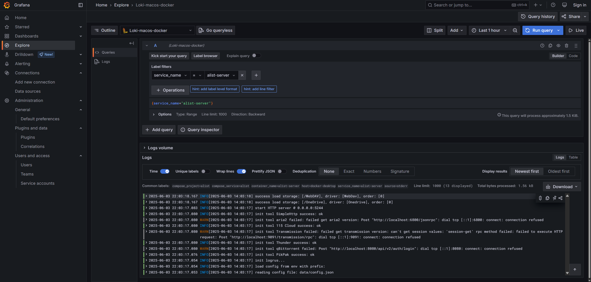

新买了服务器果然能为自己创造一个又一个接连不断的需求。例如今天，想到公网服务器上跑的定时脚本会把日志重定向到指定的文件里，但是并不会自动清理，意味着它们会在几十年后占满笔者的硬盘空间，这是不可接受不可妥协的！

因此今天，笔者打算部署统一的日志管理服务，用于存储来自各个地方的日志信息，既方便管理，也方便快速发现并修复问题。

在 Github 上以 `log` 为关键词，按星标数排序，目前排名第一的开源软件是 [`grafana/grafana`](https://github.com/grafana/grafana)。浏览使用文档后觉得它远远超出笔者的需要，但就笔者就爱用大炮打蚊子，遂决定在 Docker 上部署之，作为笔者的日志管理服务。

## 部署 Grafana 和 Loki 容器

[Grafana](https://grafana.org.cn/docs/grafana/latest/) 的定位是整合数据查询和展示的客户端，在它背后实际负责日志收集和存储的是 [Loki](https://grafana.org.cn/docs/loki/latest/)。因此，首先我们需要部署 Grafana 和 Loki 这两个容器。

> 笔者在撰写本文时，使用的 Grafana 的版本为 `12.0`，Loki 的版本为 `3.5.x`。

参考 Loki 官方快速开始文档，精简示例里的 [`docker-compose.yaml` 文件](https://github.com/grafana/loki/blob/main/examples/getting-started/docker-compose.yaml)，只保留用于启动 Grafana 和 Loki 这两个服务和其他一些必要服务的容器的配置。简化后的 `docker-compose.yaml` 配置文件如下：

```yaml
---
networks:
  loki:

services:
  # Loki 日志读服务
  read:
    image: grafana/loki:latest
    command: "-config.file=/etc/loki/config.yaml -target=read"
    ports:
      - 3101:3100
      - 7946
      - 9095
    volumes:
      - ./loki-config.yaml:/etc/loki/config.yaml
    depends_on:
      - minio
    healthcheck:
      test:
        [
          "CMD-SHELL",
          "wget --no-verbose --tries=1 --spider http://localhost:3100/ready || exit 1",
        ]
      interval: 10s
      timeout: 5s
      retries: 5
    networks: &loki-dns
      loki:
        aliases:
          - loki

  # Loki 日志写服务
  write:
    image: grafana/loki:latest
    command: "-config.file=/etc/loki/config.yaml -target=write"
    ports:
      - 3102:3100
      - 7946
      - 9095
    volumes:
      - ./loki-config.yaml:/etc/loki/config.yaml
    healthcheck:
      test:
        [
          "CMD-SHELL",
          "wget --no-verbose --tries=1 --spider http://localhost:3100/ready || exit 1",
        ]
      interval: 10s
      timeout: 5s
      retries: 5
    depends_on:
      - minio
    networks:
      <<: *loki-dns

  # MinIO 对象存储服务；负责持久化存储 Loki 的日志数据
  minio:
    image: minio/minio
    entrypoint:
      - sh
      - -euc
      - |
        mkdir -p /data/loki-data && \
        mkdir -p /data/loki-ruler && \
        minio server /data --console-address ":9001"
    environment:
      - MINIO_ROOT_USER=loki # 数据库管理员用户名
      - MINIO_ROOT_PASSWORD=supersecret # 数据库管理员用户登录密码
      - MINIO_PROMETHEUS_AUTH_TYPE=public
      - MINIO_UPDATE=off
    ports:
      - 9000
      - 9001 # 监听 Web UI 端口
    volumes:
      - ./.data/minio:/data
    healthcheck:
      test: ["CMD", "curl", "-f", "http://localhost:9000/minio/health/live"]
      interval: 15s
      timeout: 20s
      retries: 5
    networks:
      - loki

  # Grafana 日志可视化服务
  grafana:
    image: grafana/grafana:latest
    environment:
      - GF_PATHS_PROVISIONING=/etc/grafana/provisioning
      - GF_AUTH_ANONYMOUS_ENABLED=true # 允许匿名访问
      - GF_AUTH_ANONYMOUS_ORG_ROLE=Admin # 匿名访问用户角色为 Admin，可以使用所有功能；如果控制台可以通过公网访问，应当对权限进行相应控制
    depends_on:
      - gateway
    entrypoint:
      - sh
      - -euc
      - |
        mkdir -p /etc/grafana/provisioning/datasources
        cat <<EOF > /etc/grafana/provisioning/datasources/ds.yaml
        apiVersion: 1
        datasources:
          - name: Loki
            type: loki
            access: proxy
            url: http://gateway:3100
            jsonData:
              httpHeaderName1: "X-Scope-OrgID"
            secureJsonData:
              httpHeaderValue1: "YOUR_TENANT_ID"
        EOF
        /run.sh
    ports:
      - "3000:3000"
    healthcheck:
      test:
        [
          "CMD-SHELL",
          "wget --no-verbose --tries=1 --spider http://localhost:3000/api/health || exit 1",
        ]
      interval: 10s
      timeout: 5s
      retries: 5
    networks:
      - loki

  # Loki 其它后端服务
  backend:
    image: grafana/loki:latest
    volumes:
      - ./loki-config.yaml:/etc/loki/config.yaml
    ports:
      - "3100"
      - "7946"
    command: "-config.file=/etc/loki/config.yaml -target=backend -legacy-read-mode=false"
    depends_on:
      - gateway
    networks:
      - loki

  # Nginx 网关；负责转发请求到对应的 Loki 服务
  gateway:
    image: nginx:latest
    depends_on:
      - read
      - write
    entrypoint:
      - sh
      - -euc
      - |
        cat <<EOF > /etc/nginx/nginx.conf
        user  nginx;
        worker_processes  5;  ## Default: 1

        events {
          worker_connections   1000;
        }

        http {
          resolver 127.0.0.11;

          server {
            listen             3100;

            location = / {
              return 200 'OK';
              auth_basic off;
            }

            location = /api/prom/push {
              proxy_pass       http://write:3100\$$request_uri;
            }

            location = /api/prom/tail {
              proxy_pass       http://read:3100\$$request_uri;
              proxy_set_header Upgrade \$$http_upgrade;
              proxy_set_header Connection "upgrade";
            }

            location ~ /api/prom/.* {
              proxy_pass       http://read:3100\$$request_uri;
            }

            location = /loki/api/v1/push {
              proxy_pass       http://write:3100\$$request_uri;
            }

            location = /loki/api/v1/tail {
              proxy_pass       http://read:3100\$$request_uri;
              proxy_set_header Upgrade \$$http_upgrade;
              proxy_set_header Connection "upgrade";
            }

            location ~ /loki/api/.* {
              proxy_pass       http://read:3100\$$request_uri;
            }
          }
        }
        EOF
        /docker-entrypoint.sh nginx -g "daemon off;"
    ports:
      - "3100:3100"
    healthcheck:
      test: ["CMD", "service", "nginx", "status"]
      interval: 10s
      timeout: 5s
      retries: 5
    networks:
      - loki
```

在上面的配置里，Grafana 采用了租户控制，您需要手动替换 `YOUR_TENANT_ID` 为您想要的租户名。如果想要添加其他租户，请按照格式添加新的 `datasources` 数组项。

启动 Loki 容器时还用到了对应的配置文件，直接使用示例里给出的 [`loki-config.yaml` 文件](https://github.com/grafana/loki/blob/main/examples/getting-started/loki-config.yaml)即可：

```yaml
---
server:
  http_listen_address: 0.0.0.0
  http_listen_port: 3100

memberlist:
  join_members: ["read", "write", "backend"]
  dead_node_reclaim_time: 30s
  gossip_to_dead_nodes_time: 15s
  left_ingesters_timeout: 30s
  bind_addr: ["0.0.0.0"]
  bind_port: 7946
  gossip_interval: 2s

schema_config:
  configs:
    - from: 2025-06-03
      store: tsdb
      object_store: s3
      schema: v13
      index:
        prefix: index_
        period: 24h

common:
  path_prefix: /loki
  replication_factor: 1
  compactor_address: http://backend:3100
  storage:
    s3:
      endpoint: minio:9000
      insecure: true
      bucketnames: loki-data
      access_key_id: loki # MinIO 数据库管理员用户名，需要与 MinIO 容器环境变量里的配置保持一致
      secret_access_key: supersecret # MinIO 数据库管理员用户登录密码，需要与 MinIO 容器环境变量里的配置保持一致
      s3forcepathstyle: true
  ring:
    kvstore:
      store: memberlist

ruler:
  storage:
    s3:
      bucketnames: loki-ruler

compactor:
  working_directory: /tmp/compactor
```

对于笔者的实际使用需求来说，上面每个配置的具体含义并不需要清楚了解，让我们直接启动 Grafana 和 Loki 容器吧！

```bash
% docker-compose up -d
[+] Running 18/18
 ✔ gateway Pulled                                                                                                                                         15.0s
 ✔ minio Pulled                                                                                                                                            9.9s
[+] Running 7/7
 ✔ Network grafana_loki         Created                                                                                                                    0.0s
 ✔ Container grafana-minio-1    Started                                                                                                                    0.5s
 ✔ Container grafana-write-1    Started                                                                                                                    0.6s
 ✔ Container grafana-read-1     Started                                                                                                                    0.6s
 ✔ Container grafana-gateway-1  Started                                                                                                                    0.7s
 ✔ Container grafana-backend-1  Started                                                                                                                    0.9s
 ✔ Container grafana-grafana-1  Started                                                                                                                    0.9s
```

验证 Grafana 服务是否启动成功，可以访问 Grafana 在本机映射的端口（配置文件里默认为 `3000`），是否能正常显示如下的控制台页面：


另外，可以分别访问 `http://localhost:3101/ready` 和 `http://localhost:3102/ready`，来验证 Loki 的读写服务是否启动成功。如果成功的话，返回值为 `ready` 字符串。

至此，前置工作就完成了。

## 重定向日志信息到 Loki

### 使用 Alloy 重定向常规日志信息

现在，我们拥有了 Loki 来收集日志，那么该拿什么负责在客户端转发日志呢？Loki 的官方文档里推荐使用 [Alloy](https://grafana.org.cn/docs/alloy/latest/)，这里笔者也就沿用官方文档提供的方案了。

> 笔者在撰写本文时，使用的 Alloy 的版本为 `1.8`。

对于笔者的 CentOS 服务器，依次执行下面的命令来安装 Alloy：

```bash
wget -q -O gpg.key https://rpm.grafana.com/gpg.key
sudo rpm --import gpg.key
echo -e '[grafana]\nname=grafana\nbaseurl=https://rpm.grafana.com\nrepo_gpgcheck=1\nenabled=1\ngpgcheck=1\ngpgkey=https://rpm.grafana.com/gpg.key\nsslverify=1\nsslcacert=/etc/pki/tls/certs/ca-bundle.crt' | sudo tee /etc/yum.repos.d/grafana.repo

yum update

sudo yum install alloy
```

配置 Alloy 服务开机自启：

```bash
sudo systemctl enable alloy.service
```

配置 Alloy 服务采集日志，编辑 `/etc/alloy/config.alloy` 文件如下：

```alloy
// 添加本地的日志文件源
local.file_match "local_files" {
  path_targets = [{"__path__" = "/path/to/*.log"}]
  sync_period = "5s"
}

// 读取日志文件源并转发到处理器
loki.source.file "log_scrape" {
  targets = local.file_match.local_files.targets
  forward_to = [loki.process.filter_logs.receiver]
  tail_from_end = true
}

// 过滤日志数据并转发到接收器
loki.process "filter_logs" {
  // ...其它的过滤日志数据的配置
  forward_to = [loki.write.grafana_loki.receiver]
}

// 将日志信息发送到 Loki 服务
loki.write "grafana_loki" {
  endpoint {
    url = "http://localhost:3100/loki/api/v1/push"
    // 必须配置租户 tenant_id 为容器 Grafana 包含的租户 ID
    tenant_id = "YOUR_TENANT_ID"
  }
}
```

启动 Alloy 服务：

```bash
sudo systemctl start alloy
```

验证 Alloy 服务的运行状态：

```bash
$ sudo systemctl status alloy
● alloy.service - Vendor-agnostic OpenTelemetry Collector distribution with programmable pipelines
   Loaded: loaded (/usr/lib/systemd/system/alloy.service; enabled; vendor preset: disabled)
   Active: active (running) since Tue 2025-06-03 21:43:30 CST; 21s ago
     Docs: https://grafana.com/docs/alloy
 Main PID: 25555 (alloy)
   CGroup: /system.slice/alloy.service
           └─25555 /usr/bin/alloy run --storage.path=/var/lib/alloy/data /etc/alloy/config.alloy

Jun 03 21:43:30 iZ2vc17uca9zl48iicx7ojZ alloy[25555]: ts=2025-06-03T13:43:30.861446161Z level=info msg="scheduling loaded com...ices"
Jun 03 21:43:30 iZ2vc17uca9zl48iicx7ojZ alloy[25555]: ts=2025-06-03T13:43:30.861894177Z level=info msg="starting cluster node...ut=0s
Jun 03 21:43:30 iZ2vc17uca9zl48iicx7ojZ alloy[25555]: ts=2025-06-03T13:43:30.862038357Z level=info msg="peers changed" servic...x7ojZ
Jun 03 21:43:30 iZ2vc17uca9zl48iicx7ojZ alloy[25555]: ts=2025-06-03T13:43:30.862410662Z level=info msg="tail routine: started...e.log
Jun 03 21:43:30 iZ2vc17uca9zl48iicx7ojZ alloy[25555]: ts=2025-06-03T13:43:30.862469331Z level=info msg="tail routine: started...g.log
Jun 03 21:43:30 iZ2vc17uca9zl48iicx7ojZ alloy[25555]: ts=2025-06-03T13:43:30.862606748Z level=info msg="Seeked /var/www/logs/...ailer
Jun 03 21:43:30 iZ2vc17uca9zl48iicx7ojZ alloy[25555]: ts=2025-06-03T13:43:30.862646605Z level=info msg="Seeked /var/www/logs/...ailer
Jun 03 21:43:30 iZ2vc17uca9zl48iicx7ojZ alloy[25555]: ts=2025-06-03T13:43:30.862631467Z level=info msg="now listening for htt...12345
Jun 03 21:43:30 iZ2vc17uca9zl48iicx7ojZ alloy[25555]: ts=2025-06-03T13:43:30.862724788Z level=info msg="tail routine: started...e.log
Jun 03 21:43:30 iZ2vc17uca9zl48iicx7ojZ alloy[25555]: ts=2025-06-03T13:43:30.862774924Z level=info msg="Seeked /var/www/logs/...aile
```

在 Grafana 查看收集到的日志信息：


这样，远程服务器上的日志信息就顺利上传到 Loki 里，并可以通过 Grafana 查看了！

### 使用 Docker 插件重定向容器日志信息

为了重定向 Docker 容器里的日志到 Loki 上，只需要安装 Loki 的 Docker 插件并添加相应的 `logging` 配置。

但在开始前，假如您忘记了最初启动容器时 `docker run` 后面的一串参数怎么办？用 `docker inspect` 去找灵感也太麻烦了！这个问题也困扰了笔者一阵，幸运的是以前有人遇到这样的烦恼后，开发了 [`runlike`](https://github.com/lavie/runlike) 工具，它可以帮助打印出运行指定容器时可能使用到的参数。

拉取 `assaflavie/runlike` 镜像：

```bash
docker pull assaflavie/runlike
```

编辑 `~/.bashrc` 或 `~/.zshrc`，添加命令别名 `runlike`：

```bash
alias runlike="docker run --rm -v /var/run/docker.sock:/var/run/docker.sock assaflavie/runlike"
```

重启终端，现在，执行 `runlike <container-name>` 就可以查看启动容器 `<container-name>` 时可能使用到的命令了。

以笔者部署的 AList 容器为例，查看它的启动命令：

```bash
# 添加 -p 以多行显示
% runlike -p alist
docker run --name=alist \
        --hostname=xxxxxx \
        --mac-address=xx:xx:xx:xx:xx:xx \
        --volume /local/path/to/AList/data:/opt/alist/data \
        --network=bridge \
        --workdir=/opt/alist/ \
        -p 5244:5244 \
        --expose=5245 \
        --restart=unless-stopped \
        --runtime=runc \
        --detach=true \
        xhofe/alist \
        /entrypoint.sh
```

摘取其中笔者确实使用到的参数，简洁的启动命令就是：`docker run --name=alist --volume /local/path/to/AList/data:/opt/alist/data -p 5244:5244 --restart=unless-stopped xhofe/alist`。

随着服务容器化和自动化的发展，`docker run` 也该被扫进历史的垃圾堆，总是使用 `docker-compose` 命令来替代了。趁着这次机会，笔者也将所有容器的启动方式替换为了 `docker-compose`，以后再遇到需要修改参数或更新镜像等的情况，就可以省时省力一键启动更新后的容器了。

以笔者的 AList 服务为例，可以编写 `docker-compose.yaml` 文件如下：

```yml
services:
  alist:
    image: xhofe/alist
    container_name: alist-server
    volumes:
      - /local/path/to/AList/data:/opt/alist/data
    ports:
      - 5244:5244
    restart: unless-stopped
```

笔者的 Docker 服务部署在使用 ARM64 架构的机器上，因此执行如下命令安装 [Loki 的 Docker 插件](https://hub.docker.com/r/grafana/loki-docker-driver/tags)：

```bash
docker plugin install grafana/loki-docker-driver:3.5.1-arm64 --alias loki --grant-all-permissions
```

重定向容器的日志信息到 Loki，完整的 `docker-compose.yaml` 配置文件如下：

```yml
services:
  alist:
    image: xhofe/alist
    container_name: alist-server
    volumes:
      - /local/path/to/AList/data:/opt/alist/data
    ports:
      - 5244:5244
    restart: unless-stopped
    logging:
      driver: loki
      options:
        loki-url: http://localhost:3100/loki/api/v1/push
        loki-tenant-id: YOUR_TENANT_ID
```

同样，您需要替换配置里的 `YOUR_TENANT_ID` 为您指定的租户 ID。

最后，删除旧的使用 `docker run` 命令启动的容器，执行命令启动新容器：`docker-compose up -d`。

在 Grafana 查看收集到的日志信息：



这样，Docker 容器的日志信息也顺利上传到了 Loki 里，并可以通过 Grafana 查看了！

## ？

请看 VCR：[《2999,入手 16+256G 内存的 macmini4，如何通过部署 50 个服务实现最大价值化》](https://www.v2ex.com/t/1123367)。还有高手……！
