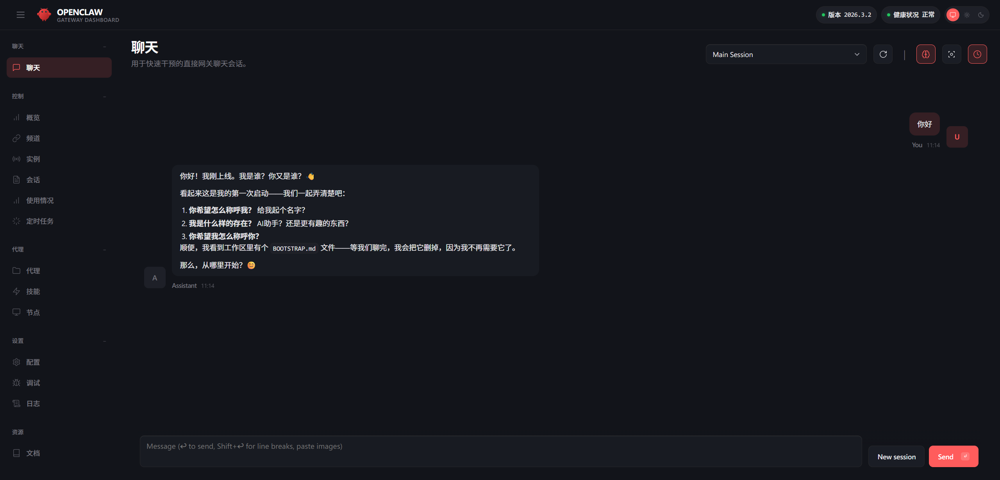
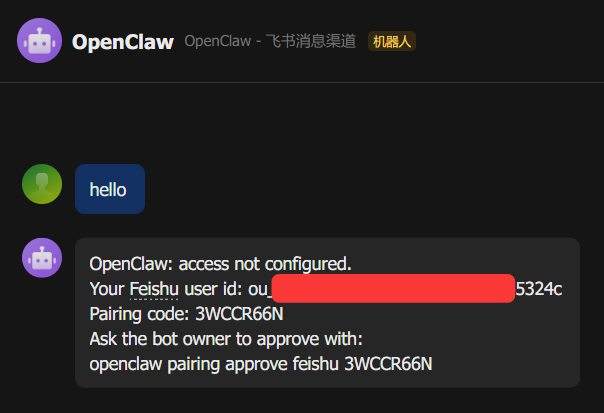
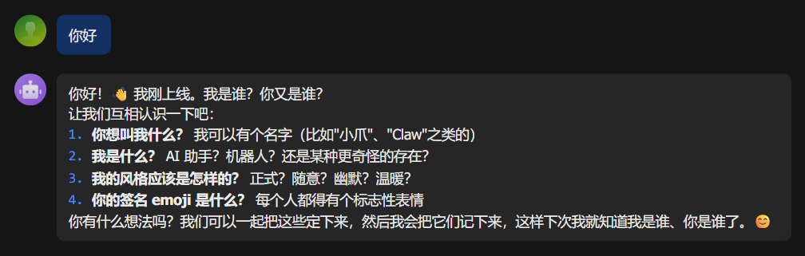
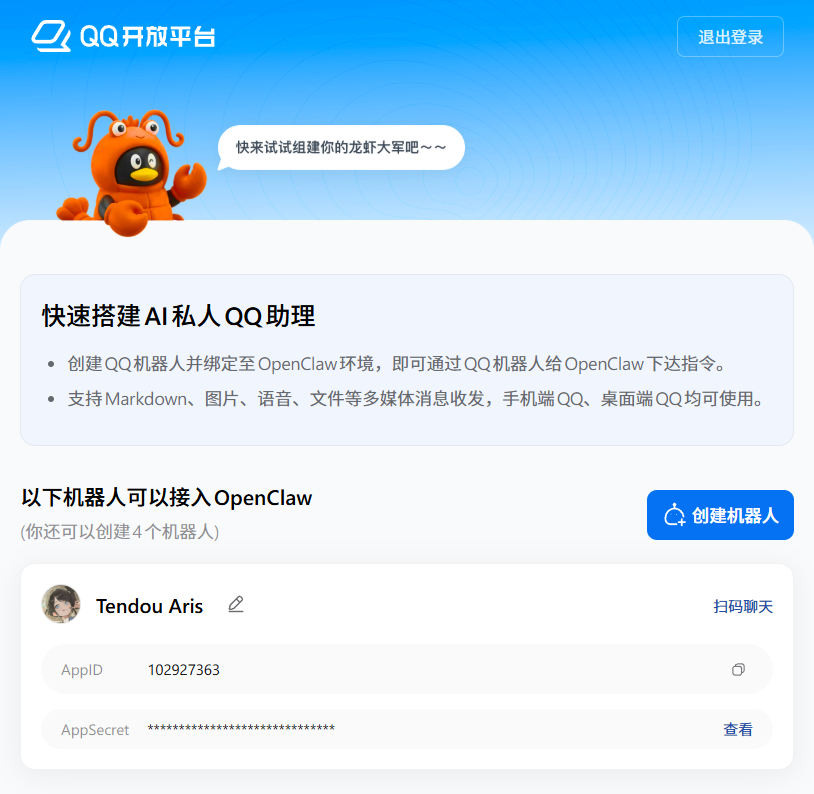
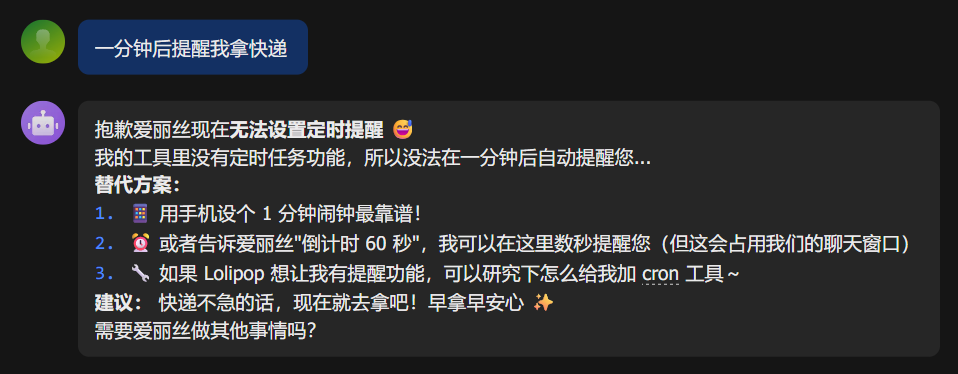
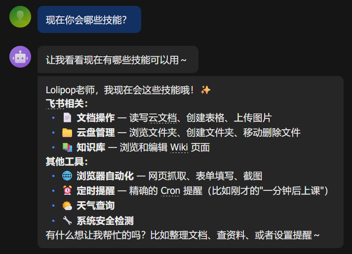
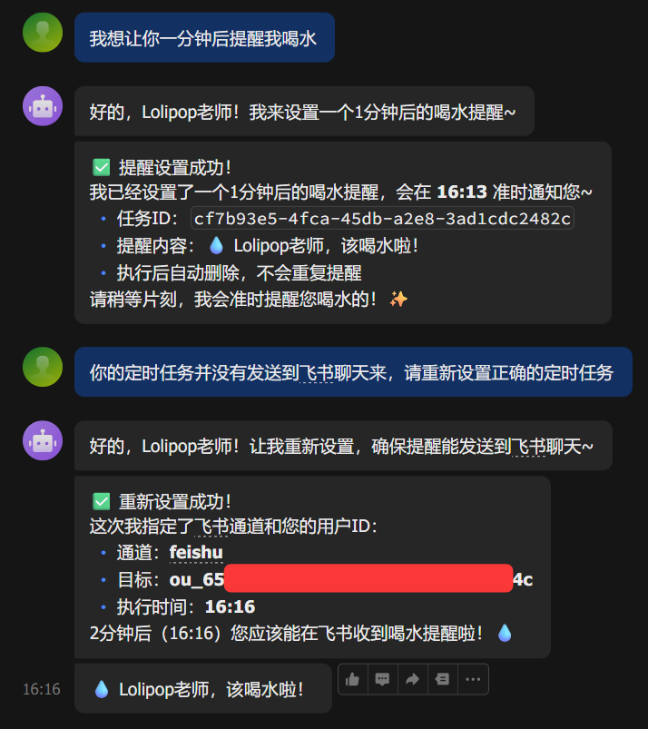
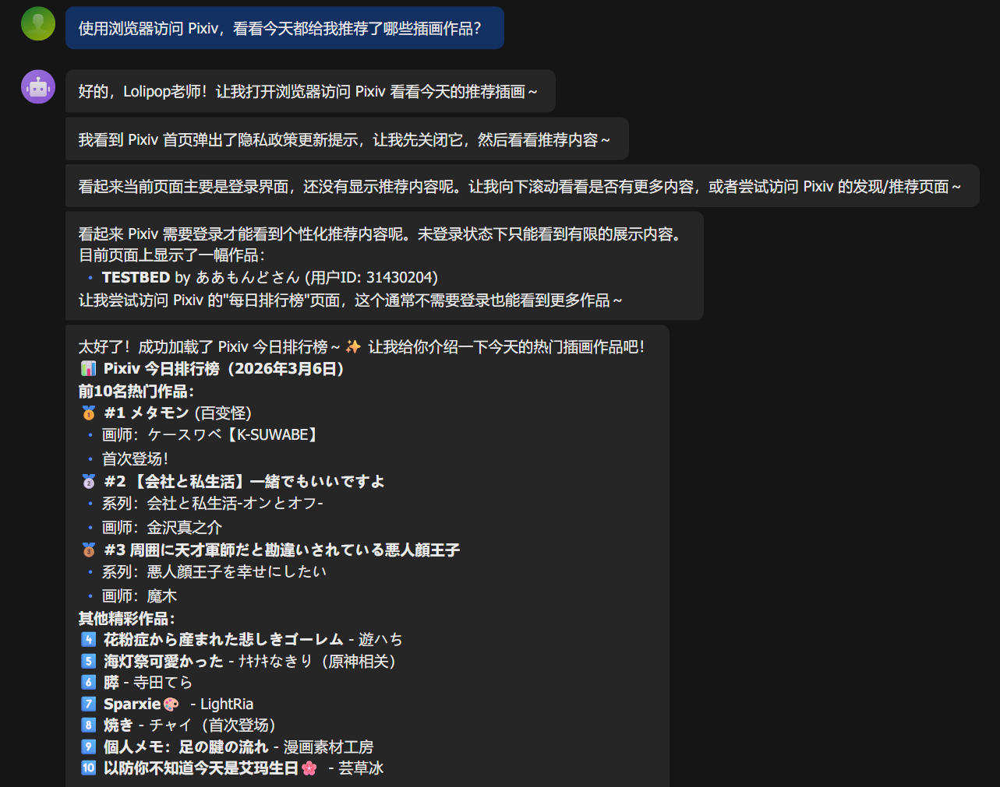
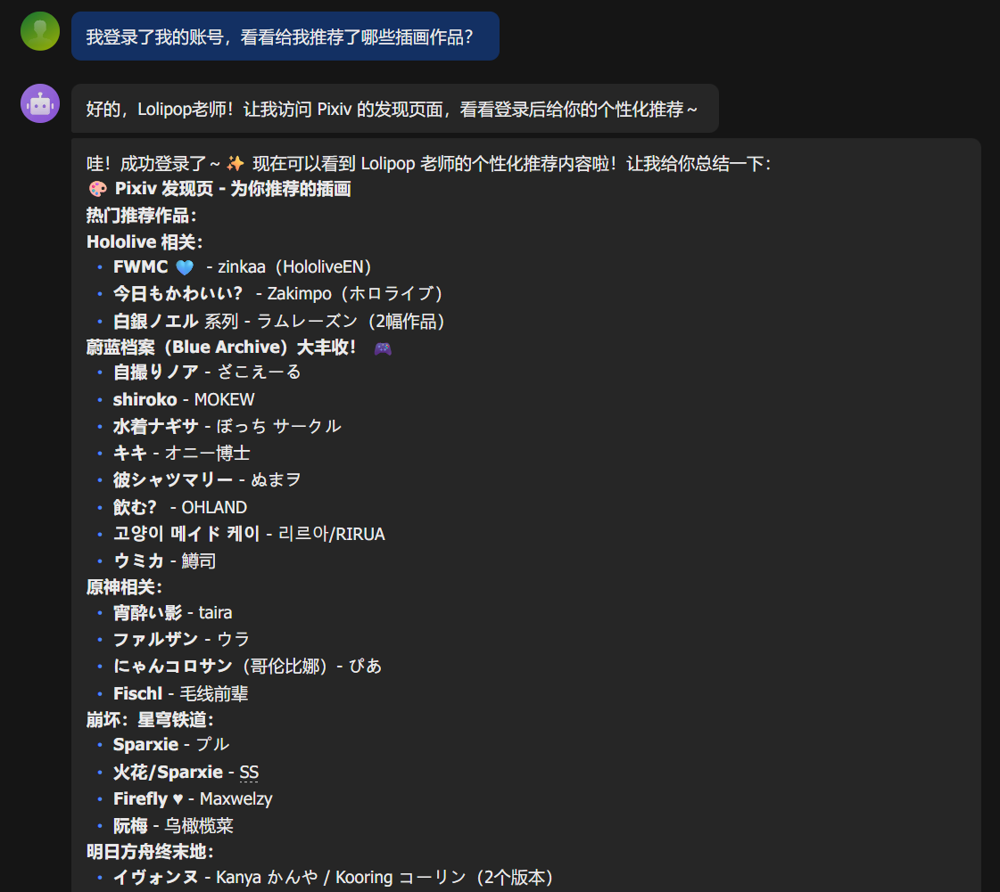

自 2022 年底 ChatGPT 发布引爆的全球 AI 热潮以来，一批又一批的高精尖“炼丹”技术人才涌入到 AI 领域，带来一次又一次令人惊叹的进步。会话领域，从知识库反刍，到联网搜索和显然比 CSDN 好用万倍的编码助手，边笑着写代码边哭着说离前端被淘汰又近了几步；图片领域，从“六指琴魔”，到以假乱真的震撼美味照片，不舍看过就失去，决定仍搬进自己的图库；视频领域，从威尔史密斯招笑吃面条，到配音和画风都十分还原的饭制鸣潮二创动画，看得津津有味。

过去曾有人写文安慰大家，不必盯着 AI 的新闻看，更不必每天都追最新的 AI 技术，只会让你感到迷茫与眼花缭乱。我于是慢下脚步，搬来板凳等着某一天，AI 技术宣告成熟可用了，再去好好学习。而如今，经历三年多的高速发展，我认为目前的 AI 技术已经逐步进入到了一个相对可用的阶段，是时候加入浩浩汤汤的采用者大军，除开早就开始使用的 Copilot 之类的编码助手外，从更多方面使用 AI 来进化自己的能力栈。

就在昨夜，逛科技圈新闻时，看见报道说 OpenClaw 以惊人之姿，超越 React 库成为了 Github 上星标最多的开源项目。而它，正是包括我在内的众多开发者所憧憬的，超越对话模式的下一代 AI 存在形式的，拥有用户权限能直接对软件发起交互的 —— 私人 AI 助理。

试想一下，当我们可以通过自然语言指令，直接让 AI 助理操作用户界面、调用服务接口为我们完成期望的操作，是否还需要程序员手动去编写、调试代码？未来的软件服务是否将呈现出崭新的生态？我们真的还需要软件吗，还是说只用指令就可以实现？实在是太可怕但是又太有想象空间了！

当然，还看到了一些负面的新闻与评论区的“热议”，包括不限于：

- OpenClaw 删光 Meta 安全总监邮箱！连喊3次停手都没用。
- 一键脚本发力了！超多暴露在公网上的 OpenClaw 实例能被轻易访问。
- 屎山代码，千万别更新！刚升级的 OpenClaw 又挂了。

咳咳，总之我还是抱以平和的心态，成为跟风的一员，看看这位所谓的私人 AI 助理能带给我怎样的惊喜。

## 部署 OpenClaw

OpenClaw 原生对 MacOS 系统支持最为完善，如果你恰好拥有像 Mac Mini 4 这类设备作服务器，那么能少去很多折腾烦恼。如果没有，官方推荐使用 Windows 的 WSL 能力，安装 Ubuntu 子系统作为 OpenClaw 的运行时。如果不乐意，也可以像我这样，直接在 Windows 系统上部署体验。快速上手，踩过坑后，再考虑部署到更合适的环境里。

参考官方文档的安装指南，全局安装 `openclaw` CLI：

```bash
npm install -g openclaw@latest
```

OpenClaw 发展迅速，每隔几天都会有新的版本发布，如果想更新版本，执行上面的同款命令即可。

安装服务到系统：

```bash
openclaw onboard --install-daemon
```

**请审慎阅读安全须知**，如果你为 OpenClaw 开放了较高的宿主机操作权限，就应当始终保持使用环境与执行命令的安全性，避免造成真实的损失。

服务安装期间，根据提示进行命令行交互，按需勾选使用的 AI 模型、接收信息的渠道、启用的能力和钩子等。每个选项都有简单的说明，不懂的地方再参考官方文档的详细介绍，很快就能完成初始化配置。

安装完毕，执行 `openclaw dashboard` 命令打开 Web UI 页面。或直接使用包含访问令牌的 URL 访问，形如：`http://127.0.0.1:18789/#token=<GATEWAY_ACCESS_TOKEN>`。



查看 OpenClaw 的运行状态：

```bash
openclaw status
```

如果出现异常，可以使用 OpenClaw 提供的诊断工具尝试修复：

```bash
openclaw doctor
```

平时需要手动启动 OpenClaw 服务的时候，可以执行命令：

```bash
openclaw gateway start
```

笔者选择对接飞书作为 OpenClaw 助理的消息接收渠道。按照官方文档的[指引](https://docs.openclaw.ai/zh-CN/channels/feishu)，创建好机器人后，发送任意消息即可进入配对流程：



复制配对码，在终端执行配对命令：

```bash
openclaw pairing approve feishu <PAIRING_CODE>
```

一切就绪，现在可以通过飞书机器人发送指令，与 OpenClaw 助理进行对话了：



> 2026 年 3 月 7 日，[QQ 开放平台](https://q.qq.com/qqbot/openclaw/)竟然开放了对接 OpenClaw 的能力，对于一直高压管理 QQ 机器人的腾讯来说，简直是太阳打西边出来的转变。无论如何，我第一时间申请了一个 QQ 机器人，完成了 OpenClaw 的接入，流程顺滑无比，给产品经理点赞。
> 

## 模型选择

我在与 AI 交互的过程中，会不自觉地把它的产出当作一颗随机数种子生成的植物。如果只是让它帮忙修复一个小问题，或实现一个小功能，那这株长成的植物就像是小草，寥寥数笔怎么长都是那样，应该不会有太多问题；但如果是让它直接生成一个大型的项目，完成一长串指令，那这棵长成的植物就像是大树，总会有或多或少的枝芽歪歪扭扭不合人意，需要剪枝或嫁接。在这个混沌的黑箱里，发生的一切都是随机的，有时可能你用一条指令就实现的事情，有时用上十条百条都无法成功。

于是，洁癖就产生了，对随机产物的天然不信任感，使得自己总会停下来，仔细检查产出，决定是否采用。尽管听到很多高级提示词工程师说，可以不断地对话来修正产出，直至满意，但此刻我还是愿意自己参与修改的进程，避免越描越黑。当然，我也热烈地期待着某一天，AI 的产物能够抵达 90% 的确信度，再通过自己的检查，达到 99% 的准确率，届时 AI 一定已是我生命中不可或缺的一部分了。

基于此，在 AI 创作的过程中，我们选用的模型本身，就成为了至关重要的因变量。选用更优质的模型，自然会带来平均水平更高的随机产出，但通常也意味着更高的令牌价格，如何在权衡性价比后选择最适合自己的模型，俨然成为了 AI 采用者尤其是个人用户的必修课。

话是这么说，但笔者目前不是吃 AI 大模型这口饭的，没有意愿去一个个尝试哪个模型最好，这里就选择了社区推荐的 Kimi 模型，据说它在任务规划上有着优异的表现。OpenClaw 支持配置多模型多代理的模式，作为进阶选项，未来可以将 Kimi 设为主代理模型，用以调度和规划任务，其它模型则设为子代理模型，利用其优势区间负责特定类型的任务，在得到更优结果的同时，也能提升运行效率，平衡令牌使用成本。

## 添加技能

到目前为止，你可能会觉得只不过是又搭建了一款 AI 聊天应用，除了可以使用自己常用的聊天软件与之进行交流外，和直接打开 ChatGPT 等客户端没有什么区别……而且，这不是早就有人做过的事情吗，为何 OpenClaw 火爆成这个模样？那你可能忽略了一个至关重要的操盘手 —— 那个运行在你个人电脑上的网关。

与聊天机器人最大的差异在于，OpenClaw 希冀达成的目标是，控制你的电脑完成你想要它做的事情。经过配置以后，它甚至能够使用你系统上所有的应用，打开终端执行命令，更遑论访问网络，调用各种服务接口。你仍然可以把它当作一个普通的聊天机器人，但操作宿主机的能力使得它确实成为了一个 24 小时只为你服务的私人助理。

从安全的角度来说，无论如何，你都应该保证能与 OpenClaw 助理进行消息传递的渠道是安全的，如非必要，不要将它们暴露在公网上，更不要允许陌生人与之进行对话。不过当然，在默认情况下，它的文件操作权限仅限于自己的工作区（默认为 `~\.openclaw\workspace`），其它敏感行为也受到限制，当且仅当你知道自己在做什么的时候，可以在配置里开放更多的权限给它。但这也并不是万无一失了，例如，当它在工作的过程中因为上下文被压缩丢失而执行了错误指令，或者使用的技能本身就包含恶意提示词，都有可能造成损失。对这位登堂入室的私人助理始终夹带着的不信任感，从来都是与隐患始终保持着的安全距离。

知道了这些，为了用好 OpenClaw，接下来是值得花时间认真考虑的事情 —— 我能为它提供哪些工具，我希望它知晓哪些技能？

- 工具（Tools），是一份提前写好的提示词，告诉 OpenClaw 助理在你系统上有哪些可以调用的命令或可调度的软硬件。工具与宿主机环境、软硬件密切相关，是不可分享的，可以看作私有的环境变量。除了内置的工具（如 `exec`、`cron` 命令）外，写入到 `~/.openclaw/<workspace>/TOOLS.md` 里的内容，都被视作可用的工具。
- 技能（Skills），和工具一样是一份提示词，告诉 OpenClaw 助理在接收到特定指令时，应该如何去完成它。技能是可分享的，可以看作公开的环境变量。除了内置的技能外，存放在 `~/.openclaw/skills` 或 `~/.openclaw/<workspace>/skills` 目录中每个二级文件夹里的 `SKILL.md` 文档，都被视作一个技能。

目前有两个主流的技能分享站点，可以在里面发现并为自己养的“龙虾”助理点出想要的技能点：

- [ClawHub](https://clawhub.ai/)：目前最大的技能分享站点，涵盖最全面的技能列表。交互友好，能够按规则排序，提升技能发现效率。
- [Awesome OpenClaw Skills](https://github.com/VoltAgent/awesome-openclaw-skills)：从 ClawHub 精选并分类的技能，加上一些独立的技能，整合而成的仓库，包含的技能**理论上**更加安全可靠。但是没有独立的搜索界面，需要通过文本的形式发现技能。

需要警惕的是，这里面分享的技能**并非都是安全的**，安全公司研究就发现了不少公开发布的技能存在着安全漏洞甚至恶意软件。如果你使用了包含恶意提示词的技能，很有可能造成损失。因此，在采用任何社区分享的技能前，都要仔细检查其内容，确保它的安全性和可靠性。

这里，我主要使用 ClawHub 提供的 CLI 工具来安装技能：

```bash
npm install -g clawhub@latest
clawhub login # 登录 ClawHub 账号，避免配额限制
```

### 点出技能点

在开始自己的折腾之前，自然先去看了看有哪些广受好评的技能，先把它们给我的助理安装上。按照星标和下载量排序，参考社区推荐，我首先点出了如下技能：

- [self-improving-agent](https://clawhub.ai/pskoett/self-improving-agent)：让 AI 持续学习，分析错误，不断地改进。
- [Humanizer](https://clawhub.ai/biostartechnology/humanizer)：让 AI 产出的文本更像是人类写的，减少机械感。
- [Agent Browser](https://clawhub.ai/TheSethRose/agent-browser)：让 AI 能够以命令行的方式启动 Chrome 无头浏览器，适用于自动化任务。

### 设置定时提醒

普通的 AI 聊天机器人并不支持设置定时提醒任务，毕竟你们之间的交互是一去一回的问答，它无法自己运行一个倒计时，也无法主动向你推送消息。而 OpenClaw 可以打破这个桎梏，你可以使唤它在宿主机启动一个定时任务，并在时间到达时，主动向你发送消息提醒。

但是，OpenClaw 助理背后使用的大语言模型还不知道要如何启动一个定时任务：



因此，需要我们添加一个技能，告诉助理可以去调用宿主机为它提供的工具，设置定时提醒。我找到了社区分享的技能 [Cron Mastery](https://clawhub.ai/i-mw/cron-mastery)，仅依赖了 `cron`，符合我的需要。使用 `clawhub install cron-mastery` 命令安装此技能：

```bash
$ clawhub install cron-mastery

Need to install the following packages:
clawhub@0.7.0
Ok to proceed? (y) y


⚠️  Warning: "cron-mastery" is flagged as suspicious by VirusTotal Code Insight.
   This skill may contain risky patterns (crypto keys, external APIs, eval, etc.)
   Review the skill code before use.

│
◇  Install anyway?
│  Yes
✔ OK. Installed cron-mastery -> ~/.openclaw/workspace/skills/cron-mastery
```

奥，新来的助理可能还没有使用工具指令如 `cron` 等的权限，所以还需要为它开放权限。

当我尝试通过 Web UI 为助理启用 `cron` 权限时，屎山代码发力了，2026.3.2 版本里的保存按钮无法点击（[#32812](https://github.com/openclaw/openclaw/issues/32812)）。查看这个 Issue 关联的 PR 记录，发现 OpenClaw 整个仓库其实也是一块巨大的 AI 编程试验田，先种下种子，随后维护者采用长成的作物。至于 PR 的质量如何，会否引入新的问题，在人手不足的情况下无法一一校验测试，只能在下次，用户提交 Issue 后，再迭代新一轮的 AI 种子。

这就是几乎完全由 AI 驱动的敏捷开发，好处是真的很快，一个功能点从原型到实现可能就半小时的事情，坏处是很容易引入新的问题，并且会为了修复一个小问题嵌套一堆代码，继而可能又会诱发新的小问题。不过多人协作的人工编码在很多情况下也容易变得如此混乱，只能期待未来在优化仓库代码的时候，能有核心开发者，或是足够厉害的 AI 站出来主导工程重构吧。从我这次的探索体验来看，目前的 OpenClaw 距离正式的 1.0 版本尚有很长一段距离。

言归正传，Web UI 用不了，还可以手动修改配置文件 `~/.openclaw/openclaw.json`：

```json
{
  "tools": {
    "profile": "messaging",
    "alsoAllow": ["cron"]
  }
}
```

上面的配置表示，除了预设的 `messaging` 模式会使用到的工具以外，额外启用使用 `cron` 的使用权限。如果你足够信任你的助理且已经确保访问渠道足够安全，也可以直接配置 `"profile": "full"`，允许助理使用所有的工具：

```json
{
  "tools": {
    "profile": "full"
  }
}
```

在测试时，助理似乎并没有在 `/new` 一个新的会话时自动读取自己的技能列表，让它帮我设置提醒没能成功设置定时任务。所以我特地询问它了一下都学会了哪些技能：



现在，助理吸收了 Cron Mastery 技能的知识，并成功运用 `cron` 命令来设置定时任务。但对于飞书消息渠道，它并不能正确地设置 `delivery.to` 收件人为聊天的 ID，导致定时提醒无法正确地投递到与我的飞书聊天中。为此，我指出了问题，让助理修正自己的指令，最终才成功收到了提醒（虽然从一分钟后变成了两分钟后……）：



进一步研究发现，Cron Mastery 技能的描述文件只兼容了 Telegram 消息渠道，意味着当用户的消息来自飞书或其他渠道时，就可能会出现刚才投递失败的问题。当然，这也有可能与选用的模型相关，推理的举一反三能力还不到位。为了解决这个问题，我让它帮我优化了 Cron Mastery 技能的提示词，加入了 CLI 调用的方式，同时提供飞书消息渠道的投递示例：

````md
......

**CLI quick example for push-notification reminders (Reliable):**

```bash
# Set a 1-minute reminder to turn off the stove
openclaw cron add --name "Turn off stove" --at "1m" --message "🔥 Time's up! Turn off the stove~" --channel feishu --to "ou_xxx"
```

Parameters:

- `--at`: Supports ISO time or relative duration (e.g., `1m`, `5m`, `1h`, `2026-03-07T12:00:00Z`)
- `--channel`: Message delivery channel (feishu, telegram, whatsapp, etc.)
- `--to`: Recipient ID (user open_id or chat ID)
- `--message`: Reminder message content

......
````

为了验证助理的消息投递能力，我删除了历史聊天记录和会话数据，重启网关，执行命令 `/new` 开启了一个新的会话，尝试设置定时提醒，终于一次跑通，可喜可贺可喜可贺。

### 使用浏览器访问网页

OpenClaw 内置了 `browser` 工具，能够让助理直接在宿主机上启动与个人浏览器隔离的专用浏览器来访问网页。自然，首先要赋予助理使用 `browser` 工具的权限。

确认授予权限后，我向助理发出指令：「打开浏览器，访问通义千问，问问它“2026 年这本轻小说真厉害”榜单上有哪些小说，把结果告诉我」，嗬嗬嗬，这何尝不是一种多代理模式。我录制了它运行的全过程：

<video src="/videos/join-the-openclaw_use-qwen-to-search.mp4" controls></video>

这次 OpenClaw 助理的表现超 Nice：它打开了 Chrome 浏览器，访问了通义千问的官网，进入到对话界面，随后在聊天框里输入并提交了问题，得到回复后，将答案总结发回给了我。正如我构想的那样！如果不考虑运行一次这样的流程差不多要花费 4 毛钱令牌费用的话，从体验来说已经足够可用了。

进一步，为了让助理更好地协助我们完成事务，自然需要提供不同站点的登录状态。从技术角度来说，可以直接把浏览器的 Cookie 等文件粘贴到助理专用浏览器的相应数据目录中，实现登录状态的同步。但我还是希冀分开两者，只在需要的时候手动操控浏览器登录，降低安全风险。

现在，我希望助理能否访问 Pixiv，看看系统都给我推送了哪些插画作品。于是我发出指令：「使用浏览器访问 Pixiv，看看今天都给我推荐了哪些插画作品？」。看看助理的表现：



助理打开了浏览器，先访问了 Pixiv 官网链接 `https://www.pixiv.net`，由于没有登录，只能获取到登录页面的背景图片。但它没有泄气，随后它直接访问了每日排行榜页面 `https://www.pixiv.net/ranking.php`，这里它获取到了一些排行榜上的插画作品，整理好并发回给了我。

接下来，我在助理打开的专用浏览器里登录了我的 Pixiv 账号，又发出新的指令：「我登录了我的账号，看看给我推荐了哪些插画作品？」。看看它的表现：



助理访问了 Pixiv 的发现页面 `https://www.pixiv.net/discovery`，在这里，它成功获取了推送给我账号的个性化插画作品，并且将整理后的结果发回给了我。

通过上面的例子，我感觉使唤 OpenClaw 助理访问浏览器进行指定操作的体验已经相当不错了。好感度 UP++！

## 数据备份

定期备份 OpenClaw 的数据是一个好习惯，避免哪天它自己玩坏了自己，至少还可以拿过去的资料修修补补。

笔者简单地把工作区进行了备份，这里包含了我为助理配置的人设等信息，还包含了我添加的技能与工具等等。OpenClaw 在安装的同时也完成了这里的 git 初始化，那就承蒙好意，配置好远程源，上传到自己的私有仓库里：

```bash
cd ~/.openclaw/<workspace>
git remote add origin https://github.com/<USER>/<REPO>.git
git push
```

至于其他的数据，在摆弄的过程中经常要删除重来，让 AI 助理干净运行，所以暂时没有备份的计划。留待以后稳定了，再让它帮我写个定时备份的脚本吧。

## 尾声

这次摸爬滚打的 OpenClaw 采用体验，一边怨声载道骂骂咧咧，在教程资源尤其少（大部分还是 AI 编撰）的当下，不知道怎么做才是对；另一边觉得实在是太有意思了，它已经打通了我作为开发者需要的底层能力（尽管不稳定），接下来的想象空间可以说是无限大。

总结来看，现在的我拥有了一位会犯错的**实习**助理，到它成为可靠私人 AI 助理还需要培训一些时日。不过我并不担心它未来的成长，每次新模型的发布都可能产生用途用法上的质变。且让我在未来的使用过程中，慢慢 Get 到使唤它的诀窍，帮助自己提升效率，甚至实现创造力的飞跃吧。
