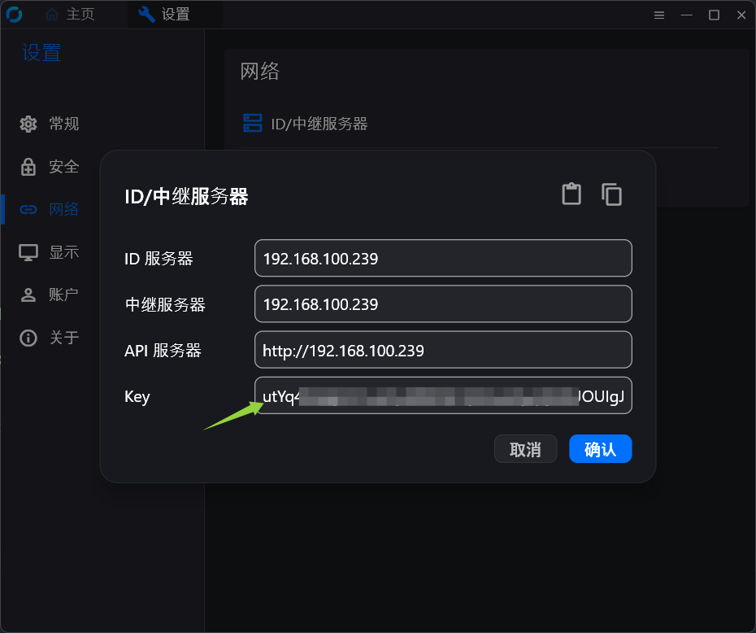
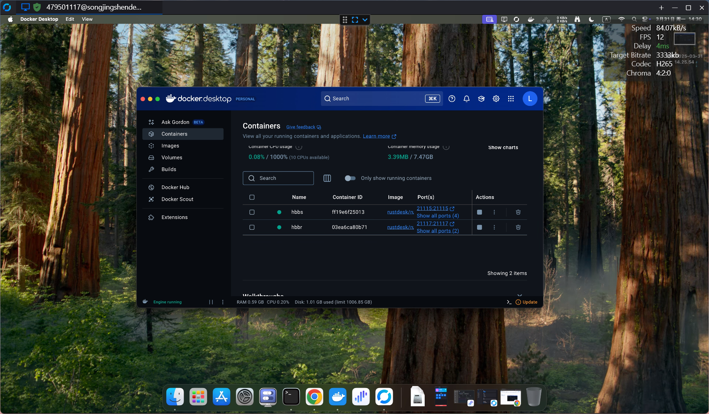
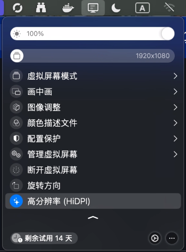
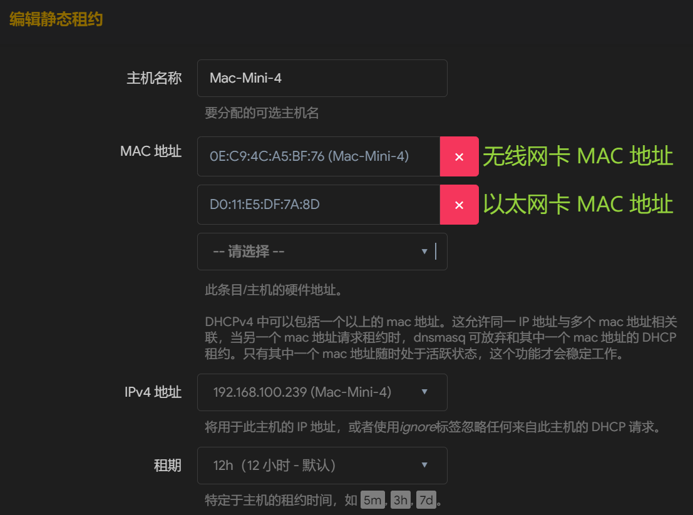
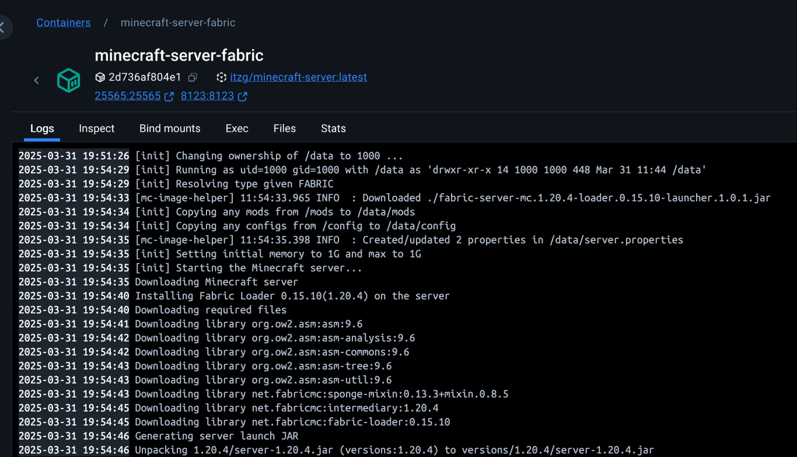
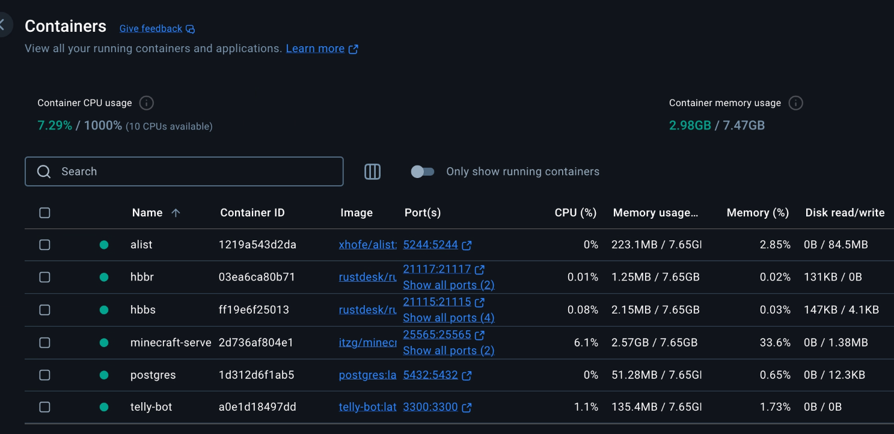

去年笔者拿 N100 小型主机安装 OpenWRT 系统作主路由服务器，又塞进去一些笔者自己部署的应用服务。后来 Mac Mini 4 发售了，评测得到的功耗与性能令人惊叹，最重要的是定价很不苹果，让我这个苹果小黑子也想要入手一台玩玩。

当然，笔者在逛 V2EX 的时候也看了大量劝退购入 Mac Mini 4 的帖子，尤其是像笔者这样只是拿来做轻量级应用服务器的用途 —— 大炮打蚊子。但是你知道的，即使并不需要，但是笔者可以拿它为自己的灵魂制造全新的刺激来充实生活。

时间来到 2025 年 03 月，Mac Mini 4 已经有大量现货而无需蹲点抢购了，国家补贴叠加学生补贴，在京东上花 2999 元下单入手了最低配置（但最高性价比）的版本。

这篇博客将记录笔者从零开始折腾 Mac Mini 4 做轻量级应用服务器的全过程，包括从原来的服务器上迁移已有 Docker 容器和应用服务的操作步骤。

## 首次启动 Mac Mini

这是笔者第一次购买 Mac Mini，在首次启动主机的时候，会需要连接鼠标与键盘。由于 Mac Mini 4 上只有 Type-C 接口，所以可以提前准备拓展坞或者 Type-C 连接线。

如果有蓝牙鼠标和蓝牙键盘，就不需要用到这些硬件了：只需要把蓝牙鼠标和蓝牙键盘置于配对模式下，Mac Mini 就会自动配对并连接。

## 面向服务器的 Mac Mini 配置

参考网上其它教程指出的细节，在“设置”里对 Mac Mini 进行配置：

1. **保持服务器运行状态**：在“能源”里设置“显示器关闭时，防止自动进入睡眠”和“断电后自动启动”；在“锁定屏幕”里禁用屏幕保护程序。
2. **保持用户的登录状态**：在“用户与群组”里设置“自动以此身份登录”，保障各种软件在主机启动后正常运行。
3. **避免系统更新自动重启**：在“通用 - 软件更新”里关闭自动检查、下载和安装更新的功能。

这样，Mac Mini 就满足作为常时运转的服务器的基本配置需要了。

## 基于 Rust Desk 的远程桌面连接

笔者目前只有局域网访问主机的需求，而且不想用包含中继服务器等增值服务在内的各类远程桌面软件，因此选用了 Github 上星标最多的开源远程桌面客户端 [Rust Desk](https://github.com/rustdesk/rustdesk)。

不想付一分钱就想体验完整的 Rust Desk 能力的话，可以选择在本地部署 Rust Desk 的中继服务器。

Docker 是管理本地服务的无二之选，首先在 Mac Mini 上下载并安装 Docker Desktop。设置国内镜像仓库，在 “Settings - Docker Engine” 里添加：

```json
{
  "registry-mirrors": [
    "https://docker-0.unsee.tech",
    "https://hub.fast360.xyz",
    "https://dockerpull.cn"
  ]
}
```

不保证上述镜像仓库始终可用，如失效，可以在网上找到最新有效的地址。

拉取 Rust Desk 的服务端镜像 `rustdesk/rustdesk-server`，运行 hbbs 和 hbbr 容器服务：

> 官方文档使用“Host”网络模式来免除一个一个手动设置端口号的麻烦，但是 MacOS 系统并不支持这种网络模式。

```bash
# RustDesk 的中介服务器，用于管理和协调客户端连接
docker run --name hbbs -p 21115:21115 -p 21116:21116 -p 21116:21116/udp -p 21118:21118 -v path/to/rustdesk/data:/root -td rustdesk/rustdesk-server hbbs
# RustDesk 的中继服务器，用于在两台客户端之间进行连接中继
docker run --name hbbr -p 21117:21117 -p 21119:21119 -v path/to/rustdesk/data:/root -td rustdesk/rustdesk-server hbbr
```

获取 Rust Desk 中介服务器公钥，打印 `path/to/rustdesk/data` 目录下自动生成的 `id_ed25519.pub` 文件内容：

```bash
cat path/to/rustdesk/data/id_ed25519.pub
```

分别在主控端（笔者为 Windows）和被控端（即 Mac Mini）上安装 Rust Desk 客户端，在客户端的“设置 - 网络 - ID/中继服务器”处配置中继服务器相关内容。这里填写主路由自动为 Mac Mini 的分配的 IP 地址 `192.168.100.239`，如果在启动中继服务器容器时没有自行修改暴露的端口，那么 Rust Desk 会自动访问到对应的端口，无需单独指定端口号，同时将上一步得到公钥填写到 “Key” 里：



在主控端输入被控端的 ID 与连接密码，即可连接到远程桌面：



在默认情况下，远程桌面将使用不可变更的 1920 \* 1080 分辨率，可以使用 Better Dummy 软件为 Mac Mini 虚拟一个显示屏，就可以自定义分辨率与启用 HiDPI 功能了。



最后，在 OpenWRT 的控制面板里将 `192.168.100.239` 绑定为分配给 Mac Mini 的固定 IPv4 地址，以后就无需在主控端重新配置中继服务器的相关内容啦。



如上图所示，笔者同时将 Mac Mini 无线网卡的 MAC 地址和以太网卡的 MAC 地址绑定给 `192.168.100.239`，为之后断开 WiFi 使用网线做好了铺垫。

## 迁移 Docker 里的容器

### 迁移数据库

数据库是笔者其它应用服务的基石，首先应当迁移这些容器服务。

这里以 PostgreSQL 数据库为例，首先应当调用 PostgreSQL 官方提供的备份工具，备份数据库里的所有数据表：

```bash
# 进入名为 postgres 的 PostgreSQL 数据库容器
docker exec -it postgres bash
# 以 postgres 的身份备份数据库里的所有数据表
pg_dumpall -U postgres > /path/to/all_databases.sql
# 退出容器
exit
```

接着，将数据表备份文件 `all_databases.sql` 复制到主机上：

```bash
docker cp postgres:/path/to/all_databases.sql /local/path/to/all_databases.sql
```

然后，将主机上的数据表备份文件传输到 Mac Mini 上：

```bash
scp /local/path/to/all_databases.sql username@192.168.100.239:/Users/username/PostgreSQL/all_databases.sql
```

在 Mac Mini 上拉取最新版本的 `postgres` 镜像，启动新的 PostgreSQL 容器：

```bash
docker run --name postgres --restart unless-stopped -e POSTGRES_PASSWORD=SECRET_PASSWORD -v /Users/username/PostgreSQL/data:/var/lib/postgresql/data -d -p 5432:5432 postgres:latest
```

将数据表备份文件复制到 PostgreSQL 容器里：

```bash
docker cp /Users/username/PostgreSQL/all_databases.sql postgres:/path/to/all_databases.sql
```

最后，进入到新的 PostgreSQL 容器里，还原数据表：

```bash
docker exec -it postgres bash
psql -U postgres -f /path/to/all_databases.sql
```

这样，对 PostgreSQL 数据库容器的迁移就完成了！

笔者基于 frpc 实现内网穿透，因此还需要在 OpenWRT 控制面板里配置 frpc 客户端，修改 PostgreSQL 数据库的内网地址，从原来主路由服务器所在的 `192.168.100.1`，改到 Mac Mini 所在的 `192.168.100.239`。这样，外网也能正常访问新的 PostgreSQL 数据库了。

### 迁移 Minecraft 游戏服务器到 Docker 容器

去年笔者在主路由上部署了 Minecraft 服务器，这次决定一并迁移到 Mac Mini 里来，作为 Docker 容器继续对外提供服务。

打包现有的 Minecraft 数据文件，包括模组生成的文件等。对于笔者，执行了如下命令：

```bash
tar -czf mc-server.tar.gz banned-ips.json banned-players.json config dynmap journeymap mods ops.json server-icon.png server.properties usercache.json whitelist.json world
```

将打包后的文件传输到 Mac Mini 上：

```bash
scp mc-server.tar.gz username@192.168.100.239:/path/to/mc-server.tar.gz
```

解压到数据文件夹中：

```bash
tar -zxf /path/to/mc-server.tar.gz -C /path/to/mc-server-data
```

拉取最新版本的 `itzg/minecraft-server` 镜像，基于它运行 Minecraft 容器：

```bash
docker run --name mc-server-fabric --restart unless-stopped -v /path/to/mc-server-data:/data -e TYPE=FABRIC -e VERSION=1.20.4 -e FABRIC_LOADER_VERSION=0.15.10 -e FABRIC_LAUNCHER_VERSION=1.0.1 -e EULA=TRUE -d -p 25565:25565 -p 8123:8123 itzg/minecraft-server:latest
```

上面的环境变量表示，启用一个 Fabric 模组服务器，Minecraft 版本为 1.20.4，Fabric loader 版本为 0.15.10，Fabric launcher 版本为 1.0.1。笔者的 Minecraft 服务器对外提供了 Dynmap 在线地图服务，因此除了 Minecraft 主服务端口 25565 外，还对外暴露了 8123 地图服务端口。

这样，容器会在初始化时自动下载对应版本的 Fabric 加载器即 `fabric-server-mc.1.20.4-loader.0.15.10-launcher.1.0.1.jar`，最后像原来一样运行起来 Minecraft 服务器，完成对 Minecraft 服务器的迁移！



从刀耕火种的 `screen` 后台应用，到如今的 Docker 容器服务，也算是一次小型的 Minecraft 服务端架构升级吧\~

## 开始漫长的工作

最初对 Mac Mini 的配置与调教依赖于 WiFi 和显示屏，在远程桌面就绪后，就可以将它移动到无线 AP 旁边，作为一台沉默的服务器开始漫长的工作啦！

关闭 Mac Mini 的 WiFi 功能，关闭主机，将主机移动到无线 AP 旁边，使用网线将两者连接。

启动 Mac Mini，主路由服务器的 DHCP 服务将会自动为 Mac Mini 分配前面笔者固定好的 IPv4 地址。

通过主控端 Rust Desk 访问 Mac Mini，顺利连接到远程桌面，一切搞定！

## 写在最后

兜兜转转折折腾腾两天时间，终于把所有应用服务从主路由服务器上迁移到了 Mac Mini 上，可喜可贺可喜可贺！



过程总体来说是相当顺利的，没有遇到什么疑难杂症或不兼容的问题，迁移到 Docker 里的应用服务也都一次正常跑通，不由让我对 Docker 依赖愈陷愈深。

其实笔者购买 Mac Mini 4 的另一个初衷是拿它做旁路由，替换目前的 OpenWRT 主路由，但是又觉得过于繁琐（源于过去心血的积累），最终搁浅了这个计划。

现在在笔者的家里，就由 N100 主路由服务器与 Mac Mini 4 轻量级应用服务器相辅相成，共同承载笔者捣腾的心理需要。
