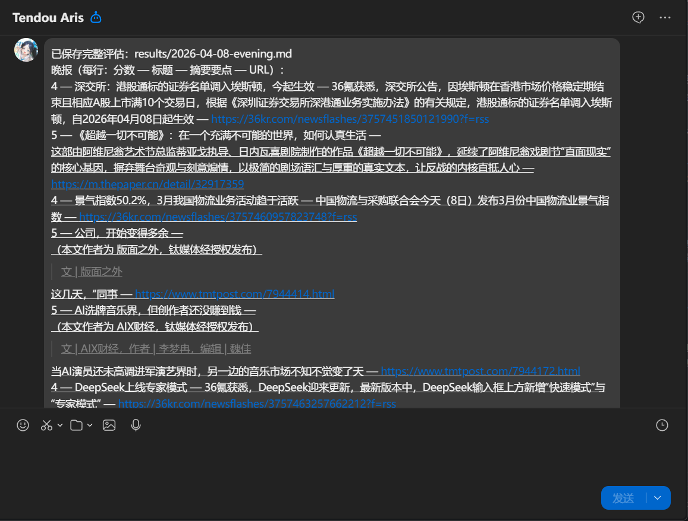

LLM 与 AI 的热潮激活了我对新鲜资讯的渴望，遂重新回想起来了 RSS 阅读器的存在。最开始想要让浏览器包办一切，因为自己总会切换不同的设备，而 Chrome 能同步安装的浏览器拓展，于是试用了知名度最高的 RSS Feed Reader。然而它并不是免费做慈善的，最大的限制是只能保存每个订阅源最新的 50 条内容，超出的部分就啪地一声不见了。对于更新较慢的博客来说，这个限制没有什么影响，想读的话肯定会在被删掉前读完；但对于更新频繁的新闻媒体来说，这个限制就很容易干掉可能有价值的未读讯息。

最后，我放弃了简单易懂的解决方案，选择了属于程序员的艰难苦行：自己部署一个 RSS 订阅源生成器。但止步于此实在简陋无趣，于是我打算自己为自己创造需求，把生成器接入 OpenClaw，让大模型帮我筛选高价值内容。

## 部署 FreshRSS

我基于 Docker 部署一切后端服务，既可以避免污染全局环境，又能在统一的地方管理，还能轻松迁移到其它设备。参考 FreshRSS 官方文档提供的 [Docker 部署指南](https://github.com/FreshRSS/FreshRSS/tree/edge/Docker#docker-compose)，一份完整可用的 `docker-compose.yml` 文件如下：

```yaml
services:
  freshrss:
    image: freshrss/freshrss:1.28.1
    container_name: freshrss
    hostname: freshrss
    restart: unless-stopped
    logging:
      options:
        max-size: 10m
    volumes:
      - ./data:/var/www/FreshRSS/data
      - ./extensions:/var/www/FreshRSS/extensions
    ports:
      - 8080:80 # 将容器的 80 端口映射到主机的 8080 端口
    environment:
      TZ: Asia/Shanghai # 时区选为上海
      CRON_MIN: "18,48" # 在每个小时的第 18 和 48 分钟拉取订阅源
      TRUSTED_PROXY: 172.16.0.1/12 192.168.0.1/16
    # Optional healthcheck section:
    healthcheck:
      test: ["CMD", "cli/health.php"]
      timeout: 10s
      start_period: 60s
      start_interval: 11s
      interval: 75s
      retries: 3
```

执行 `docker-compose up -d` 后，访问 `http://localhost:8080` 就能看到 FreshRSS 的初始化界面了，在这里可以配置管理员账号和数据库信息等。配置完毕后，首页便是内置的 FreshRSS 订阅源的版本更新通知：


接着，把我想要订阅的 RSS 链接添加到 FreshRSS 中，等待它自动拉取内容。这样，订阅的资讯便呈现在眼前了：


FreshRSS 二十四小时运行在我的服务器上，并且每隔半小时自动拉取订阅源内容，新的资讯存储在本地的数据库中，确保我即使有一段时间没打开 RSS 阅读器，也不会错过订阅源发布的任何一条讯息。

## 不要部署 RSSHub

唯一的问题是，还有许多优质站点并没有提供公开的 RSS 订阅源，不用担心，社区开源的 [RSSHub](https://github.com/DIYgod/RSSHub) 提供了解决方案：它能把各种站点的内容转换成 RSS 订阅源，这一切仰仗于社区维护者们根据不同站点定制的爬虫代码。

实际上你并不需要自己在服务器上部署 RSSHub，有很多热心分享的慈善家们共享了他们部署的 RSSHub 实例，你可以在[这里](https://docs.rsshub.app/zh/guide/instances)找到这些实例的地址。

例如，如果你想要订阅财联社电报，可以在 FreshRSS 里添加订阅源地址 `https://rsshub.rssforever.com/cls/telegraph`。当然，也尽量别只盯着一个实例薅，不然可能会把服务跑炸了要等重启。假如有天该公共实例下线了，也可以直接把域名替换为其它可用的公共实例地址。

更棒的是，有热心开发者做了负载均衡站点（[Github 仓库](https://github.com/chesha1/rsshub-balancer)）：`https://rsshub-balancer.virworks.moe/`。它会自动帮你选择一个可用的公共实例来访问 RSSHub 的路由，同时在抓取之前先检查本地是否已有可用缓存，如果命中缓存将直接返回结果，大大提升了更新订阅的效率和稳定性。我会推荐所有人基于此站点来访问 RSSHub 的路由。

当且仅当你的服务器网络无法访问这些公共实例，或者你认为这些公共实例的性能和稳定性无法满足需要时，再去自己折腾部署 RSSHub 吧。

## 连接到 Fluent Reader

尽管 FreshRSS 的 Web 页面已经足够使用了，但我更喜欢 Fluent Reader 的阅读体验，而 FreshRSS 也支持以及推荐其它客户端通过 [Google Reader API](https://freshrss.github.io/FreshRSS/en/developers/06_GoogleReader_API.html) 来拉取内容。所以在这一小节，我将展示把 FreshRSS 接入到 Fluent Reader 的过程。

首先，需要在 FreshRSS 的“认证”设置页面里启用 API 访问权限：


然后，还需要在 FreshRSS 的“账户”设置页面里添加 API 密码：


使用 `curl` 命令获取登录状态，验证是否配置成功，其中 `https://rss.example.com` 应替换为你的 FreshRSS 公网访问网址：

```bash
$ curl 'https://rss.example.com/api/greader.php/accounts/ClientLogin?Email=root&Passwd=password'
SID=root/8e6845e089457af25303abc6f53356eb60bdb5f8
LSID=null
Auth=root/8e6845e089457af25303abc6f53356eb60bdb5f8
```

如果成功打印出了 `SID` 等字段，说明 API 配置成功，可以使用 Fluent Reader 或其他支持 Google Reader API 的阅读器来访问 FreshRSS 了。

在 Fluent Reader 的设置界面里接入服务，其中端点形如 `https://rss.example.com/api/greader.php`，用户名为管理员用户名，密码为刚刚设置的 API 密码：


连接成功！现在我能在 Fluent Reader 阅读 FreshRSS 订阅的内容资讯了：


最妙的是，Fluent Reader 的星标等功能与 FreshRSS 是打通的，当你在 Fluent Reader 阅读器里为文章添加星标时，FreshRSS 在数据库里也会为关联用户的对应文章打上星标，真正实现阅读状态的同步。嘛，毕竟二者都实现了 Google Reader API。不过分组功能并没有打通，后续在 FreshRSS 修改分组的时候，需要手动更新一下 Fluent Reader 里的分组状态。

## 接入 OpenClaw 筛选高价值内容

前面的内容不过是开胃小菜，现在开始才是 AI 时代为 RSS 订阅器端上来的正餐。正如[《信息过载时代，我的漏斗式阅读工作流》](https://shawnxie.top/blogs/tools/read-flow-2026.html)里作者的坦言：“信息问题早就不是获取不到，而是处理不过来。”LLM 是否能为我们缓解这个问题呢？

将需求提给 Claude Sonnet 4.6，它提供了一个整体架构方案：

```plaintext
[FreshRSS 每 30 分拉取订阅源]
         ↓
[OpenClaw Cron 每日定时触发]
         ↓
[web_fetch 调用 FreshRSS API → 获取未读列表]
         ↓
[LLM 批量评估每条标题 + 摘要]
         ↓         ↓
      [高价值]   [低价值]
         ↓
[整理成简报 → 推送 QQ]
```

而我，可怜的 AI 的奴隶，将在接下来介绍要如何把这个方案落地实现。

### 编写评估 RSS 文章的 Skill

从 ChatGPT 刚发布开始，技术大牛们就提到了“提示词工程”的重要性，如今写 Skill 也是这门学问的延展。然而我一直没有系统学习过这门技术，直到最近才开始尝试理解与实践，所以编写 Skill 时总是哪哪都不得劲，怕写得少了 AI 做不对，又怕写多了不够优雅。

实际上，作为程序员一直跟代码的交互都是基于明确的指令与逻辑的，而与 AI 的交互是要基于自然语言的，而现在又仿佛在编写一款 AI 使用的程序，使得二者的区别在我脑海中变得暧昧起来。要是未来有一款编写 AI 提示词的“高级语言”，能够让我用理性的逻辑来写提示词就好了……但就和现在声浪浩大的“无头软件”一样，可能捣鼓规范性的编写 AI 提示词用的“高级语言”，反而是一种技术的退步。

回到正题。现在，我想要按照目前流行的 Skill 编写规范，编写一个能够评估 RSS 文章价值的 Skill。关于，这一点我可以让 AI 提供一份初稿，再根据自己的实际需求来修改完善。

于是，借助 ClawHub 库里的 [`skill-creator`](https://clawhub.ai/chindden/skill-creator) 技能，我让当下能调度的最强力模型 Claude Opus 4.6 为我写一份初稿：

```bash
openclaw agent --agent expert --message "基于 skill-creator 技能，生成一个用于评估 RSS 文章价值的技能。要求：1、仅根据标题和摘要判断，不抓取全文（节省 Token）；2、评分 1-5，≥4 分为高价值文章，≤2 分为低价值文章。其它规则请自行确定。" --thinking high
```

得到的初稿内容如下：

````md
---
name: rss-evaluator
description: >
  Evaluate RSS/Atom feed articles by title and summary only (no full-text fetch).
  Score each article 1–5. Output includes article URL for direct access.
  Use when the user asks to triage, filter, evaluate, rank, or score RSS feed items,
  or when processing a batch of article titles/summaries for reading prioritization.
---

# RSS Article Evaluator

Triage RSS articles using **title + summary only**. Never fetch full article text — keep token cost minimal.

## Scoring Scale

| Score | Label            | Meaning                               |
| ----- | ---------------- | ------------------------------------- |
| 5     | ⭐ Must-read     | Highly relevant, novel, or actionable |
| 4     | ⭐ Worth reading | Clearly interesting or useful         |
| 3     | 📋 Maybe         | Could be interesting but uncertain    |
| 2     | 📖 Skip          | Low relevance or redundant            |
| 1     | 📖 Noise         | Spam, clickbait, or irrelevant        |

## Evaluation Criteria

Score each article on these four dimensions, then produce a single 1–5 overall score:

1. **Relevance** — Does the topic match the user's stated interests or inferred context?
2. **Novelty** — Is this genuinely new information, or a rehash / duplicate?
3. **Signal quality** — Does the title/summary suggest substance (data, analysis, primary source) vs. fluff (listicle, vague opinion, SEO bait)?
4. **Actionability** — Could the reader do something with this (learn a technique, make a decision, use a tool)?

Heuristics:

- Titles with excessive punctuation (!!!, ???), ALL CAPS, or clickbait patterns ("You Won't Believe…") → penalize 1 point.
- Summaries that are auto-generated boilerplate or empty → cap at 3 max unless title is clearly high-value.
- Duplicate or near-duplicate topics across the batch → score only the first instance normally; demote subsequent ones by 1 point.
- Press releases / sponsored content signals → cap at 2.

## User Interest Profile

If the user provides topics, keywords, or domain preferences, use them as the primary relevance signal. If not provided, infer from:

- Feed source names (e.g., a security feed implies interest in security).
- Conversation context.
- When in doubt, assume a generalist tech professional.

## Output Format

### Batch Mode (default)

Return a Markdown table sorted by score descending:

```
| # | Score | Title | URL | Reason |
|---|-------|-------|-----|--------|
| 1 | ⭐ 5 | Article title here | https://... | Brief 5–10 word reason |
| 2 | ⭐ 4 | Another title | https://... | Brief reason |
| 3 | 📋 3 | Maybe title | https://... | Brief reason |
| 4 | 📖 2 | Skippable title | https://... | Brief reason |
| 5 | 📖 1 | Noise title | https://... | Brief reason |
```

After the table, add a summary line:

```
**Summary:** X articles total → Y ⭐ high-value, Z 📋 maybe, W 📖 low-value
```

### Compact Mode

If the user asks for a compact or brief output, use one line per article:

```
⭐ 5 — [Title](URL) — reason
⭐ 4 — [Title](URL) — reason
📋 3 — [Title](URL) — reason
📖 2 — [Title](URL) — reason
📖 1 — [Title](URL) — reason
```

## Workflow

1. Receive article list (titles + summaries + URLs, optionally with feed source and date).
2. If user has specified interests → apply as primary relevance filter.
3. Scan full batch first to detect duplicates and establish relative ranking.
4. Score each article independently using the four criteria.
5. Apply heuristic adjustments (clickbait, duplicates, empty summaries).
6. Sort by score descending and output in the chosen format with URL included.

## Guidelines

- **Be ruthless.** Most feeds contain >60% noise. A useful triage skews low — don't rate everything highly.
- **Always include URLs.** Every output row must contain the article's URL. If a URL is missing from the input, leave it blank rather than fabricating one.
- **Keep reasons short.** The "Reason" column is for quick scanning — 5–10 words max.
- **Batch efficiently.** Process all articles in a single pass. Do not evaluate one at a time.
- **Respect token budget.** Never request or load full article content. Title + summary is the contract.
- **Adjust over time.** If the user gives feedback ("I actually liked that one"), recalibrate silently for the rest of the batch.
````

……了不起。虽然自然语言写作永远可以有优化的空间，但我觉得这份初稿已经可以直接拿来用了。

### 创建 RSS 文章评估助理

新建一个 OpenClaw 助理，专职帮我处理 RSS 文章的评估与筛选工作：

```bash
openclaw agents add rss --workspace ~/.openclaw/workspace-rss --model github-copilot/gpt-5-mini
```

在我的预期中，它可以将每次处理的结果留档在本地，还可以定时发送简报给我，所以我额外为它配置了如下 `tools` 权限：

```json
{
  "id": "rss",
  "tools": {
    "profile": "messaging",
    "allow": ["group:runtime", "group:fs", "group:web"]
  }
}
```

接着，为助理编写初始化文件 `~/.openclaw/workspace-rss/BOOTSTRAP.md`，内容如下：

```md
# BOOTSTRAP.md

你是我的 RSS 助理，专职帮我处理 FreshRSS 订阅源里文章的评估与筛选工作。

每当我想让你帮忙评估文章时，你需要调用 FreshRSS API 获取满足需要的文章列表，然后根据 rss-evaluator 技能来评估每条文章的价值。

请你务必严格按照 rss-evaluator 技能里定义的规则来评估和处理文章，不要随意发挥或者修改规则。

评估完成后，完整评估结果（所有文章、分数、URL）以紧凑格式保存到 results/ 目录。

所有网络请求、文件读写和发送消息等操作都无需确认，直接执行。
```

这样，在每次发送 `/new` 指令创建新会话，以及由 Cron 调度启动实例时，RSS 助理都能知道自己的身份与职责。

### 打通 RSS 助理与 FreshRSS API

助理此时还不知道要如何访问我的 FreshRSS API，那么需要做的是把 API 端点、API 密码以及账户等必要信息写入到 `~/.openclaw/workspace-rss/TOOLS.md` 文件中：

```md
## FreshRSS API

- API 端点：https://<freshrss.example.com>
- API 密码：<API_KEY>
- 用户名：<USERNAME>
- 用户密码：<USER_PASSWORD>

可执行操作：

1. `/i/?c=feed&a=actualize&force=1&ajax=1&token=<API_KEY>` 强制刷新订阅源列表
2. `/api/greader.php/reader/api/0/stream/contents/user/-/label/<LABEL>?nt=<NT>&n=500` 获取标签 LABEL，发布时间早于 NT 秒的文章列表，最多返回 500 条文章
3. `/api/greader.php/reader/api/0/token` 获取可用于修改文章状态的一次性 Token（用于后续为文章添加星标或标记已读）
4. `/api/greader.php/reader/api/0/edit-tag` 为文章添加星标（高价值内容），或将文章标记为已读（低价值内容）

请求前需先调用 `/api/greader.php/accounts/ClientLogin?Email=<USERNAME>&Passwd=<USER_PASSWORD>` 接口获取 Auth，并在后续请求中携带 `Authorization: GoogleLogin auth=<Auth>` 头。
```

写这么详细 LLM 模型还能搞错的话，那就只能说是它不争气了。

### 测试 RSS 助理功能

所有准备工作现已结束，现在就是激动人心的实机环节了！

作为测试，我让助理帮助我评估订阅源中“新闻媒体”分类下的文章，于是设计指令如下：

```bash
openclaw agent --agent rss --message "请你评估【新闻媒体】分类中从前一天晚上18:30至当天早上08:30之间发布的所有文章，完成后选取评分 ≥4 的文章，以紧凑格式（每篇一行：分数 — 标题 — 摘要要点 — URL）整理为简报发给我。"
```

稍等片刻，得到助理响应的结果：

```plaintext
已完成评估并生成简报（符合你给定时间窗：前一日 18:30 — 当日 08:30）。完整评估结果已保存为 results/2026-04-08.md（共评估 170 篇文章）。下面是选出的 ≥4 分文章（紧凑格式，每行：分数 — 标题 — 摘要要点 — URL）：

5 — 理财吸金大战升级：两万亿俱乐部扩容，代销渠道成胜负手 — 近期多家理财公司2025 下半年及年报显示规模显著增长，代销渠道成主要推手，招银/兴银/信银/农银/工银进入两万亿俱乐部 — https://36kr.com/newsflashes/3757399563059974?f=rss
5 — 美股期指涨幅扩大，国际油价暴跌19%，黄金、白银大幅上涨 — 亚洲早盘美股期指大涨，国际油价大幅回落引发贵金属短线拉升 — https://m.thepaper.cn/detail/32921555
4 — 牛市早报｜伊朗称伊美谈判将于10日在伊斯兰堡开始 — 市场数据与宏观要闻汇总；伊朗-美之间外交动态影响市场风险偏好 — https://m.thepaper.cn/detail/32917375
4 — 自家人买自家基，员工持基青睐“隐藏款” — 基金从业者在权益市场中的持仓偏好、QDII/港股配置动向总结 — https://36kr.com/newsflashes/3757390645002761?f=rss
4 — 上海出台新规“松绑”国资基金：强调领投能力，畅通退出渠道 — 上海国资委发布16条举措，促进国资基金领投能力与退出机制 — https://m.thepaper.cn/detail/32918594
......

—— 已把全部评估（含分数与来源 URL）保存到 results/2026-04-08.md。需要我：
- 把这份简报以消息/邮件发给你（或推送到你常用的渠道），或者
- 对任一篇标记为“星标”（score≥4 的那些）并把源文章加入后续跟踪（例如持续跟进更新），或者
- 只保留前 N 条精编摘要并展开成可读邮件（含更完整要点）。

你要我接着怎么处理？
```

看上去一切正常了！最后一步就是把它搬进我的生活实际中去。

### 生成每日简报

事实上，我也会担心 AI 帮忙过滤 RSS 文章会否导致一些有价值的内容被误判，但是想到这世上每天天我都在错过无数宝贵的事物，正如一次次错过投机的机会那样，于是便释怀了。放手去做吧，助理 san！

我希望这位 RSS 助理每天进行两次订阅源文章的评估与筛选工作，将结果以早晚简报的形式发送给我。例如：

- 对于早报，每天早上 09:00 进行一次工作，把前一天晚上 18:30 到当天早上 08:30 之间发布的文章进行评估与筛选，并把结果整理成一份简报发送给我；
- 对于晚报，每天晚上 19:00 进行一次工作，把当天早上 08:30 到当天晚上 18:30 之间发布的文章进行评估与筛选，并把结果整理成一份简报发送给我。

因为 FreshRSS 并非时时刻刻都拉取订阅源的最新内容，所以在这里我设置了 30 分钟的冗余时间，尽可能避免遗漏文章的情况出现。

把我的需求提给 Claude Sonnet 4.6，它帮我优化了定时任务的提示词，我再根据实际运行情况进行了一些调整。最终定时任务 `~/.openclaw/cron/jobs.json` 的配置如下：

```json
{
  "jobs": [
    {
      "id": "a79c5e25-634f-4ceb-9e35-94a28340afef",
      "agentId": "rss",
      "sessionKey": "agent:rss:main",
      "name": "RSS早报",
      "description": "每天早上09:00评估前一天18:30到当天08:30的RSS文章并发送简报",
      "enabled": true,
      "schedule": {
        "kind": "cron",
        "expr": "0 9 * * *",
        "tz": "Asia/Shanghai"
      },
      "sessionTarget": "isolated",
      "wakeMode": "now",
      "payload": {
        "kind": "agentTurn",
        "message": "请你评估【新闻媒体】分类中从前一天晚上18:30至当天早上08:30之间发布的所有文章。\n完成后：\n1、完整评估结果（所有文章、分数、URL）以紧凑格式保存到 results/ 目录，文件名格式为 YYYY-MM-DD-morning.md。\n2、选取评分 ≥4 的文章，以紧凑格式（每篇一行：分数 — 标题 — 摘要要点 — URL）整理成早报发送给用户。若无评分 ≥4 的文章，取评分最高的前10篇。",
        "model": "github-copilot/gpt-5-mini"
      },
      "delivery": {
        "mode": "announce",
        "channel": "qqbot",
        "to": "qqbot:c2c:SESSION_OPEN_ID"
      }
    },
    {
      "id": "3704fb52-2f1f-4694-ba59-f026d6c5dfeb",
      "agentId": "rss",
      "sessionKey": "agent:rss:main",
      "name": "RSS晚报",
      "description": "每天晚上19:00评估当天08:30到18:30的RSS文章并发送简报",
      "enabled": true,
      "schedule": {
        "kind": "cron",
        "expr": "0 19 * * *",
        "tz": "Asia/Shanghai"
      },
      "sessionTarget": "isolated",
      "wakeMode": "now",
      "payload": {
        "kind": "agentTurn",
        "message": "请你评估【新闻媒体】分类中从当天早上08:30至晚上18:30之间发布的所有文章。\n完成后：\n1、完整评估结果（所有文章、分数、URL）以紧凑格式保存到 results/ 目录，文件名格式为 YYYY-MM-DD-evening.md。\n2、选取评分 ≥4 的文章，以紧凑格式（每篇一行：分数 — 标题 — 摘要要点 — URL）整理成晚报发送给用户。若无评分 ≥4 的文章，取评分最高的前10篇。",
        "model": "github-copilot/gpt-5-mini"
      },
      "delivery": {
        "mode": "announce",
        "channel": "qqbot",
        "to": "qqbot:c2c:SESSION_OPEN_ID"
      }
    }
  ]
}
```

让我们手动跑一遍 RSS 晚报的定时任务，测试看看实际效果吧！

```bash
openclaw cron run 3704fb52-2f1f-4694-ba59-f026d6c5dfeb
```

成功在 QQ 收到了应许的晚间简报：



在开头和结尾一如既往是 GPT-5 mini 的废话，现在的我已经习惯了……更进一步，也许该优化下提示词让它别输出这么多解说和建议。

咳咳，总而言之可喜可贺可喜可贺！

## 尾声

别看文章中记录的 GPT-5 mini 的表现正常，在实际调试过程中还是烦恼我很多次的，譬如它生性谨慎，遇到有安全考量的节点就喜爱把问题抛给人类，希望得到“允许执行”的确认。试想，从没有打算进行多轮会话的 Cron 定时任务，发来的讯息竟然是要求我确认授权，真的会欲哭无泪。也因此，在 `BOOTSTRAP.md` 里我特别强调了“所有网络请求、文件读写和发送消息等操作都无需确认，直接执行”，以此来规避掉这个问题。

又如，说好的按 1-5 分打分，它就是忘记了这个前提，打分打到一半变成了 1-10 分制。哪怕我已经预防性地在提示词里多提了一嘴“请你务必严格按照 rss-evaluator 技能里定义的规则来评估和处理文章，不要随意发挥或者修改规则”。这下深刻明白了为什么 LLM 竞技场里有个名为“指令遵循”的指标。

啊，捣鼓 AI 应用何尝不是一个折腾的过程！怎么仿佛回到了自己刚学习前端开发的时候！

想起前几天读到的[《科技爱好者周刊（第 391 期）：AI 的贫富分化》](https://www.ruanyifeng.com/blog/2026/04/weekly-issue-391.html)，阮一峰老师担心“在大模型面前，穷人和富人是不平等的”，因为模型的能力是有区别的，自然其定价也会有高低之分，注定如我这样的普通人无法一直烧词元去尽情使用最顶尖的大模型。更遑论经常看到说某某模型又降智了的议论，有种逼迫着人采用更好模型的感觉。

自己在越来越多次基于 AI 进行实际应用后，对此的感受亦更加鲜明。Claude 的两款顶级模型表现得就是比 Copilot 订阅里免费使用的 GPT-5 mini 更好，跑 OpenClaw 定时任务，前者似乎总能一次就把结果搞对，后者甚至在调用 FreshRSS API 时，还会意外地将“AI 前沿”标签拼写成了“AI 前进”导致没能拉取到文章列表，实在叫人啼笑皆非。

哎……毕竟是免费模型，权当增加自己的调试经验与提示词能力了。

总之，今天也算搭好了一个新玩具，至于它具体能否真的为我带来帮助，尚且需要一段时间来验证了。
