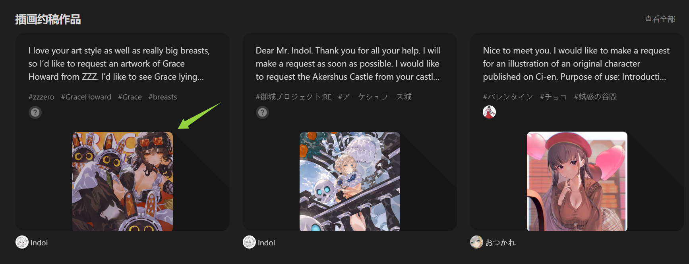
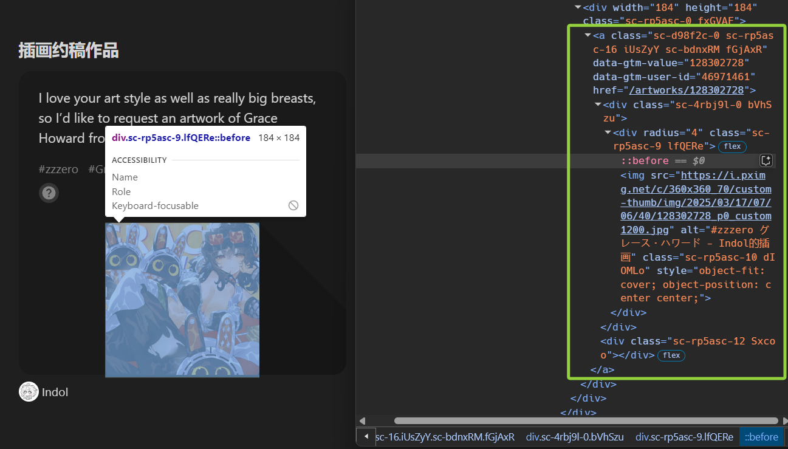
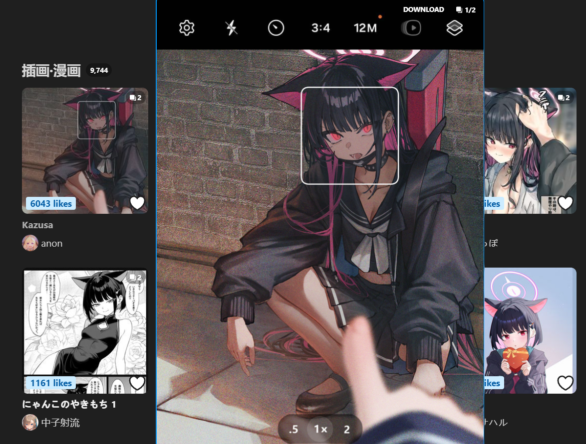
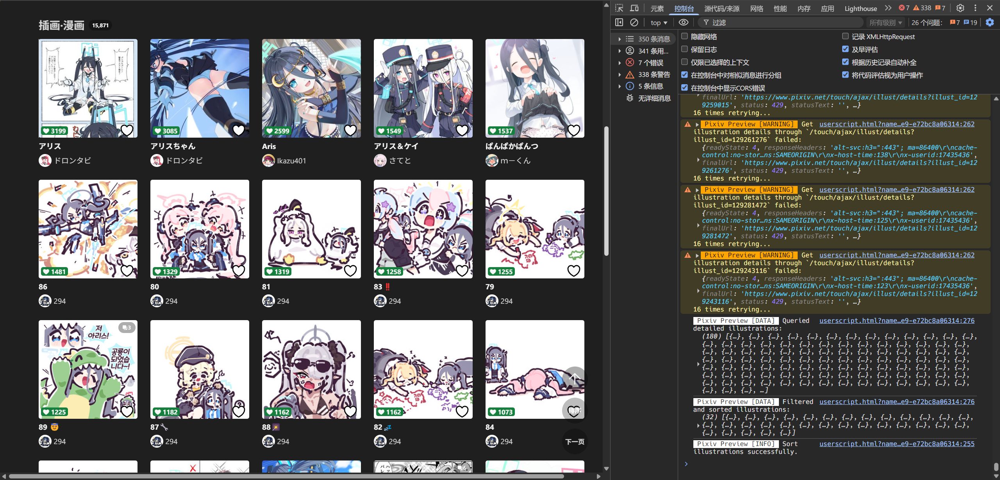

笔者的业余爱好之一就是逛 Pixiv，收藏好看的插画等作品并下载到本地。油猴脚本 Pixiv Previewer 做了两个笔者很喜欢的便利性工作：

1. **作品预览**：鼠标悬浮在作品缩略图上时自动在当前页面显示大图，快速决定要不要点进作品页。
2. **作品排序**：作品搜索页可以按“排序”按钮，自动获取若干页的作品并按照收藏数排序，快速筛选优质作品。

出于爱好，笔者去[脚本仓库](https://github.com/Ocrosoft/PixivPreviewer)翻阅了一下源码，觉得有一些可以改进的地方，遂 Fork 之，进行二次开发。

## 工程化改造

首当其冲的自然是前端项目工程化改造。大多数油猴脚本仓库都是孤零零的一个 JavaScript 文件，Pixiv Previewer 也不例外。直接手搓 JavaScript 虽然很便利，但在项目长期的维护开发中多半会掩埋掉许多未曾留意的 Bug，同时由于缺少关联提示，开发效率也会大打折扣。作为前端工程师，这样可怕的事情自然是不能接受的。

### 通过 tsup 构建项目

初始化 `package.json` 等过程跳过不表，添加 TypeScript 支持自然是对项目进行二次开发的前置步骤。由于我们最后构建的产物将作为油猴脚本运行，即打包为库，因此笔者选择了开箱即用的 [tsup](https://github.com/egoist/tsup)：

```bash
yarn add -D tsup
```

添加 tsup 的配置文件 `tsup.config.ts`：

```ts
import svg from "esbuild-plugin-svg";
import { defineConfig } from "tsup";

import packageJson from "./package.json";

export default defineConfig({
  entry: ["src/index.ts"],
  target: ["chrome107"],
  minify: false,
  splitting: false,
  clean: true,
  platform: "browser",
  esbuildPlugins: [svg()], // 为了正确处理项目中用到的 SVG 文件，添加了此插件
  env: {
    VERSION: packageJson.version,
  },
  banner: {
    js: `// ==UserScript==
// @name                Pixiv Previewer L
// @namespace           ${packageJson.homepage}
// @version             ${packageJson.version}-${new Date().toLocaleDateString()}
// @description         ${packageJson.description}
// @author              ${packageJson.author}
// @license             ${packageJson.license}
// @supportURL          ${packageJson.homepage}
// @match               *://www.pixiv.net/*
// @grant               GM_getValue
// @grant               GM_setValue
// @grant               GM_registerMenuCommand
// @grant               GM_unregisterMenuCommand
// @grant               GM.xmlHttpRequest
// @icon                https://t0.gstatic.com/faviconV2?client=SOCIAL&type=FAVICON&fallback_opts=TYPE,SIZE,URL&size=32&url=https://www.pixiv.net
// @icon64              https://t0.gstatic.com/faviconV2?client=SOCIAL&type=FAVICON&fallback_opts=TYPE,SIZE,URL&size=64&url=https://www.pixiv.net
// @require             https://update.greasyfork.org/scripts/515994/1478507/gh_2215_make_GM_xhr_more_parallel_again.js
// @require             http://code.jquery.com/jquery-3.7.1.min.js
// @run-at              document-end
// ==/UserScript==`,
  },
});
```

上面的配置表示，tsup 将打包构建源文件 `src/index.ts` 至默认产物文件 `dist/index.js`，保证兼容 `Chrome >= 107`。其中，笔者复用了 `package.json` 里定义的若干字段，用于添加项目环境变量（脚本通过版本号判断是否显示更新日志框），以及生成油猴脚本顶部的配置项。

这样，当执行 `tsup` 命令时，构建的产物形如：

```js
// ==UserScript==
// @name                Pixiv Previewer L
// @namespace           https://github.com/LolipopJ/PixivPreviewer
// @version             1.1.1-2025/4/25
// @description         Original project: https://github.com/Ocrosoft/PixivPreviewer.
// @author              Ocrosoft, LolipopJ
// @license             GPL-3.0
// @supportURL          https://github.com/LolipopJ/PixivPreviewer
// @match               *://www.pixiv.net/*
// @grant               GM_getValue
// @grant               GM_setValue
// @grant               GM_registerMenuCommand
// @grant               GM_unregisterMenuCommand
// @grant               GM.xmlHttpRequest
// @icon                https://t0.gstatic.com/faviconV2?client=SOCIAL&type=FAVICON&fallback_opts=TYPE,SIZE,URL&size=32&url=https://www.pixiv.net
// @icon64              https://t0.gstatic.com/faviconV2?client=SOCIAL&type=FAVICON&fallback_opts=TYPE,SIZE,URL&size=64&url=https://www.pixiv.net
// @require             https://update.greasyfork.org/scripts/515994/1478507/gh_2215_make_GM_xhr_more_parallel_again.js
// @require             http://code.jquery.com/jquery-3.7.1.min.js
// @run-at              document-end
// ==/UserScript==

// ... 脚本构建后的代码
```

在默认情况下，tsup 会使用预设的 `tsconfig.json`。但笔者在开发过程中，发现 VSCode 有时会遗漏某些类型的定义，于是手动添加了 `tsconfig.json` 在根目录：

```json
{
  "compilerOptions": {
    "target": "ES2022",
    "module": "esnext",
    "esModuleInterop": true,
    "moduleResolution": "bundler",
    "skipLibCheck": true,
    "forceConsistentCasingInFileNames": true,
    "lib": ["esnext", "dom"]
  },
  "include": ["src/"],
  "exclude": ["node_modules/", "dist/"]
}
```

### 代码质量检查与格式化工具

TypeScript 自身已包含类型检查等能力，但还可以引入更多质量检查的通用规范，提升项目的健壮性。对于 TypeScript 项目，目前来看最好的选择应当是 [`typescript-eslint`](https://github.com/typescript-eslint/typescript-eslint)，参考官方文档添加依赖并配置 `eslint.config.mjs`：

```bash
yarn add --dev eslint @eslint/js typescript typescript-eslint
```

```js
// @ts-check

import eslint from "@eslint/js";
import tseslint from "typescript-eslint";

export default tseslint.config(
  eslint.configs.recommended,
  tseslint.configs.recommended,
);
```

现在执行 `eslint src --fix` 即可查找并尝试修复 `src/` 目录下所有文件的质量问题。

接着为项目添加自动格式化能力，Prettier 是笔者最推荐的选项。此外，笔者喜欢将 Prettier 与 ESLint 结合起来一起使用，即在执行 `eslint src --fix` 修复质量问题的同时，自动格式化代码。ESLint 的插件 [`eslint-plugin-prettier`](https://github.com/prettier/eslint-plugin-prettier) 可以实现如上能力，添加此插件作为依赖并进一步配置 `eslint.config.mjs`：

```bash
yarn add -D prettier eslint-plugin-prettier eslint-config-prettier
```

```js
// @ts-check

import eslint from "@eslint/js";
import tseslint from "typescript-eslint";
import eslintPluginPrettierRecommended from "eslint-plugin-prettier/recommended";

export default tseslint.config(
  eslint.configs.recommended,
  tseslint.configs.recommended,
  eslintPluginPrettierRecommended,
);
```

此外，Pixiv Previewer 项目依赖于 JQuery 来执行查找与修改 DOM 的操作，笔者添加了相应的类型提示：

```bash
yarn add -D @types/jquery globals
```

```js
// @ts-check

import eslint from "@eslint/js";
import tseslint from "typescript-eslint";
import eslintPluginPrettierRecommended from "eslint-plugin-prettier/recommended";
import globals from "globals";

export default tseslint.config(
  eslint.configs.recommended,
  tseslint.configs.recommended,
  {
    languageOptions: {
      globals: {
        ...globals.browser,
        ...globals.jquery,
      },
    },
  },
  eslintPluginPrettierRecommended,
);
```

至此，基本的项目工程化改造告一段落。项目可以基于 TypeScript 开发，并且拥有了质量检查和格式化能力。将原来的 JavaScript 代码放到 `src/index.ts` 文件里，开始正式的二次开发吧！

## 预览功能优化

笔者在阅读 Pixiv Previewer 源码时发现，原作者根据当前页面的不同，实现了不同的通过 DOM 节点寻找可预览作品的 `` 标签的方法，并为它添加监听事件，当鼠标悬浮在上面的时候显示预览。为了应对作品动态加载的情况，脚本设置了循环定时器，每隔一小段时间重新执行上述方法。

这种力大砖飞的实现方案存在一个不可忽视的缺陷：要考虑到每个页面里不同的作品 `` 标签的排布情况，为之实现绑定事件的方法。对于没有考虑到的作品 `` 标签，自然无法显示预览。例如，在当前的 `Pixiv Previewer@3.7.32` 版本，艺术家弹窗里最近的作品就无法显示预览：



另外，如果 Pixiv 前端页面某一天迭代更新，寻找作品 `` 标签的方法也可能需要大刀阔斧地修改。

> 发布这篇博客的第二天，2025 年 03 月 18 日，Pixiv 就上线了新的首页，“推荐作品”模块的下面变成了无限滚动的推文模式。由于推文存在高度上限，因此部分尺寸的图片还是会出现显示不全的情况，可以添加预览功能。

笔者想到的改进方案是：把找作品 `` 标签的工作，从脚本手中移交到用户手中。即监听鼠标移动事件，当悬浮到可预览作品上时，显示预览。

```ts
const onMouseMove = (mouseMoveEvent: JQuery.MouseMoveEvent) => {
  onMouseOverIllust(mouseMoveEvent.target);
};

$(document).on("mousemove", onMouseMove);
```

在上面的代码里，笔者为 Document 全局绑定了 `mousemove` 监听事件，当鼠标移动时，调用 `onMouseOverIllust(target)` 方法，其中 `target` 是当前鼠标所悬浮的元素。如果监听的是 `mouseover` 事件，脚本可以有更好的性能表现，但是笔者在测试过程中，发现 `mouseover` 事件回调对象里的 `ctrlKey` 等值有时不能正确反映实际状态，所以这里选择了监听 `mousemove` 事件。

接着，需要判断鼠标当前悬浮的元素是否为可预览的作品，如果是则显示预览。观察 DOM 节点：



如果当前鼠标悬浮在可预览的作品 `` 元素上，则本身包含了访问链接的 `src` 属性，通过简单的正则表达式处理即可获取作品的 Pixiv ID 和大图链接。同时，外层还包裹着一层 `<a>` 元素，包含跳转链接。

考虑到部分 `` 元素虽然包含作品缩略图的 `src` 属性，但跳转的页面并不一定是作品页本身（`https://www.pixiv.net/artworks/artwork-id`），即可能只是作为封面打开别的页面，鼠标悬浮在这些 `` 元素上时不应当显示预览。因此笔者实现的判断方法是：统一取当前悬浮元素的第一个父 `<a>` 节点，当其 `href` 值满足 `/\/artworks\/(\d+)/` 时，显示预览：

```ts
const getIllustMetadata = (target: JQuery<HTMLElement>) => {
  let imgLink = target;
  while (!imgLink.is("A")) {
    imgLink = imgLink.parent();

    if (!imgLink.length) {
      return null;
    }
  }

  const illustHref = imgLink.attr("href");
  const illustHrefMatch = illustHref?.match(/\/artworks\/(\d+)/);
  if (!illustHrefMatch) {
    return null;
  }
  const illustId = illustHrefMatch[1];

  const ugoiraSvg = imgLink.children("div:first").find("svg:first");
  const illustType =
    ugoiraSvg.length || imgLink.hasClass("ugoku-illust")
      ? IllustType.UGOIRA // 动图作品
      : IllustType.ILLUST; // 插画或漫画作品

  return {
    /** 作品 ID */
    illustId,
    /** 作品类型 */
    illustType,
  };
};

const onMouseOverIllust = (target: JQuery<HTMLElement>) => {
  const { illustId, illustType } = getIllustMetadata(target) || {};
  previewIllust({ target, illustId, illustType });
};
```

插画或漫画作品可能存在多页，处理时可以始终调用 Pixiv 官方的接口 `/ajax/illust/${artwork-id}/pages`，获取指定作品包含的所有链接。

再修修补补，为事件加上节流函数，响应鼠标滚动切换页数等，实现了和原版并无二异的预览能力：



可喜可贺，可喜可贺！

## 排序功能重构与优化

原脚本的预览功能已经能够非常好地实现笔者需要的能力了，笔者想要在此基础上加入一些额外的能力或做一些优化。

其实最开始的原动力来自于原脚本在某次更新以后，排序功能突然变得很慢，过去笔者一次性喜欢排序 20 页作品再挑选喜欢的，现在却要先等个二十分钟，还可能“中道崩殂”。后面看公告才了解到，Pixiv 从某天开始对来自于同 IP 的请求进行了限制，如果短时间内超过了请求的上限，则会暂时屏蔽请求。这点对于 Pixiv 来说无可厚非，能大大缓解像笔者这样的服务器蛀虫的“攻击”。

于是便开始了本以为无限期的咕咕咕，但最近代码写得手感火热，想到了这个坑，就花了几天填一填。同时也多接触接触原生 DOM 操作等小知识，百利无一害。

### 请求作品分页

排序功能的本质就是同时请求多个分页，再获取每个作品的详细信息，最后在前端显示出来。下面以标签搜索结果的页面为例，实现排序功能。

对于不同的可排序页面，需要获取的要素有三：

- 请求分页的接口。
- 请求分页的参数。
- 作品的列表 DOM 节点。

使用观察法，在网络请求里找到分页的接口与默认的搜索参数：

```ts
function getSortOptionsFromPathname(pathname: string) {
  let type: IllustSortType;
  let api: string;
  let defaultSearchParams: string;

  let match: RegExpMatchArray;
  if (
    (match = pathname.match(/\/tags\/(.+)\/(artworks|illustrations|manga)$/))
  ) {
    const tagName = match[1];
    const filterType = match[2];

    switch (filterType) {
      case "artworks":
        type = IllustSortType.TAG_ARTWORK;
        api = `/ajax/search/artworks/${tagName}`;
        defaultSearchParams = `word=${tagName}&order=date_d&mode=all&p=1&csw=0&s_mode=s_tag_full&type=all&lang=zh`;
        break;
      case "illustrations":
        type = IllustSortType.TAG_ILLUST;
        api = `/ajax/search/illustrations/${tagName}`;
        defaultSearchParams = `word=${tagName}&order=date_d&mode=all&p=1&csw=0&s_mode=s_tag_full&type=illust_and_ugoira&lang=zh`;
        break;
      case "manga":
        type = IllustSortType.TAG_MANGA;
        api = `/ajax/search/manga/${tagName}`;
        defaultSearchParams = `word=${tagName}&order=date_d&mode=all&p=1&csw=0&s_mode=s_tag_full&type=manga&lang=zh`;
        break;
    }
  }

  return {
    type,
    api,
    searchParams: new URLSearchParams(defaultSearchParams),
  };
}
```

当用户在前端设置搜索条件的时候，搜索条件会自动追加到当前的 Search Params 上。脚本在处理的时候，也应该读取 Search Params，再与方法 `getSortOptionsFromPathname()` 得到的默认 `searchParams` 进行合并，让接口请求符合用户预期：

```ts
const url = new URL(location.href);
const { pathname, searchParams } = url;

const {
  type,
  api,
  searchParams: defaultSearchParams,
} = getSortOptionsFromPathname(pathname);

const mergedSearchParams = new URLSearchParams(defaultSearchParams);
searchParams.forEach((value, key) => {
  // 相同参数覆盖，不同参数追加
  mergedSearchParams.set(key, value);
});
```

接着，获取陈列作品的列表 DOM 节点：

```ts
function getIllustrationsListDom(type: IllustSortType) {
  let dom: JQuery<HTMLUListElement>;
  if (
    [
      IllustSortType.TAG_ARTWORK,
      IllustSortType.TAG_ILLUST,
      IllustSortType.TAG_MANGA,
    ].includes(type)
  ) {
    dom = $("ul.sc-ad8346e6-1.iwHaa-d");
  }

  if (dom) {
    return dom;
  } else {
    throw new Error(`Illustrations list DOM not found.`);
  }
}
```

Pixiv 的前端使用了 CSS Module 技术来生成样式名，能够有效避免同名样式冲突的问题。但是对于脚本开发者来说会增加一定的维护成本 —— 每次 Pixiv 的样式改变而重新构建样式文件时，需要手动更新脚本里对应的样式名，以正确找到目标节点。

因此在实现里，当脚本寻找节点失败时，会抛出一个错误，阻止脚本的继续运行。作为开发者，在碰到这样的问题时，就得赶紧更新脚本，或者想一想有没有更好的方式能定位此节点（例如搜索包含 60 个子元素的 `ul` 节点 🤔）。

### 获取作品详细信息

为了获取作品的收藏数据以排序，需要通过另外的接口获取作品的详细信息（如果请求分页的时候，响应值就把作品的收藏数带上就好了……）。

这里直接沿用了原作者使用的接口 `/touch/ajax/illust/details?illust_id=${id}`：

```ts
async function getIllustrationDetailsWithCache(id: string) {
  let illustDetails: IllustrationDetails =
    await getCachedIllustrationDetails(id);

  if (illustDetails) {
    iLog.d(`Use cached details for illustration ${id}`, illustDetails);
  } else {
    const requestUrl = `/touch/ajax/illust/details?illust_id=${id}`;
    const getIllustDetailsRes = await requestWithRetry({
      url: requestUrl,
      onRetry: (response, retryTimes) => {
        iLog.w(
          `Get illustration details through \`${requestUrl}\` failed:`,
          response,
          `${retryTimes} times retrying...`,
        );
      },
    });
    illustDetails = (
      getIllustDetailsRes.response as PixivStandardResponse<{
        illust_details: IllustrationDetails;
      }>
    ).body.illust_details;
  }

  cacheIllustrationDetails(illustDetails);

  return illustDetails;
}
```

在此基础上做了两个额外的工作。其一是缓存作品详细信息：对于发布时间超过 6 小时的作品，我们认为作品的收藏数变化率会趋于平稳，则将作品的详细信息缓存 12 小时。12 小时内再获取此作品的详细信息时，直接从 Indexed DB 里拿。省略 Indexed DB 初始化和错误处理等逻辑，核心实现如下：

```ts
/** 缓存数据表名称 */
const ILLUSTRATION_DETAILS_CACHE_TABLE_KEY = "illustrationDetailsCache";
/** 缓存过期时间 */
const ILLUSTRATION_DETAILS_CACHE_TIME = 1000 * 60 * 60 * 12; // 12 小时
/** 不添加缓存的新作品发布时间 */
const NEW_ILLUSTRATION_NOT_CACHE_TIME = 1000 * 60 * 60 * 6; // 6 小时

/** 缓存作品详细信息 */
const cacheIllustrationDetails = (
  illustration: IllustrationDetails,
  now: Date = new Date(),
) => {
  return new Promise<void>(() => {
    const cachedIllustrationDetailsObjectStore = db
      .transaction(ILLUSTRATION_DETAILS_CACHE_TABLE_KEY, "readwrite")
      .objectStore(ILLUSTRATION_DETAILS_CACHE_TABLE_KEY);

    const createDate = new Date(illustration.createDate);

    if (
      now.getTime() - createDate.getTime() >
      NEW_ILLUSTRATION_NOT_CACHE_TIME
    ) {
      // 作品发布超过一定时间，添加缓存
      const illustrationDetails: IllustrationDetailsCache = {
        ...illustration,
        cacheDate: now,
      };
      // 这里简单处理，如果数据库里已经包含缓存数据，则重新设置缓存过期时间为 12 小时
      // 当然，更合理的方式是存在时跳过，不重新设置缓存过期时间
      const addCachedIllustrationDetailsRequest =
        cachedIllustrationDetailsObjectStore.put(illustrationDetails);
    }
  });
};

/** 获取作品详细信息缓存 */
const getCachedIllustrationDetails = (id: string, now: Date = new Date()) => {
  return new Promise<IllustrationDetailsCache | undefined>((resolve) => {
    const cachedIllustrationDetailsObjectStore = db
      .transaction(ILLUSTRATION_DETAILS_CACHE_TABLE_KEY, "readwrite")
      .objectStore(ILLUSTRATION_DETAILS_CACHE_TABLE_KEY);

    const getCachedIllustrationDetailsRequest =
      cachedIllustrationDetailsObjectStore.get(id);

    getCachedIllustrationDetailsRequest.onsuccess = (event) => {
      const illustrationDetails = (
        event.target as IDBRequest<IllustrationDetailsCache | undefined>
      ).result;
      if (illustrationDetails) {
        const { cacheDate } = illustrationDetails;
        if (
          now.getTime() - cacheDate.getTime() <=
          ILLUSTRATION_DETAILS_CACHE_TIME
        ) {
          // 缓存未过期，返回缓存结果
          resolve(illustrationDetails);
        }
      }
      resolve(undefined);
    };
  });
};
```

设置缓存的主要目的是减少被 Pixiv 限制请求的可能性，也便于开发测试。

第二个额外的工作是：为获取作品详细信息的请求添加错误重试机制，避免因 Pixiv 限制引起的排序功能失效。这一点通过封装请求方法实现：

```ts
const xmlHttpRequest = window.GM.xmlHttpRequest;

/** 标准的请求方法 */
export const request = <TContext = unknown>(
  options: Tampermonkey.Request<TContext>,
) => {
  const { headers, ...restOptions } = options;
  return xmlHttpRequest<TContext>({
    responseType: "json",
    ...restOptions,
    headers: {
      referer: "https://www.pixiv.net/",
      ...headers,
    },
  });
};

/** 封装了错误重试机制的请求方法 */
export const requestWithRetry = async <TContext = unknown>(
  options: Tampermonkey.Request<TContext> & {
    /** 重试间隔时间（ms） */
    retryDelay?: number;
    /** 最大重试次数 */
    maxRetryTimes?: number;
    /** 重试回调 */
    onRetry?: (
      response: Tampermonkey.Response<TContext>,
      retryTimes: number,
    ) => void;
  },
) => {
  const {
    retryDelay = 10000,
    maxRetryTimes = Infinity,
    onRetry,
    ...restOptions
  } = options;

  let response: Tampermonkey.Response<TContext>;
  let retryTimes = 0;
  while (retryTimes < maxRetryTimes) {
    response = await request<TContext>(restOptions);

    if (response.status === 200) {
      const responseData = response.response as PixivStandardResponse<unknown>;
      if (!responseData.error) {
        return response;
      }
    }

    retryTimes += 1;
    onRetry?.(response, retryTimes);
    await pause(retryDelay);
  }
  throw new Error(
    `Request for ${restOptions.url} failed: ${response.responseText}`,
  );
};
```

在默认情况下，如果请求失败，那么会间隔 10s 重新发起相同请求，重试的次数无上限。直到请求获得成功响应值时，返回响应的结果。

最后，实现并发请求的能力：

```ts
export const execLimitConcurrentPromises = async <T>(
  promises: (() => Promise<T>)[],
  limit = 48,
) => {
  const results: T[] = [];
  let index = 0;

  const executeNext = async () => {
    if (index >= promises.length) return Promise.resolve();

    const currentIndex = index++;
    const result = await promises[currentIndex]();
    results[currentIndex] = result;
    return await executeNext();
  };

  const initialPromises = Array.from(
    { length: Math.min(limit, promises.length) },
    () => executeNext(),
  );

  await Promise.all(initialPromises);
  return results;
};

const getDetailedIllustrationPromises: (() => Promise<IllustrationDetails>)[] =
  [];
for (let i = 0; i < illustrations.length; i += 1) {
  getDetailedIllustrationPromises.push(async () => {
    const illustration = illustrations[i];
    const illustrationId = illustration.id;
    const illustrationDetails =
      await getIllustrationDetailsWithCache(illustrationId);
    return {
      ...illustration,
      bookmark_user_total: illustrationDetails.bookmark_user_total,
    } as IllustrationDetails;
  });
}
const detailedIllustrations = await execLimitConcurrentPromises(
  getDetailedIllustrationPromises,
);
```

在默认情况下，脚本会发起至多 48 个获取作品详细信息的并发请求，提升排序功能的处理效率。而且经测试，并发能在一定程度上“绕过”风控机制，至少在首次完成排序时，不会被限制请求。只是结束后，Pixiv 的服务器“反应过来”了，就会被关几分钟小黑屋了 😿。

关于并发请求功能，值得补充的一点是，由于 [Chrome MV3 issue](https://github.com/w3c/webextensions/issues/694)，笔者参考原作者的处理，引入了修复脚本 `https://update.greasyfork.org/scripts/515994/1478507/gh_2215_make_GM_xhr_more_parallel_again.js` 使得并行请求功能生效。

### 前端展示作品

根据条件过滤作品和排序作品的过程跳过不表，直接来到最后展示作品的环节！

```ts
class IllustrationsSorter {
  type: IllustSortType;
  illustrations: IllustrationDetails[];
  listElement: JQuery<HTMLUListElement>;

  constructor() {
    // ...
    this.showIllustrations();
  }

  showIllustrations() {
    const fragment = document.createDocumentFragment();
    for (const {
      aiType,
      alt,
      bookmarkData,
      bookmark_user_total,
      id,
      illustType,
      pageCount,
      profileImageUrl,
      tags,
      title,
      url,
      userId,
      userName,
    } of this.illustrations) {
      const isUgoira = illustType === IllustType.UGOIRA;

      const listItem = document.createElement("li");

      const container = document.createElement("div");
      container.style = "width: 184px;";

      const illustrationAnchor = document.createElement("a");
      illustrationAnchor.setAttribute("data-gtm-value", id);
      illustrationAnchor.setAttribute("data-gtm-user-id", userId);
      illustrationAnchor.href = `/artworks/${id}`;
      illustrationAnchor.target = "_blank";
      illustrationAnchor.rel = "external";
      illustrationAnchor.style =
        "display: block; position: relative; width: 184px;";

      const illustrationImageWrapper = document.createElement("div");
      illustrationImageWrapper.style =
        "position: relative; width: 100%; height: 100%; display: flex; align-items: center; justify-content: center;";

      const illustrationImage = document.createElement("img");
      illustrationImage.src = url;
      illustrationImage.alt = alt;
      illustrationImage.style =
        "object-fit: cover; object-position: center center; width: 100%; height: 100%; border-radius: 4px; background-color: rgb(31, 31, 31);";

      const ugoriaSvg = document.createElement("div");
      ugoriaSvg.style = "position: absolute;";
      ugoriaSvg.innerHTML = playIcon;

      const illustrationMeta = document.createElement("div");
      illustrationMeta.style =
        "position: absolute; top: 0px; left: 0px; right: 0px; display: flex; align-items: flex-start; padding: 4px 4px 0; pointer-events: none; font-size: 10px;";
      illustrationMeta.innerHTML = `
          ${
            pageCount > 1
              ? `
                <div style="margin-left: auto;">
                  <div style="display: flex; justify-content: center; align-items: center; height: 20px; min-width: 20px; color: rgb(245, 245, 245); font-weight: bold; padding: 0px 6px; background: rgba(0, 0, 0, 0.32); border-radius: 10px; line-height: 10px;">
                    ${pageIcon}
                    <span>${pageCount}</span>
                  </div>
                </div>`
              : ""
          }
        `;

      const illustrationToolbar = document.createElement("div");
      illustrationToolbar.style =
        "position: absolute; top: 154px; left: 0px; right: 0px; display: flex; align-items: center; padding: 0 4px 4px; pointer-events: none; font-size: 12px;";
      // Mock: 暂未实现点击爱心收藏 / 取消收藏的功能
      illustrationToolbar.innerHTML = `
          <div style="padding: 0px 4px; border-radius: 4px; color: rgb(245, 245, 245); background: ${bookmark_user_total > 50000 ? "#9f1239" : bookmark_user_total > 10000 ? "#dc2626" : bookmark_user_total > 5000 ? "#1d4ed8" : bookmark_user_total > 1000 ? "#15803d" : "#475569"}; font-weight: bold; line-height: 16px; user-select: none;">❤ ${bookmark_user_total}</div>
          <div style="margin-left: auto;">${bookmarkData ? heartFilledIcon : heartIcon}</div>
        `;

      const illustrationTitle = document.createElement("div");
      illustrationTitle.innerHTML = title;
      illustrationTitle.style =
        "margin-top: 4px; max-width: 100%; overflow: hidden; text-decoration: none; text-overflow: ellipsis; white-space: nowrap; line-height: 22px; font-size: 14px; font-weight: bold; color: rgb(245, 245, 245); transition: color 0.2s;";

      const illustrationAuthor = document.createElement("a");
      illustrationAuthor.setAttribute("data-gtm-value", userId);
      illustrationAuthor.href = `/users/${userId}`;
      illustrationAuthor.target = "_blank";
      illustrationAuthor.rel = "external";
      illustrationAuthor.style =
        "display: flex; align-items: center; margin-top: 4px;";
      illustrationAuthor.innerHTML = `
          
          <span style="min-width: 0px; line-height: 22px; font-size: 14px; color: rgb(214, 214, 214); text-decoration: none; text-overflow: ellipsis; white-space: nowrap; overflow: hidden;">${userName}</span>
        `;

      illustrationImageWrapper.appendChild(illustrationImage);
      if (isUgoira) illustrationImageWrapper.appendChild(ugoriaSvg);
      illustrationAnchor.appendChild(illustrationImageWrapper);
      illustrationAnchor.appendChild(illustrationMeta);
      illustrationAnchor.appendChild(illustrationToolbar);
      illustrationAnchor.appendChild(illustrationTitle);
      container.appendChild(illustrationAnchor);
      container.appendChild(illustrationAuthor);
      listItem.appendChild(container);
      fragment.appendChild(listItem);
    }

    this.listElement.find("li").remove();
    this.listElement.append(fragment);
  }
}
```

在上面的代码里，笔者参考 Pixiv 作品节点的 DOM，手动构造了大抵一致的作品节点，尽管部分功能缺失，但能够满足排序作品的需要。笔者也考虑过克隆原生节点再修改 DOM 节点里的属性会否更好，但是忧心前端版本更新导致 DOM 节点结构更新，以及担心不同页面的 DOM 节点结构不同，所以还是人工捏出来了通用节点。

最后，在想要排序的页面点击按钮，看看大家都爱什么作品吧！



## 最后

附上 [Github 仓库地址](https://github.com/LolipopJ/PixivPreviewerL)与 [Tampermonkey 脚本地址](https://greasyfork.org/zh-CN/scripts/533844)，希望对有类似需求的人带来一些帮助。
