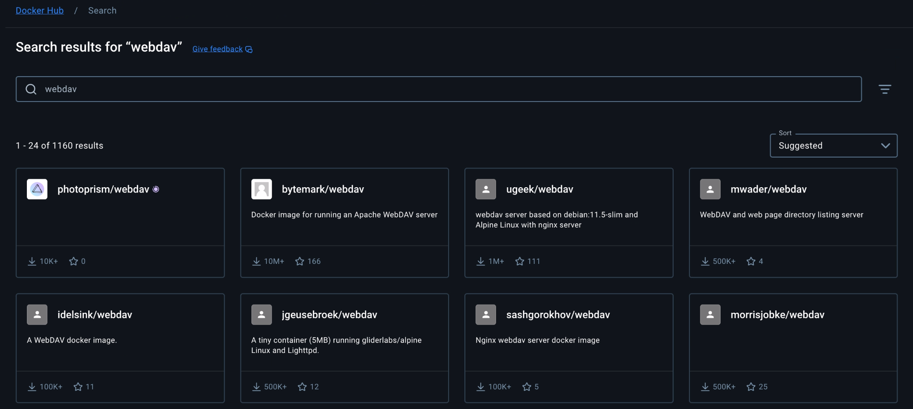
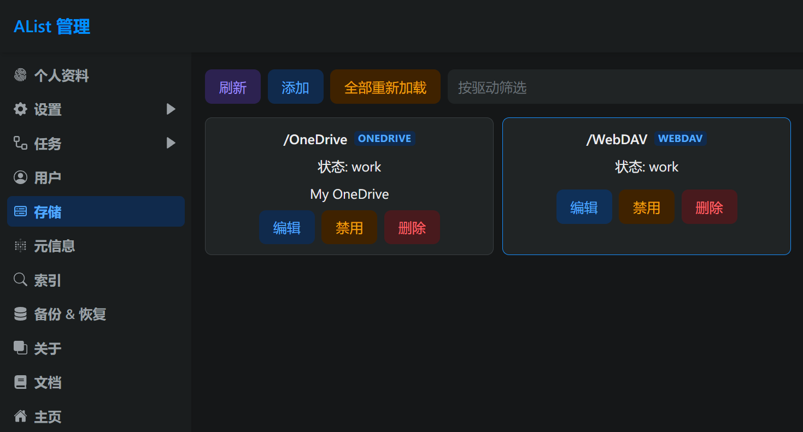
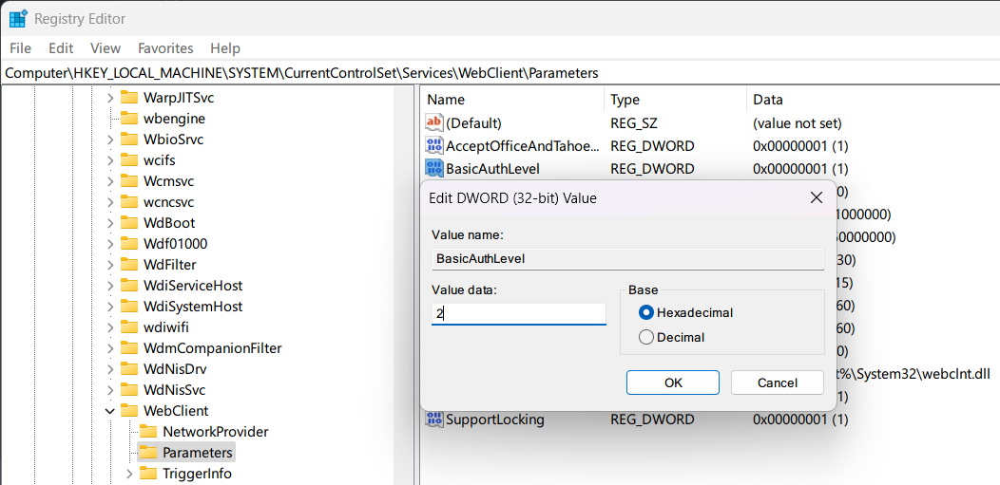
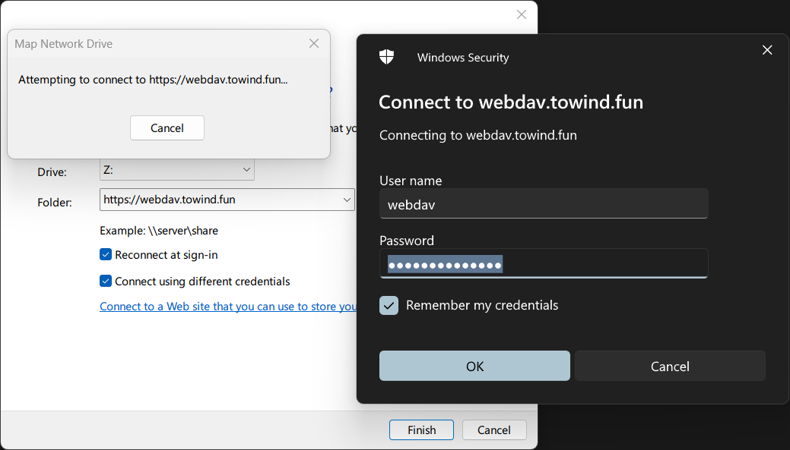
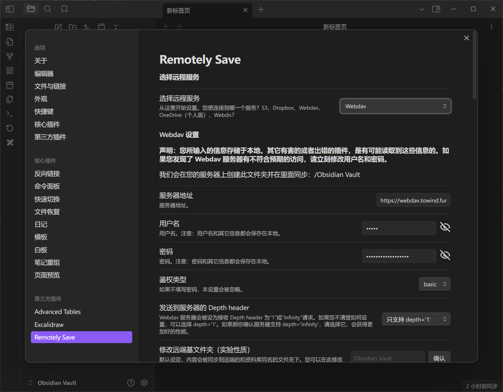
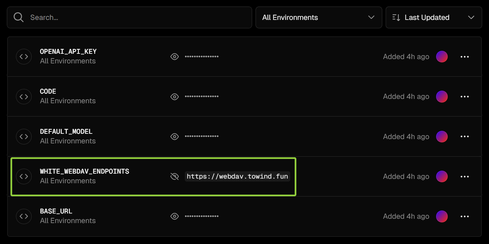
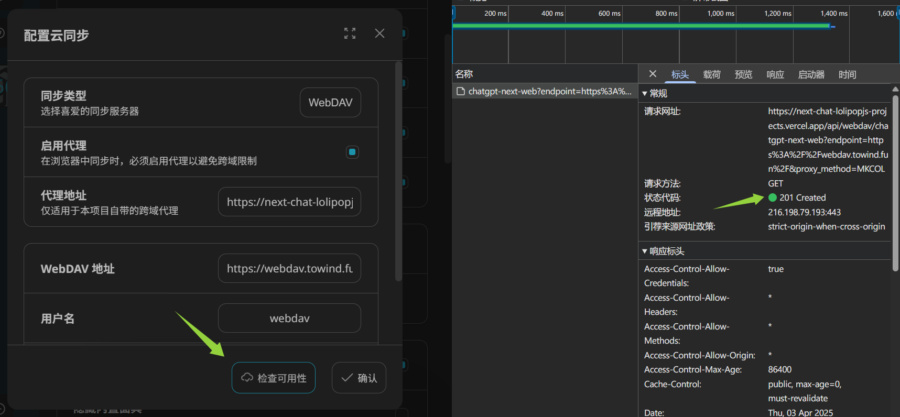
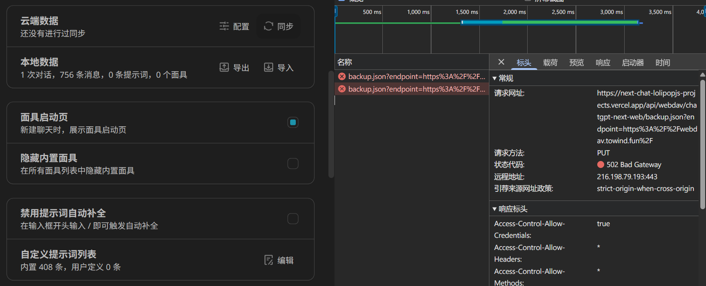
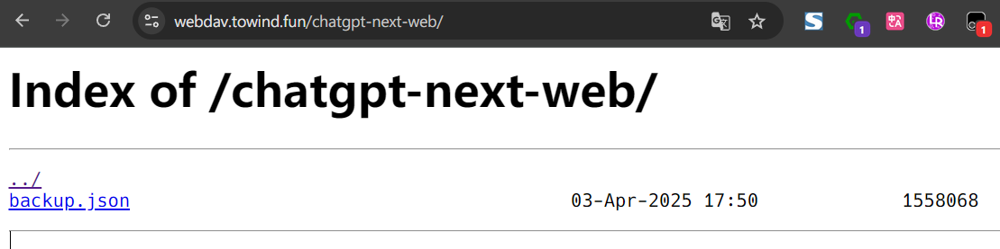

今天在使用 Next Chat 时，突然想到聊天数据应该是可以备份的，在设置里面发现它支持 WebDAV 和没听说过的 UpStash 两种文件协议，而笔者使用的其它软件又广泛支持前者进行备份同步。于是今天便来捣腾 WebDAV 并实现数据备份。

## Docker 部署 WebDAV 服务

> 此章节里笔者选用了纯净的 WebDAV 服务镜像。如果想要更友好的交互体验，可以选用支持 WebDAV 协议的文件服务器镜像，例如 [`drakkan/sftpgo`](https://github.com/drakkan/sftpgo) 以及 [`sigoden/dufs`](https://github.com/sigoden/dufs) 等等。

一旦使用上了 Docker，就再也不想回去那种将服务运行在机器本体上的时代了。笔者首选使用 Docker 部署 WebDAV 服务，在 Docker Hub 以 `webdav` 为关键词搜索，有如下结果：



笔者尝试了下载量和收藏数最高的 `bytemark/webdav`，但发现设置了挂载目录后无法正常上传文件，仔细阅读说明文档才看到，必须要将宿主机的挂载目录设置为写死的 `/srv/dav`，意味着如果想要用其它目录来存放 WebDAV 里的文件的话，还需要额外添加一个软链接。这样的限制感觉笨笨的，很不优雅，于是找了找它的 [Github 仓库](https://github.com/BytemarkHosting/docker-webdav)，发现作者在写完这个镜像，发了一篇[部署文档](https://docs.bytemark.co.uk/article/run-your-own-webdav-server-with-docker/)后就再没有更新了，代码也就停留在了 2018 年。也许 WebDAV 协议已经相当稳定了，但是笔者还是想要找一个不这么别扭的 WebDAV 镜像。

接着，笔者尝试在 Github 上以 `webdav` 为关键词搜索，发现了关联度和星标均为最高，并且活跃更新的 [`hacdias/webdav`](https://github.com/hacdias/webdav)。它针对不同用户组的权限管理能力非常强，笔者很喜欢。但笔者遇到的一个问题是：将本地的 `local/path/to/data` 目录关联给容器的 `/data` 目录后，同步的数据仍然被放置在了容器的根目录里，导致无法持久化备份文件。这也许是当前版本的 Bug，也有可能是没配置对的原因，总之笔者又着眼于找下一个 WebDAV 镜像去了。

最后，笔者尝试了 Docker Hub 上目前下载量和收藏数均为第二的 [`ugeek/webdav`](https://github.com/uGeek/docker-webdav)，没有上述的问题，满足了笔者的需要。笔者在 MacOS 系统上部署 WebDAV 服务，因此要拉取它的 `arm64` 版本：

```bash
docker pull ugeek/webdav:arm64
```

运行 WebDAV 容器：

```bash
docker run --name webdav \
  --restart=unless-stopped \
  -p 3180:80 \
  -v $HOME/WebDAV/data:/media \
  -e USERNAME=YOUR_USERNAME \
  -e PASSWORD=YOUR_PASSWORD \
  -e TZ=Asia/Shanghai  \
  -e UDI=1000 \
  -e GID=1000 \
  -d  ugeek/webdav:arm64
```

上面的配置表明，WebDAV 服务暴露在宿主机的 3180 端口，数据持久化存储在 `$HOME/WebDAV/data` 目录下。访问 `127.0.0.1:3180`，输入用户名和密码，即可看见当前 WebDAV 中包含的文件列表（当然此时为空）。

通过 frp 将内网的服务暴露给公网服务器上，再通过配置公网服务器的 Nginx 配置，现在 WebDAV 就可以通过域名 `https://webdav.towind.fun` 访问了！

## 图形界面管理 WebDAV

用 Postman 来对 WebDAV 里的文件做 CRUD 显然不符合实际需要。在这一章节，笔者将分别通过 AList 和 Windows 来连接 WebDAV，方便以后实际的管理与使用。

### AList 挂载 WebDAV

笔者之前在 Docker 上部署了 AList 服务，它也支持连接并管理 WebDAV。这一切尤为简单，只需要在“管理 - 存储”页面添加 WebDAV 驱动，输入账号和密码即可连接：



回到主页，WebDAV 就顺利地挂载到了指定的路由上。这样，就可以随时随地通过浏览器访问 AList，管理 WebDAV 里的文件了！

### Windows 挂载 WebDAV

> 如果遇到报错：`The network path was not found`，可以尝试多连接几次，直到顺利访问。笔者暂时没有找到能够稳定连接的方案，Drive me crazy，更推荐使用其它方案访问 WebDAV。

笔者的 WebDAV 由 SSL 加密，因此需要首先配置 Windows Web Client 的身份验证级别，即在“运行”里输入 `regedit` 打开注册表编辑器，找到 `Computer\HKEY_LOCAL_MACHINE\SYSTEM\CurrentControlSet\Services\WebClient\Parameters`，修改其中键 `BasicAuthLevel` 的值为 `2`。



笔者翻阅有关 Windows 系统连接 WebDAV 的[官方文档](https://learn.microsoft.com/zh-cn/iis/publish/using-webdav/using-the-webdav-redirector#webdav-redirector-registry-settings)发现，`BasicAuthLevel` 默认值为 `1` 的时候就已经对 SSL 加密的连接启用身份验证了，但笔者仅在其值为 `2` 的时候能顺利连接上。暂且蒙在鼓里。

右键“我的电脑”，选择“选择映射网络驱动器”，输入 WebDAV 的地址，再输入用户名和密码即可连接到服务：



现在就可以在 Windows 系统上，像管理其它本地文件一样管理 WebDAV 里的文件了！

## 备份应用数据到 WebDAV

### 备份 Obsidian 笔记到 WebDAV

笔者使用 Obsidian 同步多端的笔记，过去使用 OneDrive 来同步笔记的数据，现在就可以迁移到 WebDAV 上了。只需要安装插件市场里的三方插件 Remotely Save，配置 WebDAV 即可：



点击同步按钮，笔记数据就光速保存到 WebDAV 上啦！相比 OneDrive，使用 WebDAV 同步的速度要显著更快，但是也失去了 OneDrive 提供的历史版本管理能力，得失兼而有之。

尽管 OneDrive 的能力更加强大，但笔者还是倾心于玩弄自己的小玩具，暂且不与 OneDrive 同步了 XD。

### 备份 Next Chat 数据到 WebDAV

笔者撰写此文时使用的 Next Chat 版本为 `v2.15.8`。

尽管在设置中它提供了同步配置和聊天记录到 WebDAV 的能力，但无论怎么配置也无法成功同步数据，翻看好多 Issues 和相关的帖子才终于理出来要如何使用。

Next Chat 设计为 Web 端使用，部署时需要配置环境变量 `WHITE_WEBDAV_ENDPOINTS` 以添加 WebDAV 终端白名单。官方构建版本仅对一些常见 WebDAV 服务域名开了白名单，但像笔者这样的自建 WebDAV 服务自然是不可能在名单内。因此需要手动部署一个属于自己的 Next Chat 的 Web 版本，在环境变量中为 WebDAV 开放白名单。这样，在同步数据时，使用自建站点的域名作为代理服务器就可以了。

参考部署 Next Chat 到 Vercel 的[官方文档](https://github.com/ChatGPTNextWeb/NextChat/blob/48469bd8ca4b29d40db0ade61b57f9be6f601e01/docs/vercel-cn.md)，部署自己的 Next Chat 站点，将 `WHITE_WEBDAV_ENDPOINTS=https://webdav.towind.fun` 作为构建环境变量：



现在，笔者自建的 Next Chat 站点便允许被作为请求 `https://webdav.towind.fun` 的代理服务器了。

配置云同步，检查可用性，成功在 WebDAV 的根目录下创建了文件夹 `chatgpt-next-chat`：



尝试初次同步 Next Chat 的数据：首先发出请求检查 WebDAV 里是否包含云端数据，响应值为 404 Not Found，符合预期；接着将备份的数据上传到 WebDAV，服务端响应 502 Bad Gateway：



查看 Nginx 错误日志：

```bash
tail -n 10 /var/log/nginx/error.log
...
[error] 2107#2107: *36701359 client intended to send too large body: 1663429 bytes, client: xxx.xx.xxx.xxx, server: webdav.towind.fun, request: "PUT /chatgpt-next-web/backup.json HTTP/2.0", host: "webdav.towind.fun"
```

可知 Nginx 拒绝了包含超过设定大小数据的请求，那么只需要将设定的大小放开一点就好。编辑对应的 Nginx 配置，例如设置允许的最大请求体为 `50M`：

```nginx
server {
  server_name webdav.towind.fun;
  client_max_body_size 50M;
}
```

再次尝试同步 Next Chat 的数据，成功上传到 WebDAV：



未来无论在什么客户端使用 Next Chat 时，都可以同步配置数据和聊天记录了！

## 参考文章

在“Windows 挂载 WebDAV”章节里，主要参考了[《Windows 挂载 WebDAV》](https://www.expoli.tech/articles/2020/12/30/1609327097930#00ecc29c1a7b4cb783cfa61ba925073e)这篇博客，解决了挂载异常的问题。

在“备份应用数据到 WebDAV”章节里，主要参考了[《终于拿下了NextChat的WebDAV云同步，我感觉我又行了》](https://linux.do/t/topic/373723)和[《【拉跨，但能用了】NextChat 的 WebDAV 云同步。。》](https://linux.do/t/topic/328163)这两篇帖子。
