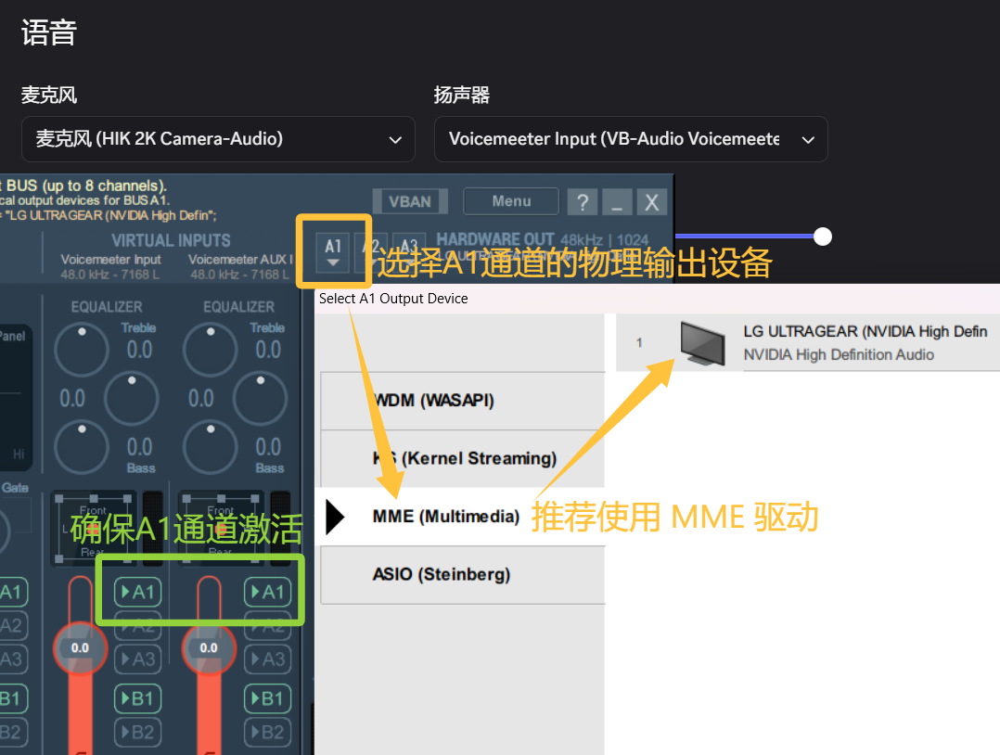
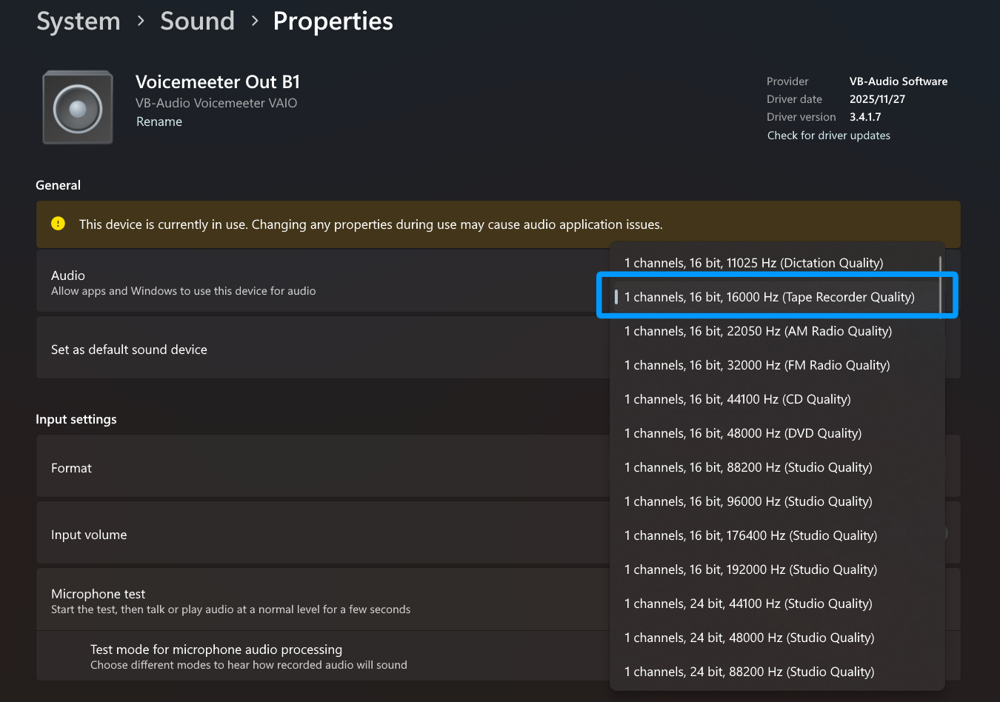

起因是自己违背了自己永远不加入固定队的誓言，受邀加入到了《最终幻想 XIV》里以通关绝龙诗为目标的固定队去。然而，因为队长是香港人，队伍招募时是在“全港最大FF14讨论区”里发的贴，所以除我之外的七个人都讲的是广东话！虽然自己粤语歌听很多，但也是配合着歌词才逐渐明白一些读音对印的字，于是交流变成了单向的，他们能听懂我讲的普通话，但是我完全听不懂他们讲的广东话。

好消息是因为《怪物猎人：荒野》的缘故，早在电脑配件价格暴涨前购买了 RTX 4070 SUPER 显卡，拥有 12GB 大小的显存，给了我本地跑大模型的算力支撑。于是，今回就计划在本地跑实时语音转文字服务，帮助自己能更好理解队友都在讲些啥。

## 技术选型与前置准备

生成式 AI 的浪潮下，STT 的发展也随着大模型技术的引入，迎来了又一次飞跃。使用深度神经网络训练出来的 STT 模型在准确率上已经得到了显著提升，足以满足日常使用需要了。而今使用基于大模型训练出来的 STT 模型，我想对于我的需求更是绰绰有余了叭。

那么就跟随技术发展的脚步，参考开源社区的流行方案，我选择的主要技术栈如下：

- [faster-whisper](https://github.com/SYSTRAN/faster-whisper)：一个对 OpenAI 的 Whisper 模型的高性能实现，自称在相同精度下，比 Whisper 模型快 4 倍，且占用的内存更少。
- [RealtimeSTT](https://github.com/KoljaB/RealtimeSTT)：一款实时语音转文本库，官方文档的推荐路径是搭配 faster-whisper 使用。

RealtimeSTT 库在安装时就可以选择使用 faster-whisper 作为语音识别引擎，因此无需单独安装 faster-whisper。

### 准备大模型任务执行环境

不同的机器学习和大模型推理任务的执行环境总会有差异，如果不想每次浪费时间在隔离环境上，那么总是应该使用 Conda 来统一管理不同的环境。

如果还没有，直接一把梭哈安装 [Anaconda](https://www.anaconda.com/download/success?reg=skipped) 并正确设置系统环境变量，将 `path/to/anaconda3`，`path/to/anaconda3/Scripts` 和 `path/to/anaconda3/Library/bin` 都添加到系统的 `PATH` 中。确认安装成功：

```bash
$ conda --version
conda 25.11.1
```

初始化 Conda：

```bash
$ conda init
no change     path/to/anaconda3/Scripts/conda.exe
no change     path/to/anaconda3/Scripts/conda-env.exe
no change     path/to/anaconda3/Scripts/conda-script.py
...

==> For changes to take effect, close and re-open your current shell. <==
```

重启命令行工具，创建并激活一个新的 Conda 虚拟环境。RealtimeSTT 支持 `python >= 3.11`，因此可以执行命令：

```bash
conda create -n realtime_stt python=3.11
conda activate realtime_stt
```

使用太新版本的 Python 可能导致后续找不到编译后的镜像，建议看仓库用啥版本的 Python 就跟着用啥版本。

### 安装 CUDA 和 PyTorch

为了使用 GPU 加速大模型推理，在安装 RealtimeSTT 之前需要先依次安装 [CUDA](https://developer.nvidia.com/cuda-toolkit-archive)，[cuDNN](https://developer.nvidia.com/cudnn-archive) 和 PyTorch。

安装稳定版本的 CUDA 和 cuDNN：

```bash
conda install -c conda-forge cudatoolkit=11.8 cudnn=8.9
```

对应安装兼容版本的 PyTorch 和 torchaudio：

```bash
python -m pip install torch torchaudio --index-url https://download.pytorch.org/whl/cu118
```

验证 GPU 加速能力是否可用，可以执行下面这段我让 AI 编写的测试代码：

```python
import torch


def test_cuda_training():
    print(f"PyTorch Version: {torch.__version__}")
    print(f"CUDA Available: {torch.cuda.is_available()}")
    print(f"CUDA Version: {torch.version.cuda}")
    print(f"GPU Count: {torch.cuda.device_count()}")
    print(f"Current Device: {torch.cuda.get_device_name(0)}")

    if not torch.cuda.is_available():
        return

    print("/n🚀 开始 CUDA 训练循环测试...")
    device = torch.device("cuda")
    model = torch.nn.Sequential(
        torch.nn.Linear(100, 50), torch.nn.ReLU(), torch.nn.Linear(50, 1)
    ).to(device)

    input_data = torch.randn(64, 100).to(device)
    target = torch.randn(64, 1).to(device)

    optimizer = torch.optim.SGD(model.parameters(), lr=0.01)
    criterion = torch.nn.MSELoss()

    for epoch in range(3):
        optimizer.zero_grad()
        output = model(input_data)
        loss = criterion(output, target)
        loss.backward()  # 测试反向传播是否能正常调用GPU
        optimizer.step()
        print(f"Epoch {epoch + 1}, Loss: {loss.item():.6f}")

    print("/n🎉 CUDA 完整训练循环测试通过！您的环境已完全就绪。")


test_cuda_training()
```

测试结果如下：

```bash
$ python ./test_cuda_training.py
path/to/anaconda3/envs/realtime_stt/Lib/site-packages/torch/_subclasses/functional_tensor.py:276: UserWarning: Failed to initialize NumPy: No module named 'numpy' (Triggered internally at C:/actions-runner/_work/pytorch/pytorch/pytorch/torch/csrc/utils/tensor_numpy.cpp:81.)
  cpu = _conversion_method_template(device=torch.device("cpu"))
PyTorch Version: 2.7.1+cu118
CUDA Available: True
CUDA Version: 11.8
GPU Count: 1
Current Device: NVIDIA GeForce RTX 4070 SUPER

🚀 开始 CUDA 训练循环测试...
Epoch 1, Loss: 0.836456
Epoch 2, Loss: 0.818898
Epoch 3, Loss: 0.802602

🎉 CUDA 完整训练循环测试通过！您的环境已完全就绪。
```

注意到开头的警告是说未找到模块 `numpy`，这是因为从 PyTorch 2.x 开始，NumPy 降级为了 “可选依赖”，于是安装 PyTorch 时不会自动安装 NumPy。不过不用担心，之后安装 RealtimeSTT 的时候会顺带安装它。

### 安装 RealtimeSTT

安装基于 faster-whisper 语音识别引擎的 RealtimeSTT：

```bash
python -m pip install "RealtimeSTT[faster-whisper]"
```

执行官方文档提供的安装验证脚本：

```python
from RealtimeSTT import AudioToTextRecorder

if __name__ == "__main__":
    with AudioToTextRecorder(model="tiny", device="cpu") as recorder:
        print("Speak now")
        print(recorder.text())
```

RealtimeSTT 会自动下载默认的模型，用于语音识别。下载完成后，脚本显示“Speak now”，这时对着麦克风说话就能将识别到的语音转为文本输出了：

```bash
$ python ./test_stt.py
Downloading: "https://github.com/snakers4/silero-vad/zipball/master" to path/to/.cache/torch/hub/master.zip
Speak now
至于让自己的这一实际上的.
RealtimeSTT shutting down
```

## 实现实时广东话转文字能力

RealtimeSTT 将代码的编写简化到的极致，官方文档提供的这个脚本就可以实现持续的音频转文字的功能了：

```python
from RealtimeSTT import AudioToTextRecorder


def print_text(text):
    print(text)


if __name__ == "__main__":
    recorder = AudioToTextRecorder()

    while True:
        recorder.text(print_text)
```

随便找了一个[粤语发音视频](https://www.bilibili.com/video/BV1YeQnB3EEP)，使用音响外放，再让麦克风接收，测试它的效果：

```bash
$ python ./test_realtime_stt.py
好久不见.
很難沒見.
很難沒見.
你怎麼樣?
那今天呢?
內景園了.
我惡嘛.
我痛我了.
我同我啦.
원래 해 봐.
那很酷呀.
魔虎骨牙.
我明白了.
我明白啦.
โม่งตัดแล้ว.
别急.
Don't go up.
Moke up.
How done?
好啊.
紅啊.
沒關係.
無關係.
無關是.
別擔心.
不用擔心.
不用擔心.
太好了.
太好了.
太好了.
/ speak nowRealtimeSTT shutting down
```

其中，每三行里的第一行是识别出来的普通话，后两行是识别出来的广东话。可以发现，虽然 RealtimeSTT 在使用默认模型时，能够识别出一些广东话，但整体的识别效果并不理想，过程中还容易窜出其它语言文本。不过默认模型本身也是使用多种语言训练的通用模型，这也在情理之中。

### 接收指定应用的音频输出

那么现在就来到了我们第一个课题：完全没有必要用麦克风接收物理设备外放的音频信息，再让 RealtimeSTT 识别，这中间肯定会有不少的失真，更不必说我自己说话的声音和游戏的声音也会混杂在一起产生严重干扰。那么应该如何让 RealtimeSTT 直接接收来自指定应用的音频输出呢？

放眼望去最简单而且最稳妥的方案还属**虚拟声卡**了，一方面不涉及到复杂的代码编写，另一方面输入源可以随时切换，针对本文探讨的 Discord 语音场景可以说是完全适用。

选择使用成熟的 [VB-Audio Voicemeeter Banana](https://vb-audio.com/Voicemeeter/banana.htm) 虚拟声卡驱动，它支持将同一输入源的音频路由到多个输出设备，这样就可以实现不但可以外放队友的声音，又能用 RealtimeSTT 进行语音识别了。

安装完成后，将 Discord 语音的扬声器设为虚拟声卡设备 Voicemeeter Input (VB-Audio Voicemeeter VAIO)。打开 Voicemeeter，点击右上角用于硬件输出的 A1 通道，选择你使用的物理输出设备。这样，当 Voicemeeter 的 A1 通道激活时，Discord 语音的输出就会顺利被路由到物理输出设备上了。

> [!TIP]
> 在选择物理输出设备时，如果左侧选择 WDM (WASAPI) 驱动，那么 Voicemeeter 会独占此物理设备，其它应用就无法直接选择该物理设备作为音频输出了。要听到声音，其它应用和电脑的音频输出都得选择 Voicemeeter 的虚拟声卡设备，相当不方便。
> 为了避免该问题，可以选择 **MME (Multimedia)** 驱动，虽然经由 Voicemeeter 处理的音频会有稍高的延迟，但不会影响到原来的音频输出设置。



配置完毕后，可以使用 Discord 语音里的“麦克风测试”功能，验证物理设备的声音输出是否正常。关闭 A1 通道后，再测试物理设备是否不再能听到声音。

细心你已经发现了，在 Voicemeeter 里，除了用于硬件输出的 A1-A3 通道，还有用于虚拟输出的 B1-B2 通道，我们的 RealtimeSTT 可以监听 B1 通道来获取 Discord 的语音输出。使用 `pyaudio` 库寻找指定设备的核心代码实现如下：

```python
DEVICE = "Voicemeeter Out B1 (VB-Audio Voicemeeter VAIO)"

def get_device_index_by_name(device_name: str) -> int:
    """根据设备名称精确匹配获取 PyAudio 设备索引"""
    import pyaudio

    p = pyaudio.PyAudio()
    try:
        device_count = p.get_device_count()
        for i in range(device_count):
            info = p.get_device_info_by_index(i)
            # 仅匹配输入设备（maxInputChannels > 0）
            if int(info["maxInputChannels"]) > 0 and info["name"] == device_name:
                print(f"[✓] 找到匹配设备: '{device_name}' -> index={i}")
                return i

        # 未找到时打印所有可用输入设备，方便排查
        print(f"[✗] 未找到设备: '{device_name}'")
        print("可用的输入设备列表:")
        for i in range(device_count):
            info = p.get_device_info_by_index(i)
            if int(info["maxInputChannels"]) > 0:
                marker = " <-- TARGET" if info["name"] == device_name else ""
                print(
                    f"  [{i}] {info['name']} (ch={info['maxInputChannels']}, rate={int(info['defaultSampleRate'])}){marker}"
                )
        raise ValueError(f"找不到名为 '{device_name}' 的输入设备")
    finally:
        p.terminate()

recorder_config = {
    # ...
}
recorder_config["input_device_index"] = get_device_index_by_name(DEVICE)

from RealtimeSTT import AudioToTextRecorder
recorder = AudioToTextRecorder(**recorder_config)
```

需要注意的是，现代模型均基于 16000Hz 的采样率进行训练，如果输入设备的采样率不是 16000Hz，那么 RealtimeSTT 在接收音频时就会自动进行重采样，会稍微多占用一些资源与时间。另外，如果输入设备的通道数不是单声道，那么 RealtimeSTT 同意会自动进行 downmix 处理，增加一些资源占用。为了从系统层面避免这些问题，建议在系统的声音设置里，将虚拟声卡输入设备的音频格式设为 `1 channels, 16bit, 16000Hz (Tape Recorder Quality)`：



额外的，我让 AI 实现了验证虚拟输出通道是否可用的[脚本](https://github.com/LolipopJ/homepage/blob/main/blog/posts/realtime-stt-cantonese-to-ch/test_vsc_output.py)，表明输出正常的测试结果形如：

```bash
$ python ./test_vsc_output.py
============================================================
  虚拟声卡输入诊断工具 (RealTimeSTT 排查专用)
============================================================

📋 所有音频输入设备:
  [0] Microsoft Sound Mapper - Input | 输入通道:2 | 默认采样率:44100.0
  ...
  [24] Voicemeeter Out B1 (VB-Audio Voicemeeter VAIO) | 输入通道:8 | 默认采样率:44100.0 ✅ (将使用此设备)
  ...
  [52] Voicemeeter Out B1 (VB-Audio Voicemeeter VAIO) | 输入通道:1 | 默认采样率:16000.0 ⚠️ (重名，已跳过)
  ...

💡 检测到 2 个同名设备，已自动选择第一个: [24]

🎯 目标设备: Voicemeeter Out B1 (VB-Audio Voicemeeter VAIO)

⚙️  配置验证:
  ❌ 采样率不匹配! 设备原生=44100.0Hz, STT期望=16000Hz
     → 运行时重采样会导致时序偏移，产生过短chunk!
     → 请在系统声音设置中将虚拟声卡设为 16000Hz
  ⚠️  通道数不一致: 设备=8ch, STT期望=1ch
     → sounddevice会自动downmix，但建议确认虚拟声卡输出格式

⚠️  检测到配置不匹配，但将继续进行采集测试以评估实际可用性...

🎤 开始采集测试 (10s @ 16000Hz/1ch)...
   💡 请现在对着虚拟声卡的输入端播放/说话...

   [ 10.0s] Level: 0.0826 |█████████████████████████████████████████░░░░░░░░░|███|███████████████████|███|████████████||███████|█████████████████████████|

📊 采集结果分析:
  收到chunks: 332/333 (✅)
  静音chunks: 230/332 (69%) ✅
  峰值电平: 0.6108 ✅
  时间抖动: 11.4ms (std), 最大间隔: 62.4ms ✅
  过短chunks(<30ms): 0 ✅
  ✅ 无回调异常

============================================================
✅ 虚拟声卡输出正常
💡 提示: 存在部分配置不匹配的现象，如果实际使用出现问题，请重点关注
============================================================
```

可以发现，在我的系统中有两个同名的输入设备 `Voicemeeter Out B1 (VB-Audio Voicemeeter VAIO)`，第一个虽然也能正常接收到声音，但第二个才是刚刚我们配置过音频格式，真正应该用于 RealtimeSTT 的设备。

### 使用面向广东话优化的模型

接下来是第二个课题：RealtimeSTT 的默认模型使用的训练集汇聚多种语言的语音数据，即使包含了广东话的数据，但数量和质量都不够，识别效果自然也比不上针对广东话优化过的模型。那么，就去找一个优化后的模型吧。

在 Hugging Face 上以“cantonese”为关键词搜索模型，目前下载量最多、星标数最多的模型是 [`alvanlii/whisper-small-cantonese`](https://huggingface.co/alvanlii/whisper-small-cantonese)。除了常用的数据集之外，它还使用了大量 Youtube 上的广东话视频进行训练，足够接地气。在参数大小仅 0.2B 的情况下，模型的表现如下：

- 字错误率（CER）：9.72%。主流开源或商用中文语音识别模型的 CER 通常在 8% 到 12% 之间波动，此模型处于行业领先水平。
- 推理速度（Inference Speed）：在 RTX 3090 上，速度为 0.055s/sample（Fast Attention）或 0.308s/sample（无优化）。完全满足实时语音转文字的需求。
- 显存占用（VRAM）：大约 1.5GB。常用的消费级显卡也足以胜任模型的推理任务。

简而言之，这不就是我需要的模型吗！

基于官方提供的[示例](https://github.com/KoljaB/RealtimeSTT/blob/05f2745e94499efbb86f917554766ca5cbb7011a/tests/realtimestt_test.py)，在调用时，传入参数即可下载并基于相应模型进行 STT：

```bash
$ python realtime_stt_cantonese_to_ch.py -m alvanlii/whisper-small-cantonese -r tiny -l zh
```

由于负责实时转录的 `tiny` 模型对广东话支持不佳，为了避免乱码问题，建议指定语言为中文 `-l zh` 而非广东话 `-l yue`。

根据网络情况，模型的下载可能花费较长时间，命令行界面也会卡在 `System initializing, please wait` 提示，是正常现象。也可以使用 Hugging Face 的官方 [CLI 工具](https://huggingface.co/docs/huggingface_hub/guides/cli)来下载模型：

```bash
$ hf download Systran/faster-whisper-tiny
$ hf download alvanlii/whisper-small-cantonese
$ hf cache ls
ID                                      SIZE LAST_ACCESSED LAST_MODIFIED REFS
-------------------------------------- ----- ------------- ------------- ----
model/Systran/faster-whisper-tiny      78.2M 1 hours ago   1 hours ago   main
model/alvanlii/whisper-small-cantonese  5.3G 1 hours ago   1 hours ago   main
```

需要注意的是，下载得到的当前版本 `alvanlii/whisper-small-cantonese` 目录中不存在 `model.bin` 文件，脚本在执行时会报错 `RuntimeError: Unable to open file 'model.bin' in model 'path/to/models--alvanlii--whisper-small-cantonese/snapshots/{COMMIT_ID}'`。实际可用于 faster-whisper 的 Whisper CT2 格式模型文件是 `path/to/models--alvanlii--whisper-small-cantonese/snapshots/{COMMIT_ID}/cts/model.bin`。为了兼容 RealtimeSTT 的规范，需要手动将这些软链接复制到上一级目录下，覆盖已有的软链接，不过懒狗如我就直接复制软链接对应的真实文件了。

### 测试 STT 效果

用 AI 炼丹，再对炼出来的完整代码缝缝补补，得到的可用魔丸[请见此](https://github.com/LolipopJ/homepage/blob/main/blog/posts/realtime-stt-cantonese-to-ch/realtime_stt_cantonese_to_ch.py)。

再次翻出刚才的粤语发音视频，切换浏览器的音频输出为虚拟声卡设备，测试转录的效果：

```bash
$ python ./realtime_stt_cantonese_to_ch.py -m alvanlii/whisper-small-cantonese -r tiny -l zh -d "Voicemeeter Out B1 (VB-Audio Voicemeeter VAIO)"
System initializing, please wait
Argument 'model' set to alvanlii/whisper-small-cantonese
Argument 'realtime_model_type' set to tiny
Argument 'language' set to zh
[⚠️] 警告: 发现 2 个同名设备 'Voicemeeter Out B1 (VB-Audio Voicemeeter VAIO)'。已根据规则自动选择最优设备 index=52 (ch=1, rate=16000)
Argument 'device' set to Voicemeeter Out B1 (VB-Audio Voicemeeter VAIO) (index 52)
RealTimeSTT: realtimestt - WARNING - Audio queue size exceeds latency limit. Current size: 117. Discarding old audio chunks.
╭──────────────────────────────── Live Transcription ─────────────────────────╮
│ 好久不見. 好耐冇見. 好耐冇見. 你怎麼樣？ 你點樣呀？ 你點樣呀？ 我餓喇. 我肚餓啦.  │
│ 我肚餓啦. 我叻喇. 我好攰呀. 我好攰呀. 我明白喇. 我明白啦. 我明白啦. 別緻. 唔好急. │
│ 唔好急. 下單. 好啊！ 好啊. 美關舌. 冇關係. 冇關係. 別低聲！ 唔使擔心. 唔使擔心.   │
│ 太好嘞. 太好喇. 太好喇.                                                       │
╰─────────────────────────────────────────────────────────────────────────────╯
```

在命令行终端的实时转录窗口里，先会以粗体打印出 `tiny` 模型快速识别出来的中文句词，而后用 `alvanlii/whisper-small-cantonese` 模型得到的结果覆盖原来的句词，实现了实时广东话转文字的功能。同样，这里的第一句话是普通话，识别成广东话后会有所差异，但是二三句广东话在识别后能达到相当令人满意的准确率。

放到更多环境里测试，此程序在处理语速适中且有明显断句的日常对话完全够用，但是在面对歌曲或者叽里呱啦一直说个不停的情况时容易出现问题，具体表现为实时转录功能卡住不工作了，或是每次只吐整句话的后几个词。哼嗯哼嗯，这应当就是商业化软件的可优化区间所在了。

## 尾声

然而朋友们，新的问题出现了，即使实时转文字能力已经能做到 90% 的正确性了，但是广东话里的文字和俚语本身有很多是我不认识的！虽然确确实实是象形文字，但我的大脑中枢却拒绝了对它们的理解，自己仿佛一个日本人在阅读中文文学作品。

难道下一个课题就是把得到的广东话文本再实时翻译为普通话？！唔姆唔姆，敬请期待？？
