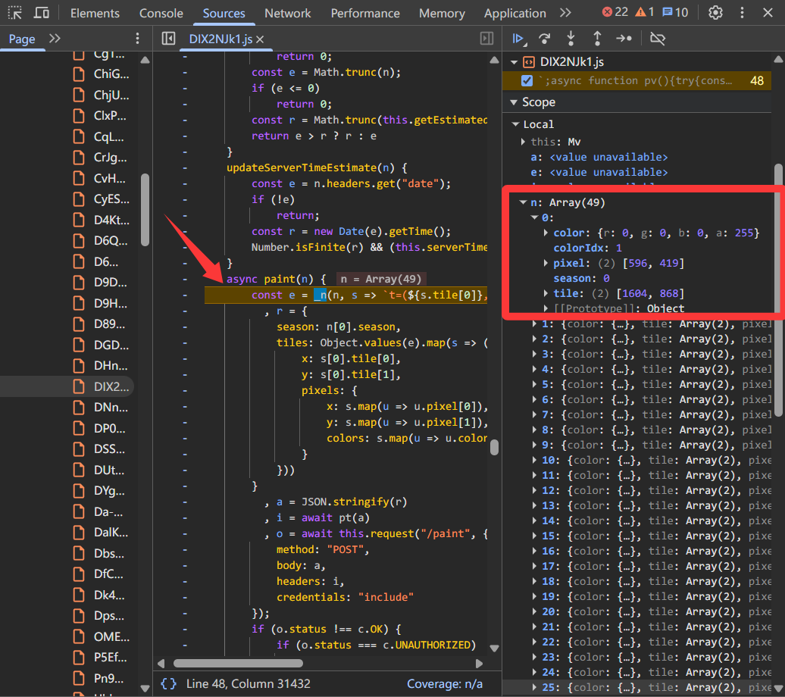
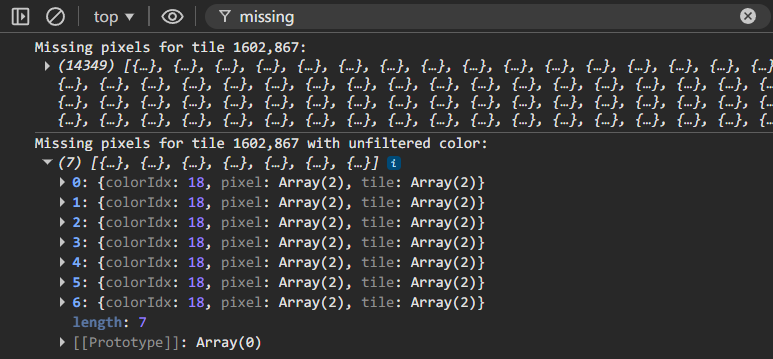
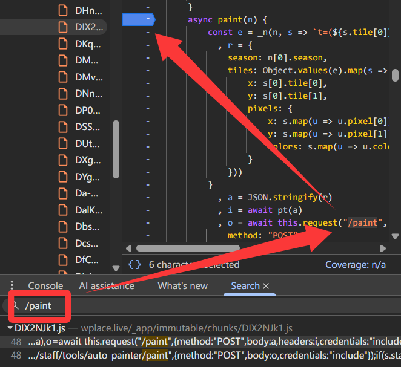
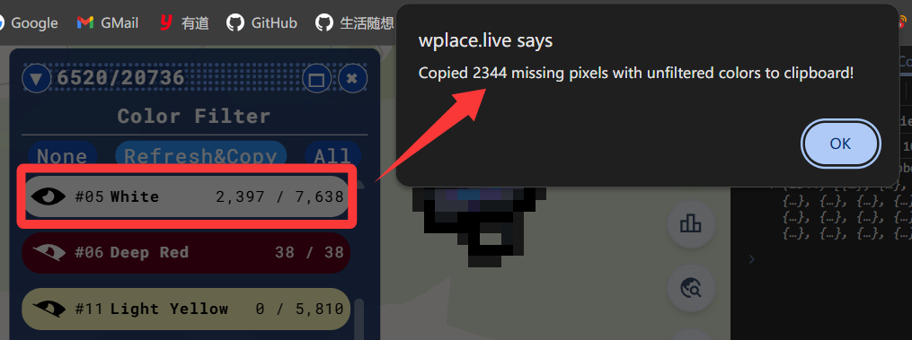
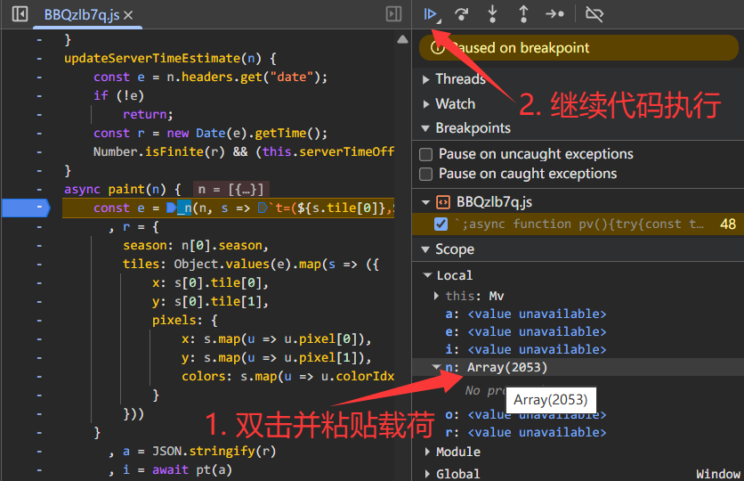
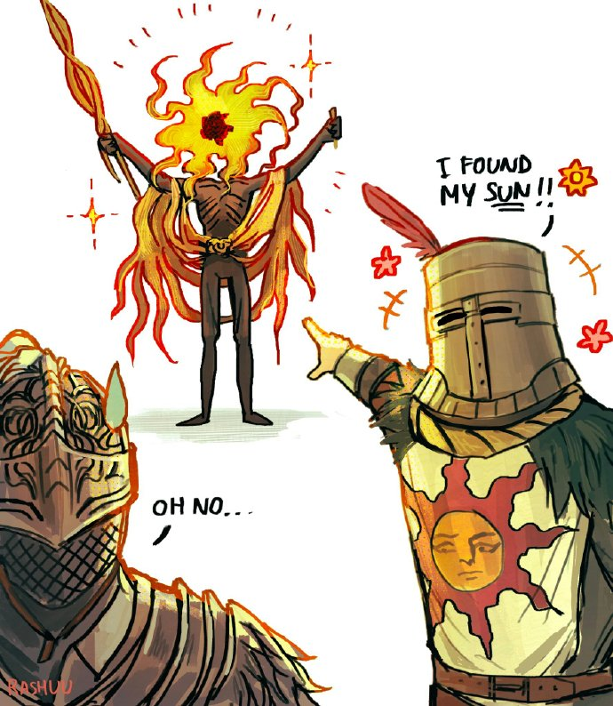
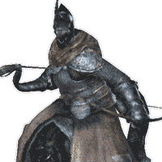

[Wplace](https://wplace.live/) 是一个所有人都可以往世界地图上任意添加像素点的涂鸦平台，看见大家创造的各种图案，我也深受吸引并成为创作的一员。

在鼠标按下一个一个像素点很久以后，我自觉没有那么多精力与耐心继续点下去了，便开始寻求自动化的方案。虽然这一定会损失掉绘画本身的乐趣，但自身的兴趣已经不在这里，又想要继续赛博涂鸦自己的家乡，于是便有了此文。

> [!CAUTION]
> Wplace 官方将任何形式的自动化绘画视为严重违反用户条例的行为，一经发现，将面临永久封禁的处罚。请珍惜自己的账号，慎重使用该 Trick。
>
> ……换句话说：怂别用，用别怂！

全流程用到了一些前端调试的知识，对非技术的小白用户并不友好，请见谅。如果对实现的细节不感兴趣，可以直接跳到最后的[使用方法](#使用方法)部分，按照步骤操作即可。

## 方案探索与实现

最初的设想自然是基于 Blue Marble 插件开发，看看能否在计算好坐标的基础上，模拟鼠标点击等事件来自动化放置像素点。在看代码之前就很疑惑，它是怎么实现的在 Open Street Map 上生成待绘制像素点的？难不成它获取了创建的 OSM 地图实例？如果是的话，那模拟点击事件应该也能够实现了吧。

遗憾是 Wplace 开发人员并没有笨到暴露出地图实例，AI 分析代码库之后告诉我，Blue Marble 实际上劫持了 `window.fetch()` 方法，当响应值为当前区块的图片时，对图片进行重绘，添加待绘制像素点，最后交还给 Wplace 的代码继续处理。优雅，完全不会产生兼容性问题！当然也从另一个方面提醒开发者们，一定要慎重引入安全性未知的代码，通过劫持常用方法，攻击者真的是可以为所欲为。

迷茫之际找到了这个仓库 [Beibeisheep/Wplace-Click-Assistant](https://github.com/Beibeisheep/Wplace-Click-Assistant)，它获取当前浏览器窗口显示的内容，通过计算机视觉技术识别出待点击的区域，并模拟鼠标移动和点击事件来完成像素点放置。即使偶尔会出现精度问题，但从理论上讲已是很完备的方案了，内置的模拟人类操作代码应该也足以应对官方的自动化检测了。稍微遗憾是脚本运行的过程中会持续占用鼠标，这也无可厚非。我并没有试用过此脚本，但放在这里给一个大大的肯定🙆‍♂️。

思考到最后，我决定通过**调用接口**的方式来实现自动化放置像素点。经验告诉我，Wplace 肯定在请求里塞了加密 Token，防止大家无脑调用接口，下面就来具体分析看看。

### 分析 Wplace 源码

从网络请求中，可以找到点击 Paint 按钮后调用的接口：`POST https://backend.wplace.live/paint`。观察请求，发现其中有两个开发者自定义的请求头：

- `x-fp`: 浏览器指纹信息。
- `x-pawtect-token`：请求合法性校验 Token。
- `x-pawtect-variant`：**新版本已移除该请求头**。请求合法性校验算法标识，固定为 `koala`。

使用 [Save All Resources](https://chromewebstore.google.com/detail/save-all-resources/abpdnfjocnmdomablahdcfnoggeeiedb) 插件将 Wplace 的前端资源下载到本地，交给 AI 分析 `x-pawtect-token` 与 `x-fp` 的生成逻辑：

- `x-fp`：将收集到的浏览器指纹信息进行处理，例如 User Agent、屏幕分辨率、字体列表等，生成的 Token。如果浏览器环境不发生改变，该值也不会发生改变。Wplace 通过该值识别用户的浏览器环境，判断请求是否来自同一个人的不同账户。
- `x-pawtect-token`：将请求载荷转为 JSON 字符串，作为参数传入另一个 WebAssembly 模块中定义的算法，计算得到的加密 Token。根据载荷的不同，生成的 Token 也会不同。

可知，知道 `x-pawtect-token` 的生成逻辑是实现接口调用的关键，但我并没有反编译 WebAssembly 模块的经验，AI 也似乎分析不出来加密算法的具体实现细节。

于是我决定退一步，不再尝试复刻具体实现，而是像之前爱做的那样，使用 Chrome 开发者工具来**劫持传入的载荷**，其余的逻辑例如生成 `x-pawtect-token` 交还给 Wplace 的代码继续处理。这样，既不用花时间反编译加密模块，也不用写自动化代码，更无需兼容未来版本的算法更新，还是在用户真实浏览器环境调用接口，大大降低被风控的风险。

那么，现在需要做的就是：构造正确的请求载荷。

在开发者工具里为对应的代码打上断点，然后正常放置像素点，点击 Paint 按钮，观察传入方法的参数：



可知参数类型为：

```ts
type n = {
  // 颜色值
  color: { r: number; g: number; b: number; a: number };
  // 颜色索引
  colorIdx: number;
  // 像素点坐标
  pixel: [number, number];
  // 地图赛季
  season: number;
  // 区块坐标
  tile: [number, number];
}[];
```

以上信息应该都能从 Blue Marble 插件中获取到，为此，我们需要改造一下 Blue Marble 插件。

### 改造 Blue Marble

先通过 AI 简单了解 Blue Marble 的具体实现后，我能想到的就是，基于输入图片的像素点坐标和颜色信息，比对目前已绘制的像素点坐标和颜色信息，得到待绘制的像素点坐标和颜色信息列表。

话虽如此，但实际编写代码还要阅读已有的函数逻辑，考虑区块坐标等，实在伤脑筋。于是我直接把需求提给了 AI，竟然一遍就写出了正确的代码，自己只稍微修改了几处细节就跑通了：

```js
export default class TemplateManager {
  constructor(name, version) {
    //...

    this.shouldFilterColor = new Map(); // Will contain all color ID's to filter @type {Map<number, boolean>}
    this.templateMissingAndUnfilteredPixels = new Map(); // A Map where the keys are tile coordinates, and the values are arrays of missing pixels for that tile, taking into unfiltered colors.
  }

  async drawTemplateOnTile(tileBlob, tileCoords) {
    // ...

    const originalTileCoords = Array.isArray(tileCoords)
      ? [Number(tileCoords[0]), Number(tileCoords[1])]
      : null;

    // Compute real missing pixels by comparing templates to the server tile
    try {
      if (originalTileCoords) {
        const tileCoordsKey = originalTileCoords.join(",");
        const missingPixels = this.getMissingPixelsForTileArray(
          tileBeforeTemplates32,
          originalTileCoords,
        );
        const missingAndUnfilteredPixels = missingPixels.filter(
          (pixel) => !this.shouldFilterColor.has(pixel.colorIdx),
        );
        this.templateMissingAndUnfilteredPixels.set(
          tileCoordsKey,
          missingAndUnfilteredPixels,
        );
        console.log(
          `Missing pixels for tile ${tileCoordsKey} with unfiltered color:`,
          missingAndUnfilteredPixels,
        );
      }
    } catch (err) {
      consoleWarn("Failed to compute missing pixels for tile:", err);
    }

    //...
  }

  /**
   * Compares all template pixels for a tile against the provided tile Uint32Array
   * and returns pixels that are not yet drawn on the server tile.
   * @param {Uint32Array} tile32 - The server tile as a Uint32Array of size (tileSize*drawMult)^2
   * @param {Array<number>} tileCoordsArray - [tileX, tileY]
   * @returns {Array<{tile:[number, number],pixel:[number, number],colorIdx:number}>}
   */
  getMissingPixelsForTileArray(tile32, tileCoordsArray) {
    const results = [];
    const drawMult = this.drawMult;
    const tileSize = this.tileSize;
    const drawSize = tileSize * drawMult;
    const centerOffset = Math.floor(drawMult / 2);
    const lookup = this.paletteBM?.LUT || new Map();

    const tileXKey = tileCoordsArray[0].toString().padStart(4, "0");
    const tileYKey = tileCoordsArray[1].toString().padStart(4, "0");
    const tileKeyPrefix = `${tileXKey},${tileYKey}`;

    for (const template of this.templatesArray) {
      const matchingKeys = Object.keys(template.chunked32 || {}).filter((k) =>
        k.startsWith(tileKeyPrefix),
      );
      if (matchingKeys.length === 0) continue;

      for (const key of matchingKeys) {
        const buffer32 = template.chunked32[key];
        if (!buffer32) continue;

        const bitmap = template.chunked?.[key];
        const width = bitmap
          ? bitmap.width
          : Math.round(Math.sqrt(buffer32.length));
        const height = bitmap
          ? bitmap.height
          : Math.round(Math.sqrt(buffer32.length));

        const [tileX, tileY, startPx, startPy] = key.split(",").map(Number);

        const cols = Math.floor(width / drawMult);
        const rows = Math.floor(height / drawMult);

        for (let r = 0; r < rows; r++) {
          for (let c = 0; c < cols; c++) {
            const cx = c * drawMult + centerOffset;
            const cy = r * drawMult + centerOffset;
            const idx = cy * width + cx;
            const packedTemplate = buffer32[idx];
            const alpha = (packedTemplate >>> 24) & 0xff;
            if (alpha === 0) continue; // transparent

            const templateColorID = lookup.get(packedTemplate) ?? -2;

            const pixelX = startPx + c;
            const pixelY = startPy + r;

            const tileCenterX = pixelX * drawMult + centerOffset;
            const tileCenterY = pixelY * drawMult + centerOffset;
            const tileIdx = tileCenterY * drawSize + tileCenterX;
            const packedTile = tile32[tileIdx];
            const tileColorID = lookup.get(packedTile) ?? -2;

            if (tileColorID !== templateColorID) {
              results.push({
                colorIdx: templateColorID,
                pixel: [pixelX, pixelY],
                season: 0, // Assuming season is 0 for now, adjust as needed
                tile: [tileX, tileY],
              });
            }
          }
        }
      }
    }

    return results;
  }
}
```

上面代码中的 `this.templateMissingAndUnfilteredPixels` 变量就是我们最终需要的待绘制像素点列表了。

踏马的我没招了，AI 太强力了，尤其对于还根本不熟悉代码库就要开发的情况，简直是降维打击。古法编程的程序员过去奉为圭皋的“代码阅读能力”，现在看来虽然仍然有用但再也不会是立身之根本了。


咳咳，回到主题。放到实际场景看一看，顺利在控制台里打印出可直接用于载荷的数组：



那么现在，完整的流程就可以跑通了：

1. 上传待绘制图片，由 Blue Marble 计算出待绘制像素点列表，从控制台复制数组对象。
2. 在开发者工具的“源代码”标签页，找到 Wplace 源码中的 `paint()` 方法，在方法的入口打上断点。
3. 随便点一个像素点，点击 Paint 按钮触发断点，修改传入方法的对应参数数组为复制的待绘制像素点数组，继续执行代码，绘制就自动完成了！

每次都要去控制台复制对象其实有点麻烦，所以接下来将能力接入到 Blue Marble 插件提供的 UI 里。

当可用绘画次数小于指定颜色像素点的待绘制数量时，应当截取数组前面的部分，避免触发异常请求。这里我将逻辑写在了 Blue Marble 插件的过滤器里的按钮点击事件中：

```js
export default class WindowFilter extends Overlay {
  buildWindowed() {
    // ...
    this.addButton({ textContent: "Refresh&Copy" }, (instance, button) => {
      button.onclick = () => {
        button.disabled = true;
        this.updateColorList();
        this.#copyMissingPixelsWithUnfilteredColorToClipboard();
        button.disabled = false;
      };
    });
  }

  /**
   * Copies the missing pixels with unfiltered colors to the clipboard,
   * up to the user's charge count.
   */
  #copyMissingPixelsWithUnfilteredColorToClipboard() {
    const missingAndUnfilteredPixels = Array.from(
      this.templateManager.templateMissingAndUnfilteredPixels.values(),
    ).flat();
    const chargeCount = Math.floor(
      this.templateManager.userChargeData["count"],
    );
    const copiedPixels = missingAndUnfilteredPixels.slice(0, chargeCount);
    GM_setClipboard(JSON.stringify(copiedPixels));
    console.log(`Copy pixels to clipboard:`, copiedPixels);
    alert(
      `Copied ${copiedPixels.length} missing pixels with unfiltered colors to clipboard!`,
    );
  }
}
```

这样，当点击 Refresh&Copy 按钮时，就可以将直接用于请求载荷的数组复制到剪贴板了。

特别的，尽管已经按颜色排序构造了用于请求的像素点列表，但默认情况下从左到右、自上而下的顺序其实并不能反映人真实的手点绘画逻辑。因此我额外做了一次排序，按照“先把颜色相同的像素按相邻可达分组，再在组内横向或纵向排序，最后合并成一个列表”的逻辑，简单模拟真人的绘画习惯：

```js
export default class WindowFilter extends Overlay {
  #copyMissingPixelsWithUnfilteredColorToClipboard() {
    // 1) Get all missing pixels with unfiltered colors of all tiles from the template manager
    const missingAndUnfilteredPixels = Array.from(
      this.templateManager.templateMissingAndUnfilteredPixels.values(),
    ).flat();

    // 2) Group the pixels by color ID, and sort the groups by color ID
    const groups = new Map();
    for (const p of missingAndUnfilteredPixels) {
      const k = Number(p.colorIdx);
      if (!groups.has(k)) groups.set(k, []);
      groups.get(k).push(p);
    }
    const groupEntries = Array.from(groups.entries());

    // 3) For each color group, find connected components (adjacent = x or y diff is 1),
    //    split large components into sub-groups of max 144, then alternate horizontal/vertical sorting.
    const sortedPixels = [];
    for (const [, group] of groupEntries) {
      if (group.length === 0) continue;

      // Build a set of pixel coordinates for O(1) lookup, and find connected components via BFS
      const keyOf = (x, y) => `${x},${y}`;
      const pixelMap = new Map(); // key -> pixel object
      for (const p of group) pixelMap.set(keyOf(p.pixel[0], p.pixel[1]), p);

      const visited = new Set();
      const components = []; // each element is an array of adjacent pixels

      for (const p of group) {
        const startKey = keyOf(p.pixel[0], p.pixel[1]);
        if (visited.has(startKey)) continue;

        // BFS to collect all pixels reachable via 4-directional adjacency
        const component = [];
        const queue = [p];
        visited.add(startKey);

        while (queue.length > 0) {
          const curr = queue.shift();
          component.push(curr);
          const [cx, cy] = curr.pixel;
          for (const [nx, ny] of [
            [cx - 1, cy],
            [cx + 1, cy],
            [cx, cy - 1],
            [cx, cy + 1],
          ]) {
            const nk = keyOf(nx, ny);
            if (!visited.has(nk) && pixelMap.has(nk)) {
              visited.add(nk);
              queue.push(pixelMap.get(nk));
            }
          }
        }

        components.push(component);
      }

      // For each connected component, split into sub-groups of random size (64-144),
      // then alternate horizontal/vertical sorting (snake pattern).
      let subIdx = 0;
      for (const component of components) {
        // Pre-sort the component by x then y so the chunk split is spatially coherent
        component.sort((A, B) => {
          const dx = A.pixel[0] - B.pixel[0];
          return dx !== 0 ? dx : A.pixel[1] - B.pixel[1];
        });

        for (let i = 0; i < component.length; subIdx++) {
          const chunkSize = Math.floor(Math.random() * 81) + 64; // 64–144
          const subGroup = component.slice(i, i + chunkSize);
          i += chunkSize;
          if (subIdx % 2 === 0) {
            // Even sub-group → horizontal: sort by x, then y
            subGroup.sort((A, B) => {
              const dx = A.pixel[0] - B.pixel[0];
              return dx !== 0 ? dx : A.pixel[1] - B.pixel[1];
            });
          } else {
            // Odd sub-group → vertical: sort by y, then x
            subGroup.sort((A, B) => {
              const dy = A.pixel[1] - B.pixel[1];
              return dy !== 0 ? dy : A.pixel[0] - B.pixel[0];
            });
          }
          sortedPixels.push(...subGroup);
        }
      }
    }

    // 4) Copy the pixels to the clipboard, up to the user's charge count
    // ...
  }
}
```

分组排序算法看不懂？没关系，我也没看懂，毕竟 2026 年开始的程序员已经不再用手写代码了，代码它自己就从屏幕里长出来了。


完整的代码请见仓库 [LolipopJ/Wplace-BlueMarble](https://github.com/LolipopJ/Wplace-BlueMarble)。

## 使用方法

在 Tampermonkey 中添加脚本，任选其一：

- 生产环境脚本 [`BlueMarble.user.js`](https://github.com/LolipopJ/Wplace-BlueMarble/blob/main/dist/BlueMarble.user.js)，一般使用此版本就好。
- 开发环境脚本 [`BlueMarble-For-GreasyFork.user.js`](https://github.com/LolipopJ/Wplace-BlueMarble/blob/main/dist/BlueMarble-For-GreasyFork.user.js)，与前者的区别在于未混淆压缩，控制台会打印调试信息。

打开开发者控制台，切换到“源代码”标签页，找到 Wplace 的前端资源中的 `paint()` 方法，在方法入口打上断点。可以通过在开发者工具里搜索接口 `/paint` 来快速定位此方法：



在 Blue Marble 插件里过滤掉不需要的颜色，只保留想要绘制的颜色，等待地图上**待绘制像素点刷新后**，点击插件里的 Refresh&Copy 按钮复制请求载荷。

> [!TIP]
> 因为 Blue Marble 劫持了 Wplace 刷新地图的请求以计算待绘制像素点列表，所以在过滤颜色后，需要等待**下一次地图刷新**才能正确获取到待绘制像素点列表。简单可以理解为“所见即所得”，当你看到地图上的待绘制像素点刷新后，就可以点击 Refresh&Copy 按钮了。

如果成功的话，浏览器将弹出对话框提示，可以看到本次复制的像素点数量：



保持开发者控制台打开，随便放置一个像素点并点击 Paint 按钮，触发断点后，用复制的载荷替换掉传入方法的对应参数。如图所示，可以双击变量名 `n` 后面的参数进入编辑状态，粘贴替换为复制的载荷，回车保存后继续执行代码：



等待地图刷新，如果一切顺利的话，载荷里包含像素点就已经完成绘制了！

> [!WARNING]
> 应避免快速发起多次绘画请求，尤其是在每次绘制像素点数量较多的情况下，避免触发 Wplace 的风控导致账号封禁。
>
> 可以自己简单做个乘除法，例如每分钟我大概能点 100 个像素点，那么应该几分钟后发起下次请求呢。

> [!IMPORTANT]
> 视频录制于早期版本，一切以实际为准。

我录制了一次完整的绘画流程可供参考：

<video controls src="/videos/wplace-painter-automatic_use-guide.mp4"></video>

## 尾声

对不起……



不能继续做小画家了……



再也回不去了……


